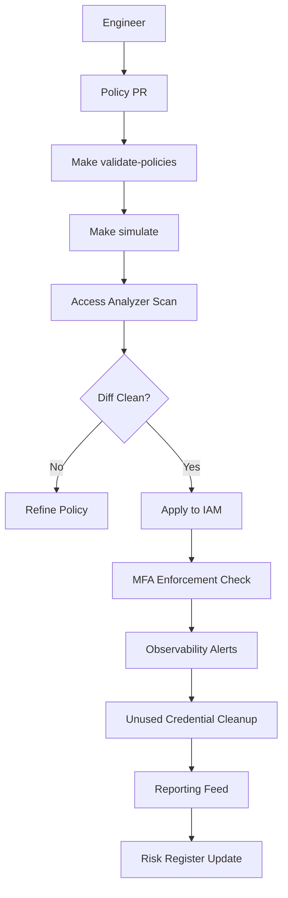
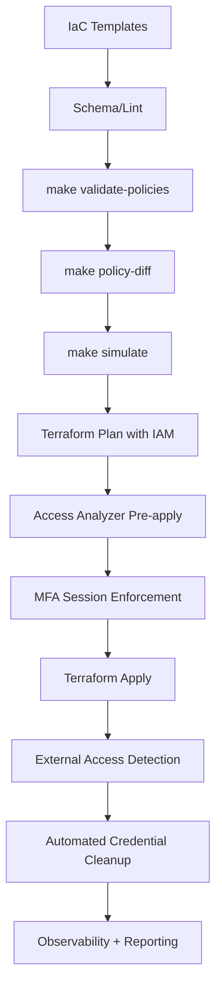

# Diagrams — P02 IAM Hardening Master Factory

The following diagrams visualize the IAM policy lifecycle with Access Analyzer scans, MFA enforcement, and automation triggers across system, CI/CD, and IaC delivery paths.

## System Flow (Mermaid)


## System Flow (ASCII)
```
Engineer -> Policy PR -> make validate-policies -> make simulate -> Access Analyzer
      |                                                                |
      +----< fixes if diff/misaligned >----+                           v
                                     Apply to IAM -> MFA check -> Observability
                                                            |                
                                            Unused credential cleanup -> Reporting -> Risk log
```

## CI/CD Flow (Mermaid)

```mermaid
graph LR
  Code[Repo Policies] --> Actions[CI Pipeline]
  Actions --> Setup[make setup]
  Setup --> Validate[make validate-policies]
  Validate --> Diff[make policy-diff]
  Diff --> Simulate[make simulate]
  Simulate --> AA[Access Analyzer Gate]
  AA --> MFA[MFA Policy Test]
  MFA --> Approve[Auto/Manual Approval]
  Approve --> Release[Tagged Release]
  Release --> Notify[Chat/Email Notifications]
```


## CI/CD Flow (ASCII)
```
Repo -> CI (make setup -> validate-policies -> policy-diff -> simulate) -> Access Analyzer gate -> MFA policy test
      -> approval -> release -> notifications
```

## IaC Flow (Mermaid)


## IaC Flow (ASCII)
```
IaC templates -> lint -> make validate-policies -> make policy-diff -> make simulate -> terraform plan
        -> Access Analyzer pre-apply -> MFA session enforcement -> apply
        -> external access detection -> automated credential cleanup -> metrics/reporting
```
