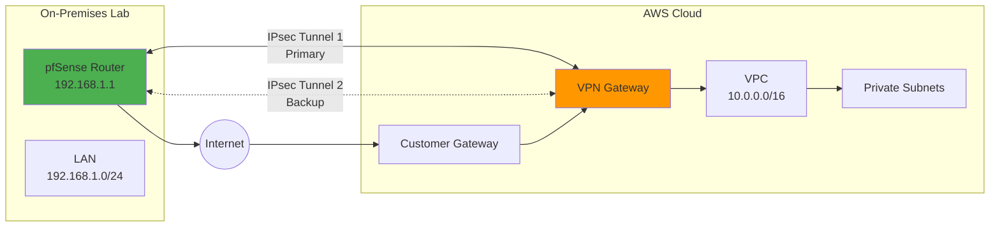

# P03 — Hybrid Network Connectivity Lab

## Overview
Design and test hybrid cloud networking between on-premises infrastructure and AWS using VPN tunnels, WireGuard, and IPsec. Demonstrates network architecture, routing protocols, latency optimization, and secure site-to-site connectivity for enterprise environments.

## Key Outcomes
- [x] Site-to-site VPN between on-prem lab and AWS VPC
- [x] WireGuard tunnel configuration and performance testing
- [x] Network topology diagram with routing tables
- [x] Latency/throughput testing and optimization
- [x] Failover testing (primary/secondary tunnel)

## Architecture
- **Components**: AWS VPN Gateway, Customer Gateway, WireGuard server, on-prem router
- **Trust boundaries**: Encrypted tunnels, private addressing (10.0.0.0/8)
- **Dependencies**: WireGuard, StrongSwan (IPsec), iperf3, mtr



## Quickstart

```bash
make setup
make test-connectivity
make benchmark
```

## Configuration

| Env Var | Purpose | Example | Required |
|---------|---------|---------|----------|
| `ON_PREM_CIDR` | On-prem network CIDR | `192.168.1.0/24` | Yes |
| `AWS_VPC_CIDR` | AWS VPC CIDR | `10.0.0.0/16` | Yes |
| `VPN_ENDPOINT` | AWS VPN endpoint IP | `52.1.2.3` | Yes |
| `WIREGUARD_PORT` | WireGuard listen port | `51820` | No (default) |

## Testing

```bash
# Test VPN tunnel connectivity
make test-vpn

# Benchmark throughput
make benchmark REMOTE_IP=10.0.1.10

# Latency analysis
make latency-test
```

## Operations

### Dashboards & Monitoring
- **VPN Tunnel Status**: AWS Console → VPC → Site-to-Site VPN Connections
- **Metrics**: Tunnel bytes in/out, tunnel state (UP/DOWN)
- **On-prem**: pfSense → VPN → IPsec Status

### Common Issues & Fixes

**Issue**: Tunnel status shows DOWN
**Fix**: Verify Phase 1/Phase 2 IPsec parameters match on both sides, check security group rules.

**Issue**: High latency (>100ms)
**Fix**: Check for packet fragmentation (MTU issues), ensure no NAT traversal problems.

## Security

- **Encryption**: AES-256-GCM (WireGuard), AES-256-CBC (IPsec)
- **Authentication**: Pre-shared keys (rotated quarterly)
- **Perfect Forward Secrecy**: Enabled on both tunnels

## Roadmap

- [ ] BGP routing for dynamic failover
- [ ] Multi-cloud connectivity (AWS + Azure ExpressRoute)
- [ ] SD-WAN integration for intelligent path selection

## References

- [AWS Site-to-Site VPN](https://docs.aws.amazon.com/vpn/latest/s2svpn/VPC_VPN.html)
- [WireGuard Documentation](https://www.wireguard.com/)
- [RUNBOOK](./RUNBOOK.md) | [HANDBOOK](./HANDBOOK.md)
