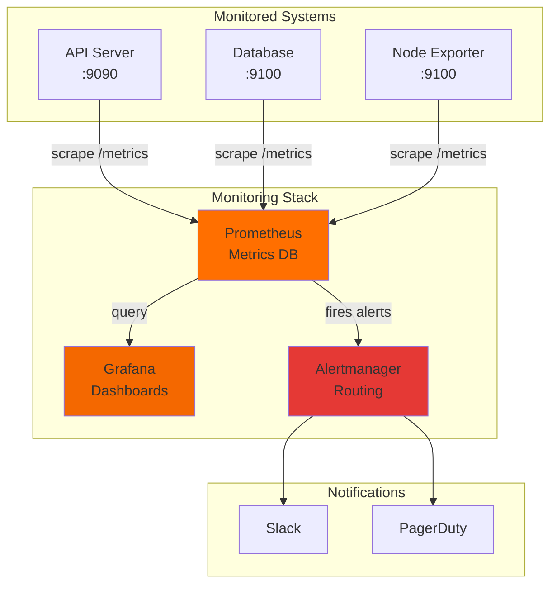

# P04 — Operational Monitoring & Automation

## Overview
Build a comprehensive monitoring and automation system using Prometheus, Grafana, Alertmanager, and automated remediation scripts. Demonstrates SRE practices, golden signals monitoring, SLO tracking, and intelligent alerting for production environments.

## Key Outcomes
- [x] Prometheus monitoring stack (metrics collection + storage)
- [x] Grafana dashboards for golden signals (latency, traffic, errors, saturation)
- [x] Alertmanager integration with PagerDuty/Slack
- [x] Automated remediation scripts (restart services, scale instances)
- [x] SLO/SLI tracking and burn rate alerts

## Architecture
- **Components**: Prometheus, Grafana, Alertmanager, Node Exporter, cAdvisor
- **Trust boundaries**: Monitoring network (scrape endpoints on private network)
- **Dependencies**: Docker Compose, Python 3.9+, Ansible (optional)



## Quickstart

```bash
make setup
make run
# Access Grafana at http://localhost:3000 (admin/admin)
```

## Configuration

| Env Var | Purpose | Example | Required |
|---------|---------|---------|----------|
| `PROMETHEUS_RETENTION` | Metrics retention period | `15d` | No (default: 15d) |
| `GRAFANA_ADMIN_PASSWORD` | Grafana admin password | `<secret>` | Yes |
| `ALERTMANAGER_SLACK_WEBHOOK` | Slack webhook URL | `https://hooks.slack.com/...` | Yes |
| `PAGERDUTY_INTEGRATION_KEY` | PagerDuty integration key | `<key>` | No |

## Testing

```bash
# Validate Prometheus config
make validate-prometheus

# Test alerting rules
make test-alerts

# Run integration tests
make test
```

## Operations

### Dashboards
- **System Overview**: CPU, memory, disk, network across all nodes
- **Golden Signals**: Request latency (p50/p95/p99), error rate, throughput, saturation
- **SLO Dashboard**: Error budget, burn rate, SLO compliance %

### Alerts (P0/P1/P2)
- **P0**: Service down, error rate >5%, SLO burn rate critical
- **P1**: High latency (p95 >500ms), disk >85%, memory >90%
- **P2**: Certificate expiring in <7 days, backup failure

## Security

- **Prometheus**: Basic auth on scrape endpoints
- **Grafana**: OAuth/SSO integration (Google/Okta)
- **Secrets**: Environment variables, never commit credentials

## Roadmap

- [ ] Distributed tracing integration (Jaeger/Tempo)
- [ ] Anomaly detection with ML (Prophet/LSTM)
- [ ] Multi-cluster monitoring aggregation

## References

- [Prometheus Documentation](https://prometheus.io/docs/)
- [Grafana Best Practices](https://grafana.com/docs/grafana/latest/best-practices/)
- [RUNBOOK](./RUNBOOK.md) | [PLAYBOOK](./PLAYBOOK.md)


## Code Generation Prompts

This section contains AI-assisted code generation prompts that can help you recreate or extend project components. These prompts are designed to work with AI coding assistants like Claude, GPT-4, or GitHub Copilot.

### Observability Setup

#### 1. Prometheus Rules
```
Create Prometheus alerting rules for application health, including error rate thresholds, latency percentiles, and service availability with appropriate severity levels
```

#### 2. Grafana Dashboard
```
Generate a Grafana dashboard JSON for microservices monitoring with panels for request rate, error rate, latency distribution, and resource utilization
```

#### 3. Log Aggregation
```
Write a Fluentd configuration that collects logs from multiple sources, parses JSON logs, enriches with Kubernetes metadata, and forwards to Elasticsearch
```

### How to Use These Prompts

1. **Copy the prompt** from the code block above
2. **Customize placeholders** (replace [bracketed items] with your specific requirements)
3. **Provide context** to your AI assistant about:
   - Your development environment and tech stack
   - Existing code patterns and conventions in this project
   - Any constraints or requirements specific to your use case
4. **Review and adapt** the generated code before using it
5. **Test thoroughly** and adjust as needed for your specific scenario

### Best Practices

- Always review AI-generated code for security vulnerabilities
- Ensure generated code follows your project's coding standards
- Add appropriate error handling and logging
- Write tests for AI-generated components
- Document any assumptions or limitations
- Keep sensitive information (credentials, keys) in environment variables

## Evidence & Verification

Verification summary: Evidence artifacts captured on 2025-11-14 to validate the quickstart configuration and document audit-ready supporting files.

**Evidence artifacts**
- [Screenshot](./docs/evidence/screenshot.svg)
- [Run log](./docs/evidence/run-log.txt)
- [Dashboard export](./docs/evidence/dashboard-export.json)
- [Load test summary](./docs/evidence/load-test-summary.txt)

### Evidence Checklist

| Evidence Item | Location | Status |
| --- | --- | --- |
| Screenshot captured | `docs/evidence/screenshot.svg` | ✅ |
| Run log captured | `docs/evidence/run-log.txt` | ✅ |
| Dashboard export captured | `docs/evidence/dashboard-export.json` | ✅ |
| Load test summary captured | `docs/evidence/load-test-summary.txt` | ✅ |
