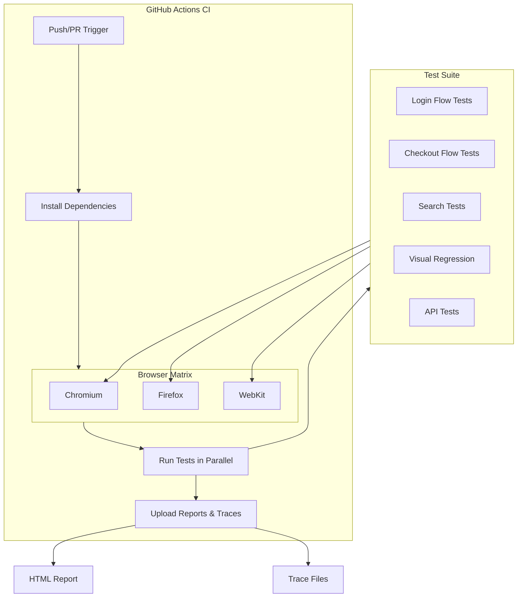

# P06 — Web App Automated Testing (E2E)

## Overview
End-to-end testing framework using Playwright for web application testing, with parallel execution, visual regression testing, and CI/CD integration via GitHub Actions. Demonstrates modern QA automation practices, cross-browser testing, and comprehensive test reporting.

## Key Outcomes
- [x] Playwright test suite for login, checkout, and search flows
- [x] Cross-browser testing (Chromium, Firefox, WebKit)
- [x] Visual regression testing with screenshot comparison
- [x] GitHub Actions CI integration with artifact uploads
- [x] Parallel test execution and test retry logic
- [x] HTML/JSON test reports with trace viewer

## Architecture
- **Components**: Playwright Test, Page Object Model, CI/CD pipeline
- **Test Layers**: UI tests, API tests, visual regression tests
- **Dependencies**: Node.js 18+, Playwright 1.40+



## Quickstart

```bash
make setup
make test
make report
```

## Configuration

| Env Var | Purpose | Example | Required |
|---------|---------|---------|----------|
| `BASE_URL` | Target application URL | `https://example.com` | Yes |
| `TEST_USER` | Test account username | `test@example.com` | Yes |
| `TEST_PASSWORD` | Test account password | `SecurePass123!` | Yes |
| `HEADLESS` | Run tests headless | `true`, `false` | No (default: `true`) |
| `BROWSER` | Browser to test | `chromium`, `firefox`, `webkit` | No (default: `chromium`) |
| `WORKERS` | Parallel workers | `4` | No (default: `4`) |

**Secrets Management**: Store credentials in GitHub Secrets for CI. Use `.env` file locally (gitignored).

```bash
cp .env.example .env
# Edit .env with your test credentials
```

## Testing

```bash
# Run all tests
make test

# Run specific test file
npx playwright test tests/login.spec.ts

# Run in headed mode (see browser)
npx playwright test --headed

# Run with specific browser
npx playwright test --project=firefox

# Debug mode
npx playwright test --debug

# Update visual snapshots
npx playwright test --update-snapshots
```

## Operations

### Logs, Metrics, Traces
- **Test Reports**: `playwright-report/index.html` (generated after test run)
- **Trace Viewer**: `npx playwright show-trace trace.zip`
- **Screenshots**: `test-results/` directory (on failure)
- **Videos**: `test-results/` directory (configurable)

### Common Issues & Fixes

**Issue**: Tests fail with "Timeout waiting for element"
**Fix**: Increase timeout in `playwright.config.ts` or use `waitForLoadState('networkidle')`.

**Issue**: Visual regression tests fail unexpectedly
**Fix**: Update snapshots: `npx playwright test --update-snapshots` (verify changes first).

**Issue**: Browser download fails in CI
**Fix**: Ensure `npx playwright install --with-deps` runs in CI setup.

## Security

### Secrets Handling
- **Development**: Use `.env` file (gitignored), never commit credentials
- **CI/CD**: Store in GitHub Secrets → inject as environment variables
- **Rotation**: Use short-lived test accounts, rotate passwords monthly

### Test Data Security
- Use dedicated test environment (not production)
- Sanitize test data (no PII/PHI)
- Clean up test data after execution

## Roadmap

- [ ] Add accessibility testing with @axe-core/playwright
- [ ] Implement performance testing with Lighthouse CI
- [ ] Add mobile viewport testing (responsive design)
- [ ] Integrate with test management tool (TestRail/Zephyr)
- [ ] Add contract testing for API endpoints

## References

- [Playwright Documentation](https://playwright.dev/)
- [Page Object Model Pattern](https://playwright.dev/docs/pom)
- [Visual Comparisons](https://playwright.dev/docs/test-snapshots)
- [CI/CD Integration](https://playwright.dev/docs/ci)
