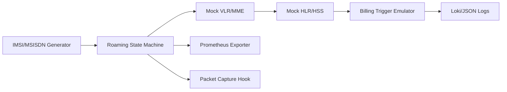

# Architecture — P07 International Roaming Simulation

## System Context
- **User Personas:** Network test engineers triggering synthetic roam events; SREs monitoring HLR/VLR interactions; QA analysts validating billing triggers.
- **External Systems:** Mock HLR/HSS, mock VLR/MME, simulated MSC/PGW, telemetry sink (Prometheus + Loki), artifact store for packet captures.
- **Data Flows:** IMSI/MSISDN flows from generator → state machine → VLR → HLR; charging and location updates exported as metrics and logs.

## Deployment Topology
- **Local/dev:** Docker Compose spins up mock HLR, VLR, and a telemetry stack with exporters on localhost.
- **CI:** Headless simulation run triggered via `make ci-simulate` publishes JUnit + coverage reports and uploads PCAPs as artifacts.
- **Perf lab:** Optional k8s manifests run state-machine workers as Jobs with a Prometheus scraper sidecar.

## Data Model
- **Subscriber record:** `imsi`, `msisdn`, `ki`, `profile`, `allowed_mcc_mnc`, `roaming_agreement`.
- **Event schema:** `event_type`, `timestamp`, `subscriber_id`, `visited_mcc_mnc`, `latency_ms`, `result`, `failure_reason`.

## Availability and Resilience
- Mock services run independently; state machine retries MAP transactions with exponential backoff and dead-letter logging.
- PCAP hook is non-blocking—simulation proceeds even if capture fails.
- Readiness probes verify HLR/VLR HTTP health endpoints before test execution.

## Security and Compliance
- Synthetic identifiers only; PCAPs are scrubbed of subscriber PII.
- Secrets (test Ki values) pulled from `.env`/`config/roaming.yaml` with dotenv loading.
- Audit log of roaming attempts retained for 30 days in `logs/audit/`.
