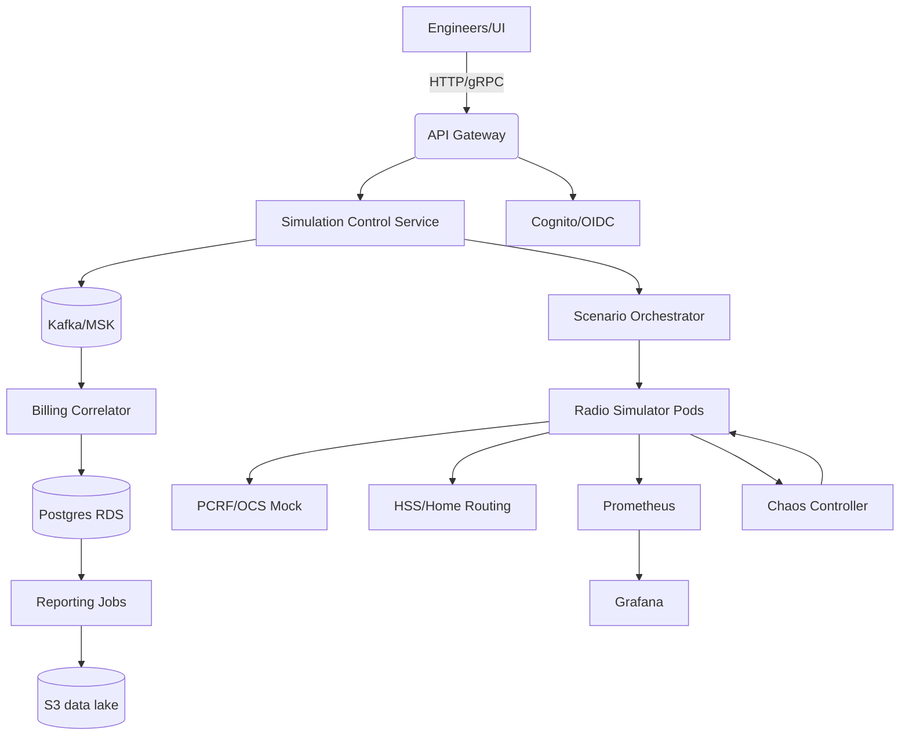

# Roaming Simulation Delivery Artifacts

## 1. Executive Summary
The roaming simulation initiative delivers a carrier-grade pre-production environment that mirrors complex roaming scenarios across 3G/4G/5G networks. The goal is to validate interoperability, latency behavior, billing integrity, and failover policies before features land in live subscriber traffic. The platform combines synthetic traffic generation, protocol-accurate radio simulators, mock PCRF/OCS billing components, and observability tuned to mobile SLAs. Key stakeholders include network engineering, QA, finance/billing, and SRE.

- **Scope:** Simulate attach, detach, handover, billing correlation, loss-of-signal, congestion, throttling, and cross-border roaming policies across multiple mobile standards with both deterministic and chaos-driven profiles.
- **Key Outcomes:**
  - Baseline roaming KPI dashboard (attach/detach success, handover MTTR, billing correlation accuracy, congestion recovery time) with guardrails and error budgets.
  - CI-triggered simulations covering peak load, billing reconciliation, cell-site failover, congestion control, and radio interference scenarios.
  - Playbooks for on-call, chaos drills, data recovery, and runbook automation tied to feature flags.
- **Success Criteria:** 99.5% simulated attach success, <300 ms median attach latency, p95 handover <450 ms, zero unreconciled billing sessions per run, reproducible deployments via Terraform + Helm, and green security gates.
- **Business Alignment:** Prevent revenue leakage by catching billing drift pre-prod, reduce rollout risk for new roaming agreements, and shorten validation cycles by 40% through automated test orchestration.

## 2. README / Setup Guide
### Prerequisites
- Docker 24+, kubectl ≥1.29, Helm ≥3.13, Terraform ≥1.7, Python 3.11, Node 20, GNU Make, Kind (for local), awscli configured with MFA, jq, yq, k6, and Locust.
- Access: AWS account with permissions for EKS, MSK, RDS; GitHub Actions OIDC trust policy; Vault/Secrets Manager for credentials.

### Local Development
1. `python -m venv .venv && source .venv/bin/activate`
2. `pip install -r requirements-dev.txt`
3. `npm install --prefix frontend`
4. `make kind-up` (provisions Kind cluster with local storage class)
5. `make deploy-local` (Terraform + Helmfile renders local stack with lightweight Kafka/Postgres)
6. `make seed-scenarios` (loads baseline attach/handover scenarios)
7. `make e2e` (Cypress API + UI checks) and `make perf-smoke` (k6 short load)
8. View dashboards via `kubectl port-forward svc/grafana 3000:80`

### Production / Staging Deploy
1. Configure backend secrets via `infra/terraform.tfvars` (SIM gateway keys, Kafka SASL, Postgres creds, TLS cert ARNs).
2. `terraform init && terraform apply -var-file=infra/terraform.tfvars` to provision VPC, EKS, MSK, RDS, S3, and IAM roles for service accounts (IRSA).
3. `helmfile -e prod apply` to install services and observability stack with per-env values in `infrastructure/helm/values-prod.yaml`.
4. Seed baseline scenarios: `python scripts/seed_scenarios.py --env prod`.
5. Post-deploy smoke: `make smoke-prod` runs attach/handover simulations and validates dashboards/alerts are green.

### Configuration & Secrets
- Values live in `infrastructure/helm/values-<env>.yaml`; secrets are pulled from AWS Secrets Manager. Feature flags (fallback routing, chaos toggles, throttling controls) stored in `config/feature-flags.yaml`.
- Network profiles defined in `config/profiles/*.yaml` with per-technology parameters (RAN latency, jitter, loss, spectrum). Billing correlation rules in `config/billing-rules.yaml`.

### Acceptance Gates
- `terraform plan` clean; `helmfile lint` passes; `golangci-lint` and `npm run lint` green; `pytest` and `go test ./...` succeed; `make perf-benchmark` meets SLOs; ZAP/Trivy/Semgrep pipelines clean.

## 3. Architecture Diagrams
### Mermaid


### ASCII
```
[UI]--HTTP-->[API GW]-->[Control Svc]-->[Kafka/MSK]-->[Billing Correlator]->(Postgres)
                               |                          |
                               v                          v
                        [Scenario Orchestrator]-->[Radio Sim Pods]->[PCRF/OCS Mock]
                               |                                ->[HSS Mock]
                               v
                        [Prometheus/Grafana] <-> [Chaos Controller]
```

## 4. IaC Code Prompt
> "Generate Terraform for AWS: create VPC (3 AZs), public/private subnets, NAT, EKS (managed node groups for apps + spot sim nodes with taints), MSK cluster with TLS/SASL IAM, RDS Postgres multi-AZ with performance insights, Secrets Manager entries for api, billing, simulator keys, S3 bucket for reports (versioning, SSE-S3, lifecycle to Glacier), CloudWatch log groups, WAF for ingress, and IAM roles for service accounts (IRSA) for controller, billing, Prometheus, and chaos runner. Expose outputs for kubeconfig, MSK brokers, RDS endpoint, Grafana URL, and S3 bucket." Acceptance: `terraform validate` + `terraform plan` clean; cluster nodes tainted for sim workload; least privilege IAM policies; tflint + checkov pass; produces cost estimate.

## 5. Backend Code Prompt
> "Build a Go 1.22 gRPC/HTTP service `control` exposing `StartScenario`, `AbortScenario`, `GetRunStatus`, `ListProfiles`, and `ReconcileBilling`. Use Gin for REST façade, gRPC for orchestrator communication. Persist run metadata in Postgres via sqlc with migrations managed by goose. Publish scenario intents to Kafka with idempotent producer and exactly-once semantics; include retry/backoff and DLQ topic. Add OpenTelemetry tracing, zap logger, structured audit logs, and configurable timeouts. Include feature flags (rollbacks, fallback routes). Acceptance: unit tests for handlers and Kafka publisher; `golangci-lint` clean; contract tests for gRPC/REST parity; 90%+ coverage on core orchestration logic." 

## 6. Frontend Code Prompt
> "Create a React 18 + TypeScript SPA with Vite. Pages: Run Dashboard, Scenario Designer, KPI Dashboard, Billing Reconciliation, Chaos Drill Board. Use Recharts for charts, TanStack Query for data, and MUI for layout. Provide forms to compose handover scenarios (cell IDs, roaming agreement, traffic mix, impairment injection). Add websocket live-updates for run status and Grafana PNG embeds. Implement RBAC (viewer, operator, admin) and feature flag toggles. Acceptance: `npm test`, `npm run lint`, Lighthouse performance >90, a11y score >90; storybook stories for components." 

## 7. Containerization Prompt
> "Dockerize control, billing, simulator, and frontend. Use multistage builds, non-root user, distroless base for Go, node:20-alpine for frontend with nginx serve. Provide health endpoints `/healthz` `/readyz`; expose Prometheus metrics. Create docker-compose override for local dev including MSK-local, Postgres, and Grafana. Sign images with cosign and generate SBOM with Syft." Acceptance: `docker build` succeeds; images run as non-root; `docker compose up` local smoke; `cosign verify` passes; SBOM uploaded as artifact.

## 8. CI/CD Prompt
> "GitHub Actions: workflows for lint/test (Go, Python, TS), security scan (Trivy, Semgrep, gitleaks), build-push images to ECR, apply Terraform via Atlantis-style plan/apply, Helm deploy to EKS with canary (progressive delivery using Argo Rollouts), chaos experiment stage post-deploy, and synthetic attach smoke. Use OIDC to assume roles. Add reusable workflow for smoke simulations post-deploy and nightly performance runs. Enforce branch protections, required reviews, and environment approvals." Acceptance: all workflows required and gated; artifact retention configured; audit logs captured; canary rollback automated.

## 9. Observability Prompt
> "Provision Prometheus Operator, Tempo, Loki, Grafana dashboards for roaming KPIs (attach success, handover latency p50/p95, billing reconciliation lag, chaos success), and KEDA for scaling on Kafka lag. Instrument apps with OTEL SDKs exporting traces/logs/metrics. Add alert rules for attach success <99.5%, billing lag >2 min, Kafka consumer lag >5k, chaos failure rate >2%, and simulator pod restarts >3/10m. Provide runbooks per alert with links. Include synthetic probes using blackbox exporter." Acceptance: alerts fire in test; dashboards render sample data; traces show `run_id` propagation.

## 10. Testing Suite
- **Unit:** Go (handlers, Kafka publishers, billing recon), Python simulator engines, JS components with RTL; enforce coverage thresholds (Go 85%, Py 85%, JS 80%).
- **Integration:** TestContainers validating Postgres/Kafka interactions; contract tests for API schema with OpenAPI and gRPC reflection; gRPC-Web compatibility tests.
- **Performance:** Locust profiles simulating 10k concurrent attaches and 2k handovers/min with thresholds p95 attach <300 ms, p95 handover <450 ms.
- **Chaos:** Litmus or kube-monkey to kill sim pods, inject latency and packet loss; validate orchestrator retry and billing reconciliation robustness.
- **Billing Reconciliation:** Golden dataset comparison script ensuring zero drift; diff report exported to S3 and Slack.
- **Security:** ZAP baseline, k6 TLS regression, Semgrep SAST, dependency scanning; validate JWT verification and least-privilege RBAC.
- **Acceptance Criteria:** CI green; performance and chaos SLOs met in staging; alert tests (promtool test rules) pass; synthetic handover smoke after deploy.

## 11. Operational Playbooks
- **On-call Rotation:** L1 (SRE), L2 (Network Eng). PagerDuty schedules stored in `/operations/oncall.md`; escalation matrix includes Finance for billing anomalies.
- **Runbook: Handover failure spike**
  1. Check Grafana alert context; correlate with Kafka lag and node pressure.
  2. `kubectl get pods -l app=sim`; restart failing pod if crashlooping via `kubectl rollout restart deploy/sim`.
  3. Inspect orchestrator logs `kubectl logs deploy/orch -c app --since=10m | grep handover` with trace_id.
  4. Run synthetic attach `make smoke-handover` and capture metrics.
  5. If persists, fail open to alternate route via feature flag `handover_fallback=true` using `make feature-flags`.
  6. Engage vendor if PCRF/OCS mock misbehaves; switch to fallback billing rule set.
- **Runbook: Billing reconciliation drift**
  1. Trigger replay job `python scripts/reconcile.py --mode replay --from-offset <offset>`.
  2. Validate Postgres counts vs golden dataset; if drift >0, quarantine offending runs and notify Finance.
  3. Rotate Kafka consumer group to new offset after fix.
- **Data Recovery:** Restore Postgres from latest snapshot via Terraform `apply -target=aws_db_instance.restore` and replay Kafka topics from offset `billing.topic`. Validate with checksum reports.
- **Deploy Freeze Procedure:** Toggle `deploy_freeze=true` in `operations/change_window.md`; require director approval; block merge via GitHub environment protection.
- **Capacity Management:** Weekly review of MSK and node utilization; run `terraform plan` cost estimates; scale simulators with KEDA thresholds.
- **Compliance/Privacy:** Ensure payloads sanitized; audit logs shipped to S3 with retention policy and access reviews quarterly.

## 12. Reporting Templates
- **Weekly Ops Report:** uptime, attach success trend, incident summary (MTTR/MTTA), change requests executed, capacity headroom, chaos experiment results, alert tuning actions.
- **Exec KPI Pack:** slide deck template in `reports/roaming_kpis.pptx` with charts bound to Grafana PNG exports for attach success, handover MTTR, billing accuracy, and cost trends.
- **Incident Postmortem:** template capturing timeline, contributing factors, corrective actions (30/90 days), cost impact, and linkage to risks/controls.
- **Quarterly Business Review:** summary of revenue protection, reduced field trials, SLA adherence, and roadmap alignment.

## 13. Metrics & Observability
- **SLIs/SLOs:** attach success 99.5%, median attach latency 300 ms, handover p95 <450 ms, billing reconciliation lag <120s, Kafka consumer lag <5k messages, chaos success rate ≥98%.
- **Dashboards:** Handover heatmap by cell; billing reconciliation pipeline; infra health (node saturation, pod restarts); chaos experiment outcomes; cost dashboard using CloudWatch metrics.
- **Logs/Traces:** Correlate `run_id` across services; traceparent propagation via W3C headers; log sampling at 10% for simulator debug; audit logs tagged with user and scenario.
- **Alerting:** PagerDuty routing for P1/P2; Slack webhooks for P3; alert runbooks linked from Grafana; error budget burn alerts for attach SLO.

## 14. Security & Threat Model
- **STRIDE:**
  - Spoofing: mutual TLS between services, JWT auth via Cognito; signed feature flags.
  - Tampering: Kafka ACLs, client auth, at-rest encryption; config immutability through GitOps.
  - Repudiation: Audit logs stored in S3 with write-once retention; cloudtrail for control plane actions.
  - Information Disclosure: PII-free payloads; data masking for traces; secrets in Secrets Manager with CMK.
  - DoS: WAF rate limits; HPA for sim pods; circuit breakers and backpressure; per-tenant quotas.
  - Elevation: RBAC least privilege; IRSA per service; CI OIDC with least-privilege roles.
- **ATT&CK Mapping:** T1078 (valid accounts) mitigated via SSO + MFA; T1499 (resource hijacking) via quotas; T1190 (exposed service) via WAF + private EKS API; T1562 (defense evasion) mitigated with audit log integrity; T1210 lateral movement mitigated via network policies.
- **Security Controls:** Semgrep/Trivy in CI; SAST/DAST; secrets scanning; SBOM+cosign; periodic pen-tests; runtime policies via Kyverno (block privileged); network policies isolating simulators.
- **Threat Scenarios:** Rogue simulator injection, billing tampering, Kafka credential leak, denial via malformed scenarios, data exfil via logs; each mapped to control + detection.

## 15. Risk Register (>=10)
1. Kafka broker outage – **Mitigation:** multi-AZ MSK, client retries, KEDA scale; **Owner:** SRE; **Impact:** High; **Likelihood:** Medium.
2. Billing drift – **Mitigation:** reconciliation job with golden dataset; dual writes; **Owner:** Finance Eng; **Impact:** High.
3. Attach latency regression – **Mitigation:** performance CI gate; profiling; **Owner:** QA Lead.
4. Cert expiry – **Mitigation:** ACM auto-renew, calendar alerts, chaos check; **Owner:** Platform.
5. Terraform drift – **Mitigation:** run `terraform plan` weekly with drift alerts; **Owner:** Cloud Eng.
6. Helm misconfig – **Mitigation:** schema validation via cue/helm schema; **Owner:** DevOps.
7. Secrets leak – **Mitigation:** OIDC + scoped IAM; rotate quarterly; secret scanning; **Owner:** Security.
8. On-call fatigue – **Mitigation:** rotate weekly, follow-the-sun, limit after-hours pages; **Owner:** Eng Manager.
9. Data loss in Postgres – **Mitigation:** daily snapshots, PITR, chaos restores; **Owner:** DBA.
10. Unrealistic simulations – **Mitigation:** validate scenarios with live metrics baseline; periodic calibration; **Owner:** Network Eng.
11. Overspend on MSK/EKS – **Mitigation:** rightsizing, spot nodes for sims, cost dashboards; **Owner:** FinOps.
12. Chaos causing false alarms – **Mitigation:** windowed chaos with comms, synthetic probes; **Owner:** SRE.

## 16. ADRs
- **ADR-001:** Use AWS EKS + MSK due to managed durability and network integration, reducing ops toil vs self-managed Kafka/K8s.
- **ADR-002:** Choose Go for control plane for concurrency, static typing, and strong ecosystem for gRPC and Kafka clients.
- **ADR-003:** Adopt Kafka for decoupling orchestrator and simulators, enabling replay and ordered eventing vs direct RPC coupling.
- **ADR-004:** Use Terraform + Helmfile for reproducible envs over manual scripts, enabling GitOps and drift detection.
- **ADR-005:** Implement OpenTelemetry-first instrumentation to unify traces/metrics/logs and support SLO enforcement.

## 17. Business Value
- **Revenue Protection:** Validates roaming billing before customer impact, preventing leakage and disputes; expected reduction of billing incidents by 60%.
- **Time-to-Market:** Simulated environments reduce field trials cycle time by 40% and accelerate onboarding of new roaming partners.
- **Reliability:** Detects network regressions early, improving SLA compliance and lowering churn through better service continuity.
- **Operational Efficiency:** Automated playbooks reduce incident MTTR; consistent IaC reduces drift risk; centralized dashboards shorten troubleshooting by 30%.
- **Regulatory Confidence:** Demonstrates testing evidence for audits on billing accuracy and network continuity; supports disaster recovery readiness.
