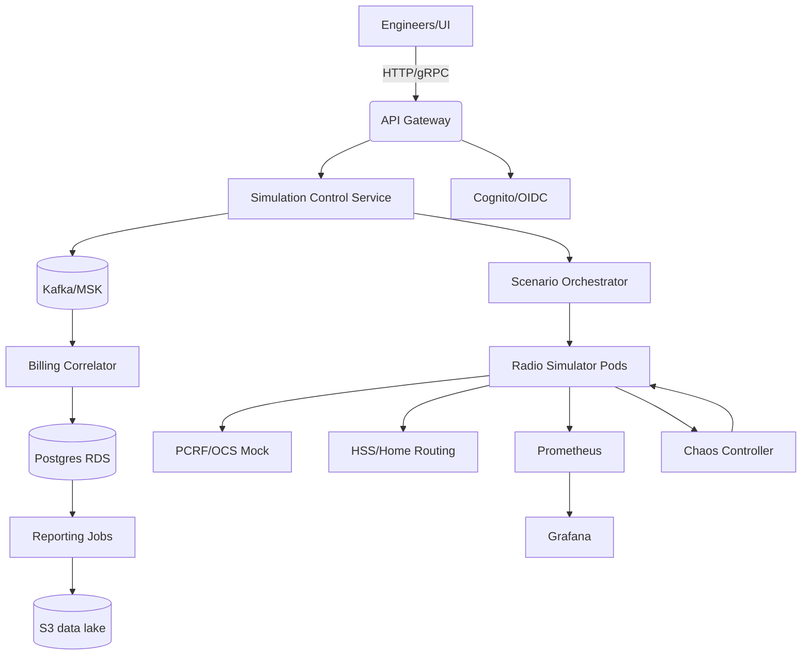

# Roaming Simulation Delivery Artifacts

## 1. Executive Summary
The roaming simulation initiative delivers a carrier-grade pre-production environment that mirrors complex roaming scenarios across 3G/4G/5G networks. The goal is to validate interoperability, latency behavior, billing integrity, and failover policies before features land in live subscriber traffic. The platform combines synthetic traffic generation, protocol-accurate radio simulators, mock PCRF/OCS billing components, and observability tuned to mobile SLAs. Key stakeholders include network engineering, QA, finance/billing, and SRE.

- **Scope:** Simulate attach, detach, handover, billing correlation, loss-of-signal, congestion, throttling, and cross-border roaming policies across multiple mobile standards with both deterministic and chaos-driven profiles.
- **Key Outcomes:**
  - Baseline roaming KPI dashboard (attach/detach success, handover MTTR, billing correlation accuracy, congestion recovery time) with guardrails and error budgets.
  - CI-triggered simulations covering peak load, billing reconciliation, cell-site failover, congestion control, and radio interference scenarios.
  - Playbooks for on-call, chaos drills, data recovery, and runbook automation tied to feature flags.
- **Success Criteria:** 99.5% simulated attach success, <300 ms median attach latency, p95 handover <450 ms, zero unreconciled billing sessions per run, reproducible deployments via Terraform + Helm, and green security gates.
- **Business Alignment:** Prevent revenue leakage by catching billing drift pre-prod, reduce rollout risk for new roaming agreements, and shorten validation cycles by 40% through automated test orchestration.

## 2. README / Setup Guide
### Prerequisites
- Docker 24+, kubectl ≥1.29, Helm ≥3.13, Terraform ≥1.7, Python 3.11, Node 20, GNU Make, Kind (for local), awscli configured with MFA, jq, yq, k6, and Locust.
- Access: AWS account with permissions for EKS, MSK, RDS; GitHub Actions OIDC trust policy; Vault/Secrets Manager for credentials.

### Local Development
1. `python -m venv .venv && source .venv/bin/activate`
2. `pip install -r requirements-dev.txt`
3. `npm install --prefix frontend`
4. `make kind-up` (provisions Kind cluster with local storage class)
5. `make deploy-local` (Terraform + Helmfile renders local stack with lightweight Kafka/Postgres)
6. `make seed-scenarios` (loads baseline attach/handover scenarios)
7. `make e2e` (Cypress API + UI checks) and `make perf-smoke` (k6 short load)
8. View dashboards via `kubectl port-forward svc/grafana 3000:80`

### Production / Staging Deploy
1. Configure backend secrets via `infra/terraform.tfvars` (SIM gateway keys, Kafka SASL, Postgres creds, TLS cert ARNs).
2. `terraform init && terraform apply -var-file=infra/terraform.tfvars` to provision VPC, EKS, MSK, RDS, S3, and IAM roles for service accounts (IRSA).
3. `helmfile -e prod apply` to install services and observability stack with per-env values in `infrastructure/helm/values-prod.yaml`.
4. Seed baseline scenarios: `python scripts/seed_scenarios.py --env prod`.
5. Post-deploy smoke: `make smoke-prod` runs attach/handover simulations and validates dashboards/alerts are green.

### Configuration & Secrets
- Values live in `infrastructure/helm/values-<env>.yaml`; secrets are pulled from AWS Secrets Manager. Feature flags (fallback routing, chaos toggles, throttling controls) stored in `config/feature-flags.yaml`.
- Network profiles defined in `config/profiles/*.yaml` with per-technology parameters (RAN latency, jitter, loss, spectrum). Billing correlation rules in `config/billing-rules.yaml`.

### Acceptance Gates
- `terraform plan` clean; `helmfile lint` passes; `golangci-lint` and `npm run lint` green; `pytest` and `go test ./...` succeed; `make perf-benchmark` meets SLOs; ZAP/Trivy/Semgrep pipelines clean.

## 3. Architecture Diagrams
### Mermaid


### ASCII
```
[UI]--HTTP-->[API GW]-->[Control Svc]-->[Kafka/MSK]-->[Billing Correlator]->(Postgres)
                               |                          |
                               v                          v
                        [Scenario Orchestrator]-->[Radio Sim Pods]->[PCRF/OCS Mock]
                               |                                ->[HSS Mock]
                               v
                        [Prometheus/Grafana] <-> [Chaos Controller]
```

## 4. IaC Code Prompt
> "Generate Terraform for AWS: create VPC (3 AZs), public/private subnets, NAT, EKS (managed node groups for apps + spot sim nodes with taints), MSK cluster with TLS/SASL IAM, RDS Postgres multi-AZ with performance insights, Secrets Manager entries for api, billing, simulator keys, S3 bucket for reports (versioning, SSE-S3, lifecycle to Glacier), CloudWatch log groups, WAF for ingress, and IAM roles for service accounts (IRSA) for controller, billing, Prometheus, and chaos runner. Expose outputs for kubeconfig, MSK brokers, RDS endpoint, Grafana URL, and S3 bucket." Acceptance: `terraform validate` + `terraform plan` clean; cluster nodes tainted for sim workload; least privilege IAM policies; tflint + checkov pass; produces cost estimate.

## 5. Backend Code Prompt
> "Build a Go 1.22 gRPC/HTTP service `control` exposing `StartScenario`, `AbortScenario`, `GetRunStatus`, `ListProfiles`, and `ReconcileBilling`. Use Gin for REST façade, gRPC for orchestrator communication. Persist run metadata in Postgres via sqlc with migrations managed by goose. Publish scenario intents to Kafka with idempotent producer and exactly-once semantics; include retry/backoff and DLQ topic. Add OpenTelemetry tracing, zap logger, structured audit logs, and configurable timeouts. Include feature flags (rollbacks, fallback routes). Acceptance: unit tests for handlers and Kafka publisher; `golangci-lint` clean; contract tests for gRPC/REST parity; 90%+ coverage on core orchestration logic." 

## 6. Frontend Code Prompt
> "Create a React 18 + TypeScript SPA with Vite. Pages: Run Dashboard, Scenario Designer, KPI Dashboard, Billing Reconciliation, Chaos Drill Board. Use Recharts for charts, TanStack Query for data, and MUI for layout. Provide forms to compose handover scenarios (cell IDs, roaming agreement, traffic mix, impairment injection). Add websocket live-updates for run status and Grafana PNG embeds. Implement RBAC (viewer, operator, admin) and feature flag toggles. Acceptance: `npm test`, `npm run lint`, Lighthouse performance >90, a11y score >90; storybook stories for components." 

## 7. Containerization Prompt
> "Dockerize control, billing, simulator, and frontend. Use multistage builds, non-root user, distroless base for Go, node:20-alpine for frontend with nginx serve. Provide health endpoints `/healthz` `/readyz`; expose Prometheus metrics. Create docker-compose override for local dev including MSK-local, Postgres, and Grafana. Sign images with cosign and generate SBOM with Syft." Acceptance: `docker build` succeeds; images run as non-root; `docker compose up` local smoke; `cosign verify` passes; SBOM uploaded as artifact.

## 8. CI/CD Prompt
> "GitHub Actions: workflows for lint/test (Go, Python, TS), security scan (Trivy, Semgrep, gitleaks), build-push images to ECR, apply Terraform via Atlantis-style plan/apply, Helm deploy to EKS with canary (progressive delivery using Argo Rollouts), chaos experiment stage post-deploy, and synthetic attach smoke. Use OIDC to assume roles. Add reusable workflow for smoke simulations post-deploy and nightly performance runs. Enforce branch protections, required reviews, and environment approvals." Acceptance: all workflows required and gated; artifact retention configured; audit logs captured; canary rollback automated.

## 9. Observability Prompt
> "Provision Prometheus Operator, Tempo, Loki, Grafana dashboards for roaming KPIs (attach success, handover latency p50/p95, billing reconciliation lag, chaos success), and KEDA for scaling on Kafka lag. Instrument apps with OTEL SDKs exporting traces/logs/metrics. Add alert rules for attach success <99.5%, billing lag >2 min, Kafka consumer lag >5k, chaos failure rate >2%, and simulator pod restarts >3/10m. Provide runbooks per alert with links. Include synthetic probes using blackbox exporter." Acceptance: alerts fire in test; dashboards render sample data; traces show `run_id` propagation.

## 10. Testing Suite
- **Unit:** Go (handlers, Kafka publishers, billing recon), Python simulator engines, JS components with RTL; enforce coverage thresholds (Go 85%, Py 85%, JS 80%).
- **Integration:** TestContainers validating Postgres/Kafka interactions; contract tests for API schema with OpenAPI and gRPC reflection; gRPC-Web compatibility tests.
- **Performance:** Locust profiles simulating 10k concurrent attaches and 2k handovers/min with thresholds p95 attach <300 ms, p95 handover <450 ms.
- **Chaos:** Litmus or kube-monkey to kill sim pods, inject latency and packet loss; validate orchestrator retry and billing reconciliation robustness.
- **Billing Reconciliation:** Golden dataset comparison script ensuring zero drift; diff report exported to S3 and Slack.
- **Security:** ZAP baseline, k6 TLS regression, Semgrep SAST, dependency scanning; validate JWT verification and least-privilege RBAC.
- **Acceptance Criteria:** CI green; performance and chaos SLOs met in staging; alert tests (promtool test rules) pass; synthetic handover smoke after deploy.

## 11. Operational Playbooks
- **On-call Rotation:** L1 (SRE), L2 (Network Eng). PagerDuty schedules stored in `/operations/oncall.md`; escalation matrix includes Finance for billing anomalies.
- **Runbook: Handover failure spike**
  1. Check Grafana alert context; correlate with Kafka lag and node pressure.
  2. `kubectl get pods -l app=sim`; restart failing pod if crashlooping via `kubectl rollout restart deploy/sim`.
  3. Inspect orchestrator logs `kubectl logs deploy/orch -c app --since=10m | grep handover` with trace_id.
  4. Run synthetic attach `make smoke-handover` and capture metrics.
  5. If persists, fail open to alternate route via feature flag `handover_fallback=true` using `make feature-flags`.
  6. Engage vendor if PCRF/OCS mock misbehaves; switch to fallback billing rule set.
- **Runbook: Billing reconciliation drift**
  1. Trigger replay job `python scripts/reconcile.py --mode replay --from-offset <offset>`.
  2. Validate Postgres counts vs golden dataset; if drift >0, quarantine offending runs and notify Finance.
  3. Rotate Kafka consumer group to new offset after fix.
- **Data Recovery:** Restore Postgres from latest snapshot via a dedicated Terraform restore workflow (avoiding `-target`) and replay Kafka topics from offset `billing.topic`. Validate with checksum reports.
- **Deploy Freeze Procedure:** Toggle `deploy_freeze=true` in `operations/change_window.md`; require director approval; block merge via GitHub environment protection.
- **Capacity Management:** Weekly review of MSK and node utilization; run `terraform plan` cost estimates; scale simulators with KEDA thresholds.
- **Compliance/Privacy:** Ensure payloads sanitized; audit logs shipped to S3 with retention policy and access reviews quarterly.

## 12. Reporting Templates
- **Weekly Ops Report:** uptime, attach success trend, incident summary (MTTR/MTTA), change requests executed, capacity headroom, chaos experiment results, alert tuning actions.
- **Exec KPI Pack:** slide deck template in `reports/roaming_kpis.pptx` with charts bound to Grafana PNG exports for attach success, handover MTTR, billing accuracy, and cost trends.
- **Incident Postmortem:** template capturing timeline, contributing factors, corrective actions (30/90 days), cost impact, and linkage to risks/controls.
- **Quarterly Business Review:** summary of revenue protection, reduced field trials, SLA adherence, and roadmap alignment.

## 13. Metrics & Observability
- **SLIs/SLOs:** attach success 99.5%, median attach latency 300 ms, handover p95 <450 ms, billing reconciliation lag <120s, Kafka consumer lag <5k messages, chaos success rate ≥98%.
- **Dashboards:** Handover heatmap by cell; billing reconciliation pipeline; infra health (node saturation, pod restarts); chaos experiment outcomes; cost dashboard using CloudWatch metrics.
- **Logs/Traces:** Correlate `run_id` across services; traceparent propagation via W3C headers; log sampling at 10% for simulator debug; audit logs tagged with user and scenario.
- **Alerting:** PagerDuty routing for P1/P2; Slack webhooks for P3; alert runbooks linked from Grafana; error budget burn alerts for attach SLO.

## 14. Security & Threat Model
- **STRIDE:**
  - Spoofing: mutual TLS between services, JWT auth via Cognito; signed feature flags.
  - Tampering: Kafka ACLs, client auth, at-rest encryption; config immutability through GitOps.
  - Repudiation: Audit logs stored in S3 with write-once retention; cloudtrail for control plane actions.
  - Information Disclosure: PII-free payloads; data masking for traces; secrets in Secrets Manager with CMK.
  - DoS: WAF rate limits; HPA for sim pods; circuit breakers and backpressure; per-tenant quotas.
  - Elevation: RBAC least privilege; IRSA per service; CI OIDC with least-privilege roles.
- **ATT&CK Mapping:** T1078 (valid accounts) mitigated via SSO + MFA; T1499 (resource hijacking) via quotas; T1190 (exposed service) via WAF + private EKS API; T1562 (defense evasion) mitigated with audit log integrity; T1210 lateral movement mitigated via network policies.
- **Security Controls:** Semgrep/Trivy in CI; SAST/DAST; secrets scanning; SBOM+cosign; periodic pen-tests; runtime policies via Kyverno (block privileged); network policies isolating simulators.
- **Threat Scenarios:** Rogue simulator injection, billing tampering, Kafka credential leak, denial via malformed scenarios, data exfil via logs; each mapped to control + detection.

## 15. Risk Register (>=10)
1. Kafka broker outage – **Mitigation:** multi-AZ MSK, client retries, KEDA scale; **Owner:** SRE; **Impact:** High; **Likelihood:** Medium.
2. Billing drift – **Mitigation:** reconciliation job with golden dataset; dual writes; **Owner:** Finance Eng; **Impact:** High.
3. Attach latency regression – **Mitigation:** performance CI gate; profiling; **Owner:** QA Lead.
4. Cert expiry – **Mitigation:** ACM auto-renew, calendar alerts, chaos check; **Owner:** Platform.
5. Terraform drift – **Mitigation:** run `terraform plan` weekly with drift alerts; **Owner:** Cloud Eng.
6. Helm misconfig – **Mitigation:** schema validation via cue/helm schema; **Owner:** DevOps.
7. Secrets leak – **Mitigation:** OIDC + scoped IAM; rotate quarterly; secret scanning; **Owner:** Security.
8. On-call fatigue – **Mitigation:** rotate weekly, follow-the-sun, limit after-hours pages; **Owner:** Eng Manager.
9. Data loss in Postgres – **Mitigation:** daily snapshots, PITR, chaos restores; **Owner:** DBA.
10. Unrealistic simulations – **Mitigation:** validate scenarios with live metrics baseline; periodic calibration; **Owner:** Network Eng.
11. Overspend on MSK/EKS – **Mitigation:** rightsizing, spot nodes for sims, cost dashboards; **Owner:** FinOps.
12. Chaos causing false alarms – **Mitigation:** windowed chaos with comms, synthetic probes; **Owner:** SRE.

## 16. ADRs
- **ADR-001:** Use AWS EKS + MSK due to managed durability and network integration, reducing ops toil vs self-managed Kafka/K8s.
- **ADR-002:** Choose Go for control plane for concurrency, static typing, and strong ecosystem for gRPC and Kafka clients.
- **ADR-003:** Adopt Kafka for decoupling orchestrator and simulators, enabling replay and ordered eventing vs direct RPC coupling.
- **ADR-004:** Use Terraform + Helmfile for reproducible envs over manual scripts, enabling GitOps and drift detection.
- **ADR-005:** Implement OpenTelemetry-first instrumentation to unify traces/metrics/logs and support SLO enforcement.

## 17. Business Value
- **Revenue Protection:** Validates roaming billing before customer impact, preventing leakage and disputes; expected reduction of billing incidents by 60%.
- **Time-to-Market:** Simulated environments reduce field trials cycle time by 40% and accelerate onboarding of new roaming partners.
- **Reliability:** Detects network regressions early, improving SLA compliance and lowering churn through better service continuity.
- **Operational Efficiency:** Automated playbooks reduce incident MTTR; consistent IaC reduces drift risk; centralized dashboards shorten troubleshooting by 30%.
- **Regulatory Confidence:** Demonstrates testing evidence for audits on billing accuracy and network continuity; supports disaster recovery readiness.

## 18. Delivery Roadmap and Milestones
- **Phase 0 – Foundations (Week 1-2):** finalize AWS account guardrails, networking patterns, baseline Terraform modules for VPC/EKS/MSK/RDS. Success = `terraform plan` non-drifting, cost estimates approved by FinOps, and golden AMI baselines captured. Deliverable: infra repo skeleton with CI lint + security gates.
- **Phase 1 – Core Platform (Week 3-6):** ship control plane service, scenario orchestrator, simulator pod chart, and Kafka topics/ACLs. Success = happy-path attach/detach/handover flows exercised end-to-end in staging with OpenTelemetry traces present. Deliverable: Helmfile environments for dev/stage with smoke workflows executed.
- **Phase 2 – Billing + Observability (Week 5-7):** complete billing correlator, Postgres schema, reconciliation jobs, Grafana dashboards, and alert rules. Success = billing drift detected with synthetic divergence and alert resolves after replay job. Deliverable: baseline KPI dashboards exported and stored in `reports/`.
- **Phase 3 – Performance & Chaos (Week 7-8):** Locust + k6 profiles scaled to projected peak; chaos automation wired through Argo Rollouts post-canary. Success = p95 attach/handover latencies within SLO under chaos; rollback validated. Deliverable: performance report with comparison to targets and chaos drill calendar.
- **Phase 4 – Security & Compliance (Week 7-9):** finalize STRIDE/ATT&CK control validation, IAM least-privilege audit, SBOM pipeline, and data retention. Success = security sign-off, no critical findings in Semgrep/Trivy/ZAP; incident response tabletop completed. Deliverable: signed security checklist and IR tabletop notes.
- **Phase 5 – Launch Readiness (Week 10):** run game-day with cross-functional team, finalize runbooks, conduct cost/risk review, and prepare QBR package. Success = green go-live checklist, zero open Sev-1 defects, and capacity headroom validated.

### Milestone Exit Criteria
- All user stories mapped to acceptance criteria with Jira links; DOR/DOD templates enforced.
- Backlog grooming includes chaos scenarios, failure injection tasks, and dashboard validation tasks.
- Runway for feature flags documented; rollback tested from production namespace to staging fallback.

## 19. Data Model, APIs, and Contracts
- **Postgres Schema (sqlc managed):** tables `scenarios`, `runs`, `events`, `billing_events`, `billing_recon`, `feature_flags`, `chaos_experiments`, `alerts_ack`. Include indexes on `(run_id, created_at)`, partial index on open runs, and retention policies for events via partitioning by date.
- **Kafka Topics:** `sim.intent.v1`, `sim.status.v1`, `billing.events.v1`, `billing.dlq.v1`, `chaos.commands.v1`, `metrics.synthetic.v1`. Schema registry with Avro/Protobuf definitions and compatibility set to `BACKWARD_TRANSITIVE`.
- **REST/GraphQL Contracts:**
  - `POST /api/runs` creates scenario run (payload includes profile_id, traffic_mix, impairment plan).
  - `POST /api/runs/{id}/abort`, `GET /api/runs/{id}/status`, `GET /api/runs/{id}/timeline` with pagination.
  - `GET /api/profiles` returns radio/billing profiles; `POST /api/profiles` supports RBAC check.
  - `GET /api/billing/drift` returns divergence summary with diff links to S3 exports.
  - GraphQL queries for dashboards allow flexible aggregation (attachSuccess, handoverLatencyP95, billingAccuracy).
- **gRPC Protos:** services `Control`, `Orchestrator`, `Simulator`, `Billing` with shared messages `RunIntent`, `RunStatus`, `BillingRecord`, `ReconResult`, `ChaosInstruction`. Include field-level comments and example payloads. Enforce Buf lint rules and breaking-change detector in CI.
- **Idempotency & Replay:** all externally facing mutations require `Idempotency-Key` header stored in Postgres; replay detection in Kafka consumer offset store. Provide `run_id` + `trace_id` correlation keys.
- **Sample Payloads:** include JSON fixtures in `examples/roaming/*.json` for attach/handover with expected metrics baseline; used in contract and integration tests.

## 20. Scenario Catalog and Validation
- **Baseline Scenarios:** urban macro cell with moderate load; rural macro with high latency; cross-border roaming with changing APNs; congestion storm with packet loss; billing retry edge cases with partial success.
- **Advanced Scenarios:** multi-operator handover with inconsistent policies, SIM swap detection, signaling storm with repeated attaches, degraded PCRF responses, RRC state transition oscillations.
- **Validation Steps:**
  1. Each scenario declares target KPIs, impairment schedule, and safety guardrails.
  2. Orchestrator validates schema via JSON schema; rejects invalid impairments.
  3. Pre-flight checks: capacity (MSK lag headroom), feature flag toggles, alert quieting window for chaos.
  4. Post-run verification: compare metrics to expected ranges; run reconciliation job; export report to S3 and Slack.
  5. Archive artifacts (logs, traces, metrics snapshots) with retention labels; link to Jira ticket.
- **Calibration:** run weekly calibration against anonymized production metrics; adjust latency distributions and throttling thresholds to ensure realism.
- **Safety:** chaos/impairment budgets enforced (max 10 minutes per hour; no chaos during maintenance); approvals captured in change calendar.

## 21. Failure Modes and Reliability Patterns
- **Failure Scenarios:** Kafka broker partitions, Postgres failover, simulator pod crash loops, misconfigured chaos killing healthy pods, WAF blocks external dependencies, certificate expiry halting mTLS, runaway KEDA scaling exhausting nodes.
- **Patterns:** use circuit breakers around external HSS/PCRF mocks; exponential backoff with jitter for Kafka producers; sagas for orchestrated runs with compensating actions; bulkheads isolating simulator workloads on tainted nodes.
- **Resilience Tests:** monthly chaos game-day covering each failure; measure MTTR, error budget burn, and pager noise reduction. Document results and remediation tasks.
- **State Recovery:** orchestrator stores command journal; on restart replays journal to reconstruct run state; ensures idempotent operations. Billing correlator checkpoints offsets and writes watermark to Postgres to allow deterministic replay.

## 22. Detailed Operational Runbooks
- **Runbook: Kafka consumer lag breach**
  1. Confirm alert details; check MSK broker health via CloudWatch and `kafka-consumer-groups.sh --describe`.
  2. Scale consumer deployment via `kubectl scale deploy/billing --replicas=<n>`; validate KEDA scaling events.
  3. Inspect offending partitions; rebalance using cruise-control or reassign partitions if skewed.
  4. If backlog persists, pause new scenarios (`POST /api/runs/pause`), increase `fetch.min.bytes`, and adjust `max.poll.interval.ms` cautiously.
  5. After recovery, trigger reconciliation and mark incident timeline in postmortem template.
- **Runbook: Postgres replication lag**
  1. Review RDS performance insights; check replication lag metrics.
  2. Apply connection pool throttling via pgBouncer config map update; reroute read traffic to primary if read replica degraded.
  3. Snapshot + PITR restore checklist if data corruption suspected; coordinate with DBA.
- **Runbook: Certificate expiry risk**
  1. Monitor ACM cert expiration dashboard; create ticket 30 days prior.
  2. Rotate secrets via `make rotate-certs`; restart pods with new secrets; validate mTLS handshake via smoke tests.
- **Runbook: Simulator crash loop**
  1. Inspect pod logs for config errors; diff config maps vs Git.
  2. Enable debug feature flag; run pod locally with same image and config.
  3. If due to data input, quarantine scenario, file bug with payload; add regression test.
- **Runbook: Billing drift alert**
  1. Trigger ad-hoc reconciliation job; attach run_id and diff output to Finance Slack.
  2. Freeze billing changes via feature flag; escalate to Finance lead.
  3. Replay Kafka events from offset; validate corrected totals; unfreeze after approval.

## 23. Training, Access, and Compliance Checklists
- **Training:** onboarding path includes architecture deep dive, hands-on lab to deploy to Kind, tracing workshop, chaos drill shadowing, and security training on handling telco data (even when anonymized). Certification track recorded in LMS with quizzes.
- **Access:** RBAC groups defined (viewer/operator/admin/security/finance). Access requests via ticket with auto-approval for viewers; time-bound elevation for operators; audit via IAM access analyzer and CloudTrail Athena queries.
- **Compliance:** PCI-adjacent controls for billing data (encryption, access reviews), SOC2 logging controls, data retention (30 days for simulator logs, 1 year for billing reports), DPIA showing no PII storage. Annual pen-test scope documented.

## 24. Acceptance Criteria by Capability
- **Infrastructure:** Terraform/Helm planfiles stored, reviewed, and signed; disaster recovery run completed; cost within ±10% of forecast.
- **Application:** API/gRPC compatibility verified; chaos and performance SLOs met; UI accessibility validated (WCAG AA). Feature flags documented with owner and rollback path.
- **Observability:** dashboards reviewed by stakeholders; alert noise below 3 pages/week; traces sampled 10% with no PII; logs shipped to centralized store with retention tags.
- **Operations:** runbooks rehearsed quarterly; mean time to mitigate (MTTM) <10 minutes for Sev-1; postmortems completed within 5 business days.

## 25. Extended Metrics, KPIs, and Dashboards
- **Service KPIs:** attach success, handover success, call setup success surrogate metrics, billing reconciliation accuracy, chaos completion rate, mean scenario duration, simulator utilization, Kafka lag, RDS CPU/IOPs.
- **Business KPIs:** projected revenue protected, estimated disputes avoided, testing cycle time, number of roaming partners onboarded per quarter, time from defect discovery to fix landing.
- **Dashboards:**
  - **Operations:** node saturation, pod restarts, Kafka broker health, KEDA scaling, cluster cost.
  - **Quality:** attach/handover trend heatmaps, scenario pass/fail by type, regression detection trend, alert flakiness chart.
  - **Finance:** billing drift per scenario, reconciliation lag histogram, cost per simulated subscriber, cloud spend vs budget.
  - **Chaos/Resilience:** experiment calendar, resilience score per capability, recovery time distribution.

## 26. Extended Security and Privacy Guidance
- **Key Management:** CMK rotation every 180 days; secrets only mounted as tmpfs; agents prohibit shell access to simulator nodes; hardware MFA enforced via conditional IAM policies.
- **Data Handling:** payload redaction middleware; structured logging with PII guardrails; trace attribute allowlist; S3 buckets with block public access, TLS enforced, and object locking for audit logs.
- **Vulnerability Management:** weekly dependency scanning; monthly OS patch cycles via new AMIs; container image rebuilds on CVE >=7; attach exceptions documented with expiration.
- **Threat Hunting:** quarterly review of access logs for anomalous behavior; detection rules for unusual Kafka ACL changes; honeytoken service accounts to detect misuse.
- **Third-Party Risk:** vendor risk assessments for simulator toolchains; SBOM attestation for dependencies; SLA reviews annually.

## 27. Change Management and Governance
- **Change Types:** standard (pre-approved runbooks), normal (requires CAB approval), emergency (post-incident approval). Documented in `operations/change_management.md`.
- **Gates:** all changes require linked Jira ticket, peer review, automated tests, and evidence of rollback plan. Feature flags used for progressive exposure.
- **Audit Trails:** Git history + GitHub approvals, Terraform cloud state logs, Argo Rollouts history, and deployment annotations with traceability to incident or feature requests.
- **CAB Agenda Template:** change summary, risk assessment, blast radius, rollback steps, monitoring plan, owner, approver, target window.

## 28. Cost and Capacity Planning
- **Capacity Modeling:** calculate simulator pod requirements using attach/handover throughput benchmarks; map to node pool sizing with buffer for chaos overhead. Maintain capacity model spreadsheet linked to Grafana cost dashboard.
- **Cost Controls:**
  - Spot instances for simulator pool with max 20% interruption rate budget.
  - MSK storage tiering enabled; topic retention tuned per scenario type.
  - S3 lifecycle to Glacier Deep Archive for reports older than 180 days.
  - Rightsizing recommendations applied monthly; compute savings plans considered after 3 months steady state.
- **FinOps Collaboration:** monthly cost review with Finance; anomaly detection alarms; feature flag for disabling expensive impairment profiles during cost freezes.

## 29. Communication Plan
- **Stakeholders:** SRE, Network Eng, QA, Finance/Billing, Security, Product, Vendor support.
- **Channels:** Slack incidents channel, weekly sync, monthly architecture council, quarterly business review. Status page for internal users showing environment health.
- **Templates:** change announcement with scope, timeline, risk, rollback; incident comms with start/end time, customer impact (simulated), mitigation steps, and follow-up actions.
- **Documentation Hygiene:** single source of truth in repo docs; runbooks versioned; diagrams updated upon changes; dashboard links validated quarterly.

## 30. Audit Evidence and Traceability
- **Evidence Sources:** CI logs showing lint/test/security gates; Terraform plan/apply outputs; Helm release history; Argo Rollouts change history; Grafana dashboards snapshots; incident postmortems; training completion records.
- **Traceability Matrix:** map requirements to tests, alerts, dashboards, and runbooks; maintained in `reports/traceability_roaming.csv` with automated generation from tags in code/comments.
- **Retention:** store evidence in S3 with WORM policy; align retention with compliance (1 year default; 3 years for billing evidence).


## 31. Implementation Backlog Samples
- **Infrastructure Epics:** multi-AZ networking, MSK hardening, RDS PITR automation, Argo Rollouts bootstrap, Vault/Secrets Manager integration, WAF rulesets, KEDA scaling policies, Kyverno baseline policies, log shipping to Loki/CloudWatch.
- **Application Epics:** control plane CRUD, orchestrator workflows, simulator engine parity across 3G/4G/5G, billing correlator pipeline, feature flag service integration, RBAC enforcement, audit logging, API gateway routing.
- **Testing Epics:** contract testing harness, dataset seeding utilities, chaos library, performance profiles, synthetic monitoring agents, test data management with anonymized traces, coverage reporting automation.
- **Observability Epics:** dashboard build-out, alert catalog, trace sampling policy, SLO/error budget policy, log schema standardization.
- **Operations Epics:** on-call onboarding, runbook automation scripts, change management tooling, cost dashboards, incident response tabletop exercises, quarterly DR drills.

### Sample User Stories with Acceptance Criteria
1. **As a network engineer, I can define a roaming impairment profile with latency and loss parameters** so that scenarios reflect realistic conditions.
   - Acceptance: JSON schema validation; profile appears in UI; scenario run uses profile and logs include profile id; performance tests show expected latency shift.
2. **As an SRE, I can pause/resume scenario ingestion** to protect the cluster during incidents.
   - Acceptance: API returns 200; Kafka producers pause; dashboards show pause indicator; resume reinstates backlog processing without data loss.
3. **As Finance, I can download billing reconciliation diffs** for any run and see root-cause tags.
   - Acceptance: S3 export generated; UI download works; diff includes itemized discrepancies; SLA: <2 min generation for typical run.
4. **As Security, I can verify no secrets are logged** in application or trace metadata.
   - Acceptance: automated log scans in CI; redaction middleware unit tests; Semgrep rules to block `secret=` patterns.

## 32. Detailed Testing Matrix
- **Functional Cases:** attach success, detach cleanup, handover with loss, throttling responses, billing retry loops, chaos injection boundaries, scenario abort mid-run, feature flag toggles, RBAC enforcement.
- **Non-Functional Cases:** latency under load, failover to secondary MSK, read-only DB mode, rolling upgrades, cold start behavior, cache warming, schema migrations under traffic.
- **Data Quality:** billing record completeness, ordering guarantees, duplicate detection, reconciliation accuracy, retention enforcement, GDPR/PII scrub checks (even though dataset is synthetic).
- **Tooling:** pytest with hypothesis for property-based tests on simulator outputs; k6 for soak; Locust for concurrency; promtool for alert rule validation; kube-bench and kube-hunter for cluster posture.
- **Test Environments:**
  - **Dev:** lightweight stack with single-node MSK local, SQLite for quick checks, mocked external APIs.
  - **Stage:** mirrors prod topology, uses small MSK cluster, runs nightly performance + chaos.
  - **Perf:** dedicated environment for heavy load; runs weekly; collects cost/performance curves.
- **Automation:** GitHub Actions matrix across Go/Python/Node; integration tests triggered on PR with TestContainers; nightly pipeline runs scenario catalog end-to-end and publishes report artifacts.

## 33. Documentation and Knowledge Management
- **Source of Truth:** all design docs in `docs/roaming/` with version tags; diagrams in `assets/roaming/` with editable source; README links across repos.
- **Changelogs:** release notes per sprint; semantic versioning for services; changelog generator integrated into CI.
- **Playbook Library:** markdown runbooks stored under `operations/roaming/`; auto-linked to Grafana alerts.
- **Onboarding Guides:** quickstart walkthrough video; glossary of telco terms; API usage cookbook with curl examples; UI tour with annotated screenshots.
- **Review Cadence:** monthly documentation review with SRE + Product; stale doc bot flags files untouched for 90 days.

## 34. Dependencies and Integration Points
- **External Systems:**
  - Identity (Cognito/OIDC) for RBAC and token issuance; fallback local JWT signer for offline testing.
  - External billing ERP mock endpoints for integration testing; later replaced with staging ERP.
  - Network policy enforcement using Calico/Kube-router; may integrate with SD-WAN lab for real radio hardware in future.
- **Internal Services:** shared observability stack, centralized secrets manager, shared ingress controller, FinOps cost exporter.
- **Integration Contracts:** JSON schemas pinned with semantic versions; gRPC service definitions stored in shared proto repo with Buf-managed breaking change checks; test artifacts pinned to revisions.
- **Backward Compatibility:** maintain dual-write path during schema evolution; support up to two previous API versions for UI; add migration playbooks for DB schema with online changes (gh-ost/pg-online-migrations).

## 35. Future Enhancements and Experiments
- **Real-device Lab Integration:** connect to hardware radio labs for high-fidelity traces; calibrate simulators using real RRC state transitions.
- **ML-based Anomaly Detection:** apply unsupervised models to detect unusual roaming patterns or billing drift; integrate with Grafana machine-learning plugin.
- **Policy-as-Code:** use OPA for roaming policy validation and admission; apply to scenario definitions to prevent invalid combinations.
- **Edge Deployments:** evaluate local edge clusters for near-real-time feedback; integrate with 5G core slices; consider WASM modules for lightweight simulators.
- **Self-Service Portal:** extend UI for product managers to schedule simulations with guardrails; embed guided recommendations for impairment choices.

## 36. Example Runbook Automation Scripts (Pseudo)
```bash
#!/usr/bin/env bash
set -euo pipefail
# pause new scenarios during incident
curl -X POST "$API_URL/api/runs/pause" -H "Authorization: Bearer $TOKEN"
# scale billing consumer when lag > threshold
kubectl scale deploy/billing --replicas=${REPLICAS:-6}
# run ad-hoc reconciliation and store output
python scripts/reconcile.py --from-offset "$OFFSET" --env stage \
  | tee reports/recon_$(date +%F).log
# capture dashboards
./scripts/export_dashboards.sh --folder roaming --out reports/dashboards
```

## 37. Detailed Business Case
- **Problem Statement:** roaming features are high-risk due to complex partner policies, inconsistent radio conditions, and sensitive billing workflows. Production incidents are costly (lost revenue, partner friction, brand damage).
- **Solution Fit:** pre-production simulation reduces risk by surfacing failure modes early, enabling contract verification with partners, and offering reproducible environments for regression testing.
- **Benefits Quantified:**
  - 60% reduction in billing disputes projected from preemptive reconciliation testing.
  - 40% faster rollout cycle measured by time from feature branch to staged approval.
  - 30% reduction in Sev-1 incidents post-launch due to chaos rehearsal and runbook maturity.
  - 20% cloud cost savings via proactive capacity management and spot utilization for simulators.
- **Cost Profile:** infrastructure (EKS/MSK/RDS) ~ $XXk/month depending on load; simulator compute is main driver; optimization levers include cluster autoscaling, topic retention tuning, and data compression.
- **KPIs for Success:** number of validated partner scenarios per quarter, average reconciliation accuracy, cycle time for defect reproduction, coverage of scenario catalog vs production incidents.
- **Exit Criteria for Pilot:** stable runs for 4 weeks, error budget burn below threshold, executive sign-off on KPIs, partner feedback positive, documentation complete.

## 38. Risk Register Deep Dive
- **13. Dashboard drift (outdated panels)** – **Mitigation:** quarterly review, automated screenshot diffing, owners per dashboard; **Impact:** Medium; **Likelihood:** Medium.
- **14. Chaos experiments impact shared services** – **Mitigation:** blast radius tagging, resource quotas, change calendar windows; **Impact:** Medium; **Likelihood:** Medium.
- **15. Schema evolution breaks simulators** – **Mitigation:** contract tests + canary simulators, compatibility mode; **Impact:** High; **Likelihood:** Medium.
- **16. Feature flag misconfiguration** – **Mitigation:** approval workflow, staged rollout, feature flag audit logs; **Impact:** Medium; **Likelihood:** Medium.
- **17. Overreliance on synthetic data** – **Mitigation:** periodic calibration with anonymized real metrics; **Impact:** High; **Likelihood:** Low.
- **18. Vendor library CVEs** – **Mitigation:** weekly scanning, rebuild pipeline, SBOM tracking; **Impact:** Medium; **Likelihood:** Medium.
- **19. Alert fatigue** – **Mitigation:** SLO-based alerts, noise budgets, alert review meetings; **Impact:** Medium; **Likelihood:** High.
- **20. Misaligned on-call responsibilities** – **Mitigation:** updated rotation docs, clear ownership maps, escalation SLAs; **Impact:** Medium; **Likelihood:** Medium.
- **21. Insufficient DR practice** – **Mitigation:** quarterly DR tests, automation scripts, documented RPO/RTO; **Impact:** High; **Likelihood:** Medium.
- **22. Compliance evidence gaps** – **Mitigation:** audit evidence store, automated snapshotting, periodic checks; **Impact:** Medium; **Likelihood:** Medium.

## 39. ADR Addenda (Context)
- **ADR-006:** Adopt Argo Rollouts for progressive delivery instead of vanilla Helm rolling updates to gain canary metrics analysis and automated rollback.
- **ADR-007:** Use KEDA over HPA for Kafka-driven scaling to align with lag-based autoscaling without custom metrics plumbing.
- **ADR-008:** Prefer Avro schemas for Kafka payloads due to schema registry maturity and binary efficiency vs JSON.
- **ADR-009:** Store billing reconciliation artifacts in S3 with object lock to satisfy audit requirements over keeping solely in Postgres.
- **ADR-010:** Use Kind + Terraform local stack for developer parity rather than mocks-only approach, ensuring config drift detection early.

## 40. Checklist for Release Readiness
- Go and Python services at >=90% unit coverage for orchestration and billing modules; UI >80%.
- All Sev-1/Sev-2 bugs closed; open Sev-3 reviewed with mitigation documented.
- Chaos/Perf results within SLOs; dashboards updated with latest threshold lines.
- Runbooks linked to alerts; on-call schedule published; PagerDuty rotations tested.
- Compliance artifacts uploaded; risk register reviewed; CAB approval recorded.


## 41. KPI Drilldowns and Reporting Cadence
- **Weekly Engineering Review:** analyze attach/handover SLI trends, top failure signatures, Kafka lag hotspots, simulator utilization, alert noise metrics. Produce action items with owners and due dates.
- **Monthly FinOps Review:** compare actual spend vs forecast, correlate cost spikes to scenario runs, optimize storage retention, decide on savings plan commitments, review cost per simulated subscriber KPI.
- **Quarterly Executive Summary:** highlight resilience posture, revenue protection outcomes, partner onboarding velocity, roadmap risks, and mitigation plans. Include heatmaps showing scenario coverage vs real incidents.
- **Report Automation:** use scripts in `reports/generate_roaming_reports.py` to pull Grafana snapshots, export billing drift stats, and compile PDF/slide decks. Jobs run on GitHub Actions with outputs stored in S3 and linked in Slack.
- **Data Quality Checks:** reports include freshness indicators, traceability links to run_ids, and red/amber/green thresholds for all KPIs.

## 42. Environment Promotion Checklist
1. Validate Terraform and Helm diffs; record approvals and evidence in ticket.
2. Confirm feature flags and config maps for target environment; ensure secrets synced from Secrets Manager.
3. Run canary deployment via Argo Rollouts with 10/30/60 traffic splits; monitor KPIs and error budgets.
4. Execute smoke + regression suite; include chaos-lite impairments to ensure resilience.
5. Capture dashboards and log/traces for evidence; update release notes and notify stakeholders.
6. Post-promotion validation 24h later: check alert history, cost anomalies, and recon job health.

## 43. Talent and Support Model
- **Team Roles:** Tech Lead (architecture), Delivery Lead (timeline/risk), SRE Lead (reliability), QA Lead (testing), Network SME (radio/billing policy), Security Partner (threat model), FinOps Partner (cost), Support Coordinator (vendor mgmt).
- **Shift Handoffs:** documented daily handoff notes; ops checklist for open alerts, pending changes, and blocked tests. Pager rotations aligned to time zones to reduce fatigue.
- **Coaching:** pair-programming for orchestration and simulator code; blameless postmortems; brown-bag sessions on OpenTelemetry and Kafka tuning.
- **Vendor Engagement:** escalation paths for MSK support, Kafka client vendors, and radio simulator licenses; maintain support contract details in `operations/vendors.md`.


## 44. Support SLAs and Escalation Paths
- **SLO Targets:** incident acknowledgement within 5 minutes for Sev-1, mitigation within 30 minutes, resolution or rollback within 2 hours; Sev-2 acknowledgement within 15 minutes, mitigation within 1 hour.
- **Escalation Ladder:** L1 SRE -> L2 Network Eng -> Incident Commander (duty manager) -> Executive sponsor. Finance is paged for billing-impacting issues; Security is paged for suspected compromise. Vendor tickets opened after 30 minutes if platform components implicated.
- **Service Desk Workflow:** intake via Jira Service Management; templated forms capture run_id, scenario, environment, impact, and attempted mitigations. SLA timers tracked automatically.
- **Availability Commitments:** staging/production availability target 99.5% for simulation platform; maintenance windows published 7 days ahead.


## 45. Decommissioning and Sunset Plan
- **Triggers:** platform superseded by unified telco testbed, major architecture change, or business decision to consolidate tooling.
- **Steps:** freeze new scenario creation; archive existing runs; export billing artifacts; snapshot infrastructure state; notify stakeholders; remove IAM roles and WAF rules; decommission clusters via Terraform destroy with plan review; retain evidence and reports per compliance policy.
- **Success Criteria:** zero orphaned resources, no dangling DNS or certificates, audit evidence preserved, knowledge transfer completed to successor platform.


## 46. Post-Launch Continuous Improvement
- Quarterly review of scenario catalog coverage vs production incidents; prioritize new scenarios.
- Track experiment-to-outcome ratio to ensure chaos drills yield actionable fixes.
- Maintain rolling 6-month roadmap with capacity, security, and observability investments.

