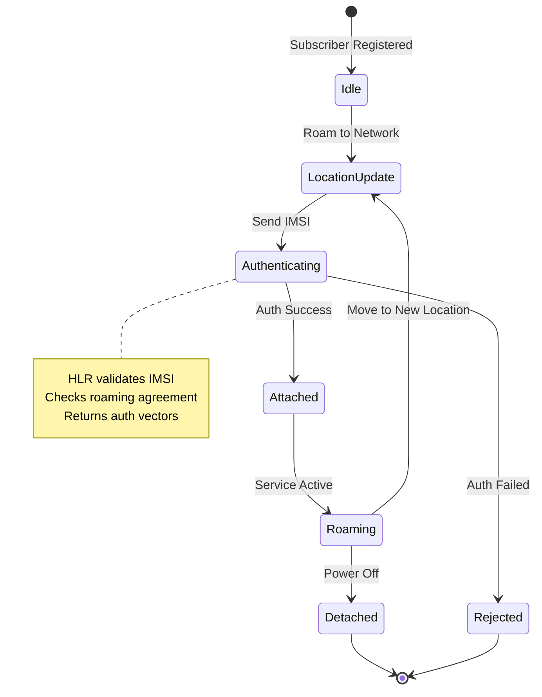
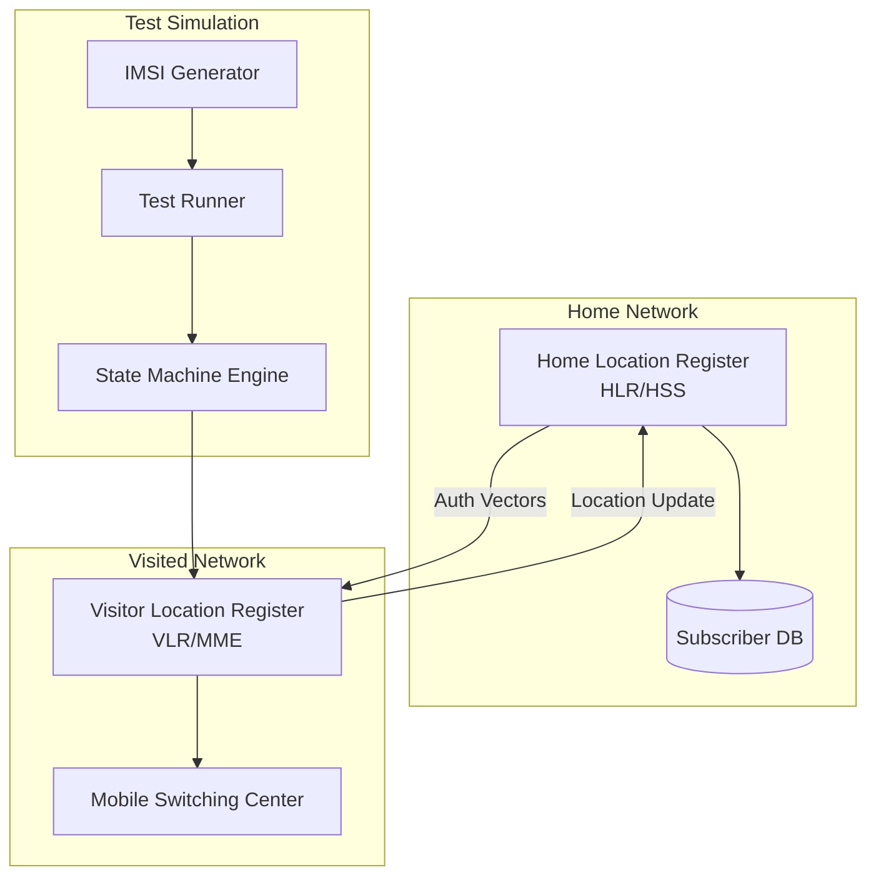

# P07 — International Roaming Test Simulation

## Overview
Telecom roaming test simulation framework with mock HLR/HSS, location update state machine, and comprehensive test scenarios for international roaming. Demonstrates understanding of mobile network protocols, state management, and telecommunications testing practices.

## Key Outcomes
- [x] Mock HLR/HSS implementation with subscriber database
- [x] Location update state machine (idle, attached, roaming, detached)
- [x] IMSI/MSISDN validation and routing logic
- [x] Test scenarios for successful and failed roaming attempts
- [x] Network selection algorithm simulation
- [x] Billing trigger simulation for roaming events

## Architecture
- **Components**: Mock HLR, Mock VLR, Subscriber DB, State Machine, Test Runner
- **Protocols**: SS7 MAP simulation, Diameter Ro/Gy (simplified)
- **Dependencies**: Python 3.9+, SQLite, pytest





## Quickstart

```bash
make setup
make test
make run-simulation
```

## Configuration

| Env Var | Purpose | Example | Required |
|---------|---------|---------|----------|
| `HOME_MCC_MNC` | Home network code | `310-410` (AT&T) | Yes |
| `VISITED_MCC_MNC` | Visited network code | `208-01` (Orange FR) | Yes |
| `ROAMING_AGREEMENT` | Roaming agreement status | `true`, `false` | Yes |
| `SUBSCRIBER_DB` | SQLite database path | `data/subscribers.db` | No |
| `SIMULATION_MODE` | Test mode | `full`, `fast`, `single` | No (default: `full`) |

**Network Codes**: Use real MCC-MNC codes for realistic testing. See [ITU-T E.212](https://www.itu.int/en/ITU-T/inr/Pages/e212.aspx).

```bash
cp config/roaming.yaml.example config/roaming.yaml
# Edit config with your test scenarios
```

## Testing

```bash
# Run all roaming test scenarios
make test

# Run specific test
pytest tests/test_roaming_success.py -v

# Run state machine tests
pytest tests/test_state_machine.py -v

# Run with coverage
pytest --cov=src --cov-report=html

# Simulate specific scenario
python src/simulator.py --scenario international_roaming
```

## Operations

### Logs, Metrics, Traces
- **Simulation Logs**: `logs/simulation.log` (timestamped events)
- **State Transitions**: `logs/state_transitions.log`
- **HLR Queries**: `logs/hlr_queries.log`
- **Metrics**: Success/failure rates, latency, billing events

### Common Issues & Fixes

**Issue**: Location update fails with "No roaming agreement"
**Fix**: Check `ROAMING_AGREEMENT` in config, ensure visited MCC-MNC is in allowed list.

**Issue**: Authentication fails unexpectedly
**Fix**: Verify IMSI format (15 digits), check HLR subscriber database for valid entries.

**Issue**: State machine stuck in "Authenticating"
**Fix**: Increase timeout in `config/roaming.yaml`, check HLR mock is responding.

## Security

### Secrets Handling
- **IMSI/MSISDN**: Use synthetic test data, never real subscriber information
- **Authentication Keys (Ki)**: Generate test keys, rotate for each test run
- **Database**: Encrypt subscriber database at rest

### Test Data Privacy
- Comply with GDPR/telecom regulations
- Use synthetic data generators for IMSI/MSISDN
- No PII in logs or test outputs

## Roadmap

- [ ] Add 5G SA roaming scenarios (NRF/UDM simulation)
- [ ] Implement charging record generation (CDR/UDR)
- [ ] Add network slicing simulation
- [ ] Support steering of roaming (SoR) testing
- [ ] Add fraud detection scenario testing

## References

- [3GPP TS 23.122 - NAS functions related to MS in idle mode](https://www.3gpp.org/DynaReport/23122.htm)
- [3GPP TS 29.002 - Mobile Application Part (MAP) specification](https://www.3gpp.org/DynaReport/29002.htm)
- [GSMA Roaming Hub Testing](https://www.gsma.com/services/roaming/)
- [ITU-T E.212 - IMSI Numbering](https://www.itu.int/rec/T-REC-E.212/)


## Code Generation Prompts

This section contains AI-assisted code generation prompts that can help you recreate or extend project components. These prompts are designed to work with AI coding assistants like Claude, GPT-4, or GitHub Copilot.

### Test Automation

#### 1. End-to-End Tests
```
Create Playwright tests for a login flow, including form validation, authentication error handling, and successful redirect to dashboard
```

#### 2. API Tests
```
Generate pytest-based API tests that verify REST endpoints for CRUD operations, including request/response validation, error cases, and authentication
```

#### 3. Performance Tests
```
Write a Locust load test that simulates 100 concurrent users performing read/write operations, measures response times, and identifies bottlenecks
```

### How to Use These Prompts

1. **Copy the prompt** from the code block above
2. **Customize placeholders** (replace [bracketed items] with your specific requirements)
3. **Provide context** to your AI assistant about:
   - Your development environment and tech stack
   - Existing code patterns and conventions in this project
   - Any constraints or requirements specific to your use case
4. **Review and adapt** the generated code before using it
5. **Test thoroughly** and adjust as needed for your specific scenario

### Best Practices

- Always review AI-generated code for security vulnerabilities
- Ensure generated code follows your project's coding standards
- Add appropriate error handling and logging
- Write tests for AI-generated components
- Document any assumptions or limitations
- Keep sensitive information (credentials, keys) in environment variables

