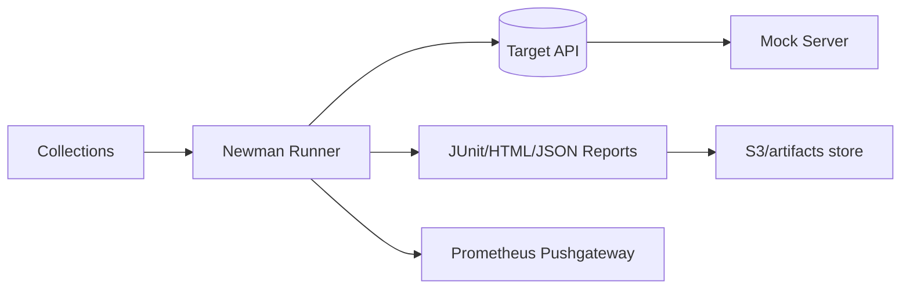

# Architecture — P08 API Testing

## System Context
- **Targets:** RESTful backend endpoints under test (orders, users, payments) reachable via configurable base URL.
- **Tooling:** Postman collections, Newman CLI, mock server stubs, and contract schemas.
- **Observability:** Newman reporters push JUnit + HTML + JSON results; optional Prometheus pushgateway for latency metrics.

## Environments
- **Local:** `npm test` hitting dockerized mock server with seeded data.
- **CI:** GitHub Actions executes `make ci-test` with secrets injected; artifacts uploaded.
- **Staging:** Same collections run against staging URL with stricter rate limits and schema validation enabled.

## Data Contracts
- Schemas stored in `tests/schemas/` aligned to each endpoint.
- Snapshot assertions lock response shapes and status codes.

## Security
- Sensitive headers (Authorization, cookies) masked in reporter outputs.
- Environment files checked in only as `.example`, actual secrets via CI vault.
