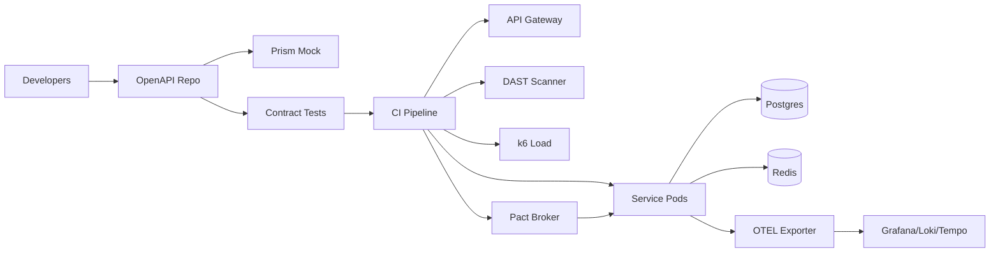

# API Testing Acceleration Artifacts

## 1. Executive Summary
A contract-first API testing acceleration program that hardens service quality, shortens release cycles, and standardizes governance across teams. The program combines OpenAPI-led design, consumer-driven contracts, layered automated testing (unit, integration, contract, load, and security), and observability to reduce escaped defects and increase delivery speed.

- **Objective:** Accelerate API quality with contract-first development, automated regression, performance/security testing baked into CI/CD, and strong operational readiness.
- **Outcomes:** Standardized OpenAPI specs with mocking and contract tests; reusable pipelines for lint, unit, integration, load, and DAST; runbooks and risk coverage for enterprise rollout; dashboards for build health and SLA adherence.
- **KPIs:** Defect escape rate <1%, test flake rate <2%, average build time <12 min, security findings SLA (critical <24h), contract verification success 100% on main, p95 latency <500 ms under standard load.
- **Stakeholders:** API platform team, service owners, QE, security, SRE, product owners.

## 2. README / Deployment
### Prereqs
- Docker, Node 20, Python 3.11, Java 17, Postman CLI, k6, GitHub Actions runners (hosted or self-hosted), Terraform ≥1.7, Helm ≥3.13, kubectl ≥1.29, OIDC-enabled AWS account for EKS/RDS/Redis, Vault for secrets.

### Local Setup
1. `python -m venv .venv && source .venv/bin/activate`
2. `pip install -r requirements-dev.txt`
3. `npm install --prefix ui`
4. `make start-local` (spins mock server + UI + Postgres via docker-compose)
5. `make test` runs unit + contract suite; `make lint` runs eslint/flake8/markdownlint.
6. `make smoke-local` hits key endpoints with supertest + newman.

### Deployment Steps
1. Terraform apply for shared EKS + RDS + Redis (`infra/main.tf`).
2. `helmfile apply` to install API gateway, test runners, Pact broker, and observability stack with env-specific values in `helm/values-<env>.yaml`.
3. Configure secrets via Vault (JWT signing key, DB creds, webhook tokens) and sync to Kubernetes with external-secrets.
4. Trigger pipeline `gh workflow run deploy-prod` or `make deploy-prod` which includes canary release via Argo Rollouts and automatic rollback on error-budget burn.
5. Validate with smoke + contract checks in staging before promotion to prod using environment protection rules.

### Configuration
- `.env.<env>` controls base URLs, auth audience, feature flags (mock vs live downstreams, caching, rate limits), and DAST scope.
- OpenAPI stored in `/spec/openapi.yaml` with style rules enforced by `spectral`. Pact broker credentials in `config/pact.yaml`.
- Performance profiles (`perf/*.json`) define k6 thresholds and stages; security profiles define authenticated/unauthenticated paths for ZAP.

## 3. Architecture Diagrams
### Mermaid


### ASCII
```
Developers -> [OpenAPI Repo] -> {Mock Server, Contract Tests} -> CI -> {Gateway -> Services -> DB/Redis, Observability}
                                           \-> {DAST, k6 Load, Pact Broker}
```

## 4. IaC Prompt
> "Terraform module deploying shared VPC, EKS with managed node groups, ALB ingress, RDS Postgres, Redis (Elasticache), and IAM roles for OIDC GitHub Actions. Add security groups limiting ingress to ALB and runner CIDRs. Configure S3 bucket for artifacts with SSE-KMS, lifecycle for logs. Provision Route53 records, WAF, and external-secrets integration. Outputs: kubeconfig, gateway endpoint, DB URI, Redis endpoint, and artifact bucket." Acceptance: `terraform plan` clean; CIS AWS Foundations checks pass; tflint/checkov green; drift detection enabled.

## 5. Backend Prompt
> "Build Node.js 20 + NestJS service exposing CRUD and search endpoints with OpenAPI decorators. Enforce request/response validation, JWT auth, RBAC scopes, and rate limiting. Add feature flag for mock adapters. Use TypeORM migrations, Winston logging, OTEL tracing, and Pact contract verification. Include health/readiness endpoints and structured error responses. Acceptance: `npm run test`, `npm run lint`, Pact broker verification green, coverage ≥85%, semgrep clean." 

## 6. Frontend Prompt
> "Develop a Next.js 14 dashboard for API quality metrics: contract status, test coverage, flake rate, security findings, pipeline duration, and deployment frequency. Integrate with Grafana image renderer, Pact broker API, and GitHub Actions API. Add role-based access with NextAuth and Okta. Implement audit logging for admin actions. Acceptance: `npm run lint`, `npm run test`, Lighthouse performance ≥90, a11y ≥90, storybook docs for widgets." 

## 7. Containerization Prompt
> "Create multistage Dockerfiles for backend and dashboard. Use non-root, distroless base for Node. Health endpoints `/healthz`, `/readyz`; expose Prometheus metrics via `/metrics`. Provide docker-compose for local with mock server, Pact broker, and Postgres. Sign images (cosign) and attach SBOM (Syft)." Acceptance: `docker compose up` local smoke; containers run as UID 1000; cosign verify passes.

## 8. CI/CD Prompt
> "GitHub Actions pipeline: lint (eslint, flake8), unit tests, contract tests (Pact) with broker verification, SCA (npm audit, pip-audit), SAST (Semgrep), secret scanning (gitleaks), DAST (OWASP ZAP baseline), k6 performance stage against staging, build & push images to ECR, Helm deploy to EKS using OIDC, Argo Rollouts canary with automatic rollback on failed metrics. Gated by required checks and environment approvals." Acceptance: all jobs pass; artifacts uploaded; SBOMs published; deployment requires verified checks.

## 9. Observability Prompt
> "Deploy OTEL collector, Prometheus, Loki, Tempo, and Grafana. Export API latency, error rates, dependency metrics, contract verification pass rate, and build durations. Dashboards for p50/p95 latency, error budget burn, test flake trends, DAST findings over time, CI duration percentiles, and canary analysis. Alerts: error rate >2% 5m, p95 latency >500ms, contract test failure in main, flake rate >3%, build time >15m, Redis evictions >100/min." Acceptance: alerts validated via synthetic load; promtool rule tests green.

## 10. Testing Strategy
- **Contract:** Pact consumer/provider with broker; snapshot stored per version; backward compatibility checks and stub generation for consumers.
- **Unit:** Jest + supertest; Python utilities with pytest; enforce coverage thresholds (JS 85%, Py 85%).
- **Integration:** TestContainers for Postgres/Redis; WireMock for downstreams; smoke tests against deployed gateway using Newman collections.
- **Performance:** k6 with thresholds (p95 <500 ms, error rate <1%, throughput 500 RPS sustained). Nightly long-run test for memory leaks.
- **Security:** ZAP baseline, dependency checks; auth bypass tests; JWT signing/verification tests; SSRF and rate limit negative tests.
- **Resilience:** Chaos injection for dependency latency using toxiproxy; verify circuit breakers and fallback behaviors.
- **Regression Gate:** CI requires contract + integration suites; nightly load test with report in S3 and Slack; release blocked if contract verification fails.

## 11. Operational Playbooks
- **On-call:** PagerDuty rotation documented in `operations/oncall.md`. L1 (SRE), L2 (API platform). Escalation channels: #api-incident Slack, SMS for P1.
- **Runbook: Elevated 5xx**
  1. Check Grafana latency/error panel and recent deploys.
  2. Inspect gateway and service logs in Loki with `trace_id`; correlate with canary metrics.
  3. Roll back via `helm rollback api <rev>` or Argo Rollouts abort if canary failing.
  4. Validate with `make smoke` hitting health and key endpoints; confirm contract tests.
  5. If Redis errors, fail open to database-only path and clear connection pool.
- **Runbook: Contract verification failure**
  1. Identify failing interaction in Pact broker.
  2. Reproduce locally with `npm run pact:verify --consumer <name>`.
  3. If breaking change, add backward-compatible field and reissue contract; otherwise block release.
- **Incident Comms:** Notify #api-incident with impact, ETA, owner, and timeline updates every 30m. Postmortem required for P1/P2 within 48h using template in `operations/postmortem.md`.
- **Backup/Restore:** Nightly Postgres snapshots; restore via `terraform apply -target=aws_db_instance.restore` then `npm run typeorm:migrate`. Redis backup via AOF; verify cache warm-up script.
- **Change Management:** CAB approvals stored in `operations/change-log.md`; freeze windows before holidays; feature flags used for phased enablement.

## 12. Reporting Templates
- **Weekly quality report:** coverage %, flake rate, mean build time, escaped defects, contract verification matrix, DAST findings status.
- **Monthly security report:** vuln counts by severity, SLA adherence, ZAP findings trend, SBOM drift, secret scanning results.
- **Executive dashboard:** ROI from reduced incidents, release frequency, MTTR, uptime, test automation adoption, and SLA adherence; slide template in `reports/api_quality.pptx`.
- **Quarterly platform review:** backlog burn-up, dependency updates cadence, architecture risks, and cost trends.

## 13. Metrics & Observability
- **SLIs/SLOs:** Availability 99.9%, p95 latency 500 ms, error rate <1%, CI stability 98%, build time p90 <12m, contract verification success 100% on main, flake rate <2%.
- **SLAs:** Critical vulns triaged <24h; P1 incident MTTR <60m; data restore RTO 30m, RPO 5m via snapshots.
- **Dashboards:** Deployment frequency, lead time for changes, error budget burn-down, k6 performance trends, DAST findings over time, dependency freshness, contract coverage per consumer.
- **Alert Routing:** PagerDuty for P1/P2, Slack for P3, email digest for P4; alerts include runbook links and recent change context.

## 14. Security & Threat Model
- **STRIDE:**
  - Spoofing mitigated with JWT + mTLS internal, OIDC for pipeline access.
  - Tampering controlled via signed JWT, immutability on pipeline artifacts, read-only service accounts.
  - Repudiation addressed with audit logs for admin actions, Git signed commits, and broker change logs.
  - Information disclosure mitigated by encryption at rest/in transit, schema validation to prevent data bleed, and secret masking in logs.
  - DoS mitigated with rate limiting, WAF, autoscale, and circuit breakers.
  - Elevation mitigated by RBAC/OIDC roles, least-privilege IAM, and Kyverno PSP-like controls blocking privileged pods.
- **ATT&CK:** T1190 (exploited APIs) mitigated via WAF + schema validation; T1078 (valid accounts) via MFA + short-lived tokens; T1499 (resource hijack) via quotas; T1552 (credential theft) via Vault + secret scanning; T1195 (supply chain) via SBOM + signature verification.
- **Controls:** Semgrep, dependency scanning, ZAP, secret scanning hooks, signed images (cosign), SBOMs (Syft) attached to releases, runtime policy (Falco) for anomaly detection.
- **Threat Scenarios:** Contract bypass, schema poisoning, cache poisoning, SSRF via proxy headers, dependency compromise; mapped to detection and mitigations with periodic tabletop exercises.

## 15. Risk Register (≥10)
1. Contract drift between teams – enforce broker verification; owner: QA Lead; impact: high; likelihood: medium.
2. Test flakiness – quarantine and reduce retries; owner: QE; impact: medium; likelihood: medium.
3. Long pipeline times – cache dependencies and parallelize; owner: DevEx; impact: medium; likelihood: medium.
4. Secrets exposure – Vault + OIDC; owner: Security; impact: high; likelihood: low.
5. Unmanaged dependencies – Dependabot weekly; owner: Eng Lead; impact: medium; likelihood: medium.
6. Load test interfering with prod – run in staging with traffic shaping; owner: SRE; impact: high; likelihood: low.
7. Schema-breaking change – use backward-compatible migrations; owner: API Lead; impact: high; likelihood: medium.
8. DAST false positives – triage weekly; owner: Security; impact: low; likelihood: high.
9. Redis data loss – enable AOF and snapshots; owner: DBA; impact: medium; likelihood: low.
10. Alert fatigue – tune thresholds quarterly; owner: SRE; impact: medium; likelihood: medium.
11. Pact broker outage – enable HA + backups; owner: Platform; impact: medium; likelihood: low.
12. Canary rollback misfire – add automated verification + manual gate; owner: Release; impact: high; likelihood: low.

## 16. ADRs
- **ADR-001:** Contract-first with OpenAPI to align teams and enable stub generation, reducing integration surprises.
- **ADR-002:** Pact for consumer-driven testing to catch integration issues early and maintain cross-team agreements.
- **ADR-003:** NestJS chosen for type safety, decorators for OpenAPI, and enterprise-ready structure.
- **ADR-004:** GitHub Actions with OIDC to avoid long-lived credentials and centralize compliance controls.
- **ADR-005:** Observability via OTEL + Prometheus/Loki/Tempo for unified telemetry and error-budget enforcement.

## 17. Business Value
- Faster release cycles through automated quality gates and contract-first workflows, reducing rework.
- Reduced incident cost via early defect detection, better regression coverage, and canary protections.
- Improved security posture with continuous scanning, signed artifacts, and threat modeling mapped to controls.
- Better stakeholder visibility with metrics, executive reporting, and traceable evidence for audits.
- Standardized platform enabling teams to onboard quickly, reuse pipelines, and focus on customer features.
