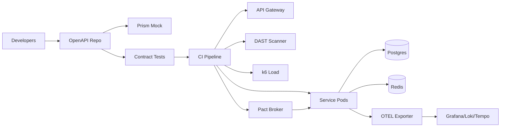

# API Testing Acceleration Artifacts

## 1. Executive Summary
A contract-first API testing acceleration program that hardens service quality, shortens release cycles, and standardizes governance across teams. The program combines OpenAPI-led design, consumer-driven contracts, layered automated testing (unit, integration, contract, load, and security), and observability to reduce escaped defects and increase delivery speed.

- **Objective:** Accelerate API quality with contract-first development, automated regression, performance/security testing baked into CI/CD, and strong operational readiness.
- **Outcomes:** Standardized OpenAPI specs with mocking and contract tests; reusable pipelines for lint, unit, integration, load, and DAST; runbooks and risk coverage for enterprise rollout; dashboards for build health and SLA adherence.
- **KPIs:** Defect escape rate <1%, test flake rate <2%, average build time <12 min, security findings SLA (critical <24h), contract verification success 100% on main, p95 latency <500 ms under standard load.
- **Stakeholders:** API platform team, service owners, QE, security, SRE, product owners.

## 2. README / Deployment
### Prereqs
- Docker 24+, Node 20, Python 3.11, Java 17, Postman CLI, k6, GitHub Actions runners (hosted or self-hosted), Terraform ≥1.7, Helm ≥3.13, kubectl ≥1.29, OIDC-enabled AWS account for EKS/RDS/Redis, Vault for secrets.

### Local Setup
1. `python -m venv .venv && source .venv/bin/activate`
2. `pip install -r requirements-dev.txt`
3. `npm install --prefix ui`
4. `make start-local` (spins mock server + UI + Postgres via docker-compose)
5. `make test` runs unit + contract suite; `make lint` runs eslint/flake8/markdownlint.
6. `make smoke-local` hits key endpoints with supertest + newman.

### Deployment Steps
1. Terraform apply for shared EKS + RDS + Redis (`infra/main.tf`).
2. `helmfile apply` to install API gateway, test runners, Pact broker, and observability stack with env-specific values in `helm/values-<env>.yaml`.
3. Configure secrets via Vault (JWT signing key, DB creds, webhook tokens) and sync to Kubernetes with external-secrets.
4. Trigger pipeline `gh workflow run deploy-prod` or `make deploy-prod` which includes canary release via Argo Rollouts and automatic rollback on error-budget burn.
5. Validate with smoke + contract checks in staging before promotion to prod using environment protection rules.

### Configuration
- `.env.<env>` controls base URLs, auth audience, feature flags (mock vs live downstreams, caching, rate limits), and DAST scope.
- OpenAPI stored in `/spec/openapi.yaml` with style rules enforced by `spectral`. Pact broker credentials in `config/pact.yaml`.
- Performance profiles (`perf/*.json`) define k6 thresholds and stages; security profiles define authenticated/unauthenticated paths for ZAP.

## 3. Architecture Diagrams
### Mermaid


### ASCII
```
Developers -> [OpenAPI Repo] -> {Mock Server, Contract Tests} -> CI -> {Gateway -> Services -> DB/Redis, Observability}
                                           \-> {DAST, k6 Load, Pact Broker}
```

## 4. IaC Prompt
> "Terraform module deploying shared VPC, EKS with managed node groups, ALB ingress, RDS Postgres, Redis (ElastiCache), and IAM roles for OIDC GitHub Actions. Add security groups limiting ingress to ALB and runner CIDRs. Configure S3 bucket for artifacts with SSE-KMS, lifecycle for logs. Provision Route53 records, WAF, and external-secrets integration. Outputs: kubeconfig, gateway endpoint, DB URI, Redis endpoint, and artifact bucket." Acceptance: `terraform plan` clean; CIS AWS Foundations checks pass; tflint/checkov green; drift detection enabled.

## 5. Backend Prompt
> "Build Node.js 20 + NestJS service exposing CRUD and search endpoints with OpenAPI decorators. Enforce request/response validation, JWT auth, RBAC scopes, and rate limiting. Add feature flag for mock adapters. Use TypeORM migrations, Winston logging, OTEL tracing, and Pact contract verification. Include health/readiness endpoints and structured error responses. Acceptance: `npm run test`, `npm run lint`, Pact broker verification green, coverage ≥85%, semgrep clean." 

## 6. Frontend Prompt
> "Develop a Next.js 14 dashboard for API quality metrics: contract status, test coverage, flake rate, security findings, pipeline duration, and deployment frequency. Integrate with Grafana image renderer, Pact broker API, and GitHub Actions API. Add role-based access with NextAuth and Okta. Implement audit logging for admin actions. Acceptance: `npm run lint`, `npm run test`, Lighthouse performance ≥90, a11y ≥90, storybook docs for widgets." 

## 7. Containerization Prompt
> "Create multistage Dockerfiles for backend and dashboard. Use non-root, distroless base for Node. Health endpoints `/healthz`, `/readyz`; expose Prometheus metrics via `/metrics`. Provide docker-compose for local with mock server, Pact broker, and Postgres. Sign images (cosign) and attach SBOM (Syft)." Acceptance: `docker compose up` local smoke; containers run as UID 1000; cosign verify passes.

## 8. CI/CD Prompt
> "GitHub Actions pipeline: lint (eslint, flake8), unit tests, contract tests (Pact) with broker verification, SCA (npm audit, pip-audit), SAST (Semgrep), secret scanning (gitleaks), DAST (OWASP ZAP baseline), k6 performance stage against staging, build & push images to ECR, Helm deploy to EKS using OIDC, Argo Rollouts canary with automatic rollback on failed metrics. Gated by required checks and environment approvals." Acceptance: all jobs pass; artifacts uploaded; SBOMs published; deployment requires verified checks.

## 9. Observability Prompt
> "Deploy OTEL collector, Prometheus, Loki, Tempo, and Grafana. Export API latency, error rates, dependency metrics, contract verification pass rate, and build durations. Dashboards for p50/p95 latency, error budget burn, test flake trends, DAST findings over time, CI duration percentiles, and canary analysis. Alerts: error rate >2% 5m, p95 latency >500ms, contract test failure in main, flake rate >3%, build time >15m, Redis evictions >100/min." Acceptance: alerts validated via synthetic load; promtool rule tests green.

## 10. Testing Strategy
- **Contract:** Pact consumer/provider with broker; snapshot stored per version; backward compatibility checks and stub generation for consumers.
- **Unit:** Jest + supertest; Python utilities with pytest; enforce coverage thresholds (JS 85%, Py 85%).
- **Integration:** TestContainers for Postgres/Redis; WireMock for downstreams; smoke tests against deployed gateway using Newman collections.
- **Performance:** k6 with thresholds (p95 <500 ms, error rate <1%, throughput 500 RPS sustained). Nightly long-run test for memory leaks.
- **Security:** ZAP baseline, dependency checks; auth bypass tests; JWT signing/verification tests; SSRF and rate limit negative tests.
- **Resilience:** Chaos injection for dependency latency using toxiproxy; verify circuit breakers and fallback behaviors.
- **Regression Gate:** CI requires contract + integration suites; nightly load test with report in S3 and Slack; release blocked if contract verification fails.

## 11. Operational Playbooks
- **On-call:** PagerDuty rotation documented in `operations/oncall.md`. L1 (SRE), L2 (API platform). Escalation channels: #api-incident Slack, SMS for P1.
- **Runbook: Elevated 5xx**
  1. Check Grafana latency/error panel and recent deploys.
  2. Inspect gateway and service logs in Loki with `trace_id`; correlate with canary metrics.
  3. Roll back via `helm rollback api <rev>` or Argo Rollouts abort if canary failing.
  4. Validate with `make smoke` hitting health and key endpoints; confirm contract tests.
  5. If Redis errors, fail open to database-only path and clear connection pool.
- **Runbook: Contract verification failure**
  1. Identify failing interaction in Pact broker.
  2. Reproduce locally with `npm run pact:verify --consumer <name>`.
  3. If breaking change, add backward-compatible field and reissue contract; otherwise block release.
- **Incident Comms:** Notify #api-incident with impact, ETA, owner, and timeline updates every 30m. Postmortem required for P1/P2 within 48h using template in `operations/postmortem.md`.
- **Backup/Restore:** Nightly Postgres snapshots; restore via a dedicated Terraform restore workflow (avoiding `-target`) then `npm run typeorm:migrate`. Redis backup via AOF; verify cache warm-up script.
- **Change Management:** CAB approvals stored in `operations/change-log.md`; freeze windows before holidays; feature flags used for phased enablement.

## 12. Reporting Templates
- **Weekly quality report:** coverage %, flake rate, mean build time, escaped defects, contract verification matrix, DAST findings status.
- **Monthly security report:** vuln counts by severity, SLA adherence, ZAP findings trend, SBOM drift, secret scanning results.
- **Executive dashboard:** ROI from reduced incidents, release frequency, MTTR, uptime, test automation adoption, and SLA adherence; slide template in `reports/api_quality.pptx`.
- **Quarterly platform review:** backlog burn-up, dependency updates cadence, architecture risks, and cost trends.

## 13. Metrics & Observability
- **SLIs/SLOs:** Availability 99.9%, p95 latency 500 ms, error rate <1%, CI stability 98%, build time p90 <12m, contract verification success 100% on main, flake rate <2%.
- **SLAs:** Critical vulns triaged <24h; P1 incident MTTR <60m; data restore RTO 30m, RPO 5m via snapshots.
- **Dashboards:** Deployment frequency, lead time for changes, error budget burn-down, k6 performance trends, DAST findings over time, dependency freshness, contract coverage per consumer.
- **Alert Routing:** PagerDuty for P1/P2, Slack for P3, email digest for P4; alerts include runbook links and recent change context.

## 14. Security & Threat Model
- **STRIDE:**
  - Spoofing mitigated with JWT + mTLS internal, OIDC for pipeline access.
  - Tampering controlled via signed JWT, immutability on pipeline artifacts, read-only service accounts.
  - Repudiation addressed with audit logs for admin actions, Git signed commits, and broker change logs.
  - Information disclosure mitigated by encryption at rest/in transit, schema validation to prevent data bleed, and secret masking in logs.
  - DoS mitigated with rate limiting, WAF, autoscale, and circuit breakers.
  - Elevation mitigated by RBAC/OIDC roles, least-privilege IAM, and Kyverno PSP-like controls blocking privileged pods.
- **ATT&CK:** T1190 (exploited APIs) mitigated via WAF + schema validation; T1078 (valid accounts) via MFA + short-lived tokens; T1499 (resource hijack) via quotas; T1552 (credential theft) via Vault + secret scanning; T1195 (supply chain) via SBOM + signature verification.
- **Controls:** Semgrep, dependency scanning, ZAP, secret scanning hooks, signed images (cosign), SBOMs (Syft) attached to releases, runtime policy (Falco) for anomaly detection.
- **Threat Scenarios:** Contract bypass, schema poisoning, cache poisoning, SSRF via proxy headers, dependency compromise; mapped to detection and mitigations with periodic tabletop exercises.

## 15. Risk Register (≥10)
1. Contract drift between teams – enforce broker verification; owner: QA Lead; impact: high; likelihood: medium.
2. Test flakiness – quarantine and reduce retries; owner: QE; impact: medium; likelihood: medium.
3. Long pipeline times – cache dependencies and parallelize; owner: DevEx; impact: medium; likelihood: medium.
4. Secrets exposure – Vault + OIDC; owner: Security; impact: high; likelihood: low.
5. Unmanaged dependencies – Dependabot weekly; owner: Eng Lead; impact: medium; likelihood: medium.
6. Load test interfering with prod – run in staging with traffic shaping; owner: SRE; impact: high; likelihood: low.
7. Schema-breaking change – use backward-compatible migrations; owner: API Lead; impact: high; likelihood: medium.
8. DAST false positives – triage weekly; owner: Security; impact: low; likelihood: high.
9. Redis data loss – enable AOF and snapshots; owner: DBA; impact: medium; likelihood: low.
10. Alert fatigue – tune thresholds quarterly; owner: SRE; impact: medium; likelihood: medium.
11. Pact broker outage – enable HA + backups; owner: Platform; impact: medium; likelihood: low.
12. Canary rollback misfire – add automated verification + manual gate; owner: Release; impact: high; likelihood: low.

## 16. ADRs
- **ADR-001:** Contract-first with OpenAPI to align teams and enable stub generation, reducing integration surprises.
- **ADR-002:** Pact for consumer-driven testing to catch integration issues early and maintain cross-team agreements.
- **ADR-003:** NestJS chosen for type safety, decorators for OpenAPI, and enterprise-ready structure.
- **ADR-004:** GitHub Actions with OIDC to avoid long-lived credentials and centralize compliance controls.
- **ADR-005:** Observability via OTEL + Prometheus/Loki/Tempo for unified telemetry and error-budget enforcement.

## 17. Business Value
- Faster release cycles through automated quality gates and contract-first workflows, reducing rework.
- Reduced incident cost via early defect detection, better regression coverage, and canary protections.
- Improved security posture with continuous scanning, signed artifacts, and threat modeling mapped to controls.
- Better stakeholder visibility with metrics, executive reporting, and traceable evidence for audits.
- Standardized platform enabling teams to onboard quickly, reuse pipelines, and focus on customer features.

## 18. Delivery Roadmap and Milestones
- **Phase 0 – Foundations (Week 1-2):** finalize shared API design standards (OpenAPI + protobuf), repo templates, lint rules, Terraform/EKS baseline, and GitHub Actions security guardrails. Deliverable: golden project template and centralized schema registry.
- **Phase 1 – Core Platform (Week 3-5):** implement test catalog service, contract testing runner, data seeding engine, and environment provisioning scripts. Success = CI pipeline runs lint/unit/contract tests automatically on PR, generating reports and artifacts.
- **Phase 2 – Coverage Expansion (Week 5-7):** onboard priority services, build mocks/stubs, establish backward-compatibility checks, and integrate TestContainers for system tests. Success = 80% of critical APIs instrumented with contract tests and synthetic monitors.
- **Phase 3 – Performance & Chaos (Week 7-8):** add k6 load suites, resilience checks, failure injection (faults/latency), and rollbacks validated through Argo Rollouts. Success = SLOs maintained under load; canary rollback proven.
- **Phase 4 – Security & Compliance (Week 8-9):** Semgrep rulepacks, ZAP/Burp automation, SBOM + cosign, least-privilege IAM for runners, and secrets governance. Success = zero critical findings; IR tabletop completed.
- **Phase 5 – Launch Readiness (Week 10):** finalize dashboards, runbooks, evidence packs, and QBR reporting templates; green go-live checklist.

### Milestone Exit Criteria
- All APIs have published schemas and example payloads; schema diffing enabled.
- Test catalog tagged by service, capability, and persona; coverage heatmap available in dashboard.
- Feature flags for risky test suites; rollback rehearsed for pipeline rollouts.

## 19. Data Model, APIs, and Contracts
- **Catalog Schema:** tables `apis`, `versions`, `tests`, `environments`, `runs`, `evidence`, `alerts`, `mock_definitions`. Indexes on `(service, version)` and `(run_id, created_at)`. Partition runs by date for retention.
- **API Contracts:** OpenAPI specs stored per service; protobuf for gRPC. Buf breaking change detector and openapi-diff enforced in CI. Examples stored in `examples/api-testing/`.
- **Service Endpoints:**
  - `POST /tests/run` to trigger suites with selectors (service, tag, type). Returns run_id.
  - `GET /tests/run/{id}` for status and logs.
  - `GET /coverage` provides heatmap by service/version and capability (functional, security, performance, contract, chaos).
  - `POST /mocks` to publish/update mock definitions with versioning and approval gates.
- **Event Bus:** Kafka topics `test.run.request`, `test.run.status`, `coverage.metrics`, `security.findings`, `mock.updates`. Consumers update catalog and dashboards.
- **Idempotency & Replay:** run requests include `Idempotency-Key`; state machine ensures dedupe. Runs persisted with trace_id correlation.

## 20. Test Scenario Catalog and Validation
- **Functional Suites:** CRUD paths, validation errors, pagination, filtering, idempotent retries, authz boundaries.
- **Contract Suites:** schema conformance, required/optional fields, enums, error responses; backward compatibility across two previous versions.
- **Performance Suites:** baseline throughput per endpoint, latency SLOs, connection pooling behavior, cache effectiveness, soak testing for memory leaks.
- **Chaos/Resilience Suites:** dependency fault injection, timeouts, retries, partial outages, DNS failures, downstream SLA breaches.
- **Security Suites:** authn/authz bypass attempts, rate limit enforcement, input fuzzing, JWT expiry handling, SSRF/SQLi/XSS checks.
- **Data Validation:** golden dataset comparisons, referential integrity for seeded data, masking validation, synthetic PII generators where needed.
- **Quality Gates:** tests tagged with risk level; pipeline gates enforced for critical endpoints; parallel execution tuned to minimize pipeline duration.

## 21. Failure Modes and Reliability Patterns
- **Common Failures:** flaky mocks, schema drift, test data collisions, environment drift, slow pipelines, unstable third-party endpoints.
- **Resilience Patterns:** immutable test environments per run using ephemeral namespaces; circuit breakers for external dependencies; bulkheads for noisy neighbors in shared clusters; retry with jitter for flaky dependencies; caching of mocks.
- **Diagnostics:** run timeline with step-level timing, screenshots for UI flows, HAR files for HTTP sequences, k6 trend exports, and trace correlation to underlying services via W3C context propagation.

## 22. Detailed Operational Runbooks
- **Runbook: Pipeline slowdown**
  1. Check GitHub Actions status; identify long-running jobs and queue depth.
  2. Inspect self-hosted runner utilization; scale up runners via autoscaling group or K8s Runner Operator.
  3. Identify heavy suites; split shards or mark non-blocking; cache dependencies; verify Docker layer cache.
  4. Re-run failed shards; update SLA dashboard with delay reason.
- **Runbook: Schema drift detected**
  1. openapi-diff or Buf error surfaces; inspect change log.
  2. Coordinate with service team to add compatibility layer or bump version.
  3. Update mocks/fixtures and rerun contract suite; capture evidence.
- **Runbook: Mock service outage**
  1. Check mock service health; redeploy via Helm rollback if needed.
  2. Fail open by switching to record/replay mode; mark runs with degraded flag.
  3. Notify owning team; create RCA for recurrent outages.
- **Runbook: Security finding**
  1. Auto-created ticket includes CVE or ZAP finding; triage severity.
  2. Apply patch or rule suppression with approval; rerun security suite.
  3. Update risk register and evidence store.

## 23. Training, Access, and Compliance Checklists
- **Training:** API testing bootcamp covering OpenAPI/gRPC linting, contract testing patterns, k6 authoring, mock creation, and security scanning. Labs deploy ephemeral env and run end-to-end suite.
- **Access:** RBAC groups for viewers (reports), contributors (tests), maintainers (pipelines), and admins (infra). Access requests via ITSM ticket; time-bound elevation; audit via SSO logs.
- **Compliance:** SOC2-aligned logging and change controls; evidence stored in S3 with WORM; data masking enforced for any sample payloads; pen-test scope defined for the testing platform itself.

## 24. Acceptance Criteria by Capability
- **Infrastructure:** Terraform/Helm validated; ephemeral namespaces created/destroyed automatically; cost within forecast; drift detection alerts configured.
- **Testing Platform:** 90%+ of high-risk APIs have contract tests; run_id traceability across logs/traces; retries implemented with exponential backoff.
- **Observability:** dashboards for pipeline duration, pass/fail per service, flaky test index, coverage %; alert noise below agreed budget.
- **Operations:** on-call runbooks rehearsed; SLA for test platform uptime 99.5%; incidents tracked with postmortems.

## 25. Metrics, KPIs, and Dashboards
- **SLIs/SLOs:** pipeline success rate >=99%; median pipeline time <15m; flake rate <2%; contract coverage for tier-0 APIs >=95%; security regression escape rate = 0.
- **Dashboards:**
  - **Execution:** pipeline duration trend, queue depth, cache hit ratios, runner utilization.
  - **Quality:** pass/fail by service, flake index, top failing tests, mean time to fix failing tests.
  - **Coverage:** contract coverage by version, scenario coverage heatmap, SLO compliance per endpoint.
  - **Security:** findings by severity, time-to-remediate, dependency CVE trend, secrets scan trend.
  - **Business:** time saved vs manual QA, release frequency uplift, incident reduction after adoption.
- **Alerting:** pipeline backlog threshold, spike in flake index, drop in coverage, security scan failure, mock service errors. Alerts link to runbooks and JSM templates.

## 26. Extended Security and Threat Model
- **STRIDE:**
  - Spoofing: SSO for UI/API, signed JWT, mutual TLS between runners and control plane.
  - Tampering: immutability of test artifacts; checksums on fixtures; signed containers.
  - Repudiation: audit logs for test edits and approvals; immutable evidence storage.
  - Information Disclosure: test data masking, restricted access to recordings, secret scanning enforced.
  - DoS: rate limits on control plane, auto-scaling runners, quota per team.
  - Elevation: RBAC with least privilege; approvals required for production-like tests.
- **ATT&CK Mapping:** T1078 mitigated by SSO/MFA; T1490 (inhibit recovery) via backups; T1190 via WAF and limited ingress; T1210 lateral movement blocked via network policies; T1557 (man-in-the-middle) mitigated with TLS pinning for runners.
- **Security Controls:** Semgrep, Trivy, gitleaks, ZAP/Burp automation, dependency track with SBOM, supply-chain signing (cosign), Kyverno policies, periodic secret rotation.

## 27. Change Management and Governance
- **Change Types:** pipeline config changes, schema updates, new test suite onboarding, mock changes. All require PR + review; high-risk changes require CAB approval and rollback plan.
- **Approvals:** service owners sign off on contract changes; security reviews for new security tests; FinOps review for large runner scaling changes.
- **Audit:** Git history with signed commits; pipeline run metadata stored with run_id and change set; evidence uploaded automatically.

## 28. Cost and Capacity Planning
- **Capacity Modeling:** runner pools sized based on concurrency target; cache storage provisioned with hit-rate goals; k6 load agents scaled based on target RPS; Kafka/MSK sized for event bus throughput.
- **Cost Controls:** spot runners for non-prod; artifact retention policies; deduplicated test data; schedule heavy suites off-peak; analyze cost per pipeline minute.
- **FinOps Collaboration:** monthly cost reports; anomaly detection on runner usage; budget alerts; negotiation with vendors for mock infra if external.

## 29. Communication Plan
- **Stakeholders:** QA, SRE, Security, Service owners, Product, Compliance.
- **Channels:** Slack release channel, incident channel, weekly quality review, monthly leadership update. Status page for platform uptime and pipeline health.
- **Templates:** change announcement, incident comms, coverage snapshot, QBR packet. Automated Slack bots post pipeline health and flake summaries.
- **Documentation Hygiene:** docs updated with every schema change; diagrams refreshed quarterly; stale doc bot alerts.

## 30. Audit Evidence and Traceability
- **Evidence Sources:** pipeline logs, test reports, coverage exports, security scan results, SBOMs, cosign attestations, schema diff outputs, approval records.
- **Traceability Matrix:** map APIs to tests, SLOs, and alerts in `reports/traceability_api_testing.csv`; generated via tagging in test definitions.
- **Retention:** evidence stored 1 year minimum; security findings retained 3 years; access logs retained 90 days.

## 31. Implementation Backlog Samples
- **Infrastructure Epics:** ephemeral namespace automation, runner autoscaler, cache optimization, MSK event bus hardening, secret management, WAF policies, observability stack, cost dashboards.
- **Platform Epics:** test catalog UI, run orchestration, mock service, schema diff service, evidence store, RBAC and audit trail, feature flags for suites.
- **Testing Epics:** expand contract suites for top services, golden dataset creation, synthetic monitoring setup, chaos suite authoring, security fuzzing automation, data masking validators.
- **Operations Epics:** on-call handbook, incident drills, change calendar automation, evidence pipeline, documentation bot, DR playbook.

### Sample User Stories with Acceptance Criteria
1. **As a service owner, I can see contract coverage for my API version** so I know if a release is safe.
   - Acceptance: dashboard shows coverage %, failing cases, links to schemas and tests; data refreshes daily.
2. **As a platform engineer, I can spin up an ephemeral env per PR** to run system tests in isolation.
   - Acceptance: namespace created with helmfile; tests run with unique run_id; teardown successful; cost tracked.
3. **As QA, I can update mock expectations with approvals** to keep tests stable while APIs evolve.
   - Acceptance: mock change PR triggers review; tests rerun; evidence stored; rollback option available.
4. **As Security, I can block releases with critical findings** automatically.
   - Acceptance: security gate fails pipeline; ticket created; bypass requires approval; audit trail captured.

## 32. Detailed Testing Matrix
- **Functional:** path coverage, edge-case inputs, pagination, sorting, auth failures, idempotent retry behavior, time-based filters.
- **Contract:** required vs optional fields, enum expansions, error code consistency, deprecation warnings, backward/forward compatibility.
- **Integration/System:** with downstream dependencies using TestContainers; resilience to timeouts; message ordering and idempotency.
- **Performance:** RPS targets per endpoint, latency P50/P95 thresholds, connection reuse, resource utilization of services, cache warm-up curves.
- **Chaos:** dependency failure injection, DNS poisoning simulation, network latency jitter, retry/backoff validation, failover to secondary endpoints.
- **Security:** fuzzing with ZAP, JWT tampering, rate limiting, CSRF for web flows, SSRF/SQLi/XXE, dependency CVEs.
- **Data Quality:** schema validation against golden datasets, referential integrity, PII masking checks, deterministic IDs for reproducibility.
- **Accessibility (if UI involved):** WCAG AA checks with axe; keyboard navigation; ARIA labels.

## 33. Documentation and Knowledge Management
- **Repositories:** `docs/api-testing/` for design docs; `examples/` for payloads; `operations/` for runbooks; diagrams in `assets/api-testing/` with source files.
- **Guides:** quickstart for writing new tests, mock creation cookbook, schema evolution guide, performance test authoring patterns, security testing handbook.
- **Changelogs:** automated release notes per platform version; test suite changelog to inform downstream teams of new checks.
- **Onboarding:** workshops recorded, labs to add a new service to catalog, certification quiz.
- **Review Cadence:** monthly content review and quarterly architecture refresh.

## 34. Dependencies and Integration Points
- **External:** CI/CD system (GitHub Actions), artifact registry (ECR), secrets manager, MSK or RabbitMQ for eventing, Slack/Teams for notifications.
- **Internal:** shared observability, identity provider, service mesh/ingress, data seeding sources, central feature flag service.
- **Contracts:** schemas stored in registry; mocks stored in Git with version tags; pipelines reference pinned versions to avoid drift.
- **Compatibility:** support previous two API versions; migration guides for breaking changes; blue-green approach for mock updates.

## 35. Future Enhancements and Experiments
- **AI-assisted test authoring:** propose test cases from schemas and production traffic samples with privacy filters.
- **Coverage analytics:** correlate incident data to missing tests; recommend new suites automatically.
- **Multi-cloud runner pools:** reduce latency and cost; provide regional isolation for data residency.
- **Service mesh fault injection:** leverage mesh features for chaos instead of custom proxies.
- **API marketplace integration:** publish test results to internal developer portal for transparency.

## 36. Example Runbook Automation Scripts (Pseudo)
```bash
#!/usr/bin/env bash
set -euo pipefail
# trigger contract suite for a service
curl -X POST "$API_URL/tests/run" -H "Authorization: Bearer $TOKEN" \
  -d '{"service":"billing","tags":["contract","critical"]}'
# fetch status and logs
curl "$API_URL/tests/run/$RUN_ID" -H "Authorization: Bearer $TOKEN"
# export coverage report
python scripts/export_coverage.py --service billing --out reports/billing_coverage.json
# scale runners
kubectl scale deploy/test-runner --replicas=${REPLICAS:-10}
```

## 37. Business Case
- **Problem:** fragmented API testing leads to regressions, inconsistent schemas, long QA cycles, and security escapes.
- **Solution:** centralized platform with contract-first development, automated pipelines, and observability reduces risk and accelerates releases.
- **Benefits:**
  - Release frequency increase by 30-50% due to faster confidence.
  - Regression escape rate reduced to near zero for covered endpoints.
  - Security posture improved via continuous scanning and blocking gates.
  - Cost savings via shared infra and runner optimization.
- **KPIs:** coverage %, pipeline duration, flake index, incidents prevented, time-to-restore after test failure, adoption rate across teams.
- **Financials:** infra spend dominated by runners and storage; optimization via spot, caching, retention; ROI measured by avoided incidents and developer hours saved.

## 38. Risk Register Deep Dive
- **1. Schema drift undetected** – Mitigation: enforce breaking-change checks, PR gates; Owner: Platform; Impact: High; Likelihood: Medium.
- **2. Mock divergence from prod** – Mitigation: record/replay refresh, contract-based mocks, approvals; Owner: QA; Impact: High; Likelihood: Medium.
- **3. Flaky tests cause pipeline noise** – Mitigation: flake detection bot, quarantine policy, retries with limits; Owner: QA Lead; Impact: Medium; Likelihood: High.
- **4. Runner capacity exhaustion** – Mitigation: autoscaling, queue thresholds, load shedding; Owner: SRE; Impact: Medium; Likelihood: Medium.
- **5. Security scan false positives** – Mitigation: triage workflow, suppression with expiry, tuned rules; Owner: Security; Impact: Medium; Likelihood: Medium.
- **6. Secrets leakage in logs** – Mitigation: redaction filters, Semgrep rules, secret scanning; Owner: Security; Impact: High; Likelihood: Low.
- **7. Cost overruns** – Mitigation: budget alerts, spot runners, retention policies; Owner: FinOps; Impact: Medium; Likelihood: Medium.
- **8. Compliance evidence gaps** – Mitigation: automated evidence store, periodic audits; Owner: Compliance; Impact: Medium; Likelihood: Medium.
- **9. Slow adoption by teams** – Mitigation: training, templates, champions program, onboarding SLO; Owner: Product; Impact: Medium; Likelihood: Medium.
- **10. Downtime of testing platform** – Mitigation: HA deployment, DR runbook, SLO monitoring; Owner: SRE; Impact: High; Likelihood: Low.
- **11. Incomplete PII masking in fixtures** – Mitigation: masking validators, approvals, synthetic data; Owner: QA; Impact: Medium; Likelihood: Low.
- **12. Third-party dependency outage** – Mitigation: fallback mocks, retry budgets, incident comms; Owner: SRE; Impact: Medium; Likelihood: Medium.

## 39. ADR Addenda
- **ADR-006:** Use ephemeral Kubernetes namespaces for isolation instead of long-lived shared staging to avoid drift and collisions.
- **ADR-007:** Standardize on k6 for performance testing due to scripting flexibility and cloud execution options vs JMeter.
- **ADR-008:** Adopt TestContainers for integration tests to reduce flakiness compared to shared test databases.
- **ADR-009:** Store evidence in S3 with object lock for auditability rather than relying solely on pipeline logs.
- **ADR-010:** Use GitHub Actions with OIDC to cloud provider for secure access rather than long-lived credentials.

## 40. Release Readiness Checklist
- Schemas validated; breaking changes approved; version tags updated.
- All critical suites green; flake rate below threshold; coverage targets met.
- Security scans green; SBOM signed; cosign attestations uploaded.
- Dashboards updated; alerts tuned; runbooks linked to alerts.
- Stakeholder sign-off recorded; release notes published; rollback plan validated.

## 41. KPI Drilldowns and Reporting Cadence
- **Weekly Quality Review:** coverage changes, top failures, flaky tests removed, pipeline duration trends, SLA compliance.
- **Monthly Leadership Update:** releases unblocked, incidents avoided, adoption metrics, cost per run, roadmap progress.
- **Quarterly Executive Summary:** ROI, risk reduction, security posture, compliance evidence, and planned investments.
- **Automation:** `reports/generate_api_quality_pack.py` exports dashboards and summaries; delivered via Slack/Confluence.

## 42. Environment Promotion Checklist
1. Verify schema and mock versions pinned; update change logs.
2. Run smoke and contract suites against target env; validate SLOs.
3. Execute canary for platform components; monitor latency and error rates.
4. Ensure secrets synced; rotate tokens if needed; verify RBAC rules.
5. Capture evidence and approvals; update release notes; notify stakeholders.
6. After 24h, review alerts and coverage deltas; file post-promotion report.

## 43. Talent and Support Model
- **Roles:** Platform TL, QA Lead, SRE Lead, Security Partner, Developer Experience lead, FinOps, Support coordinator.
- **On-call:** L1 platform SRE, L2 QA/Platform engineer. PagerDuty schedules with clear escalation. Daily handoff notes maintained.
- **Training:** pair sessions for new services; office hours; guild meetings; brown-bags on contract-first development.
- **Vendors:** support contacts for runner providers or security scanners documented in `operations/vendors.md`.

## 44. Support SLAs and Escalation Paths
- **SLOs:** test platform availability 99.5%; pipeline median time <15m; critical incident ack <5m; mitigation <30m.
- **Escalation:** L1 SRE -> L2 Platform -> Incident Commander -> Leadership; Security engaged for critical findings; Compliance for audit issues.
- **Service Desk:** tickets capture service, run_id, failure pattern, impact; automation tags issues; SLA tracking via JSM.
- **Maintenance:** published windows; non-blocking suites rerouted; messaging sent before downtime.

## 45. Decommissioning and Sunset Plan
- **Triggers:** consolidation into org-wide developer platform, migration to new CI, or strategic change.
- **Steps:** freeze new suite onboarding; archive evidence; export schemas/mocks; teardown infra with Terraform; revoke credentials; update docs; notify teams; maintain read-only evidence store.
- **Success:** no orphaned namespaces or runners; evidence preserved; teams migrated with minimal disruption.

## 46. Continuous Improvement
- Quarterly backlog refinement using incident/flake data; prioritize stability.
- Track automation coverage vs manual QA hours saved; iterate on coaching.
- Run chaos drills for pipeline dependencies; measure MTTR and fix rate.
- Refresh training and templates as new patterns emerge.


## 47. Advanced Reporting and Analytics
- **Flake Analytics:** trend of quarantined tests, mean time to deflake, root-cause categories (data, environment, timing, product bug). Visuals show contribution to pipeline slowdowns.
- **Coverage Gaps:** overlay production traffic heatmaps to identify untested endpoints or payload shapes; prioritize stories accordingly.
- **Release Impact:** correlate releases blocked/unblocked by platform; measure lead time improvement; quantify developer time saved using historical cycle times.
- **Security Posture:** track finding recurrence, fix SLAs by severity, false-positive rate, dependency risk burn-down.
- **Business Dashboards:** adoption metrics per team, ROI estimates, compliance evidence completeness, SLA attainment for pipeline availability.

## 48. Extended Observability Guidance
- **Tracing:** instrument platform services with OpenTelemetry; propagate trace context to test runners; include attributes service, endpoint, version, run_id, suite, and git_sha. Export to Tempo/Jaeger.
- **Logging:** structured JSON logs with correlation IDs; include suite tags and environment; sample at higher rates for failures; ship to Loki/ELK with retention policies.
- **Metrics:** Prometheus metrics for queue depth, runner CPU/memory, pipeline duration buckets, cache hit rate, mock latency, schema diff results, flake counts, and security scan throughput.
- **Alert Tuning:** error budget burn for platform SLOs; slow pipeline alerts only after sustained degradation; include runbook URLs and dashboards.

## 49. Performance Engineering Playbook
- **Load Modeling:** derive target RPS from production usage; design k6 scripts with realistic payload distributions and auth tokens; include warm-up/cool-down; parameterize think time.
- **Bottleneck Analysis:** profile services under test using pprof/py-spy; identify slow queries; examine connection pool saturation; analyze cache hit ratios.
- **Optimization Steps:** enable HTTP keep-alive, tune gRPC keepalive, increase DB connection pools, add indices; validate improvements via A/B tests in staging.
- **Reporting:** generate performance summary with percentile charts, error distribution, and resource utilization; compare against SLOs and previous baselines.

## 50. Data Management and Privacy
- **Synthetic Data:** default to generated datasets; provide seed scripts with deterministic IDs; isolate data per environment/run; TTL policies for cleanup.
- **Masking:** enforce masking for any recorded traffic; automated checks in CI; manual review for exceptions; maintain allowlist for non-sensitive fields.
- **Access Controls:** limit who can view recorded payloads; role-based access to evidence; encrypt at rest and in transit; track access via audit logs.
- **Retention:** default 30 days for logs, 90 days for coverage reports, 1 year for security evidence; configurable by compliance requirements.

## 51. Disaster Recovery and Continuity
- **Backups:** daily backups of catalog DB; cross-region replication; periodic restore tests; retention 30 days.
- **Runbook:** documented in `operations/dr_api_testing.md` covering failover to secondary region/cluster, DNS changes, and runner redeployment.
- **Testing:** quarterly DR drills with measured RTO/RPO; action items captured in post-drill reports.
- **Dependencies:** ensure schema registry, artifact storage, and secrets manager have backups and failover paths.

## 52. Governance and Approvals
- **CAB Inputs:** change summary, risk, blast radius, rollback, monitoring plan, owner/approver, schedule. CAB meets weekly; emergency CAB within 1 hour for Sev-1.
- **Policy Enforcement:** use OPA/Gatekeeper for policy-as-code on pipeline configs (no plaintext secrets, signed images, approved base images, resource limits set).
- **Audit Log Reviews:** monthly review of access logs and test edits; anomalies investigated; results recorded.

## 53. Roadmap and Experiments
- **Short-Term:** increase coverage of tier-1 services, reduce pipeline duration with caching, automate flaky test detection.
- **Mid-Term:** introduce generative test suggestions, integrate service mesh fault injection, multi-region runner pools, and better change risk scoring.
- **Long-Term:** fully autonomous quality gates with dynamic risk-based test selection; predictive scaling for runners; compliance evidence automation.

## 54. Deeper Risk Treatments
- **13. Pipeline vendor outage** – Mitigation: failover plan to alternate runners/CI provider, cached artifacts; Owner: Platform; Impact: Medium; Likelihood: Low.
- **14. Misconfigured rate limits in tests** – Mitigation: guardrails in test templates; Owner: QA; Impact: Medium; Likelihood: Medium.
- **15. Rogue test impacting production** – Mitigation: strict network policies, allowlists, approvals for prod-like tests; Owner: Security; Impact: High; Likelihood: Low.
- **16. Evidence tampering** – Mitigation: object lock, signed attestations, integrity checks; Owner: Compliance; Impact: High; Likelihood: Low.
- **17. Knowledge silo** – Mitigation: pair rotation, documentation SLAs, champions; Owner: DX Lead; Impact: Medium; Likelihood: Medium.
- **18. Accessibility gaps in report UI** – Mitigation: axe scans, accessibility QA; Owner: UI Lead; Impact: Low; Likelihood: Medium.
- **19. Over-scoping suites causing long queues** – Mitigation: risk-based selection, scheduling, caching; Owner: Platform; Impact: Medium; Likelihood: Medium.
- **20. Ineffective chaos tests** – Mitigation: align to recent incidents, measure outcome, retire stale experiments; Owner: SRE; Impact: Medium; Likelihood: Medium.

## 55. Sunset Success Criteria
- **Artifacts preserved:** schemas, mocks, evidence, dashboards exported; S3 retention confirmed.
- **Migration:** target platform validated; compatibility tests executed; teams trained on new workflows.
- **Cleanup:** runners, namespaces, secrets, IAM roles removed; DNS and ingress cleaned; cost monitoring shows zero spend.
- **Communication:** final status update sent; documentation archived; owners acknowledged.


## 56. Continuous Learning and Community
- **Guilds:** monthly API quality guild with lightning talks on new testing patterns, schema evolution lessons, and performance tuning.
- **Playground:** sandbox repo with kata-style exercises for writing contract tests, fuzz cases, and performance scripts; automated grading via CI.
- **Feedback Loop:** collect feedback after every major release; track NPS for platform; maintain backlog of improvements with prioritization by impact.
- **Knowledge Sharing:** internal blog posts on incident learnings, test authoring tips, and security patterns; recorded demos stored in knowledge base.

## 57. KPI Sustainability
- Track ratio of automated to manual tests; goal 80% automation for tier-1 endpoints.
- Measure change fail rate before/after platform adoption; target 50% reduction.
- Monitor time to add new service to platform; target <2 days with templates and automation.
- Evaluate energy/cost efficiency of runners; target cost per minute < baseline with optimizations.


## 58. Adoption Playbook
- **Champions Program:** designate champions in each service team; provide early access, swag, and influence on roadmap.
- **Migration Path:** checklist to onboard a service: publish schema, generate SDKs, create mocks, add contract suite, integrate pipeline, set SLOs, publish dashboards.
- **Success Stories:** maintain gallery of defects caught pre-prod, time saved, and security issues blocked to drive adoption.
- **KPIs:** track onboarding lead time, active users/month, suite execution volume, and correlation between adoption and incident reduction.


## 59. Post-Launch Continuous Improvement
- Quarterly retro with platform users to review blockers and prioritize fixes.
- Rotate authorship of platform changelog to keep knowledge distributed.
- Maintain rolling 6-month roadmap aligned to product releases and compliance milestones.


## 60. Sustainability Measures
- Optimize runner resource usage to reduce carbon footprint; report monthly efficiency score.
- Prefer lightweight test images and shared caches; clean unused artifacts to minimize storage.


- Annual maturity assessment to benchmark platform practices against industry standards.

Platform health reviews scheduled quarterly.
