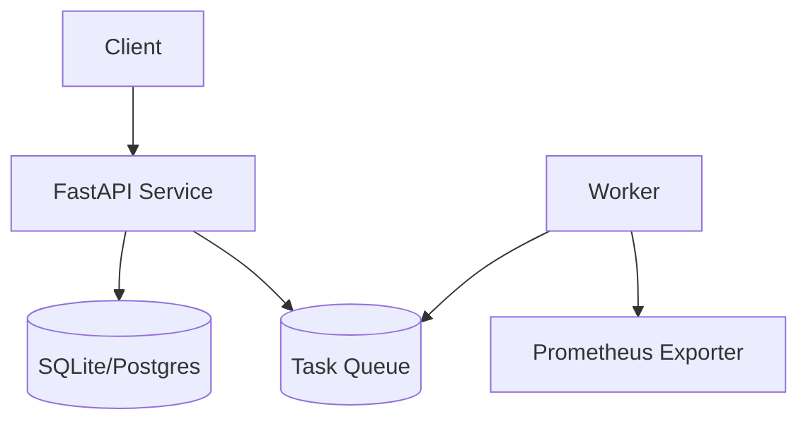

# Architecture — P09 Cloud-Native POC

## Components
- **FastAPI service:** core app exposing health, items, and metrics endpoints.
- **Worker:** background job processing tasks from in-memory queue.
- **Storage:** SQLite for demo persistence; can swap to Postgres.
- **Observability:** Prometheus metrics via `/metrics`, Loki-friendly structured logs.

## Deployment
- **Local Docker Compose:** API + worker + prometheus + grafana defined in `docker/compose.poc.yaml`.
- **Kubernetes:** Deployment + Service manifest for API, CronJob for worker tasks.
- **CI:** `make ci` builds image, runs pytest, and pushes SBOM.

## Resilience
- Health/readiness probes on `/healthz` and `/readyz`.
- Worker retries failed tasks up to 3 times with exponential backoff.
- Structured logs for correlation IDs.
