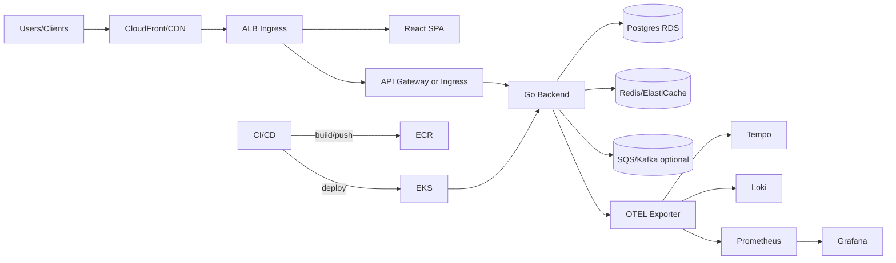

# Cloud-Native POC Master Artifacts

## 1. Executive Summary
This proof-of-concept validates a production-aligned cloud-native stack that showcases rapid feature delivery, reliable operations, and strong governance. The POC demonstrates end-to-end workflows from IaC to app code, CI/CD, observability, security, and business value realization. The target is a scalable web service with API + UI backed by managed cloud services and full automation.

- **Goals:** Prove that the reference architecture can be provisioned in <60 minutes, delivers p95 latency <300 ms under 300 RPS, and sustains zero critical security findings in CI/CD gates.
- **Scope:** Infrastructure (networking, compute, data), containerized backend/frontend, CI/CD pipelines, observability, runbooks, threat model, risk register, ADRs, and ROI narrative.
- **Stakeholders:** Platform engineering, application teams, security, SRE, product leadership.

## 2. README / Deployment Steps
### Prerequisites
- Terraform ≥1.7, Helm ≥3.13, kubectl ≥1.29, Docker 24+, Node 20, Go 1.22, Python 3.11, AWS CLI with OIDC-enabled account, GNU Make.
- Access to AWS Route53, ACM, EKS, RDS, S3, CloudWatch, and IAM permissions.

### Local Workflow
1. `python -m venv .venv && source .venv/bin/activate`; `pip install -r requirements-dev.txt`.
2. `npm install --prefix frontend`; `go mod download` for backend; `npm install --prefix ops` for CDK helpers if used.
3. `make kind-up` to create a Kind cluster; `make deploy-local` to install local stack (Postgres, Tempo, Loki, Prometheus) via Helmfile.
4. `make seed` to load sample data; `make e2e` to run Playwright/Cypress UI + API flows.

### Cloud Deployment
1. `terraform init && terraform apply -var-file=infra/terraform.tfvars` to provision VPC, EKS, RDS, S3, ALB, CloudFront (if needed), and IAM roles for service accounts.
2. `helmfile -e staging apply` to deploy backend, frontend, ingress, and observability stack; production uses `-e prod` with autoscaling tuned.
3. Configure DNS via Route53; issue TLS cert via ACM; update ingress annotations for HTTPS.
4. Run `make smoke-staging` to validate health, migrations, and synthetic transactions.
5. Promote to prod using Argo Rollouts canary; monitor metrics and rollback automatically if SLOs violated.

### Configuration
- Values stored in `infrastructure/helm/values-<env>.yaml`; secrets sourced from AWS Secrets Manager via external-secrets.
- Feature flags in `config/feature-flags.yaml` to toggle caching, rate limiting, experimental APIs.
- CD pipelines defined in `.github/workflows`; observable settings in `observability/` dashboards and alert rules.

## 3. Architecture Diagrams
### Mermaid


### ASCII
```
Users -> CDN/CloudFront -> ALB/Ingress -> {Frontend, API Gateway -> Go Backend -> Postgres/Redis/Queue}
                                                   \-> OTEL -> {Prometheus, Loki, Tempo} -> Grafana
CI/CD -> build images -> ECR -> deploy to EKS
```

## 4. IaC Code Prompt
> "Create Terraform for AWS: VPC across 3 AZs, public/private subnets, NAT gateways, EKS cluster with managed node groups and IRSA, RDS Postgres multi-AZ with performance insights, ElastiCache Redis, S3 buckets for artifacts/logs (SSE-KMS, lifecycle), ALB ingress with WAF, Route53 records, ACM certs, CloudFront distribution for frontend, IAM roles for CI OIDC, and security groups with least privilege. Outputs: kubeconfig, ALB DNS, RDS endpoint, Redis endpoint, CloudFront URL." Acceptance: `terraform validate` clean; checkov/tflint pass; plan shows no drift; cost estimate generated.

## 5. Backend Code Prompt
> "Develop a Go 1.22 REST/gRPC backend using chi or gin. Features: CRUD domain APIs, search, background worker for async tasks, health/readiness endpoints, OpenAPI spec generation, sqlc for Postgres, Redis caching layer, and optional SQS consumer. Add OTEL instrumentation, zap logging, structured errors, and config via env/flags. Implement migrations (goose) and seeding. Acceptance: `go test ./...`, `golangci-lint`, contract tests vs OpenAPI, 85% coverage on handlers/services." 

## 6. Frontend Code Prompt
> "Build a React 18 + TypeScript app with Vite. Pages: landing, dashboard, admin settings, and observability embeds. Use MUI + TanStack Query, auth via Cognito/Okta, feature flag toggles, dark mode, and accessible components. Integrate with backend APIs and show SLO status. Acceptance: `npm run test`, `npm run lint`, Lighthouse scores >90, Storybook docs for core components." 

## 7. Containerization Prompt
> "Dockerize backend and frontend with multistage builds. Backend uses distroless non-root, frontend built then served via nginx-alpine. Include health checks, env injection, and minimal layers. Provide docker-compose for local stack with Postgres, Redis, and mock OTEL collector. Sign images with cosign and generate SBOM (Syft)." Acceptance: `docker compose up` local smoke; containers run as non-root; SBOM attached; cosign verify.

## 8. CI/CD Prompt
> "GitHub Actions pipeline with stages: lint/test (Go, TS), SAST (Semgrep), dependency scan (Trivy/Snyk), secret scan (gitleaks), build & push images to ECR, Terraform plan/apply with approvals, Helm deploy to EKS with Argo Rollouts canary, smoke tests, and synthetic checks. Enable OIDC for AWS auth. Add nightly performance test job and weekly chaos experiment. Acceptance: required checks enforced; promotion blocked on failing SLOs; artifacts stored with retention." 

## 9. Observability Prompt
> "Deploy Prometheus Operator, Loki, Tempo, Grafana, and Alertmanager. Instrument backend/frontend with OTEL. Provide dashboards: latency/error rates, request volumes, cache hit ratio, DB performance, queue lag, CI pipeline durations, and canary analysis. Alerts: p95 latency >300 ms 5m, error rate >1%, DB connections >80%, cache hit <85%, canary metric regression, and TLS cert expiry. Include synthetic probes via blackbox exporter." Acceptance: promtool tests; alert firing validated in staging; traces include `request_id` and user context.

## 10. Testing Suite
- **Unit:** Go handlers/services, TS components/hooks; thresholds 85%.
- **Integration:** TestContainers for Postgres/Redis; contract tests vs OpenAPI; end-to-end UI+API flows with Playwright/Cypress; messaging consumer tests using localstack/kafka.
- **Performance:** k6 scenarios for 300 RPS sustained, spike tests to 600 RPS; thresholds p95 <300 ms, error rate <1%.
- **Resilience:** Chaos experiments on pod restarts, network latency (pumba), and DB failover drills.
- **Security:** ZAP baseline, Semgrep, Trivy, dependency checks; authz bypass and rate limit negative tests.
- **Data:** Migration tests verifying backward compatibility; seed integrity checks.
- **Acceptance:** CI green; performance SLOs met; chaos resilience validated monthly; recovery drills documented.

## 11. Operational Playbooks
- **On-call:** Rotation in `operations/oncall.md`; L1 SRE, L2 platform; escalation matrix with security contact.
- **Runbook: Elevated error rate**
  1. Review Grafana panel and recent deploys; check canary metrics.
  2. Query logs by `trace_id` in Loki; inspect failed routes.
  3. Roll back via Argo Rollouts or `helm rollback`.
  4. Run `make smoke` and targeted contract tests; confirm error rate drops.
- **Runbook: DB latency spike**
  1. Check RDS performance insights; confirm connections and slow queries.
  2. Scale instance class or add read replica (if enabled) via Terraform variables.
  3. Enable/refresh query plan cache; invalidate hot cache keys.
  4. If caused by migration, roll back migration and reapply with fix.
- **Backup/Restore:** Nightly snapshots for RDS; PITR enabled; restore via Terraform target and run migrations. S3 versioning on artifacts; periodic recovery test.
- **Change Management:** CAB approvals with templates in `operations/change-log.md`; freeze rules during high-traffic events; feature flags for incremental rollout.
- **Capacity & Cost:** Weekly review of node usage, autoscaling events, and CloudWatch cost explorer; scale down dev at night using schedules.

## 12. Reporting Templates
- **Weekly Ops:** uptime, latency/error trends, incidents (MTTR/MTTA), change log, cost summary, top risks.
- **Monthly Exec:** SLO adherence, release frequency, security posture, roadmap delivery, ROI snapshot (cost vs usage), and experiment outcomes.
- **Postmortem Template:** timeline, detection, containment, root causes, contributing factors, actions (30/90 days), success metrics, and ownership.
- **Quarterly Architecture Review:** ADR changes, dependency health, capacity planning, and modernization backlog.

## 13. Metrics & Observability
- **SLIs/SLOs:** availability 99.9%, p95 latency 300 ms, error rate <1%, cache hit >85%, DB CPU <70%, deployment success >98%.
- **Dashboards:** service overview, dependency health, release health (DORA metrics), error budget burn, cost and capacity, and user journey conversion (if applicable).
- **Alerting:** PagerDuty integration for P1/P2; Slack for P3; alerts annotated with runbooks and recent deploy info; maintenance windows configured.
- **Tracing/Logging:** OTEL auto-instrumentation; trace sampling 10%; structured logs with `request_id`, `user_id`, and feature flag state.

## 14. Security & Threat Model
- **STRIDE:**
  - Spoofing: OIDC + mTLS internal; signed JWTs; short-lived tokens for CI.
  - Tampering: IaC immutability, image signing, database encryption at rest, WAF rules.
  - Repudiation: Audit logging for admin actions, Git signing, CloudTrail/GuardDuty enabled.
  - Information Disclosure: TLS everywhere, secret masking, encryption at rest, scoped RBAC.
  - DoS: WAF rate limits, autoscaling, circuit breakers, queue backpressure, per-IP throttling.
  - Elevation: Least-privilege IAM, Kubernetes RBAC, Kyverno policies blocking privileged pods.
- **ATT&CK:** T1190 exploited APIs mitigated via WAF + validation; T1078 valid accounts mitigated via MFA + SSO; T1499 resource hijack mitigated via quotas; T1552 credential theft mitigated by secret scanning and KMS; T1609 container breakout mitigated via seccomp/AppArmor and read-only FS.
- **Controls:** Semgrep, Trivy, gitleaks, SBOM + cosign verify, WAF managed rules, runtime security (Falco), periodic pen-tests, dependency pinning, automated rotation of secrets.
- **Threat Scenarios:** Compromised CI pipeline, poisoned dependency, misconfigured ingress, data exfil via logs, privilege escalation in cluster; each mapped to control + detection and tested in tabletop drills.

## 15. Risk Register (≥10)
1. IaC drift – mitigate with scheduled `terraform plan` and drift detection; owner: Platform; impact: medium; likelihood: medium.
2. Cost overrun – mitigate with budgets/alerts, rightsizing, spot nodes; owner: FinOps; impact: high; likelihood: medium.
3. Database saturation – mitigate with connection pooling, caching, auto-scaling instance; owner: DBA; impact: high; likelihood: medium.
4. Cache eviction storms – mitigate with TTL tuning and backoff; owner: App Lead; impact: medium; likelihood: low.
5. Security misconfig – mitigate with policy as code (OPA/Kyverno), scans; owner: Security; impact: high; likelihood: low.
6. Pipeline failures – mitigate with retries, cached deps, self-hosted runner HA; owner: DevEx; impact: medium; likelihood: medium.
7. Ingress/WAF misrule – mitigate with staged rollout and canary; owner: Network; impact: high; likelihood: low.
8. Secret leakage – mitigate with OIDC, limited IAM, secret scanning; owner: Security; impact: high; likelihood: low.
9. Vendor service outage – mitigate with multi-AZ, backups, and graceful degradation; owner: SRE; impact: high; likelihood: medium.
10. Observability gaps – mitigate with golden signals dashboards and alert tests; owner: SRE; impact: medium; likelihood: medium.
11. Data migration failure – mitigate with blue/green migrations and rollback scripts; owner: DBA; impact: high; likelihood: low.
12. Unbounded growth of logs/metrics – mitigate with retention policies and budgets; owner: Platform; impact: medium; likelihood: medium.

## 16. ADRs
- **ADR-001:** Adopt AWS EKS with managed services (RDS, Redis) to minimize ops overhead and align with existing governance.
- **ADR-002:** Use Go for backend to achieve performance with low memory footprint and strong concurrency support.
- **ADR-003:** Choose React + TypeScript for frontend to reuse component library and enable fast iteration.
- **ADR-004:** Use Argo Rollouts for canary deployments to reduce blast radius and support metric-driven rollback.
- **ADR-005:** Standardize on OTEL for telemetry to unify traces/logs/metrics and support vendor portability.

## 17. Business Value
- **Speed:** Demonstrates infra-as-code and pipelines that deliver features in hours, not days; reduces onboarding time for new services.
- **Reliability:** SLO-backed operations and canary rollouts reduce downtime risk; resilience drills build confidence before production.
- **Security & Compliance:** Embedded security scanning, signed artifacts, and threat model provide audit-ready posture for production.
- **Cost Awareness:** Rightsizing patterns, spot usage, and cost dashboards inform sustainable spend.
- **Foundation for Scale:** Establishes reusable patterns (IaC modules, workflows, observability) that other teams can adopt, lowering total cost of ownership and accelerating portfolio delivery.
