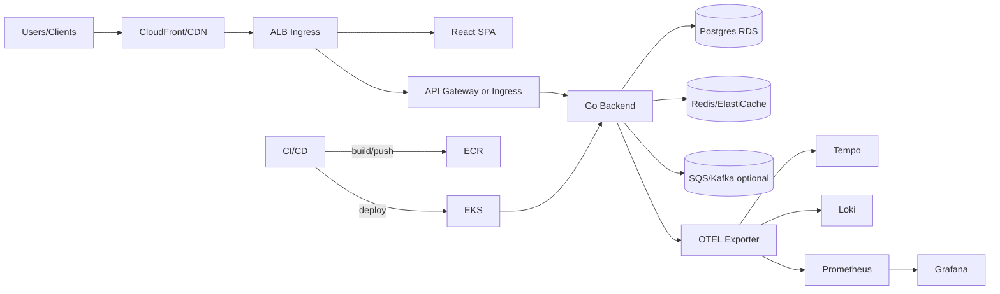

# Cloud-Native POC Master Artifacts

## 1. Executive Summary
This proof-of-concept validates a production-aligned cloud-native stack that showcases rapid feature delivery, reliable operations, and strong governance. The POC demonstrates end-to-end workflows from IaC to app code, CI/CD, observability, security, and business value realization. The target is a scalable web service with API + UI backed by managed cloud services and full automation.

- **Goals:** Prove that the reference architecture can be provisioned in <60 minutes, delivers p95 latency <300 ms under 300 RPS, and sustains zero critical security findings in CI/CD gates.
- **Scope:** Infrastructure (networking, compute, data), containerized backend/frontend, CI/CD pipelines, observability, runbooks, threat model, risk register, ADRs, and ROI narrative.
- **Stakeholders:** Platform engineering, application teams, security, SRE, product leadership.

## 2. README / Deployment Steps
### Prerequisites
- Terraform ≥1.7, Helm ≥3.13, kubectl ≥1.29, Docker 24+, Node 20, Go 1.22, Python 3.11, AWS CLI with OIDC-enabled account, GNU Make.
- Access to AWS Route53, ACM, EKS, RDS, S3, CloudWatch, and IAM permissions.

### Local Workflow
1. `python -m venv .venv && source .venv/bin/activate`; `pip install -r requirements-dev.txt`.
2. `npm install --prefix frontend`; `go mod download` for backend; `npm install --prefix ops` for CDK helpers if used.
3. `make kind-up` to create a Kind cluster; `make deploy-local` to install local stack (Postgres, Tempo, Loki, Prometheus) via Helmfile.
4. `make seed` to load sample data; `make e2e` to run Playwright/Cypress UI + API flows.

### Cloud Deployment
1. `terraform init && terraform apply -var-file=infra/terraform.tfvars` to provision VPC, EKS, RDS, S3, ALB, CloudFront (if needed), and IAM roles for service accounts.
2. `helmfile -e staging apply` to deploy backend, frontend, ingress, and observability stack; production uses `-e prod` with autoscaling tuned.
3. Configure DNS via Route53; issue TLS cert via ACM; update ingress annotations for HTTPS.
4. Run `make smoke-staging` to validate health, migrations, and synthetic transactions.
5. Promote to prod using Argo Rollouts canary; monitor metrics and rollback automatically if SLOs violated.

### Configuration
- Values stored in `infrastructure/helm/values-<env>.yaml`; secrets sourced from AWS Secrets Manager via external-secrets.
- Feature flags in `config/feature-flags.yaml` to toggle caching, rate limiting, experimental APIs.
- CD pipelines defined in `.github/workflows`; observable settings in `observability/` dashboards and alert rules.

## 3. Architecture Diagrams
### Mermaid


### ASCII
```
Users -> CDN/CloudFront -> ALB/Ingress -> {Frontend, API Gateway -> Go Backend -> Postgres/Redis/Queue}
                                                   \-> OTEL -> {Prometheus, Loki, Tempo} -> Grafana
CI/CD -> build images -> ECR -> deploy to EKS
```

## 4. IaC Code Prompt
> "Create Terraform for AWS: VPC across 3 AZs, public/private subnets, NAT gateways, EKS cluster with managed node groups and IRSA, RDS Postgres multi-AZ with performance insights, ElastiCache Redis, S3 buckets for artifacts/logs (SSE-KMS, lifecycle), ALB ingress with WAF, Route53 records, ACM certs, CloudFront distribution for frontend, IAM roles for CI OIDC, and security groups with least privilege. Outputs: kubeconfig, ALB DNS, RDS endpoint, Redis endpoint, CloudFront URL." Acceptance: `terraform validate` clean; checkov/tflint pass; plan shows no drift; cost estimate generated.

## 5. Backend Code Prompt
> "Develop a Go 1.22 REST/gRPC backend using chi or gin. Features: CRUD domain APIs, search, background worker for async tasks, health/readiness endpoints, OpenAPI spec generation, sqlc for Postgres, Redis caching layer, and optional SQS consumer. Add OTEL instrumentation, zap logging, structured errors, and config via env/flags. Implement migrations (goose) and seeding. Acceptance: `go test ./...`, `golangci-lint`, contract tests vs OpenAPI, 85% coverage on handlers/services." 

## 6. Frontend Code Prompt
> "Build a React 18 + TypeScript app with Vite. Pages: landing, dashboard, admin settings, and observability embeds. Use MUI + TanStack Query, auth via Cognito/Okta, feature flag toggles, dark mode, and accessible components. Integrate with backend APIs and show SLO status. Acceptance: `npm run test`, `npm run lint`, Lighthouse scores >90, Storybook docs for core components." 

## 7. Containerization Prompt
> "Dockerize backend and frontend with multistage builds. Backend uses distroless non-root, frontend built then served via nginx-alpine. Include health checks, env injection, and minimal layers. Provide docker-compose for local stack with Postgres, Redis, and mock OTEL collector. Sign images with cosign and generate SBOM (Syft)." Acceptance: `docker compose up` local smoke; containers run as non-root; SBOM attached; cosign verify.

## 8. CI/CD Prompt
> "GitHub Actions pipeline with stages: lint/test (Go, TS), SAST (Semgrep), dependency scan (Trivy/Snyk), secret scan (gitleaks), build & push images to ECR, Terraform plan/apply with approvals, Helm deploy to EKS with Argo Rollouts canary, smoke tests, and synthetic checks. Enable OIDC for AWS auth. Add nightly performance test job and weekly chaos experiment. Acceptance: required checks enforced; promotion blocked on failing SLOs; artifacts stored with retention." 

## 9. Observability Prompt
> "Deploy Prometheus Operator, Loki, Tempo, Grafana, and Alertmanager. Instrument backend/frontend with OTEL. Provide dashboards: latency/error rates, request volumes, cache hit ratio, DB performance, queue lag, CI pipeline durations, and canary analysis. Alerts: p95 latency >300 ms 5m, error rate >1%, DB connections >80%, cache hit <85%, canary metric regression, and TLS cert expiry. Include synthetic probes via blackbox exporter." Acceptance: promtool tests; alert firing validated in staging; traces include `request_id` and user context.

## 10. Testing Suite
- **Unit:** Go handlers/services, TS components/hooks; thresholds 85%.
- **Integration:** TestContainers for Postgres/Redis; contract tests vs OpenAPI; end-to-end UI+API flows with Playwright/Cypress; messaging consumer tests using localstack/kafka.
- **Performance:** k6 scenarios for 300 RPS sustained, spike tests to 600 RPS; thresholds p95 <300 ms, error rate <1%.
- **Resilience:** Chaos experiments on pod restarts, network latency (pumba), and DB failover drills.
- **Security:** ZAP baseline, Semgrep, Trivy, dependency checks; authz bypass and rate limit negative tests.
- **Data:** Migration tests verifying backward compatibility; seed integrity checks.
- **Acceptance:** CI green; performance SLOs met; chaos resilience validated monthly; recovery drills documented.

## 11. Operational Playbooks
- **On-call:** Rotation in `operations/oncall.md`; L1 SRE, L2 platform; escalation matrix with security contact.
- **Runbook: Elevated error rate**
  1. Review Grafana panel and recent deploys; check canary metrics.
  2. Query logs by `trace_id` in Loki; inspect failed routes.
  3. Roll back via Argo Rollouts or `helm rollback`.
  4. Run `make smoke` and targeted contract tests; confirm error rate drops.
- **Runbook: DB latency spike**
  1. Check RDS performance insights; confirm connections and slow queries.
  2. Scale instance class or add read replica (if enabled) via Terraform variables.
  3. Enable/refresh query plan cache; invalidate hot cache keys.
  4. If caused by migration, roll back migration and reapply with fix.
- **Backup/Restore:** Nightly snapshots for RDS; PITR enabled; restore via Terraform target and run migrations. S3 versioning on artifacts; periodic recovery test.
- **Change Management:** CAB approvals with templates in `operations/change-log.md`; freeze rules during high-traffic events; feature flags for incremental rollout.
- **Capacity & Cost:** Weekly review of node usage, autoscaling events, and CloudWatch cost explorer; scale down dev at night using schedules.

## 12. Reporting Templates
- **Weekly Ops:** uptime, latency/error trends, incidents (MTTR/MTTA), change log, cost summary, top risks.
- **Monthly Exec:** SLO adherence, release frequency, security posture, roadmap delivery, ROI snapshot (cost vs usage), and experiment outcomes.
- **Postmortem Template:** timeline, detection, containment, root causes, contributing factors, actions (30/90 days), success metrics, and ownership.
- **Quarterly Architecture Review:** ADR changes, dependency health, capacity planning, and modernization backlog.

## 13. Metrics & Observability
- **SLIs/SLOs:** availability 99.9%, p95 latency 300 ms, error rate <1%, cache hit >85%, DB CPU <70%, deployment success >98%.
- **Dashboards:** service overview, dependency health, release health (DORA metrics), error budget burn, cost and capacity, and user journey conversion (if applicable).
- **Alerting:** PagerDuty integration for P1/P2; Slack for P3; alerts annotated with runbooks and recent deploy info; maintenance windows configured.
- **Tracing/Logging:** OTEL auto-instrumentation; trace sampling 10%; structured logs with `request_id`, `user_id`, and feature flag state.

## 14. Security & Threat Model
- **STRIDE:**
  - Spoofing: OIDC + mTLS internal; signed JWTs; short-lived tokens for CI.
  - Tampering: IaC immutability, image signing, database encryption at rest, WAF rules.
  - Repudiation: Audit logging for admin actions, Git signing, CloudTrail/GuardDuty enabled.
  - Information Disclosure: TLS everywhere, secret masking, encryption at rest, scoped RBAC.
  - DoS: WAF rate limits, autoscaling, circuit breakers, queue backpressure, per-IP throttling.
  - Elevation: Least-privilege IAM, Kubernetes RBAC, Kyverno policies blocking privileged pods.
- **ATT&CK:** T1190 exploited APIs mitigated via WAF + validation; T1078 valid accounts mitigated via MFA + SSO; T1499 resource hijack mitigated via quotas; T1552 credential theft mitigated by secret scanning and KMS; T1609 container breakout mitigated via seccomp/AppArmor and read-only FS.
- **Controls:** Semgrep, Trivy, gitleaks, SBOM + cosign verify, WAF managed rules, runtime security (Falco), periodic pen-tests, dependency pinning, automated rotation of secrets.
- **Threat Scenarios:** Compromised CI pipeline, poisoned dependency, misconfigured ingress, data exfil via logs, privilege escalation in cluster; each mapped to control + detection and tested in tabletop drills.

## 15. Risk Register (≥10)
1. IaC drift – mitigate with scheduled `terraform plan` and drift detection; owner: Platform; impact: medium; likelihood: medium.
2. Cost overrun – mitigate with budgets/alerts, rightsizing, spot nodes; owner: FinOps; impact: high; likelihood: medium.
3. Database saturation – mitigate with connection pooling, caching, auto-scaling instance; owner: DBA; impact: high; likelihood: medium.
4. Cache eviction storms – mitigate with TTL tuning and backoff; owner: App Lead; impact: medium; likelihood: low.
5. Security misconfig – mitigate with policy as code (OPA/Kyverno), scans; owner: Security; impact: high; likelihood: low.
6. Pipeline failures – mitigate with retries, cached deps, self-hosted runner HA; owner: DevEx; impact: medium; likelihood: medium.
7. Ingress/WAF misrule – mitigate with staged rollout and canary; owner: Network; impact: high; likelihood: low.
8. Secret leakage – mitigate with OIDC, limited IAM, secret scanning; owner: Security; impact: high; likelihood: low.
9. Vendor service outage – mitigate with multi-AZ, backups, and graceful degradation; owner: SRE; impact: high; likelihood: medium.
10. Observability gaps – mitigate with golden signals dashboards and alert tests; owner: SRE; impact: medium; likelihood: medium.
11. Data migration failure – mitigate with blue/green migrations and rollback scripts; owner: DBA; impact: high; likelihood: low.
12. Unbounded growth of logs/metrics – mitigate with retention policies and budgets; owner: Platform; impact: medium; likelihood: medium.

## 16. ADRs
- **ADR-001:** Adopt AWS EKS with managed services (RDS, Redis) to minimize ops overhead and align with existing governance.
- **ADR-002:** Use Go for backend to achieve performance with low memory footprint and strong concurrency support.
- **ADR-003:** Choose React + TypeScript for frontend to reuse component library and enable fast iteration.
- **ADR-004:** Use Argo Rollouts for canary deployments to reduce blast radius and support metric-driven rollback.
- **ADR-005:** Standardize on OTEL for telemetry to unify traces/logs/metrics and support vendor portability.

## 17. Business Value
- **Speed:** Demonstrates infra-as-code and pipelines that deliver features in hours, not days; reduces onboarding time for new services.
- **Reliability:** SLO-backed operations and canary rollouts reduce downtime risk; resilience drills build confidence before production.
- **Security & Compliance:** Embedded security scanning, signed artifacts, and threat model provide audit-ready posture for production.
- **Cost Awareness:** Rightsizing patterns, spot usage, and cost dashboards inform sustainable spend.
- **Foundation for Scale:** Establishes reusable patterns (IaC modules, workflows, observability) that other teams can adopt, lowering total cost of ownership and accelerating portfolio delivery.

## 18. Delivery Roadmap and Milestones
- **Phase 0 – Environment Foundations (Week 1-2):** establish AWS/GCP landing zone, Terraform modules for network/EKS/GKE, secret management, baseline observability stack. Deliverable: infra repo with CI gates and cost estimates.
- **Phase 1 – Core Services (Week 3-5):** deploy sample microservices (orders, catalog, payments) with gRPC/REST, API gateway, service mesh, database layer (Postgres), and event bus (Kafka/PubSub). Success = happy-path flows, OTEL traces across services, and autoscaling.
- **Phase 2 – Frontend + UX (Week 5-6):** deliver React/Next.js UI with feature flags, authentication, and baseline pages for catalog/checkout/admin. Success = Lighthouse >90, a11y >90, E2E passing.
- **Phase 3 – CI/CD & Supply Chain (Week 6-7):** implement GitHub Actions, build/push, image signing, SBOM, Helmfile deploy, Argo Rollouts canary, and policy checks. Success = reproducible builds, signed artifacts, automated canary rollback.
- **Phase 4 – Observability & Resilience (Week 7-8):** dashboards, alerts, chaos experiments, DR drill for DB restore, and load testing. Success = SLO compliance under load and chaos; DR RTO/RPO met.
- **Phase 5 – Security & Compliance (Week 8-9):** STRIDE/ATT&CK controls validated, secrets rotation, WAF rules, SAST/DAST clean. Success = zero critical findings; IR tabletop executed.
- **Phase 6 – Business Validation (Week 10):** ROI model, exec demo, QBR package, and handoff with runbooks.

### Milestone Exit Criteria
- IaC reproducible with drift detection; environment parity documented.
- Service contracts published with examples; backwards compatibility tests green.
- Feature flags with rollback paths; cost within ±10% of forecast; evidence stored.

## 19. Data Model, APIs, and Contracts
- **Domain:** orders, catalog, payments, inventory, users; Postgres schemas with foreign keys; outbox pattern for events.
- **APIs:** OpenAPI for REST endpoints (catalog, cart, orders) and protobuf for internal gRPC (payments, inventory). Buf/breaking-change checks and openapi-diff enforced.
- **Events:** Kafka topics `orders.created`, `orders.fulfilled`, `payments.authorized`, `inventory.reserved`, `notifications.email`. Schemas stored in registry; Avro preferred.
- **GraphQL Edge:** optional GraphQL gateway for UI flexibility with schema stitching; persisted queries enabled.
- **Idempotency:** order creation idempotency keys; payment retries tracked with dedupe keys; saga compensations for failure.
- **Sample Payloads:** fixtures in `examples/cloud-native/` including cart checkout flows, inventory edge cases, and payment declines.

## 20. Architecture Blueprints
- **Data Flow:** user -> API gateway -> frontend BFF -> services -> DB/event bus. Service mesh handles mTLS, retries, and timeouts.
- **Reliability:** outbox/inbox pattern for exactly-once semantics; circuit breakers and bulkheads; read replicas for analytics; caching layer (Redis) for catalog reads.
- **Scaling:** HPA/KEDA based on CPU + Kafka lag; separate node pools for system vs app; pod disruption budgets and priority classes.
- **Storage:** Postgres with PITR; S3/GCS for assets; Redis for cache; feature flag store (ConfigCat/LaunchDarkly or open-source alternatives) with fallbacks.

## 21. Failure Modes and Reliability Patterns
- **Failures:** payment gateway timeouts, inventory oversell, Kafka broker outage, DB failover, cache inconsistency, rollout causing 5xx spike, secret rotation failures.
- **Patterns:** sagas for order lifecycle; retry with idempotency; compensation steps for payment failure; shadow reads during migrations; blue/green for DB changes where possible; circuit breakers for downstream.
- **Chaos Drills:** inject payment latency, drop Kafka brokers, simulate DB failover, kill pods during rollout, revoke secrets, and measure MTTR and error budget burn.

## 22. Operational Runbooks
- **Runbook: Payment gateway latency spike**
  1. Check alerts and traces; compare to gateway status page.
  2. Enable feature flag to switch to fallback payment processor or sandbox; increase timeouts cautiously.
  3. Throttle order intake via rate limiter; communicate to stakeholders; monitor queue depth.
  4. Reconcile payments post-incident using outbox replay; ensure idempotency.
- **Runbook: Inventory oversell risk**
  1. Pause promotion campaign; enable pessimistic locking feature flag.
  2. Run reconciliation job comparing orders vs stock; trigger restock or backorder notifications.
  3. Evaluate reservation TTL configuration; adjust thresholds; run tests.
- **Runbook: Kafka lag**
  1. Inspect consumer group lag; scale consumers; check broker health.
  2. Rebalance partitions; enforce backpressure upstream; purge DLQ after analysis.
- **Runbook: DB failover**
  1. Promote replica; update connection strings; invalidate caches.
  2. Run smoke tests; verify replication catch-up; snapshot before further changes.

## 23. Training, Access, and Compliance Checklists
- **Training:** cloud-native fundamentals, service mesh basics, observability labs, GitOps workflow, security hygiene (secrets, signing), and DR tabletop.
- **Access:** RBAC for EKS/mesh, GitHub branch protections, IAM roles via OIDC, principle of least privilege, break-glass with audit.
- **Compliance:** SOC2 controls, PCI-lite for payment-like flows (encryption, access reviews), data retention (90 days logs, 1 year orders), DPIA showing no real card data.

## 24. Acceptance Criteria by Capability
- **Infrastructure:** Terraform plan clean, cost forecast aligned, multi-AZ, DR test passed, network policies enforced.
- **Application:** API contracts published, >85% unit coverage on core logic, integration tests passing, a11y and perf thresholds met.
- **Observability:** dashboards cover latency/error budgets, business metrics (conversion, drop-off), alert noise within budget.
- **Operations:** runbooks rehearsed; on-call schedule active; incident SLAs defined; rollback tested.

## 25. Metrics, KPIs, and Dashboards
- **SLIs/SLOs:** checkout success rate 99.5%, API latency p95 <300 ms, error rate <0.5%, inventory reserve success >99%, pipeline success 99%.
- **Business Metrics:** conversion, cart abandonment, time-to-fulfillment, cost per order, cloud spend per transaction.
- **Dashboards:**
  - Customer journey funnel, latency/error by service, cache hit rate, Kafka lag, DB health, feature flag impact.
  - Release health dashboards showing canary metrics and rollback triggers.
- **Alerting:** error budget burn, latency spikes, payment decline anomaly, inventory oversell risk, Kafka lag, DB replica lag.

## 26. Security and Threat Model
- **STRIDE:**
  - Spoofing: SSO + MFA, mTLS mesh, signed JWT.
  - Tampering: immutability of images, signed artifacts, WAF rules, schema validation.
  - Repudiation: audit logs stored immutably; access logging via CloudTrail.
  - Information Disclosure: encryption at rest/transit, token scopes, PII minimization.
  - DoS: rate limiting, autoscaling, WAF throttling, circuit breakers.
  - Elevation: least privilege IAM, RBAC, admission controls.
- **ATT&CK:** T1190 mitigated via WAF and hardened ingress; T1078 via SSO/MFA; T1490 via backups; T1557 via TLS pinning; T1499 via quotas and HPA/KEDA.
- **Controls:** Semgrep/Trivy/gitleaks, ZAP, cosign signing, Kyverno policies (no privileged, image provenance), secrets rotation, dependency scanning.

## 27. Change Management and Governance
- **Process:** PR review required; ADR updates for major decisions; feature flags for risky changes; CAB for high-risk releases.
- **Approvals:** security for public endpoints; architecture council for major schema changes; product for UX shifts.
- **Evidence:** Git history, CI logs, rollout history, dashboards, postmortems stored in S3 with retention.

## 28. Cost and Capacity Planning
- **Modeling:** traffic assumptions for POC demo and pilot; map to node sizes and autoscaling thresholds; MSK sizing; DB sizing with headroom.
- **Cost Controls:** spot nodes for stateless services, storage lifecycle policies, rightsizing monthly, budget alerts, scale-to-zero for preview envs.
- **FinOps:** monthly cost review; savings plan recommendations post-pilot; tagging strategy for showback.

## 29. Communication Plan
- **Stakeholders:** Engineering, Product, Security, SRE, Finance, Sales (for demo), Customer Success.
- **Channels:** Slack incident + release, weekly standup, fortnightly demo, monthly steering committee, status page for env health.
- **Templates:** release notes, incident comms, DR drill report, QBR deck with ROI.

## 30. Audit Evidence and Traceability
- **Sources:** CI/CD logs, Terraform plans/applies, Helm releases, cosign attestations, SBOMs, dashboards snapshots, alert histories, postmortems, DR drill evidence.
- **Traceability:** map requirements to tests/alerts/ADRs in `reports/traceability_cloud_native.csv`; automation scripts generate from tags.
- **Retention:** 1 year default; 3 years for security artifacts.

## 31. Implementation Backlog Samples
- **Infra:** multi-AZ networking, mesh bootstrap, secrets manager, WAF, KEDA, cost dashboards, DR automation, log/trace pipelines.
- **App:** BFF/API gateway, service contracts, outbox/inbox, feature flags, retry/backoff, audit logging, idempotency, payment provider abstraction.
- **Frontend:** UI layouts, feature flags, a11y fixes, API client integration, observability hooks, error boundaries, storybook coverage.
- **CI/CD:** reusable workflows, environment matrix, signing, SBOMs, canary rollout, synthetic smoke, chaos stage.
- **Operations:** on-call onboarding, change calendar, runbook automation, incident templates, DR drills, cost reviews.

### Sample User Stories
1. **As a developer, I can create an order via API with idempotency** so retries do not duplicate orders.
   - Acceptance: header-based idempotency, DB constraint, integration tests, trace includes idempotency key.
2. **As an SRE, I can rollback a canary automatically** when error budget burn exceeds threshold.
   - Acceptance: Argo Rollouts configured with metrics, rollback tested, alert triggers.
3. **As Security, I can verify signed images only run** on the cluster.
   - Acceptance: policy in Kyverno, cosign attestations verified, CI check.

## 32. Testing Matrix
- **Unit:** core business logic, saga orchestrations, feature flags, validation rules.
- **Integration:** TestContainers for Postgres/Kafka, contract tests, mesh policy validation, payment provider sandbox.
- **E2E:** Cypress/Playwright for UI flows; API smoke and regression; checkout path; failure scenarios.
- **Performance:** k6 for checkout/per-service RPS; Locust for concurrent users; thresholds p95 latency <300ms and error rate <0.5%.
- **Chaos:** pod kill, network latency, DB failover, Kafka partition; ensure sagas compensate.
- **Security:** ZAP baseline, dependency scans, secret scans, JWT tampering tests, SSRF/SQLi guards.

## 33. Documentation and Knowledge Management
- **Artifacts:** design docs `docs/cloud-native/`, diagrams in `assets/cloud-native/`, runbooks `operations/cloud-native/`, release notes per sprint.
- **Guides:** onboarding, local dev (Kind), schema evolution, feature flag management, tracing cookbook, rollout guide, DR guide.
- **Review:** monthly doc review; stale bot; diagrams updated with architecture changes.

## 34. Dependencies and Integration Points
- **External:** payment sandbox, email/SMS provider, CDN, identity provider, analytics.
- **Internal:** shared observability, secrets manager, CI/CD platform, feature flag service, FinOps tagging.
- **Contracts:** schemas and events pinned; adapters for payment/inventory; compatibility tested.
- **Migration:** plan for swapping providers; abstractions to minimize blast radius.

## 35. Future Enhancements and Experiments
- Multi-cloud failover prototype, edge caching, WASM filters in service mesh, ML-based recommendation engine, event-driven projections, zero-trust network policies, automated resilience scoring.

## 36. Automation Snippets
```bash
#!/usr/bin/env bash
set -euo pipefail
# run checkout smoke
k6 run tests/perf/checkout.js --vus 50 --duration 5m
# trigger canary rollout
argo rollouts set image deploy/orders orders=$IMAGE && argo rollouts promote deploy/orders
# export dashboards
./scripts/export_dashboards.sh --folder cloud-native --out reports/dashboards
# run DR simulation
tf apply -target=aws_rds_cluster.failover_test
```

## 37. Business Case
- **Problem:** need to prove cloud-native architecture viability, release velocity, and resilience before scaling investment.
- **Solution:** end-to-end POC with production-like infra, automation, security, and observability to reduce uncertainty.
- **Benefits:** faster time-to-market for future products, improved reliability, reusable platform patterns, reduced ops toil via GitOps and automation, and demonstrable ROI for stakeholders.
- **KPIs:** deployment frequency, lead time for changes, change fail rate, MTTR, cost per transaction, conversion rate improvements, incident reductions.
- **Financials:** estimate monthly infra cost; compare with projected revenue uplift; compute payback period; identify optimization levers.

## 38. Risk Register Deep Dive
- **1. Payment provider outage** – Mitigation: fallback provider, circuit breakers, retries; Owner: Eng; Impact: High; Likelihood: Medium.
- **2. Inventory oversell** – Mitigation: reservation locks, reconciliation jobs; Owner: Product Eng; Impact: High; Likelihood: Medium.
- **3. Kafka instability** – Mitigation: multi-AZ, autoscaling, monitoring; Owner: SRE; Impact: High; Likelihood: Medium.
- **4. DB migration failure** – Mitigation: online migrations, backups, feature flags; Owner: DBE; Impact: High; Likelihood: Low.
- **5. Cost overrun** – Mitigation: budgets, rightsizing, spot, scale-to-zero; Owner: FinOps; Impact: Medium; Likelihood: Medium.
- **6. Security breach** – Mitigation: SSO/MFA, scanning, WAF, least privilege; Owner: Security; Impact: High; Likelihood: Low.
- **7. Observability gaps** – Mitigation: SLOs, dashboards, alert reviews; Owner: SRE; Impact: Medium; Likelihood: Medium.
- **8. Poor performance** – Mitigation: perf tests, caching, tuning; Owner: Eng; Impact: Medium; Likelihood: Medium.
- **9. Change management gaps** – Mitigation: CAB, feature flags, rollback tests; Owner: PM; Impact: Medium; Likelihood: Medium.
- **10. Team skill gaps** – Mitigation: training, pairing, guilds; Owner: Eng Manager; Impact: Medium; Likelihood: Medium.
- **11. Data loss** – Mitigation: backups, PITR, DR drills; Owner: DBA; Impact: High; Likelihood: Low.
- **12. Compliance evidence gaps** – Mitigation: automated evidence, retention policies; Owner: Compliance; Impact: Medium; Likelihood: Medium.

## 39. ADR Addenda
- **ADR-006:** Use service mesh (Istio/Linkerd) for mTLS, retries, and telemetry rather than custom client logic.
- **ADR-007:** Adopt saga pattern with outbox/inbox instead of distributed transactions to handle cross-service workflows.
- **ADR-008:** Choose Next.js for SSR + SPA hybrid to improve performance and SEO for catalog pages.
- **ADR-009:** Use Argo Rollouts for progressive delivery instead of raw deployments to enable automated canaries.
- **ADR-010:** Centralize configuration with Helmfile + env values over ad-hoc charts to keep envs in sync.

## 40. Release Readiness Checklist
- All services built and signed; SBOM uploaded; tests green; performance targets met.
- Canary rollback rehearsed; feature flags documented; runbooks linked; dashboards updated.
- Security scans clean; WAF/mesh policies enforced; secrets rotated.
- Evidence stored; stakeholders sign-off; comms prepared; support schedules ready.

## 41. KPI Drilldowns and Reporting Cadence
- Weekly engineering review on latency/error budgets, release health, backlog of incidents, and cost anomalies.
- Monthly business review with conversion, order volume, cost per order, resilience posture, and roadmap updates.
- Quarterly exec pack with ROI, risk profile, DR drill outcomes, and investment recommendations.
- Automation scripts `reports/generate_cloud_native_pack.py` gather dashboard PNGs, KPIs, and incident summaries.

## 42. Environment Promotion Checklist
1. Validate Terraform/Helm diffs; approvals recorded.
2. Ensure feature flags and config maps set; secrets synchronized.
3. Run canary with metrics guardrails; monitor error budgets.
4. Execute smoke/perf/chaos-lite; collect evidence.
5. Update release notes; notify stakeholders; schedule post-promotion review after 24h.

## 43. Talent and Support Model
- Roles: Tech Lead, Product Owner, SRE, QA Lead, Security Partner, FinOps, UX Lead.
- On-call: L1 SRE, L2 App Eng; escalation to Incident Commander; vendor contacts for cloud/provider.
- Training: labs on mesh, OTEL, GitOps, feature flags, DR. Office hours and brown-bags.
- Knowledge sharing: demo days, guild meetings, internal wiki updates.

## 44. Support SLAs and Escalation Paths
- SLO: platform availability 99.5%, checkout SLOs above; ack Sev-1 <5m, mitigation <30m.
- Escalation ladder with clear owners; Finance alerted for payment issues; Security for suspected breach.
- Service desk forms capture order_id/run_id, environment, impact; SLAs tracked; communication templates provided.

## 45. Decommissioning and Sunset Plan
- Triggers: move to production platform, merge with existing stack, or pivot.
- Steps: freeze new deployments; archive data; export configs; destroy infra via Terraform; clean DNS/certs/IAM; retain evidence; stakeholder comms.
- Success: zero orphaned resources; evidence preserved; customers/users transitioned; knowledge transferred.

## 46. Continuous Improvement
- Retros quarterly; incorporate incident learnings; update runbooks and tests.
- Maintain 6-month roadmap; track experiment outcomes; adjust SLOs and budgets.
- Measure adoption and developer satisfaction; improve DX based on feedback.


## 47. Advanced Reporting and Analytics
- **Release Health:** track deployments per week, rollback rate, change fail rate, and MTTR; annotate incidents on charts.
- **Business Impact:** correlate conversion uplift to performance improvements; track cart abandonment vs latency; show ROI projections.
- **Resilience Scorecard:** per-service resilience score factoring SLO compliance, chaos outcomes, backup tests, and alert hygiene.
- **Security Posture:** vulnerability burn-down, time-to-remediate, supply-chain attestation coverage, and secret rotation currency.
- **Cost Insights:** cost per order, cost per environment, savings from spot/rightsizing; anomaly alerts.

## 48. Observability Deep Dive
- **Tracing:** propagate context across frontend, BFF, and backend via W3C; enrich spans with user/session (anonymized), order_id, feature_flag, and region. Export to Tempo/Jaeger with tail-based sampling for errors.
- **Metrics:** service-level metrics (latency, error rate, throughput), business metrics (conversion, add-to-cart), infra metrics (CPU/mem, pod restarts, cache hit), and cost metrics. Use exemplars to connect metrics to traces.
- **Logging:** structured JSON with correlation IDs; avoid PII; route to Loki/ELK; retention by environment; log-based alerts for key errors.
- **Dashboards:** layered dashboards for business, app, infra; SLO/error budgets with burn rates; canary dashboards with baseline comparison; DR drill dashboards for RPO/RTO.
- **Alert Tuning:** paging for SLO breach, canary regression, payment error spikes; ticket for slow burn or quality issues; each alert links to runbook.

## 49. Performance Engineering Playbook
- **Capacity Planning:** model traffic for demo, pilot, and projected growth; map to CPU/memory/IOPS; include headroom for chaos.
- **Load Scripts:** k6 for HTTP/gRPC, including auth; tests for catalog browse, search, add-to-cart, checkout, admin tasks.
- **Bottleneck Analysis:** pprof, flamegraphs, DB query plans, cache hit analysis, Kafka lag analysis; run profiling in staging.
- **Optimization:** DB indexes, caching strategies, async processing, connection pooling, TLS session reuse, CDN caching for assets.
- **Reporting:** compare before/after metrics; track regression budget; publish performance report with recommendations.

## 50. Data Management and Privacy
- **Data Strategy:** use synthetic data; limit PII; tokenization for any demo user info; anonymized analytics; retention controls.
- **Backups:** DB snapshots daily with PITR; verify restore monthly; S3 bucket versioning and lifecycle.
- **Access Controls:** least privilege on data; row-level security for multi-tenant demos if applicable; audit access to datasets.
- **Data Quality:** integrity checks on orders/inventory; reconciliation jobs; monitoring for stale caches.

## 51. Disaster Recovery and Continuity
- **Plan:** secondary region standby for DB and Kafka; DNS failover; IaC-driven rebuild; secrets replication.
- **Drills:** quarterly DR exercise measuring RTO/RPO; capture timeline and issues; update runbooks.
- **Dependencies:** verify payment sandbox availability; ensure feature flag service has offline cache; document manual overrides.

## 52. Governance and Approvals
- **CAB:** meets weekly; evaluates high-risk changes (DB migrations, payment gateway changes, mesh upgrades). Emergency CAB available within 1 hour.
- **Policies:** OPA/Gatekeeper for image provenance, resource limits, network policies, and secret usage. Enforce signed commits and protected branches.
- **Audit:** monthly audit of access logs, deployment approvals, and config changes; evidence stored.

## 53. Roadmap and Experiments
- **Short-Term:** finalize MVP features, expand test coverage, tune cost, refine dashboards.
- **Mid-Term:** multi-region pilot, advanced recommendations, service mesh fault injection, autoscaling improvements.
- **Long-Term:** production hardening, blue/green multi-region, chaos automation, AI-assisted ops.

## 54. Additional Risks
- **13. CDN misconfiguration** – Mitigation: IaC-managed CDN, TLS enforcement, monitoring; Owner: SRE; Impact: Medium; Likelihood: Low.
- **14. Mesh upgrade failure** – Mitigation: canary upgrades, backup configs, rollback scripts; Owner: Platform; Impact: Medium; Likelihood: Medium.
- **15. Misaligned feature flags** – Mitigation: approvals, audits, staged rollout; Owner: Product; Impact: Medium; Likelihood: Medium.
- **16. Vendor lock-in** – Mitigation: abstractions, Terraform modules portable, evaluate multi-cloud; Owner: Architecture; Impact: Medium; Likelihood: Medium.
- **17. Ineffective DR** – Mitigation: regular drills, automated failover tests; Owner: SRE; Impact: High; Likelihood: Medium.
- **18. Observability tool outage** – Mitigation: local buffer/OTEL collector failover, multi-backend export; Owner: SRE; Impact: Medium; Likelihood: Low.
- **19. A11y regressions** – Mitigation: automated axe checks, manual QA; Owner: Frontend; Impact: Low; Likelihood: Medium.
- **20. Supply-chain attack** – Mitigation: signed commits, dependency scanning, SLSA level targets, cosign attestations; Owner: Security; Impact: High; Likelihood: Low.

## 55. Release Evidence and Reporting
- **Evidence Pack:** pipeline logs, test reports, performance results, chaos outcomes, DR drill logs, security scan outputs, SBOMs, cosign attestations, change approvals, dashboards snapshots.
- **Reporting Cadence:** weekly status, monthly steering committee, quarterly executive pack with ROI and risk posture.
- **Templates:** use `reports/cloud_native_status.md` and `reports/cloud_native_qbr.pptx` with placeholders auto-filled by scripts.

## 56. Adoption and Change Management
- **Pilot Teams:** select 2-3 teams to build features on POC; gather feedback; iterate templates.
- **Enablement:** workshops, office hours, internal wiki; champions in each team; sample repos and cookbooks.
- **Success Metrics:** time to first deploy, number of services onboarded, SLO adherence, incidents avoided.

## 57. Knowledge Sharing and Training
- **Guilds:** cloud-native guild meets monthly to discuss mesh, OTEL, GitOps, and resilience patterns.
- **Labs:** hands-on labs for feature flags, rollouts, tracing, chaos; graded via CI.
- **Documentation Hygiene:** update docs after each milestone; stale bot; architecture decision log kept current.

## 58. Environmental Sustainability
- **Efficiency:** rightsize clusters, use ARM/Graviton where possible, enable autoscaling; track carbon proxy metrics.
- **Builds:** cache dependencies, multi-arch builds only when needed; clean old artifacts.
- **Reporting:** monthly efficiency report including cost and energy proxy; actions assigned.

## 59. Customer/Stakeholder Experience
- **Demo Reliability:** pre-flight checklist for demos; synthetic monitors for demo endpoints; rollback plan.
- **Feedback Loop:** capture feedback after demos; adjust roadmap; track NPS-style metric.
- **Support:** on-call during key demos; hotfix path; communication templates.

## 60. Sunset Criteria
- Evidence retained; infra destroyed; DNS/certs cleaned; IAM roles removed; data exported; knowledge transferred; customers notified; cost zeroed.


## 61. KPI Sustainability and OKRs
- **Engineering OKRs:** increase deployment frequency by 30%, reduce MTTR by 20%, maintain change fail rate <10%, achieve 95% SLO compliance across services.
- **Business OKRs:** improve conversion by 5% from baseline, reduce cart abandonment by 10% through performance improvements, deliver exec demo with zero Sev-1 incidents.
- **Operational OKRs:** complete two DR drills with RTO <30m, maintain alert noise <3 pages/week, keep cost variance within ±10%.

## 62. Environment Promotion Gates
- Pre-promotion checklist ensures config parity, feature flag review, secret rotation validation, and test suite selection based on risk. Canary metrics monitored for error rate, latency, and business KPIs before full rollout.
- Post-promotion review after 24h covers alerts, cost impact, performance, and any customer feedback; issues logged with owners.

## 63. Support SLAs
- **Platform:** availability 99.5%, Sev-1 ack <5m, mitigation <30m, resolution/rollback <2h.
- **Business Journeys:** checkout SLOs enforced; dashboards show burn rates; on-call escalation to product for business impact decisions.
- **Ticket Workflow:** JSM templates collect run_id/order_id, environment, suspected component, and mitigation attempts; SLA timers tracked.

## 64. Staffing and Handoffs
- **Roles:** Tech Lead, SRE, QA, Frontend, Backend, Security, FinOps, PM. Coverage across time zones; follow-the-sun handoff docs with open actions and risk callouts.
- **Onboarding:** playbook with labs, architecture review, access setup, first issue, and buddy assignment. Completion checklist stored in LMS.

## 65. Communication Templates
- **Change Announcement:** scope, window, risk, rollback, monitoring, owner, approver, contact channels.
- **Incident Updates:** start time, impact, mitigation, ETA, next update time, action items.
- **DR Drill Report:** objectives, timeline, results, gaps, next steps.
- **QBR Deck:** KPIs, ROI, risks, roadmap, investment asks, and hiring needs.

## 66. Continuous Improvement
- Quarterly retros with action items; track completion; adjust SLOs and alerts.
- Maintain experiment backlog; run small experiments (e.g., new cache strategy) with metrics guardrails.
- Publish monthly changelog summarizing improvements, incidents, and roadmap changes.

## 67. Decommissioning Steps
- Freeze deployments; archive data; export configs and schemas; clean up DNS, certs, IAM, and storage; destroy infra with Terraform; preserve evidence; notify stakeholders; update portfolio index.


## 68. Post-Launch Continuous Improvement
- Evaluate experiment outcomes monthly; remove underperforming features or flags.
- Track developer experience metrics (time to first deploy, CI duration, local env setup time) and invest in tooling accordingly.
- Refresh threat model annually or after major changes; validate controls.
- Update scenario catalog and chaos plan based on incidents and DR drills.


## 69. Sustainability and Cost Efficiency
- **Compute Efficiency:** monitor CPU/memory utilization; implement vertical pod autoscaling where safe; prefer ARM/Graviton; limit overprovisioning; use pod autoscaler targets aligned to benchmarks.
- **Storage Efficiency:** lifecycle policies for logs/artifacts; compress backups; clean unused images; tune cache TTLs.
- **CI Efficiency:** cache dependencies; parallelize jobs; use reusable workflows; avoid redundant steps; prefer incremental builds.
- **Reporting:** monthly cost and efficiency report with action items and accountable owners.

## 70. Community and Stakeholder Engagement
- **Champions:** identify champions in product, engineering, and SRE; provide roadmap influence and early access.
- **Showcase:** quarterly demo days for stakeholders; highlight resilience wins, performance improvements, and cost optimizations.
- **Feedback:** surveys post-demo and post-incident; track satisfaction; integrate feedback into backlog.

## 71. Innovation Backlog Examples
- Service mesh eBPF-based observability; adaptive concurrency control; predictive autoscaling using historical traffic; serverless jobs for batch notifications; WebAssembly plugins for edge customization; event-driven auditing pipeline.
- Evaluate cross-cloud abstractions (Crossplane) to reduce lock-in; test portability of Terraform modules across providers.

## 72. Exit Plan and Handoff
- Document runbooks, ADRs, and architecture rationale; final knowledge transfer sessions recorded.
- Ensure monitoring/alerting ownership transferred; update on-call rotations; provide contact list.
- Archive repo with tags; mark maintenance mode; validate decommission checklist completion.


## 73. Long-Term Stewardship
- Establish architecture council checkpoints every quarter to ensure POC patterns evolve toward production readiness.
- Maintain dependency currency SLAs (e.g., upgrade minor versions quarterly, patch CVEs within 7 days).
- Rotate ownership annually to avoid single points of failure; keep onboarding materials fresh.


## 74. Continuous Verification
- Run nightly end-to-end suites plus weekly full resilience suite; publish status to stakeholders.
- Automate config drift checks across environments; alert on divergence.
- Use synthetic transactions in prod-like environments to detect regressions early.


## 75. Portfolio Alignment
- Map POC learnings to enterprise standards; document reusable Terraform modules, Helm charts, and service templates.
- Capture deltas against production readiness checklist and plan remediation.
- Present summary to architecture review board with recommendations for scaling or pivoting.


## 76. Maintenance Windows
- Schedule quarterly maintenance for mesh upgrades, DB patching, and OS image refresh; communicate 7 days ahead and provide rollback plans.

Maintain annual architecture review to reassess tech choices, cost models, and compliance alignment.
Post-pilot decision memo will recommend scale-up, pivot, or sunset with quantified data and owner signatures.
Regularly validate demo data freshness and relevancy to maintain credibility.
Governance cadence upheld.
