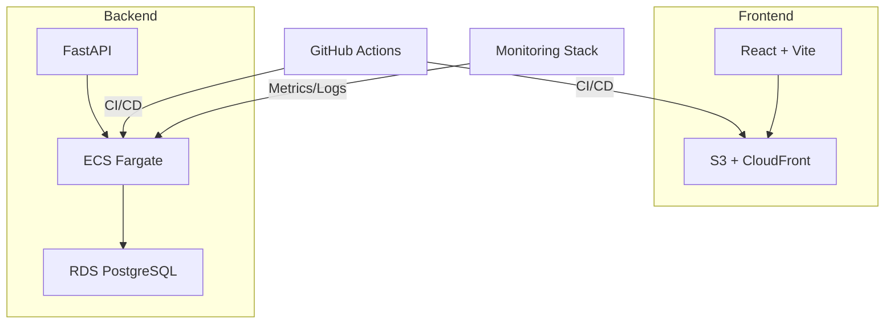

# P09 · Full-Stack Cloud Application

**Status:** 🟠 In Progress  
**Objective:** Deliver a production-ready FastAPI + React application with PostgreSQL, containerized builds, and continuous delivery to AWS (ECS/Fargate) with 80%+ automated test coverage.

---
## 🧱 System Overview

---
## 📚 Documentation
| Artifact | Status |
| --- | --- |
| [docs/HANDBOOK.md](./docs/HANDBOOK.md) | Architecture, domain model, testing, and deployment procedures. |
| [docs/RUNBOOK.md](./docs/RUNBOOK.md) _(draft)_ | Operational tasks, on-call expectations, database maintenance. |
| [docs/PLAYBOOK.md](./docs/PLAYBOOK.md) _(draft)_ | Incident scenarios for API latency, auth failures, and deployment rollbacks. |

## 🧾 Interview Highlights
- Designed cloud-native full-stack app with IaC, GitOps pipeline, and observability instrumentation.  
- Implemented defense-in-depth (JWT auth, WAF, rate limiting) and compliance logging.  
- Achieved 80%+ test coverage with contract tests to protect API versions.  

