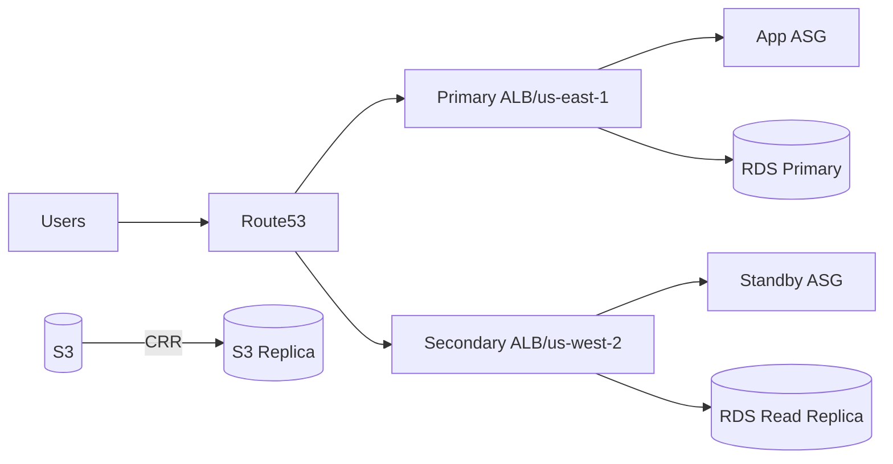

# Architecture — P10 Multi-Region

## Blueprint
- **Regions:** Primary (us-east-1) active, Secondary (us-west-2) warm standby.
- **Data Plane:** RDS primary with read replica, S3 cross-region replication.
- **Control Plane:** Route 53 health checks + failover policy; Lambda for DNS flip automation.
- **CI/CD:** Terraform plans per region; failover drills executed via GitHub Actions.

## Failover Model
- Health checks on `/healthz` and DB connectivity drive Route 53 failover.
- Lambda runbook updates DNS + warms caches.
- Data replication validated via checksum job.

## Security
- IAM roles per region with least privilege; KMS keys region-specific.
- Secrets stored in AWS SSM Parameter Store and referenced by Terraform.
