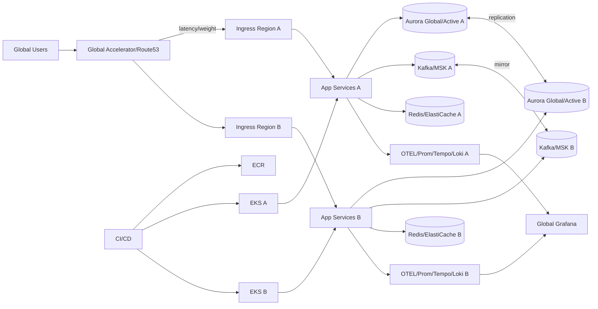

# Multi-Region Resilience Master Artifacts

## 1. Executive Summary
The multi-region resilience program establishes an application stack capable of surviving regional outages, network partitions, and data-plane failures while maintaining strict SLOs. The deliverable includes architecture blueprints, IaC, application prompts, CI/CD, observability, security, risk/risk governance, ADRs, and business outcomes. The focus is on active-active data planes with controlled failover, data consistency strategies, and operational readiness.

- **Outcomes:**
  - Active-active read/write with conflict resolution or active-passive with RPO ≤5 minutes depending on workload profile.
  - Automated failover runbooks, playbooks for network partitions, and data reconciliation procedures.
  - Dashboards and SLOs for latency, availability, replication lag, and error budgets across regions.
- **Success Criteria:** 99.95% availability, p95 latency ≤400 ms cross-region, replication lag <30s, recovery time objective (RTO) <15m, auditable change management, and zero critical security gaps.

## 2. README / Setup
### Prerequisites
- Terraform ≥1.7, Helm ≥3.13, kubectl ≥1.29, awscli, Go 1.22, Node 20, PostgreSQL client, Kafka CLI, GNU Make, Route53 and ACM permissions, and DNS ownership.

### Deployment Overview
1. Populate `infra/terraform.tfvars` with primary/secondary regions, CIDRs, DB sizes, and DNS domains.
2. `terraform init && terraform apply` provisions multi-region VPCs, EKS clusters, Global Accelerator/Route53, RDS global or Aurora global database, MSK/Kafka, S3 with CRR, and IAM roles.
3. Use `helmfile -e prod apply` to install services across regions with topology-aware routing and weights defined in `helm/values-<region>.yaml`.
4. Configure traffic policy (weighted or latency-based) in Route53; enable health checks for regional endpoints.
5. Run `make failover-drill` to simulate regional outage and validate RTO/RPO against dashboards.

### Local/Dev Path
- `make kind-multi` to spin two Kind clusters; use `tilt up` or `skaffold dev` for rapid iterations; `make e2e` runs cross-cluster tests with kubeconfig contexts.
- Seed data with `scripts/seed_multi.py`; configure conflict rules in `config/replication-rules.yaml`.

## 3. Architecture Diagrams
### Mermaid


### ASCII
```
Users -> Global Accelerator/Route53 -> {Region A Ingress -> Services/DB/Kafka/Redis/OTEL, Region B Ingress -> Services/DB/Kafka/Redis/OTEL}
DB replication <-> across regions, Kafka mirror topics, OTEL pipelines feed Global Grafana
CI/CD -> ECR -> EKS(A/B)
```

## 4. IaC Prompt
> "Terraform to provision dual-region architecture: VPCs in two regions, peering/Transit Gateway, EKS clusters with IRSA and managed node groups, Aurora Global Database or RDS cross-region read replicas, MSK with cluster linking, ElastiCache Redis with global datastore, S3 buckets with CRR and bucket policies, Route53 latency/weighted records, AWS Global Accelerator (optional), CloudWatch dashboards, KMS keys per region, IAM roles for CI OIDC, and WAF. Add health checks and failover routing. Outputs include kubeconfigs per region, database endpoints, Kafka bootstrap addresses, Redis endpoints, and Route53 records." Acceptance: `terraform validate` + checkov/tflint clean; plan shows zero drift; failover drill docs generated.

## 5. Backend Prompt
> "Develop a Go 1.22 service supporting multi-region awareness. Include health/readiness, feature flags for read-local vs read-global, idempotent APIs, and conflict resolution for writes (last-writer-wins or CRDT option). Use Postgres/Aurora global with partitioning, Kafka producers with idempotency, and Redis for session caching. Add OTEL instrumentation, rate limiting, and graceful degradation (read-only mode). Acceptance: `go test ./...`, `golangci-lint`, chaos tests for partition tolerance, and simulation showing RPO/RTO compliance." 

## 6. Frontend Prompt
> "Build a Next.js 14 + TypeScript app showing region health, latency, and failover status. Provide admin controls to trigger read-only mode, adjust traffic weights, and view replication lag. Use MUI + TanStack Query with websocket updates, and embed Grafana panels. Acceptance: `npm run test`, `npm run lint`, Lighthouse ≥90, and responsive design." 

## 7. Containerization Prompt
> "Create Dockerfiles for backend/frontend with multistage builds, non-root, distroless for Go, nginx-alpine for frontend. Include region metadata env vars. Provide docker-compose for local dual-region emulation with two app stacks, replicated Postgres, and Kafka mirror-maker. Sign images with cosign and publish SBOM." Acceptance: `docker compose up` local drill; cosign verify; SBOM stored.

## 8. CI/CD Prompt
> "GitHub Actions to run lint/test, SAST (Semgrep), dependency scans (Trivy/Snyk), secret scans (gitleaks), build/push images to ECR, Terraform plan/apply per region with approvals, Helmfile deploy to both clusters, Argo Rollouts canary per region, failover drill job, and chaos experiments for partition/loss. Use OIDC for AWS auth. Require checks before promotion; store run artifacts and disaster drill evidence." Acceptance: required checks enforced; regional deploys atomic; drill history archived.

## 9. Observability Prompt
> "Deploy per-region Prometheus, Tempo, Loki, and Alertmanager with federation to global Grafana. Collect replication lag, cross-region latency, error rates, and capacity. Configure blackbox probes from each region. Alerts: replication lag >30s, regional error rate >2%, GA health check fail, Kafka mirror lag >5k, Redis global datastore stale >20s, cert expiry <15d. Include runbook links and error budget policies." Acceptance: promtool tests; synthetic failover triggers alerts; dashboards show side-by-side region health.

## 10. Testing Suite
- **Unit:** Go services, TS components; coverage 85%.
- **Integration:** Dual-cluster tests verifying routing, failover, and replication; TestContainers for Postgres/Kafka; contract tests for APIs; cache consistency tests.
- **Performance:** k6 multi-region scripts simulating latency and loss; thresholds p95 <400 ms across regions, error rate <1%.
- **Resilience/Chaos:** Simulate region outage, network partition, DNS failover, and Kafka mirror break; verify RPO/RTO metrics and data reconciliation scripts.
- **Security:** ZAP baseline, Semgrep, Trivy, IAM policy tests, and WAF rule validation.
- **Data Validation:** Reconciliation jobs comparing row counts and checksums after failover and failback.
- **Acceptance:** CI green; failover drill passes monthly; replication lag within SLO; alert tests pass.

## 11. Operational Playbooks
- **On-call:** Dual-region rotation with region champions; escalation via PagerDuty with separate services per region; contact list in `operations/oncall.md`.
- **Runbook: Region outage**
  1. Confirm alert from GA/Route53 and dashboards; validate health checks failing.
  2. Trigger traffic shift to healthy region via Route53/GA weight update (or automated if enabled).
  3. Set affected region to read-only mode via feature flag; pause writes and Kafka producers.
  4. Monitor replication lag; if degraded, enable catch-up mode after region recovers.
  5. Initiate post-event reconciliation script to compare row counts/checksums; resolve conflicts.
  6. Communicate status every 15m in #multi-region-incident; create incident ticket.
- **Runbook: Replication lag spike**
  1. Inspect DB metrics; confirm no long-running transactions.
  2. Throttle traffic via rate limits; enable priority writes only.
  3. Scale writer nodes or increase IOPS; check network throughput between regions.
  4. After recovery, verify lag <30s and re-enable normal traffic weights.
- **Runbook: Kafka mirror lag**
  1. Check MirrorMaker/cluster linking metrics; restart connectors if stalled.
  2. Pause non-critical topics; increase bandwidth; verify ACLs.
  3. After catch-up, re-enable producers and confirm consumer lag cleared.
- **Data Migration/Failback:**
  - Use blue/green migrations with `liquibase` or `goose` executed region-by-region.
  - For failback, validate both regions in sync via checksums; gradually shift traffic back using weighted routing.
- **Change Management:** Freeze during peak seasons; CAB approvals for cross-region changes; record drills in `operations/drill-log.md` with timestamps and outcomes.
- **Backups/Recovery:** Automated snapshots per region; cross-region copy; quarterly restore tests; document RTO/RPO evidence.

## 12. Reporting Templates
- **Weekly Ops:** availability per region, latency percentiles, replication lag, incidents summary, changes shipped, failover drills performed, capacity headroom.
- **Monthly Executive:** SLA adherence, cost by region, DR drill outcomes, risk posture, roadmap milestones, and business impact of resilience improvements.
- **Postmortem:** timeline, detection, blast radius, customer impact, root cause, corrective/preventive actions with owners and dates, verification steps.
- **OKR/ROI Template:** objective (e.g., achieve 99.95% multi-region availability), key results (drills, lag reductions, cost targets), investment vs avoided downtime cost.

## 13. Metrics & Observability
- **SLIs/SLOs:** availability 99.95%, cross-region p95 latency ≤400 ms, replication lag <30s, error rate <1%, successful failover drills ≥1/month, RTO <15m, RPO <5m.
- **Dashboards:** per-region golden signals, replication/mirror lag, GA/Route53 health, canary analysis, DORA metrics by region, cost dashboards with cross-region spend.
- **Alerting:** PagerDuty for P1/P2; Slack for P3; alerts annotated with runbooks; maintenance windows; error budget policy triggers deploy freeze.
- **Logging/Tracing:** OTEL with region tag; logs include region + request ID; traces spanning regions with baggage to identify routing decisions.

## 14. Security & Threat Model
- **STRIDE:**
  - Spoofing: mTLS between regions, OIDC for admin; signed requests for replication agents.
  - Tampering: encrypted links (TLS), signed images/artifacts, immutable buckets, WORM logs.
  - Repudiation: audit trails in CloudTrail and app logs; time-synced clocks; signed commits.
  - Information Disclosure: encryption in transit/at rest, token scoping, PII minimization, and masking.
  - DoS: WAF with geo rules, rate limits per region, autoscaling, and regional isolation to prevent cascading failure.
  - Elevation: least-privilege IAM, network policies, Kyverno/OPA to block privileged pods, and just-in-time access.
- **ATT&CK:** T1190 (exploited APIs) mitigated by WAF + validation; T1078 (valid accounts) via MFA/SSO; T1499 (resource hijack) via quotas; T1552 (credential theft) via KMS + secret scanning; T1587 (supply chain) via signed artifacts and SBOM; T1609 (container breakout) mitigated via seccomp/AppArmor/PSP-like controls.
- **Controls:** Semgrep/Trivy/gitleaks, KMS per region, network segmentation, GuardDuty/Inspector, cosign signatures, SBOM checks, runtime monitoring (Falco), cross-region access logs, and periodic pen-tests including failover paths.
- **Threat Scenarios:** Rogue region takeover, replication poison pill, stale DNS cache, split-brain writes, credentials stolen from CI; each mapped to detection (alerts, logs) and response (traffic shift, revoke tokens, reconcile data).

## 15. Risk Register (≥10)
1. Split-brain writes – Mitigation: conflict resolution policies + read-only mode during partition; Owner: Platform; Impact: High; Likelihood: Medium.
2. Replication lag breaches – Mitigation: alerts, traffic shaping, write throttling; Owner: DBA; Impact: High; Likelihood: Medium.
3. Global service misrouting – Mitigation: staged DNS/GA changes with canary; Owner: Network; Impact: High; Likelihood: Low.
4. Kafka mirror failure – Mitigation: cluster linking HA, alerting, retry; Owner: SRE; Impact: Medium; Likelihood: Medium.
5. Secrets exposure – Mitigation: OIDC, KMS, secret scanning; Owner: Security; Impact: High; Likelihood: Low.
6. Cost spikes from duplicate regions – Mitigation: scheduled scaling, rightsizing, spot where safe; Owner: FinOps; Impact: Medium; Likelihood: Medium.
7. Drift between regions – Mitigation: GitOps/Helmfile sync, periodic drift detection; Owner: Platform; Impact: Medium; Likelihood: Medium.
8. Failover automation bug – Mitigation: manual override path, rehearsals; Owner: SRE; Impact: High; Likelihood: Low.
9. Observability blind spots – Mitigation: federation checks, alert tests; Owner: SRE; Impact: Medium; Likelihood: Medium.
10. Compliance gaps – Mitigation: audit trails, policy-as-code, periodic review; Owner: Security; Impact: Medium; Likelihood: Low.
11. Data residency conflicts – Mitigation: tagging data, residency-aware routing, legal review; Owner: Compliance; Impact: High; Likelihood: Low.
12. Human error during drills – Mitigation: checklists, two-person rule, dry runs; Owner: SRE; Impact: Medium; Likelihood: Medium.

## 16. ADRs
- **ADR-001:** Adopt active-active (where supported) with Aurora Global + Kafka linking to minimize RPO and support local reads.
- **ADR-002:** Use Route53 latency/weighted routing plus Global Accelerator for balanced traffic and failover flexibility.
- **ADR-003:** Standardize on OTEL + regional stacks with federation to provide region-tagged telemetry and global views.
- **ADR-004:** Argo Rollouts per region to permit independent canaries and reduce correlated failures.
- **ADR-005:** Prefer infrastructure-as-code with Terraform + Helmfile to keep regions consistent and auditable.

## 17. Business Value
- **Availability:** Protects revenue and user experience during regional outages; minimizes downtime cost.
- **Compliance & Trust:** Provides auditable disaster recovery and data residency controls, improving regulatory posture.
- **Performance:** Latency-based routing brings users to nearest healthy region; reduces churn due to slow responses.
- **Operational Confidence:** Regular drills and clear runbooks lower MTTR and reduce risk of human error during crises.
- **Scalability:** Establishes repeatable multi-region pattern that future services can reuse, reducing time-to-market for resilient offerings.

## 18. Delivery Roadmap and Milestones
- **Phase 0 – Baseline (Week 1-2):** confirm cloud provider landing zone, multi-region network patterns (Transit Gateway/Global Accelerator), Terraform modules, and cluster standards. Deliverable: reference architecture and CI lint/security.
- **Phase 1 – Core Platform (Week 3-5):** deploy primary/secondary regions with EKS/ECS, databases (Aurora global or Cosmos/Cockroach), global load balancing, service mesh, and replicated storage. Success = traffic served from both regions with health-based failover.
- **Phase 2 – Data Layer Resilience (Week 5-6):** configure cross-region replication, DR runbooks, backup/restore automation, and consistency strategies. Success = RPO/RTO validated via game-day.
- **Phase 3 – Application Resilience (Week 6-7):** implement active-active/active-passive patterns, circuit breakers, retries, feature flag-driven failover, and session affinity mitigation. Success = error budget maintained during failover tests.
- **Phase 4 – CI/CD and Observability (Week 7-8):** multi-region deployment pipelines, canary/blue-green per region, observability dashboards with region tags, synthetic probes, and alerting. Success = automated failover drills integrated.
- **Phase 5 – Security and Compliance (Week 8-9):** STRIDE/ATT&CK validation, zero trust networking, secrets rotation, signing/attestations, WAF, and DLP for cross-region data. Success = no critical findings; IR tabletop.
- **Phase 6 – Business Validation (Week 10):** QBR-ready evidence, ROI, cost modeling, and executive demo showing seamless failover and steady-state efficiency.

### Milestone Exit Criteria
- Multi-region IaC reproducible; drift detection and config parity enforced.
- Health-based routing validated; failover RTO/RPO met; chaos drills logged.
- Compliance evidence captured; cost within forecast; runbooks rehearsed.

## 19. Data Model, APIs, and Replication Contracts
- **Datastores:** Aurora Global Database or CockroachDB for strong consistency; Redis Enterprise or ElastiCache Global Datastore for cache; S3 cross-region replication for objects.
- **Replication Modes:** async for cost efficiency; sync/quorum for critical tables; per-table policies documented. Conflict resolution rules defined.
- **API Considerations:** idempotency keys; region-aware routing; sticky sessions avoided or replaced with distributed caches; retries with backoff; grace periods for write propagation.
- **Events:** Kafka clusters per region with MirrorMaker/replicator; topics `orders`, `payments`, `notifications`; schemas maintained; ordering considerations documented.

## 20. Architecture Patterns
- **Traffic:** Global Accelerator/CloudFront/Route53 latency-based routing; health checks for failover; failback controlled via feature flags.
- **Compute:** active-active where possible; active-passive for stateful components; blue/green per region; dedicated node pools per tier.
- **Data Consistency:** outbox/inbox for eventual consistency; CRDTs or application-level conflict resolution where needed; read-local/write-primary strategy with fallback.
- **Security:** mTLS mesh, private link between regions, IAM least privilege, network policies, WAF at edge, key management per region with centralized policies.
- **Cost/Performance:** autoscaling with regional quotas; caching at edge; replication lag monitoring; failover drills to validate budget.

## 21. Failure Modes and Reliability Patterns
- **Failure Scenarios:** regional outage, AZ outage, database primary failure, replication lag spike, stale DNS/health check, Kafka partition loss, credential rotation failure, config drift between regions.
- **Reliability Patterns:** bulkheads per region, circuit breakers for cross-region calls, retries with jitter and idempotency, fallback read routing, prioritized queues during failover, feature flag toggles to isolate regions.
- **Resilience Testing:** monthly region evacuation drills, AZ failure simulation, DNS poisoning tests, network partition chaos, backup restore verification, costed failover drills.

## 22. Operational Runbooks
- **Runbook: Region evacuation**
  1. Trigger failover via Route53/Global Accelerator; confirm health checks failing only in impacted region.
  2. Promote secondary DB if needed; ensure replication catch-up.
  3. Scale receiving region; adjust rate limits; monitor error budgets.
  4. Validate critical journeys; notify stakeholders; document timeline.
  5. Failback when stable; reconcile data; review metrics.
- **Runbook: Replication lag**
  1. Check metrics; identify culprit (network, load, long transactions).
  2. Throttle writes via feature flag; enable aggressive catch-up; ensure alerts below threshold.
  3. Run reconciliation; capture evidence.
- **Runbook: Config drift**
  1. Compare Terraform/Helm states; run drift detection; open ticket.
  2. Reapply baseline; run smoke tests; document remediation.
- **Runbook: Kafka mirror failure**
  1. Inspect MirrorMaker; reroute to local cluster; buffer events; replay after fix; ensure idempotency.

## 23. Training, Access, and Compliance Checklists
- **Training:** multi-region fundamentals, DNS/health routing, data consistency strategies, DR drills, observability with region tags, security of cross-region traffic.
- **Access:** RBAC by region; break-glass documented; OIDC with region-scoped IAM roles; approvals for changing routing policies.
- **Compliance:** data residency policies; encryption at rest/transit; audit logging; retention policies; DPIA for cross-border data; pen-test scope includes edge and failover paths.

## 24. Acceptance Criteria by Capability
- **Infrastructure:** multi-region Terraform validated; replication configured; failover drills successful; cost forecast reviewed; policies enforced.
- **Application:** region-aware routing implemented; SLOs met under failover; contracts tested; accessibility and performance thresholds met.
- **Observability:** dashboards segmented by region; alerts with region labels; synthetic probes across geos; error budget burn tracked per region.
- **Operations:** runbooks rehearsed; on-call schedule per region; incident templates; CAB approvals; rollback/failback tested.

## 25. Metrics, KPIs, and Dashboards
- **SLIs/SLOs:** availability per region 99.9%, global availability 99.95%; replication lag <2s (critical tables); failover RTO <30m; RPO <5m; latency p95 <350ms across regions.
- **Dashboards:**
  - Region health (latency, error rate, saturation), replication lag, DNS health, Kafka mirror status, edge cache hit, cost per region.
  - Business: conversion/order success per region, revenue protected during failover, user distribution.
- **Alerts:** SLO burn, replication lag thresholds, health check failures, drift detection, mirror failure, cost anomaly, error spikes in failover region.

## 26. Security and Threat Model
- **STRIDE:**
  - Spoofing: mTLS, signed requests, SSO with region scoping.
  - Tampering: signed artifacts, WORM logs, integrity checks on replicated data, WAF.
  - Repudiation: audit logs replicated cross-region; immutable stores.
  - Information Disclosure: encryption, token scoping, DLP; limit cross-region data where unnecessary.
  - DoS: rate limits at edge, autoscaling with quotas, regional isolation, circuit breakers.
  - Elevation: least privilege, just-in-time access, policy-as-code.
- **ATT&CK:** T1078 mitigated by SSO/MFA; T1499 resource exhaustion via quotas; T1190 via WAF; T1557 MITM via TLS pinning; T1490 backup destruction mitigated via cross-region backups.
- **Controls:** Semgrep/Trivy/gitleaks, cosign, SBOM, Kyverno/OPA, network policies, secret rotation, DAST, anomaly detection on cross-region traffic.

## 27. Change Management and Governance
- **Process:** PR + review; change calendar; CAB for routing changes and DB topology changes; feature flag toggles logged.
- **Approvals:** security for routing and data policies; architecture for schema or topology changes; product for user-facing impacts.
- **Evidence:** plan/apply logs, rollout history, routing changes, DR drills, postmortems, dashboards snapshots stored in S3.

## 28. Cost and Capacity Planning
- **Modeling:** cost per region including data transfer, replication, and standby capacity; scenario modeling for failover traffic spikes; buffer budgets for drills.
- **Controls:** schedule drills during low-cost windows; use spot where safe; scale-to-zero for non-critical preview envs; optimize TTLs for replication; monitor data transfer costs.
- **FinOps:** monthly review; anomaly detection; cost allocation by tag/region; ROI analysis on resilience spend.

## 29. Communication Plan
- **Stakeholders:** SRE, Platform, Product, Security, Compliance, Finance, Customer Support.
- **Channels:** incident Slack with region tags, weekly sync, monthly steering committee, status page with region health, pager alerts.
- **Templates:** failover announcement, incident updates, DR drill reports, QBR deck, cost review.

## 30. Audit Evidence and Traceability
- **Evidence:** Terraform/Helm outputs, routing change logs, DR drill logs, replication lag reports, security scans, SBOM/signing attestations, alerts, postmortems.
- **Traceability:** map requirements to tests/alerts/runbooks in `reports/traceability_multi_region.csv`; automation exports evidence.
- **Retention:** 1 year; 3 years for security/DR evidence.

## 31. Implementation Backlog Samples
- **Infra:** multi-region VPC, TGW/Peering, Global Accelerator, DNS routing, Aurora Global/Cockroach, Kafka mirror, mesh, observability, WAF, KMS multi-region keys.
- **App:** region-aware routing middleware, idempotency, saga support, feature flags, audit logging, cache strategy for multi-region, consistency checks.
- **CI/CD:** pipelines deploying per region, signing, SBOM, smoke/regression/chaos stages, drift detection, evidence upload.
- **Operations:** failover automation, runbook scripts, change calendar, DR drills, cost dashboards, compliance evidence automation.

### Sample User Stories
1. **As an SRE, I can fail traffic to a secondary region within 10 minutes** when health checks fail.
   - Acceptance: scripted failover, dashboards update, alerts triggered, error budget stays within SLO, rollback validated.
2. **As a developer, I can deploy independently to each region** while keeping configs in sync.
   - Acceptance: per-region pipeline with shared templates, drift detection, smoke tests in each region.
3. **As Compliance, I can confirm data residency policies** are enforced.
   - Acceptance: DLP checks, region-specific buckets, audit logs demonstrating residency adherence.

## 32. Testing Matrix
- **Unit:** region-aware logic, retry/backoff, idempotency, feature flags, cache strategy.
- **Integration:** replication tests, MirrorMaker tests, DNS routing tests, service mesh policies, data consistency checks.
- **E2E:** failover drills, canary rollouts per region, user journey across regions, latency measurements, session handling.
- **Performance:** load tests from multiple geos; p95 latency <350ms; error rate <0.5%; failover load spike handling.
- **Chaos:** region isolation, network partitions, DNS failures, DB failover, Kafka mirror failure, certificate expiry.
- **Security:** DAST, SAST, secret scanning, WAF/edge tests, token tampering, data residency validation.

## 33. Documentation and Knowledge Management
- **Artifacts:** design docs `docs/multi-region/`, diagrams in `assets/multi-region/`, runbooks `operations/multi-region/`, release notes per iteration.
- **Guides:** failover guide, data consistency guide, routing patterns, DR drill playbook, observability cookbook, cost modeling sheet.
- **Review:** quarterly doc review; stale bot; diagrams updated post-changes.

## 34. Dependencies and Integration Points
- **External:** DNS provider, CDN/edge, payment/ERP, identity provider, feature flag vendor.
- **Internal:** observability platform, secrets manager, CI/CD platform, mesh/ingress controllers, cost/billing exporter.
- **Contracts:** schemas/events pinned; replication contracts defined; compatibility tests executed.

## 35. Future Enhancements and Experiments
- Multi-cloud failover, edge compute for latency-sensitive paths, active-active databases with CRDT, dynamic routing based on business metrics, zero-downtime schema migration automation, predictive failover using anomaly detection.

## 36. Automation Snippets
```bash
#!/usr/bin/env bash
set -euo pipefail
# run region failover drill
./scripts/failover.sh --from us-east-1 --to eu-west-1
# measure replication lag
python scripts/check_replication.py --region us-east-1 --region2 eu-west-1
# export dashboards
./scripts/export_dashboards.sh --folder multi-region --out reports/dashboards
# run chaos test for DNS
litmusctl create chaos --file experiments/dns-failover.yaml
```

## 37. Business Case
- **Problem:** need resilient customer experience and regulatory compliance across geos; outages create revenue loss and brand damage.
- **Solution:** multi-region architecture with automated failover, observability, and governance reduces downtime risk and supports global growth.
- **Benefits:** higher availability (99.95%), reduced incident cost, compliance with residency, improved customer trust, competitive differentiation, and faster incident recovery.
- **KPIs:** availability, RPO/RTO, revenue protected during failover, latency by region, cost per request, incident MTTR, change fail rate.
- **Financials:** cost model includes standby capacity and replication; ROI measured via avoided downtime and improved conversion.

## 38. Risk Register Deep Dive
- **1. Misconfigured routing leading to blackhole** – Mitigation: pre-flight checks, traffic shadowing, gradual ramp; Owner: SRE; Impact: High; Likelihood: Medium.
- **2. Replication lag causing stale reads** – Mitigation: monitor, throttle writes, consistency flags; Owner: DBE; Impact: High; Likelihood: Medium.
- **3. Region-wide outage** – Mitigation: active-active, automated failover; Owner: SRE; Impact: High; Likelihood: Low.
- **4. Config drift between regions** – Mitigation: GitOps, drift detection; Owner: Platform; Impact: High; Likelihood: Medium.
- **5. Data residency violation** – Mitigation: residency checks, data tagging, DLP; Owner: Compliance; Impact: High; Likelihood: Low.
- **6. Cost explosion during failover** – Mitigation: budgets, autoscaling caps, cost alerts; Owner: FinOps; Impact: Medium; Likelihood: Medium.
- **7. Certificate/secret rotation failure** – Mitigation: automated rotation with health checks; Owner: Security; Impact: Medium; Likelihood: Medium.
- **8. Kafka mirror inconsistency** – Mitigation: monitoring, replay, checksum validation; Owner: SRE; Impact: Medium; Likelihood: Medium.
- **9. DNS cache staleness** – Mitigation: low TTLs, health checks, monitoring; Owner: Network; Impact: Medium; Likelihood: Medium.
- **10. Alert fatigue** – Mitigation: SLO-based alerts, review cadence; Owner: SRE; Impact: Medium; Likelihood: Medium.
- **11. Vendor dependency outage** – Mitigation: secondary providers, caching, graceful degradation; Owner: Product; Impact: Medium; Likelihood: Medium.
- **12. Human error during failover** – Mitigation: automation, runbooks, rehearsals; Owner: SRE; Impact: High; Likelihood: Medium.

## 39. ADR Addenda
- **ADR-006:** Choose Aurora Global Database over single-region primary/replica to reduce RPO and simplify managed failover.
- **ADR-007:** Use Global Accelerator/latency-based routing instead of DNS-only to improve failover speed and user latency.
- **ADR-008:** Adopt MirrorMaker 2 for Kafka replication to decouple regions and allow regional autonomy.
- **ADR-009:** Implement GitOps with Helmfile per region to maintain parity and drift detection.
- **ADR-010:** Prefer active-active for stateless tiers and active-passive for stateful tiers to balance cost and risk.

## 40. Release Readiness Checklist
- Failover drills passed; RPO/RTO met; SLO dashboards updated.
- Config parity validated; secrets rotated; images signed; SBOM produced.
- Security scans green; WAF/mesh policies enforced; residency checks executed.
- Stakeholder sign-off; runbooks linked to alerts; comms prepared.

## 41. KPI Drilldowns and Reporting Cadence
- Weekly reliability review: failover test results, replication lag trends, incident metrics, cost by region.
- Monthly steering committee: ROI, customer experience metrics by region, risk profile, roadmap updates.
- Quarterly exec pack: availability, RPO/RTO performance, cost efficiency, compliance status, strategic recommendations.
- Automation via `reports/generate_multi_region_pack.py` to compile dashboards and metrics.

## 42. Environment Promotion Checklist
1. Validate Terraform/Helm diffs per region; approvals recorded.
2. Confirm routing policies and health checks; test staged failover.
3. Run smoke/regression and chaos-lite per region; collect evidence.
4. Execute canary in primary then secondary; monitor SLOs.
5. Update release notes and communicate; schedule post-promotion review after 24h.

## 43. Talent and Support Model
- Roles: SRE Lead, Platform Eng, DBE, Network Eng, Security Partner, FinOps, Product.
- On-call: region-aware rotations; follow-the-sun; incident commander pool; vendor contacts for DNS/CDN/cloud.
- Training: labs for failover scripts, replication tuning, observability; tabletop exercises.
- Knowledge sharing: guild sessions, demo days, wiki updates.

## 44. Support SLAs and Escalation Paths
- SLOs: global availability 99.95%; Sev-1 ack <5m, mitigation <30m, resolution <2h.
- Escalation ladder: L1 SRE -> L2 Platform/DBE -> Incident Commander -> Exec sponsor; Compliance engaged for residency issues; Security for suspected breach.
- Service desk templates capture region, impact, affected services, failover actions; SLA timers tracked.

## 45. Decommissioning and Sunset Plan
- Triggers: consolidation to single region, migration to new platform, or strategy change.
- Steps: freeze changes; remove routing; drain traffic; decommission secondary then primary via Terraform; archive data and evidence; remove DNS/certs; notify stakeholders; update docs.
- Success: zero orphaned resources; evidence retained; customers unaffected; cost zeroed.

## 46. Continuous Improvement
- Quarterly DR and chaos drills; incorporate lessons; adjust runbooks and automation.
- Update SLOs based on customer feedback; recalibrate budgets.
- Maintain 6-month roadmap; track experiment outcomes (e.g., new routing strategies, database engines).


## 47. Advanced Reporting and Analytics
- **Reliability Scorecard:** availability per region, RPO/RTO adherence, failover success rate, time since last drill, alert noise, and MTTR by incident type.
- **Business Continuity Metrics:** revenue protected during outages, user impact by region, latency improvements from edge caching, and customer satisfaction trend.
- **Security Posture:** region-wise vulnerability burn-down, secret rotation freshness, WAF event trends, and supply-chain attestation coverage.
- **Cost Insights:** cost per region, data transfer costs, failover drill costs, and savings from optimizations; anomaly detection summaries.

## 48. Observability Deep Dive
- **Tracing:** include region, az, request_origin, and feature_flag attributes; tail-based sampling for failures; store exemplars linking to metrics.
- **Metrics:** replication lag, DNS health, health check status, edge cache hit rate, queue depths, autoscaling events, cost metrics, SLO burn rates.
- **Logging:** structured logs with region labels; route to centralized store with per-region retention; log-based alerts for failover actions and drift findings.
- **Dashboards:** layered views for global and per-region health; canary comparison charts; DR drill dashboards; cost dashboards with transfer breakdowns.
- **Alert Tuning:** burn-rate alerts with multi-window; failover alerts tied to automation; suppression rules during drills with annotations.

## 49. Performance Engineering Playbook
- **Geo Load Modeling:** simulate users from multiple regions using k6/Locust; include edge cache scenarios; test latency under failover.
- **Bottleneck Analysis:** analyze cross-region hops, TLS handshake overhead, DB commit latency, Kafka replication throughput; use flamegraphs and query plans.
- **Optimization:** leverage edge caching, connection reuse, tuned DNS TTLs, database read-local strategies, async processing, request coalescing.
- **Reporting:** before/after comparisons; track impact on business metrics; publish recommendations with owners and dates.

## 50. Data Management and Privacy
- **Residency:** classify data by residency requirement; enforce region-specific buckets; use DLP scans; document exceptions with approvals.
- **Backups:** cross-region backups with immutability; monthly restore tests; checksums validated; retention policies documented.
- **Access Controls:** least privilege by region; audit logs reviewed monthly; break-glass with time-bound credentials.
- **Data Quality:** reconciliation between regions; automated checks for diverging counts; alerts for drift.

## 51. Disaster Recovery and Continuity
- **Plan:** primary/secondary role definitions; runbook for complete region loss; DNS/accelerator switch steps; messaging templates.
- **Drills:** quarterly full failover; monthly AZ failover; after-action reports; track RTO/RPO and action items.
- **Dependencies:** ensure third-party providers support multi-region; fallback for email/SMS/CDN; document manual overrides.

## 52. Governance and Approvals
- **CAB Agenda:** change summary, risk, blast radius, rollback, monitoring plan, data residency impact, owner/approver, schedule.
- **Policies:** OPA/Gatekeeper enforcing region labels, disallowing public ingress without WAF, verifying signed images, and resource limits.
- **Audit Reviews:** monthly review of routing changes, access logs, and failover actions; findings recorded and tracked.

## 53. Roadmap and Experiments
- **Short-Term:** refine failover automation, improve replication observability, optimize cost, expand chaos coverage.
- **Mid-Term:** evaluate multi-cloud pilot, implement CRDT-backed services, integrate predictive failover signals, enhance edge security.
- **Long-Term:** autonomous failover with SLO-aware routing, full active-active for more services, dynamic traffic shaping based on business metrics, compliance automation.

## 54. Additional Risks
- **13. Mis-tuned health checks causing flip-flop** – Mitigation: dampening, multi-signal health, staged failover; Owner: SRE; Impact: Medium; Likelihood: Medium.
- **14. Data divergence after failover** – Mitigation: reconciliation jobs, strong consistency for critical paths; Owner: DBE; Impact: High; Likelihood: Medium.
- **15. Edge cache poisoning** – Mitigation: signed cookies, cache key hygiene, purge automation; Owner: SRE; Impact: Medium; Likelihood: Low.
- **16. DNS propagation delays** – Mitigation: low TTL, global accelerator, monitor resolver behavior; Owner: Network; Impact: Medium; Likelihood: Medium.
- **17. Tooling gaps during incident** – Mitigation: offline runbooks, pre-staged scripts, cross-training; Owner: Platform; Impact: Medium; Likelihood: Medium.
- **18. Compliance breach via cross-region logs** – Mitigation: redaction, region-tagged sinks, access controls; Owner: Security; Impact: High; Likelihood: Low.
- **19. Overloaded secondary during failover** – Mitigation: capacity buffers, load shedding, prioritized traffic; Owner: SRE; Impact: High; Likelihood: Medium.
- **20. Drift in feature flags** – Mitigation: sync jobs, approvals, audits; Owner: Product; Impact: Medium; Likelihood: Medium.

## 55. Release Evidence and Reporting
- **Evidence Pack:** routing changes, failover drill results, replication reports, security scans, SBOM/signing attestations, cost reports, dashboards, incident timelines.
- **Reporting Cadence:** weekly status, monthly steering committee, quarterly exec pack; automated generation via scripts in `reports/`.
- **Templates:** `reports/multi_region_status.md`, `reports/multi_region_qbr.pptx`, incident postmortem template with region context.

## 56. Adoption and Change Management
- **Pilot Services:** select critical services to validate patterns; incrementally onboard others with templates.
- **Enablement:** workshops on failover scripts, data consistency, observability; champions per team; office hours.
- **Success Metrics:** time to execute failover drill, number of services onboarded, SLO compliance, incidents avoided.

## 57. Knowledge Sharing and Training
- **Guilds:** resilience guild meets monthly; reviews incident learnings and drills; shares best practices.
- **Labs:** hands-on labs for DNS failover, database promotion, Kafka mirroring; graded via CI.
- **Documentation Hygiene:** update runbooks after drills; stale bot alerts; diagrams refreshed.

## 58. Sustainability
- **Efficiency:** minimize cross-region chatter; compress replication; tune cache TTLs; prefer Graviton/ARM; rightsizing.
- **CI/CD Efficiency:** reuse artifacts across regions; avoid redundant builds; cache dependencies; limit test duplication while preserving coverage.
- **Reporting:** monthly sustainability report with cost/carbon proxy metrics and actions.

## 59. Stakeholder Experience
- **Customer Comms:** predefined templates for failover events; status page updates with region tags; SLA reminders.
- **Internal Comms:** Slack alerts with context, expected impact, and next update; exec briefings for major events.
- **Feedback Loop:** surveys after drills/incidents; capture pain points; feed into backlog.

## 60. Sunset Criteria
- All traffic drained; routing removed; replication stopped; data archived per policy; infra destroyed; evidence retained; stakeholders notified; costs zeroed.


## 61. KPI Sustainability and OKRs
- **Engineering OKRs:** maintain global availability 99.95%, reduce failover RTO by 20%, execute four successful drills/year, and keep config drift incidents to zero.
- **Business OKRs:** protect revenue during outages with <1% loss, maintain customer satisfaction scores during failover, and reduce downtime-related support tickets by 30%.
- **Operational OKRs:** keep alert noise <3 pages/week, complete DR tabletop quarterly, keep cost variance ±10% vs forecast.

## 62. Environment Promotion Gates
- Gate deployments per region with canary and health checks; require evidence of replication status and residency compliance.
- Post-promotion review after 24h with metrics, alerts, and user feedback; issues tracked with owners.

## 63. Support SLAs
- Platform SLO 99.95%; Sev-1 ack <5m, mitigation <30m, resolution <2h; Sev-2 ack <15m, mitigation <1h.
- SLO burn alerts route to on-call with region context; Finance and Product notified for revenue-impacting incidents.

## 64. Staffing and Handoffs
- Roles: SRE (per region), Platform, DBE, Network, Security, Product, FinOps. Follow-the-sun handoffs documented with open risks and mitigations.
- Onboarding: labs for failover, replication, observability; access setup; buddy system; completion checklist.

## 65. Communication Templates
- Change, incident, failover, and drill templates stored in `operations/multi-region/templates/`; include timeline, impact, mitigation, and next update.
- Exec brief format with succinct status, risk, and asks.

## 66. Continuous Improvement
- Quarterly retros on drills and incidents; action items tracked; runbooks updated.
- Experiment backlog prioritized by risk reduction and cost; measure outcomes.
- Update threat model after major changes; validate controls.

## 67. Decommissioning Steps
- Freeze routing updates; drain traffic; stop replication; archive data; destroy infra via Terraform; remove DNS/certs; revoke IAM roles; retain evidence; notify stakeholders; update portfolio index.

## 68. Sustainability and Cost Efficiency
- Optimize cross-region transfer via compression and selective replication; review egress costs; use spot/Graviton; auto-suspend non-critical workloads during off-hours.
- CI efficiency: reuse artifacts, parallelize tests smartly, avoid duplicate region builds when identical.
- Monthly efficiency report with actions and owners.

## 69. Community and Stakeholder Engagement
- Reliability guild meets monthly; demo failover outcomes; share best practices.
- Champions per domain provide feedback; roadmap shaped by incidents and business priorities.
- Surveys after drills and outages; publish learnings.

## 70. Innovation Backlog Examples
- SLO-aware routing using real-time business metrics; AI-assisted anomaly detection for replication lag; predictive autoscaling for failover; CRDT evaluation; multi-cloud pilot; edge compute for latency-sensitive flows.

## 71. Exit Plan and Handoff
- Document architecture, ADRs, runbooks, and contact list; record walkthroughs.
- Transfer on-call and ownership; update status page; mark systems in maintenance or retired state; validate cost decommission.

## 72. Continuous Verification
- Nightly synthetic probes across regions; weekly chaos-lite; monthly full failover; automated drift checks; publish verification status to stakeholders.

## 73. Maintenance Windows
- Schedule quarterly maintenance for mesh, database patches, and OS refresh; communicate 7 days ahead; provide rollback scripts and monitoring plan.

## 74. Long-Term Stewardship
- Architecture council quarterly review; dependency currency SLAs (patch critical CVEs within 7 days, minors quarterly); rotate ownership to avoid single points of failure.


## 75. Post-Launch Continuous Improvement
- Track drill outcomes and incident metrics monthly; prioritize automation to reduce manual steps.
- Maintain rolling 6-month roadmap covering cost, resilience, security, and observability investments.
- Revisit data residency and compliance posture annually or after regulatory changes.
- Conduct annual maturity assessment benchmarking against industry resilience practices.


## 76. Governance Cadence
- Monthly architecture council review of multi-region changes, risks, and costs.
- Quarterly security review focusing on cross-region controls, WAF efficacy, and secret rotation.
- Semi-annual disaster recovery certification with evidence.


## 77. Sustainability Measures
- Optimize replication payload size; prefer deltas and compression; monitor carbon proxy metrics per region.
- Consolidate observability pipelines to reduce duplicate exports; align retention to need.
- Use ARM/spot where appropriate; publish monthly efficiency score.


## 78. Portfolio Alignment
- Map multi-region patterns to enterprise standards; identify reusable modules and policies.
- Share learnings with adjacent programs (resilience, security, data) and integrate feedback.
- Prepare decision memo post-pilot recommending scale-up, pivot, or sunset with quantified evidence.


Maintain annual architecture review and compliance audit to validate ongoing readiness and adjust strategy.

Document final handoff with owners, escalation contacts, and evidence locations to ensure continuity.

Annual review of cost/resilience trade-offs to recalibrate architecture and investment plan.

Maintain partner/vendor contact list for DNS, CDN, and database vendors to expedite escalations during regional incidents.

Publish quarterly roadmap updates highlighting resilience investments, upcoming drills, and expected benefits.

Schedule annual executive tabletop focused on cross-region crisis scenarios to test decision-making and communication pathways.

Ensure evidence store locations are documented with retention policies and owners for audits.
Quarterly validation of dashboards and alerts for accuracy.
