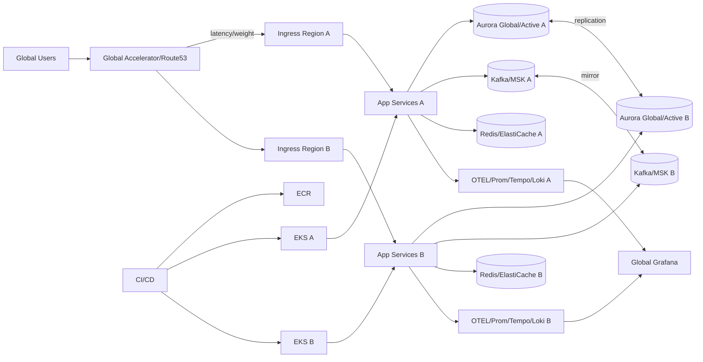

# Multi-Region Resilience Master Artifacts

## 1. Executive Summary
The multi-region resilience program establishes an application stack capable of surviving regional outages, network partitions, and data-plane failures while maintaining strict SLOs. The deliverable includes architecture blueprints, IaC, application prompts, CI/CD, observability, security, risk/risk governance, ADRs, and business outcomes. The focus is on active-active data planes with controlled failover, data consistency strategies, and operational readiness.

- **Outcomes:**
  - Active-active read/write with conflict resolution or active-passive with RPO ≤5 minutes depending on workload profile.
  - Automated failover runbooks, playbooks for network partitions, and data reconciliation procedures.
  - Dashboards and SLOs for latency, availability, replication lag, and error budgets across regions.
- **Success Criteria:** 99.95% availability, p95 latency ≤400 ms cross-region, replication lag <30s, recovery time objective (RTO) <15m, auditable change management, and zero critical security gaps.

## 2. README / Setup
### Prerequisites
- Terraform ≥1.7, Helm ≥3.13, kubectl ≥1.29, awscli, Go 1.22, Node 20, PostgreSQL client, Kafka CLI, GNU Make, Route53 and ACM permissions, and DNS ownership.

### Deployment Overview
1. Populate `infra/terraform.tfvars` with primary/secondary regions, CIDRs, DB sizes, and DNS domains.
2. `terraform init && terraform apply` provisions multi-region VPCs, EKS clusters, Global Accelerator/Route53, RDS global or Aurora global database, MSK/Kafka, S3 with CRR, and IAM roles.
3. Use `helmfile -e prod apply` to install services across regions with topology-aware routing and weights defined in `helm/values-<region>.yaml`.
4. Configure traffic policy (weighted or latency-based) in Route53; enable health checks for regional endpoints.
5. Run `make failover-drill` to simulate regional outage and validate RTO/RPO against dashboards.

### Local/Dev Path
- `make kind-multi` to spin two Kind clusters; use `tilt up` or `skaffold dev` for rapid iterations; `make e2e` runs cross-cluster tests with kubeconfig contexts.
- Seed data with `scripts/seed_multi.py`; configure conflict rules in `config/replication-rules.yaml`.

## 3. Architecture Diagrams
### Mermaid


### ASCII
```
Users -> Global Accelerator/Route53 -> {Region A Ingress -> Services/DB/Kafka/Redis/OTEL, Region B Ingress -> Services/DB/Kafka/Redis/OTEL}
DB replication <-> across regions, Kafka mirror topics, OTEL pipelines feed Global Grafana
CI/CD -> ECR -> EKS(A/B)
```

## 4. IaC Prompt
> "Terraform to provision dual-region architecture: VPCs in two regions, peering/Transit Gateway, EKS clusters with IRSA and managed node groups, Aurora Global Database or RDS cross-region read replicas, MSK with cluster linking, ElastiCache Redis with global datastore, S3 buckets with CRR and bucket policies, Route53 latency/weighted records, AWS Global Accelerator (optional), CloudWatch dashboards, KMS keys per region, IAM roles for CI OIDC, and WAF. Add health checks and failover routing. Outputs include kubeconfigs per region, database endpoints, Kafka bootstrap addresses, Redis endpoints, and Route53 records." Acceptance: `terraform validate` + checkov/tflint clean; plan shows zero drift; failover drill docs generated.

## 5. Backend Prompt
> "Develop a Go 1.22 service supporting multi-region awareness. Include health/readiness, feature flags for read-local vs read-global, idempotent APIs, and conflict resolution for writes (last-writer-wins or CRDT option). Use Postgres/Aurora global with partitioning, Kafka producers with idempotency, and Redis for session caching. Add OTEL instrumentation, rate limiting, and graceful degradation (read-only mode). Acceptance: `go test ./...`, `golangci-lint`, chaos tests for partition tolerance, and simulation showing RPO/RTO compliance." 

## 6. Frontend Prompt
> "Build a Next.js 14 + TypeScript app showing region health, latency, and failover status. Provide admin controls to trigger read-only mode, adjust traffic weights, and view replication lag. Use MUI + TanStack Query with websocket updates, and embed Grafana panels. Acceptance: `npm run test`, `npm run lint`, Lighthouse ≥90, and responsive design." 

## 7. Containerization Prompt
> "Create Dockerfiles for backend/frontend with multistage builds, non-root, distroless for Go, nginx-alpine for frontend. Include region metadata env vars. Provide docker-compose for local dual-region emulation with two app stacks, replicated Postgres, and Kafka mirror-maker. Sign images with cosign and publish SBOM." Acceptance: `docker compose up` local drill; cosign verify; SBOM stored.

## 8. CI/CD Prompt
> "GitHub Actions to run lint/test, SAST (Semgrep), dependency scans (Trivy/Snyk), secret scans (gitleaks), build/push images to ECR, Terraform plan/apply per region with approvals, Helmfile deploy to both clusters, Argo Rollouts canary per region, failover drill job, and chaos experiments for partition/loss. Use OIDC for AWS auth. Require checks before promotion; store run artifacts and disaster drill evidence." Acceptance: required checks enforced; regional deploys atomic; drill history archived.

## 9. Observability Prompt
> "Deploy per-region Prometheus, Tempo, Loki, and Alertmanager with federation to global Grafana. Collect replication lag, cross-region latency, error rates, and capacity. Configure blackbox probes from each region. Alerts: replication lag >30s, regional error rate >2%, GA health check fail, Kafka mirror lag >5k, Redis global datastore stale >20s, cert expiry <15d. Include runbook links and error budget policies." Acceptance: promtool tests; synthetic failover triggers alerts; dashboards show side-by-side region health.

## 10. Testing Suite
- **Unit:** Go services, TS components; coverage 85%.
- **Integration:** Dual-cluster tests verifying routing, failover, and replication; TestContainers for Postgres/Kafka; contract tests for APIs; cache consistency tests.
- **Performance:** k6 multi-region scripts simulating latency and loss; thresholds p95 <400 ms across regions, error rate <1%.
- **Resilience/Chaos:** Simulate region outage, network partition, DNS failover, and Kafka mirror break; verify RPO/RTO metrics and data reconciliation scripts.
- **Security:** ZAP baseline, Semgrep, Trivy, IAM policy tests, and WAF rule validation.
- **Data Validation:** Reconciliation jobs comparing row counts and checksums after failover and failback.
- **Acceptance:** CI green; failover drill passes monthly; replication lag within SLO; alert tests pass.

## 11. Operational Playbooks
- **On-call:** Dual-region rotation with region champions; escalation via PagerDuty with separate services per region; contact list in `operations/oncall.md`.
- **Runbook: Region outage**
  1. Confirm alert from GA/Route53 and dashboards; validate health checks failing.
  2. Trigger traffic shift to healthy region via Route53/GA weight update (or automated if enabled).
  3. Set affected region to read-only mode via feature flag; pause writes and Kafka producers.
  4. Monitor replication lag; if degraded, enable catch-up mode after region recovers.
  5. Initiate post-event reconciliation script to compare row counts/checksums; resolve conflicts.
  6. Communicate status every 15m in #multi-region-incident; create incident ticket.
- **Runbook: Replication lag spike**
  1. Inspect DB metrics; confirm no long-running transactions.
  2. Throttle traffic via rate limits; enable priority writes only.
  3. Scale writer nodes or increase IOPS; check network throughput between regions.
  4. After recovery, verify lag <30s and re-enable normal traffic weights.
- **Runbook: Kafka mirror lag**
  1. Check MirrorMaker/cluster linking metrics; restart connectors if stalled.
  2. Pause non-critical topics; increase bandwidth; verify ACLs.
  3. After catch-up, re-enable producers and confirm consumer lag cleared.
- **Data Migration/Failback:**
  - Use blue/green migrations with `liquibase` or `goose` executed region-by-region.
  - For failback, validate both regions in sync via checksums; gradually shift traffic back using weighted routing.
- **Change Management:** Freeze during peak seasons; CAB approvals for cross-region changes; record drills in `operations/drill-log.md` with timestamps and outcomes.
- **Backups/Recovery:** Automated snapshots per region; cross-region copy; quarterly restore tests; document RTO/RPO evidence.

## 12. Reporting Templates
- **Weekly Ops:** availability per region, latency percentiles, replication lag, incidents summary, changes shipped, failover drills performed, capacity headroom.
- **Monthly Executive:** SLA adherence, cost by region, DR drill outcomes, risk posture, roadmap milestones, and business impact of resilience improvements.
- **Postmortem:** timeline, detection, blast radius, customer impact, root cause, corrective/preventive actions with owners and dates, verification steps.
- **OKR/ROI Template:** objective (e.g., achieve 99.95% multi-region availability), key results (drills, lag reductions, cost targets), investment vs avoided downtime cost.

## 13. Metrics & Observability
- **SLIs/SLOs:** availability 99.95%, cross-region p95 latency ≤400 ms, replication lag <30s, error rate <1%, successful failover drills ≥1/month, RTO <15m, RPO <5m.
- **Dashboards:** per-region golden signals, replication/mirror lag, GA/Route53 health, canary analysis, DORA metrics by region, cost dashboards with cross-region spend.
- **Alerting:** PagerDuty for P1/P2; Slack for P3; alerts annotated with runbooks; maintenance windows; error budget policy triggers deploy freeze.
- **Logging/Tracing:** OTEL with region tag; logs include region + request ID; traces spanning regions with baggage to identify routing decisions.

## 14. Security & Threat Model
- **STRIDE:**
  - Spoofing: mTLS between regions, OIDC for admin; signed requests for replication agents.
  - Tampering: encrypted links (TLS), signed images/artifacts, immutable buckets, WORM logs.
  - Repudiation: audit trails in CloudTrail and app logs; time-synced clocks; signed commits.
  - Information Disclosure: encryption in transit/at rest, token scoping, PII minimization, and masking.
  - DoS: WAF with geo rules, rate limits per region, autoscaling, and regional isolation to prevent cascading failure.
  - Elevation: least-privilege IAM, network policies, Kyverno/OPA to block privileged pods, and just-in-time access.
- **ATT&CK:** T1190 (exploited APIs) mitigated by WAF + validation; T1078 (valid accounts) via MFA/SSO; T1499 (resource hijack) via quotas; T1552 (credential theft) via KMS + secret scanning; T1587 (supply chain) via signed artifacts and SBOM; T1609 (container breakout) mitigated via seccomp/AppArmor/PSP-like controls.
- **Controls:** Semgrep/Trivy/gitleaks, KMS per region, network segmentation, GuardDuty/Inspector, cosign signatures, SBOM checks, runtime monitoring (Falco), cross-region access logs, and periodic pen-tests including failover paths.
- **Threat Scenarios:** Rogue region takeover, replication poison pill, stale DNS cache, split-brain writes, credentials stolen from CI; each mapped to detection (alerts, logs) and response (traffic shift, revoke tokens, reconcile data).

## 15. Risk Register (≥10)
1. Split-brain writes – Mitigation: conflict resolution policies + read-only mode during partition; Owner: Platform; Impact: High; Likelihood: Medium.
2. Replication lag breaches – Mitigation: alerts, traffic shaping, write throttling; Owner: DBA; Impact: High; Likelihood: Medium.
3. Global service misrouting – Mitigation: staged DNS/GA changes with canary; Owner: Network; Impact: High; Likelihood: Low.
4. Kafka mirror failure – Mitigation: cluster linking HA, alerting, retry; Owner: SRE; Impact: Medium; Likelihood: Medium.
5. Secrets exposure – Mitigation: OIDC, KMS, secret scanning; Owner: Security; Impact: High; Likelihood: Low.
6. Cost spikes from duplicate regions – Mitigation: scheduled scaling, rightsizing, spot where safe; Owner: FinOps; Impact: Medium; Likelihood: Medium.
7. Drift between regions – Mitigation: GitOps/Helmfile sync, periodic drift detection; Owner: Platform; Impact: Medium; Likelihood: Medium.
8. Failover automation bug – Mitigation: manual override path, rehearsals; Owner: SRE; Impact: High; Likelihood: Low.
9. Observability blind spots – Mitigation: federation checks, alert tests; Owner: SRE; Impact: Medium; Likelihood: Medium.
10. Compliance gaps – Mitigation: audit trails, policy-as-code, periodic review; Owner: Security; Impact: Medium; Likelihood: Low.
11. Data residency conflicts – Mitigation: tagging data, residency-aware routing, legal review; Owner: Compliance; Impact: High; Likelihood: Low.
12. Human error during drills – Mitigation: checklists, two-person rule, dry runs; Owner: SRE; Impact: Medium; Likelihood: Medium.

## 16. ADRs
- **ADR-001:** Adopt active-active (where supported) with Aurora Global + Kafka linking to minimize RPO and support local reads.
- **ADR-002:** Use Route53 latency/weighted routing plus Global Accelerator for balanced traffic and failover flexibility.
- **ADR-003:** Standardize on OTEL + regional stacks with federation to provide region-tagged telemetry and global views.
- **ADR-004:** Argo Rollouts per region to permit independent canaries and reduce correlated failures.
- **ADR-005:** Prefer infrastructure-as-code with Terraform + Helmfile to keep regions consistent and auditable.

## 17. Business Value
- **Availability:** Protects revenue and user experience during regional outages; minimizes downtime cost.
- **Compliance & Trust:** Provides auditable disaster recovery and data residency controls, improving regulatory posture.
- **Performance:** Latency-based routing brings users to nearest healthy region; reduces churn due to slow responses.
- **Operational Confidence:** Regular drills and clear runbooks lower MTTR and reduce risk of human error during crises.
- **Scalability:** Establishes repeatable multi-region pattern that future services can reuse, reducing time-to-market for resilient offerings.
