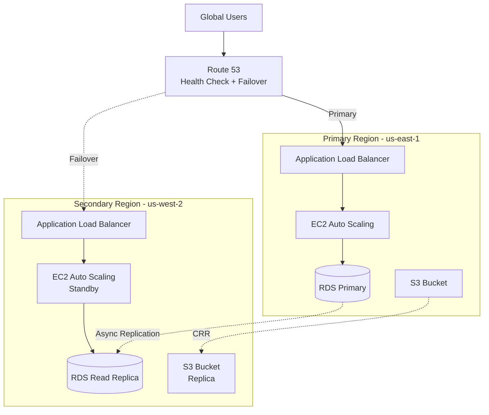

# P10 — Multi-Region Architecture

## Documentation
For cross-project documentation, standards, and runbooks, see the [Portfolio Documentation Hub](../../DOCUMENTATION_INDEX.md).


## Overview
Active-passive multi-region AWS architecture with Route 53 DNS failover, cross-region RDS read replicas, and automated disaster recovery. Demonstrates global infrastructure design, high availability, and business continuity planning.

## Key Outcomes
- [x] Active-passive multi-region deployment (us-east-1, us-west-2)
- [x] Route 53 health checks and failover policies
- [x] Cross-region RDS read replicas with promotion capability
- [x] S3 cross-region replication for static assets
- [x] CloudFormation stack sets for multi-region deployment
- [x] Automated failover testing scripts

## Architecture



## Quickstart

```bash
make setup
make deploy-primary
make deploy-secondary
make test-failover
```

## Configuration

| Env Var | Purpose | Example | Required |
|---------|---------|---------|----------|
| `PRIMARY_REGION` | Primary AWS region | `us-east-1` | Yes |
| `SECONDARY_REGION` | Secondary AWS region | `us-west-2` | Yes |
| `DOMAIN_NAME` | Route 53 domain | `example.com` | Yes |
| `RTO_MINUTES` | Recovery Time Objective | `15` | No |
| `RPO_MINUTES` | Recovery Point Objective | `5` | No |

## Testing

```bash
# Deploy to both regions
make deploy-all

# Test failover mechanism
make test-failover

# Validate Route 53 health checks
make check-health

# Simulate primary region failure
make simulate-outage
```

## Operations

### Logs, Metrics, Traces
- **CloudWatch Logs**: Centralized logging from both regions
- **Route 53 Health Checks**: Monitor endpoint availability
- **RDS Metrics**: Replication lag, IOPS, connections
- **Cross-Region Metrics**: Data transfer, sync status

### Common Issues & Fixes

**Issue**: High replication lag between regions
**Fix**: Increase RDS instance size, check network connectivity, reduce write load.

**Issue**: Route 53 failover not triggering
**Fix**: Verify health check configuration, ensure endpoints return correct HTTP status codes.

## Security

- Encrypted data in transit (TLS 1.2+)
- Encrypted data at rest (KMS with separate keys per region)
- IAM roles with least privilege
- VPC peering for cross-region communication

## Roadmap

- [ ] Add active-active configuration with DynamoDB Global Tables
- [ ] Implement automated failback procedures
- [ ] Add cross-region Lambda@Edge for edge caching
- [ ] Integrate AWS Backup for centralized backup management

## References

- [AWS Multi-Region Architecture](https://docs.aws.amazon.com/whitepapers/latest/real-time-communication-on-aws/multi-region-deployment.html)
- [Route 53 Health Checks](https://docs.aws.amazon.com/Route53/latest/DeveloperGuide/dns-failover.html)
- [RDS Read Replicas](https://docs.aws.amazon.com/AmazonRDS/latest/UserGuide/USER_ReadRepl.html)


## Code Generation Prompts

This section contains AI-assisted code generation prompts that can help you recreate or extend project components. These prompts are designed to work with AI coding assistants like Claude, GPT-4, or GitHub Copilot.

### Infrastructure as Code

#### 1. Terraform Module
```
Create a Terraform module for deploying a highly available VPC with public/private subnets across 3 availability zones, including NAT gateways and route tables
```

#### 2. CloudFormation Template
```
Generate a CloudFormation template for an Auto Scaling Group with EC2 instances behind an Application Load Balancer, including health checks and scaling policies
```

#### 3. Monitoring Integration
```
Write Terraform code to set up CloudWatch alarms for EC2 CPU utilization, RDS connections, and ALB target health with SNS notifications
```

### How to Use These Prompts

1. **Copy the prompt** from the code block above
2. **Customize placeholders** (replace [bracketed items] with your specific requirements)
3. **Provide context** to your AI assistant about:
   - Your development environment and tech stack
   - Existing code patterns and conventions in this project
   - Any constraints or requirements specific to your use case
4. **Review and adapt** the generated code before using it
5. **Test thoroughly** and adjust as needed for your specific scenario

### Best Practices

- Always review AI-generated code for security vulnerabilities
- Ensure generated code follows your project's coding standards
- Add appropriate error handling and logging
- Write tests for AI-generated components
- Document any assumptions or limitations
- Keep sensitive information (credentials, keys) in environment variables

## Evidence & Verification

Verification summary: Evidence artifacts captured on 2025-11-14 to validate the quickstart configuration and document audit-ready supporting files.

**Evidence artifacts**
- [Screenshot](./docs/evidence/screenshot.svg)
- [Run log](./docs/evidence/run-log.txt)
- [Dashboard export](./docs/evidence/dashboard-export.json)
- [Load test summary](./docs/evidence/load-test-summary.txt)

### Evidence Checklist

| Evidence Item | Location | Status |
| --- | --- | --- |
| Screenshot captured | `docs/evidence/screenshot.svg` | ✅ |
| Run log captured | `docs/evidence/run-log.txt` | ✅ |
| Dashboard export captured | `docs/evidence/dashboard-export.json` | ✅ |
| Load test summary captured | `docs/evidence/load-test-summary.txt` | ✅ |
