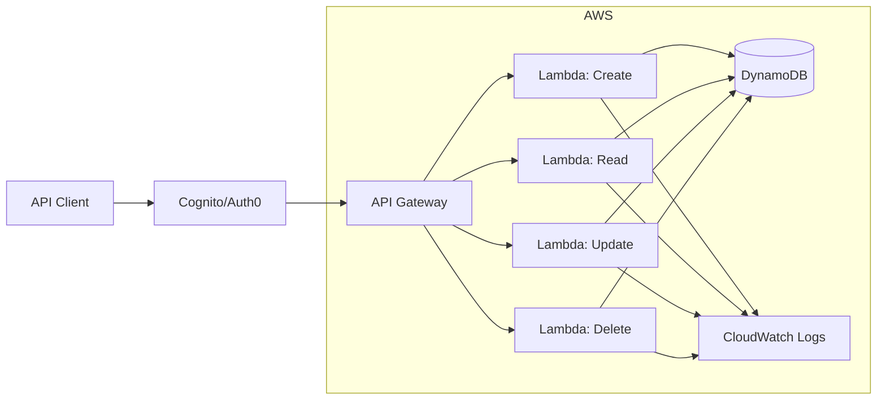

# P11 — API Gateway & Serverless Integration

## Documentation
For cross-project documentation, standards, and runbooks, see the [Portfolio Documentation Hub](../../DOCUMENTATION_INDEX.md).


## Overview
Serverless API using AWS SAM, Lambda functions, API Gateway with authentication, and DynamoDB. Demonstrates event-driven architecture, serverless patterns, and production-grade API design.

## Key Outcomes
- [x] AWS SAM template for Infrastructure as Code
- [x] Lambda functions with Python runtime
- [x] API Gateway REST API with CORS
- [x] JWT/API Key authentication integration
- [x] DynamoDB for data persistence
- [x] CloudWatch Logs and X-Ray tracing

## Architecture



## Quickstart

```bash
make setup
make build
make deploy-dev
```

## Configuration

| Env Var | Purpose | Example | Required |
|---------|---------|---------|----------|
| `AWS_REGION` | AWS region | `us-east-1` | Yes |
| `STACK_NAME` | SAM stack name | `serverless-api` | Yes |
| `STAGE` | API stage | `dev`, `prod` | Yes |
| `TABLE_NAME` | DynamoDB table | `items-table` | No |

## Testing

```bash
make test
make invoke-local
make test-api
```

## References

- [AWS SAM Documentation](https://docs.aws.amazon.com/serverless-application-model/)
- [API Gateway Best Practices](https://docs.aws.amazon.com/apigateway/latest/developerguide/best-practices.html)


## Code Generation Prompts

This section contains AI-assisted code generation prompts that can help you recreate or extend project components. These prompts are designed to work with AI coding assistants like Claude, GPT-4, or GitHub Copilot.

### Data Pipelines

#### 1. ETL Pipeline
```
Create a Python-based ETL pipeline using Apache Airflow that extracts data from PostgreSQL, transforms it with pandas, and loads it into a data warehouse with incremental updates
```

#### 2. Stream Processing
```
Generate a Kafka consumer in Python that processes real-time events, performs aggregations using sliding windows, and stores results in Redis with TTL
```

#### 3. Data Quality
```
Write a data validation framework that checks for schema compliance, null values, data freshness, and statistical anomalies, with alerting on failures
```

### How to Use These Prompts

1. **Copy the prompt** from the code block above
2. **Customize placeholders** (replace [bracketed items] with your specific requirements)
3. **Provide context** to your AI assistant about:
   - Your development environment and tech stack
   - Existing code patterns and conventions in this project
   - Any constraints or requirements specific to your use case
4. **Review and adapt** the generated code before using it
5. **Test thoroughly** and adjust as needed for your specific scenario

### Best Practices

- Always review AI-generated code for security vulnerabilities
- Ensure generated code follows your project's coding standards
- Add appropriate error handling and logging
- Write tests for AI-generated components
- Document any assumptions or limitations
- Keep sensitive information (credentials, keys) in environment variables

## Evidence & Verification

Verification summary: Evidence artifacts captured on 2025-11-14 to validate the quickstart configuration and document audit-ready supporting files.

**Evidence artifacts**
- [Screenshot](./docs/evidence/screenshot.svg)
- [Run log](./docs/evidence/run-log.txt)
- [Dashboard export](./docs/evidence/dashboard-export.json)
- [Load test summary](./docs/evidence/load-test-summary.txt)

### Evidence Checklist

| Evidence Item | Location | Status |
| --- | --- | --- |
| Screenshot captured | `docs/evidence/screenshot.svg` | ✅ |
| Run log captured | `docs/evidence/run-log.txt` | ✅ |
| Dashboard export captured | `docs/evidence/dashboard-export.json` | ✅ |
| Load test summary captured | `docs/evidence/load-test-summary.txt` | ✅ |
