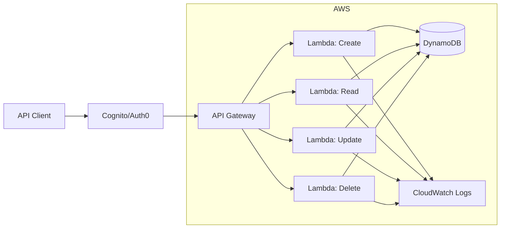

# P11 — API Gateway & Serverless Integration

## Overview
Serverless API using AWS SAM, Lambda functions, API Gateway with authentication, and DynamoDB. Demonstrates event-driven architecture, serverless patterns, and production-grade API design.

## Key Outcomes
- [x] AWS SAM template for Infrastructure as Code
- [x] Lambda functions with Python runtime
- [x] API Gateway REST API with CORS
- [x] JWT/API Key authentication integration
- [x] DynamoDB for data persistence
- [x] CloudWatch Logs and X-Ray tracing

## Architecture



## Quickstart

```bash
make setup
make build
make deploy-dev
```

## Configuration

| Env Var | Purpose | Example | Required |
|---------|---------|---------|----------|
| `AWS_REGION` | AWS region | `us-east-1` | Yes |
| `STACK_NAME` | SAM stack name | `serverless-api` | Yes |
| `STAGE` | API stage | `dev`, `prod` | Yes |
| `TABLE_NAME` | DynamoDB table | `items-table` | No |

## Testing

```bash
make test
make invoke-local
make test-api
```

## References

- [AWS SAM Documentation](https://docs.aws.amazon.com/serverless-application-model/)
- [API Gateway Best Practices](https://docs.aws.amazon.com/apigateway/latest/developerguide/best-practices.html)
