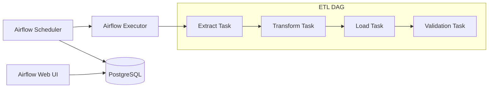

# P12 — Data Pipeline (Airflow DAGs)

## Overview
Apache Airflow data pipeline with DAGs for ETL workflows, task dependencies, and scheduling. Demonstrates workflow orchestration, data engineering, and production pipeline practices.

## Key Outcomes
- [x] Apache Airflow with Docker Compose
- [x] Multiple DAG examples (ETL, data quality, reporting)
- [x] Task dependencies and scheduling
- [x] Error handling and retry logic
- [x] Monitoring and alerting
- [x] Integration tests for DAGs

## Architecture



## Quickstart

```bash
make setup
make run
# Visit http://localhost:8080 (admin/admin)
```

## Configuration

| Env Var | Purpose | Example | Required |
|---------|---------|---------|----------|
| `AIRFLOW__CORE__SQL_ALCHEMY_CONN` | Database connection | `postgresql+psycopg2://...` | Yes |
| `AIRFLOW__CORE__EXECUTOR` | Executor type | `LocalExecutor` | No |

## Testing

```bash
make test
make test-dags
```

## References

- [Apache Airflow Documentation](https://airflow.apache.org/docs/)
- [DAG Best Practices](https://airflow.apache.org/docs/apache-airflow/stable/best-practices.html)
