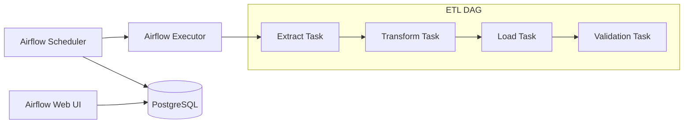

# P12 — Data Pipeline (Airflow DAGs)

## Overview
Apache Airflow data pipeline with DAGs for ETL workflows, task dependencies, and scheduling. Demonstrates workflow orchestration, data engineering, and production pipeline practices.

## Key Outcomes
- [x] Apache Airflow with Docker Compose
- [x] Multiple DAG examples (ETL, data quality, reporting)
- [x] Task dependencies and scheduling
- [x] Error handling and retry logic
- [x] Monitoring and alerting
- [x] Integration tests for DAGs

## Architecture



## Quickstart

```bash
make setup
make run
# Visit http://localhost:8080 (admin/admin)
```

## Configuration

| Env Var | Purpose | Example | Required |
|---------|---------|---------|----------|
| `AIRFLOW__CORE__SQL_ALCHEMY_CONN` | Database connection | `postgresql+psycopg2://...` | Yes |
| `AIRFLOW__CORE__EXECUTOR` | Executor type | `LocalExecutor` | No |

## Testing

```bash
make test
make test-dags
```

## References

- [Apache Airflow Documentation](https://airflow.apache.org/docs/)
- [DAG Best Practices](https://airflow.apache.org/docs/apache-airflow/stable/best-practices.html)


## Code Generation Prompts

This section contains AI-assisted code generation prompts that can help you recreate or extend project components. These prompts are designed to work with AI coding assistants like Claude, GPT-4, or GitHub Copilot.

### Data Pipelines

#### 1. ETL Pipeline
```
Create a Python-based ETL pipeline using Apache Airflow that extracts data from PostgreSQL, transforms it with pandas, and loads it into a data warehouse with incremental updates
```

#### 2. Stream Processing
```
Generate a Kafka consumer in Python that processes real-time events, performs aggregations using sliding windows, and stores results in Redis with TTL
```

#### 3. Data Quality
```
Write a data validation framework that checks for schema compliance, null values, data freshness, and statistical anomalies, with alerting on failures
```

### How to Use These Prompts

1. **Copy the prompt** from the code block above
2. **Customize placeholders** (replace [bracketed items] with your specific requirements)
3. **Provide context** to your AI assistant about:
   - Your development environment and tech stack
   - Existing code patterns and conventions in this project
   - Any constraints or requirements specific to your use case
4. **Review and adapt** the generated code before using it
5. **Test thoroughly** and adjust as needed for your specific scenario

### Best Practices

- Always review AI-generated code for security vulnerabilities
- Ensure generated code follows your project's coding standards
- Add appropriate error handling and logging
- Write tests for AI-generated components
- Document any assumptions or limitations
- Keep sensitive information (credentials, keys) in environment variables

## Evidence & Verification

Verification summary: Baseline evidence captured to validate the latest quickstart configuration and document supporting artifacts for audits.

**Evidence artifacts**
- [Screenshot](./docs/evidence/screenshot.svg)
- [Run log](./docs/evidence/run-log.txt)
- [Dashboard export](./docs/evidence/dashboard-export.json)
- [Load test summary](./docs/evidence/load-test-summary.txt)

### Evidence Checklist

| Evidence Item | Location | Status |
| --- | --- | --- |
| Screenshot captured | `docs/evidence/screenshot.svg` | ✅ |
| Run log captured | `docs/evidence/run-log.txt` | ✅ |
| Dashboard export captured | `docs/evidence/dashboard-export.json` | ✅ |
| Load test summary captured | `docs/evidence/load-test-summary.txt` | ✅ |
