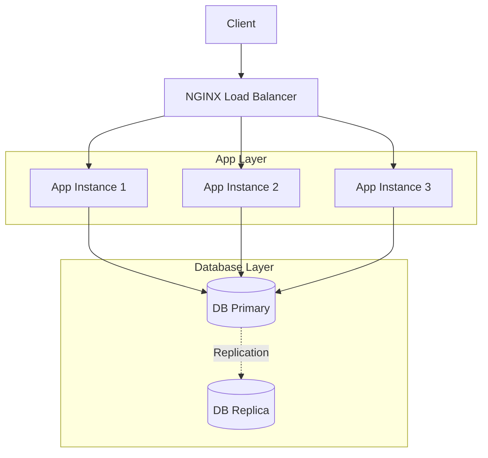

# P13 — High-Availability Web App

## Overview
High-availability web application with NGINX load balancer, multiple app instances, database replication, and comprehensive health checks. Demonstrates HA architecture, load balancing, and zero-downtime deployment.

## Key Outcomes
- [x] NGINX load balancer with upstream health checks
- [x] Multiple application instances with Docker Compose
- [x] Database replication (primary-replica)
- [x] Health check endpoints
- [x] Rolling deployment support
- [x] Monitoring and metrics

## Architecture



## Quickstart

```bash
make setup
make run
# Visit http://localhost
```

## Configuration

| Env Var | Purpose | Example | Required |
|---------|---------|---------|----------|
| `APP_REPLICAS` | Number of app instances | `3` | No (default: 3) |
| `DB_PRIMARY_HOST` | Primary DB host | `db-primary` | Yes |
| `HEALTH_CHECK_INTERVAL` | Health check interval | `10s` | No |

## Testing

```bash
make test
make test-ha
```

## References

- [NGINX Load Balancing](https://docs.nginx.com/nginx/admin-guide/load-balancer/http-load-balancer/)
- [High Availability Best Practices](https://aws.amazon.com/architecture/well-architected/)
