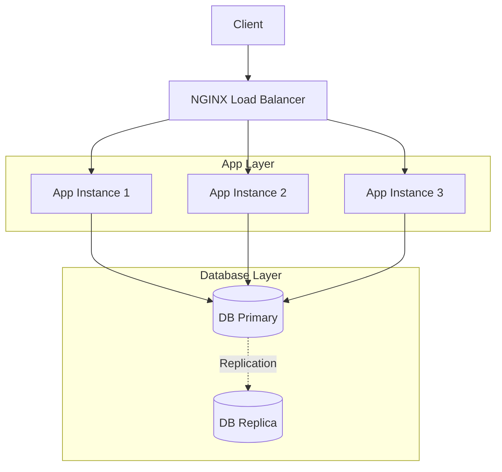

# P13 — High-Availability Web App

## Overview
High-availability web application with NGINX load balancer, multiple app instances, database replication, and comprehensive health checks. Demonstrates HA architecture, load balancing, and zero-downtime deployment.

## Key Outcomes
- [x] NGINX load balancer with upstream health checks
- [x] Multiple application instances with Docker Compose
- [x] Database replication (primary-replica)
- [x] Health check endpoints
- [x] Rolling deployment support
- [x] Monitoring and metrics

## Architecture



## Quickstart

```bash
make setup
make run
# Visit http://localhost
```

## Configuration

| Env Var | Purpose | Example | Required |
|---------|---------|---------|----------|
| `APP_REPLICAS` | Number of app instances | `3` | No (default: 3) |
| `DB_PRIMARY_HOST` | Primary DB host | `db-primary` | Yes |
| `HEALTH_CHECK_INTERVAL` | Health check interval | `10s` | No |

## Testing

```bash
make test
make test-ha
```

## References

- [NGINX Load Balancing](https://docs.nginx.com/nginx/admin-guide/load-balancer/http-load-balancer/)
- [High Availability Best Practices](https://aws.amazon.com/architecture/well-architected/)


## Code Generation Prompts

This section contains AI-assisted code generation prompts that can help you recreate or extend project components. These prompts are designed to work with AI coding assistants like Claude, GPT-4, or GitHub Copilot.

### Code Components

#### 1. Core Functionality
```
Create the main application logic for [specific feature], including error handling, logging, and configuration management
```

#### 2. API Integration
```
Generate code to integrate with [external service] API, including authentication, rate limiting, and retry logic
```

#### 3. Testing
```
Write comprehensive tests for [component], covering normal operations, edge cases, and error scenarios
```

### How to Use These Prompts

1. **Copy the prompt** from the code block above
2. **Customize placeholders** (replace [bracketed items] with your specific requirements)
3. **Provide context** to your AI assistant about:
   - Your development environment and tech stack
   - Existing code patterns and conventions in this project
   - Any constraints or requirements specific to your use case
4. **Review and adapt** the generated code before using it
5. **Test thoroughly** and adjust as needed for your specific scenario

### Best Practices

- Always review AI-generated code for security vulnerabilities
- Ensure generated code follows your project's coding standards
- Add appropriate error handling and logging
- Write tests for AI-generated components
- Document any assumptions or limitations
- Keep sensitive information (credentials, keys) in environment variables

