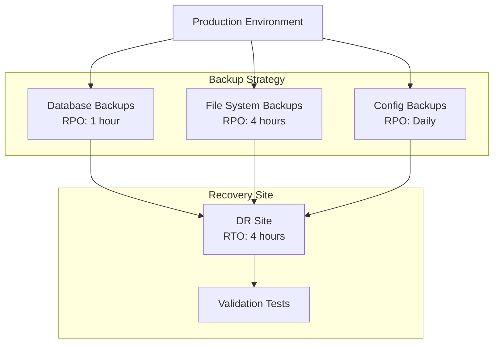

# P14 — Disaster Recovery (DR) Design

## Overview
Comprehensive disaster recovery plan with backup/restore automation, RPO/RTO documentation, failover procedures, and DR testing framework. Demonstrates business continuity planning and operational resilience.

## Key Outcomes
- [x] RPO/RTO analysis and documentation
- [x] Automated backup scripts (databases, files, configurations)
- [x] Restore procedures with validation
- [x] DR drill automation
- [x] Runbook for disaster scenarios
- [x] Recovery testing framework

## Architecture



## Quickstart

```bash
make setup
make backup-all
make test-restore
```

## Configuration

| Env Var | Purpose | Example | Required |
|---------|---------|---------|----------|
| `BACKUP_BUCKET` | S3 backup bucket | `s3://backups` | Yes |
| `RPO_HOURS` | Recovery Point Objective | `1` | Yes |
| `RTO_HOURS` | Recovery Time Objective | `4` | Yes |
| `DR_REGION` | DR region | `us-west-2` | Yes |

## Testing

```bash
make test
make dr-drill
```

## References

- [AWS Disaster Recovery](https://docs.aws.amazon.com/whitepapers/latest/disaster-recovery-workloads-on-aws/disaster-recovery-options-in-the-cloud.html)
- [DR Best Practices](https://aws.amazon.com/architecture/reliability/)
