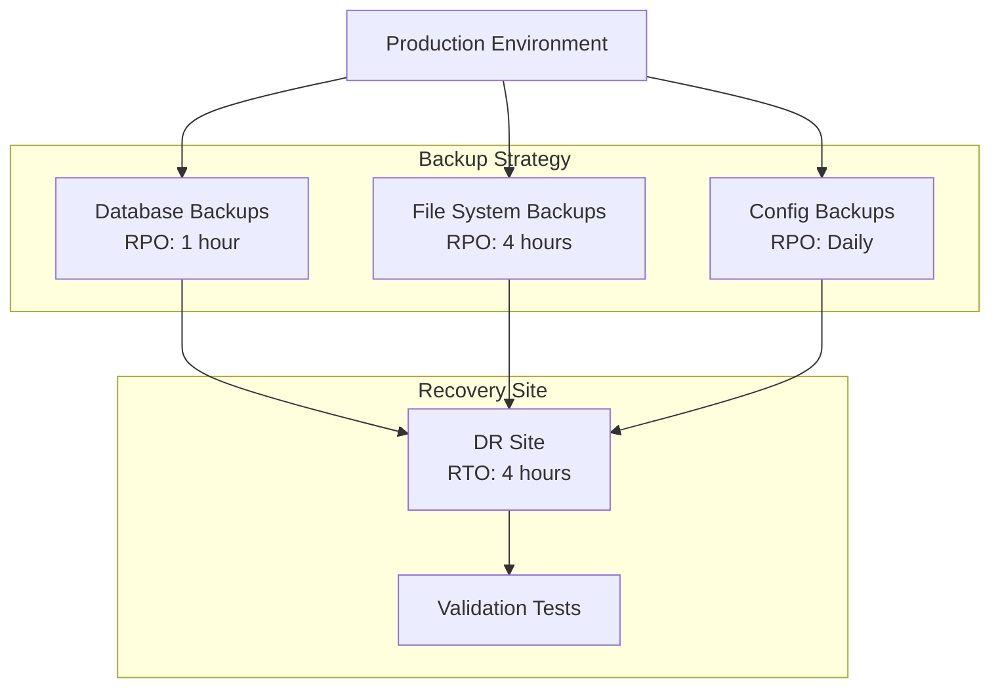

# P14 — Disaster Recovery (DR) Design

## Overview
Comprehensive disaster recovery plan with backup/restore automation, RPO/RTO documentation, failover procedures, and DR testing framework. Demonstrates business continuity planning and operational resilience.

## Key Outcomes
- [x] RPO/RTO analysis and documentation
- [x] Automated backup scripts (databases, files, configurations)
- [x] Restore procedures with validation
- [x] DR drill automation
- [x] Runbook for disaster scenarios
- [x] Recovery testing framework

## Architecture



## Quickstart

```bash
make setup
make backup-all
make test-restore
```

## Configuration

| Env Var | Purpose | Example | Required |
|---------|---------|---------|----------|
| `BACKUP_BUCKET` | S3 backup bucket | `s3://backups` | Yes |
| `RPO_HOURS` | Recovery Point Objective | `1` | Yes |
| `RTO_HOURS` | Recovery Time Objective | `4` | Yes |
| `DR_REGION` | DR region | `us-west-2` | Yes |

## Testing

```bash
make test
make dr-drill
```

## References

- [AWS Disaster Recovery](https://docs.aws.amazon.com/whitepapers/latest/disaster-recovery-workloads-on-aws/disaster-recovery-options-in-the-cloud.html)
- [DR Best Practices](https://aws.amazon.com/architecture/reliability/)


## Code Generation Prompts

This section contains AI-assisted code generation prompts that can help you recreate or extend project components. These prompts are designed to work with AI coding assistants like Claude, GPT-4, or GitHub Copilot.

### Infrastructure as Code

#### 1. Terraform Module
```
Create a Terraform module for deploying a highly available VPC with public/private subnets across 3 availability zones, including NAT gateways and route tables
```

#### 2. CloudFormation Template
```
Generate a CloudFormation template for an Auto Scaling Group with EC2 instances behind an Application Load Balancer, including health checks and scaling policies
```

#### 3. Monitoring Integration
```
Write Terraform code to set up CloudWatch alarms for EC2 CPU utilization, RDS connections, and ALB target health with SNS notifications
```

### How to Use These Prompts

1. **Copy the prompt** from the code block above
2. **Customize placeholders** (replace [bracketed items] with your specific requirements)
3. **Provide context** to your AI assistant about:
   - Your development environment and tech stack
   - Existing code patterns and conventions in this project
   - Any constraints or requirements specific to your use case
4. **Review and adapt** the generated code before using it
5. **Test thoroughly** and adjust as needed for your specific scenario

### Best Practices

- Always review AI-generated code for security vulnerabilities
- Ensure generated code follows your project's coding standards
- Add appropriate error handling and logging
- Write tests for AI-generated components
- Document any assumptions or limitations
- Keep sensitive information (credentials, keys) in environment variables

## Evidence & Verification

Verification summary: Baseline evidence captured to validate the latest quickstart configuration and document supporting artifacts for audits.

**Evidence artifacts**
- [Screenshot](./docs/evidence/screenshot.svg)
- [Run log](./docs/evidence/run-log.txt)
- [Dashboard export](./docs/evidence/dashboard-export.json)
- [Load test summary](./docs/evidence/load-test-summary.txt)

### Evidence Checklist

| Evidence Item | Location | Status |
| --- | --- | --- |
| Screenshot captured | `docs/evidence/screenshot.svg` | ✅ |
| Run log captured | `docs/evidence/run-log.txt` | ✅ |
| Dashboard export captured | `docs/evidence/dashboard-export.json` | ✅ |
| Load test summary captured | `docs/evidence/load-test-summary.txt` | ✅ |
