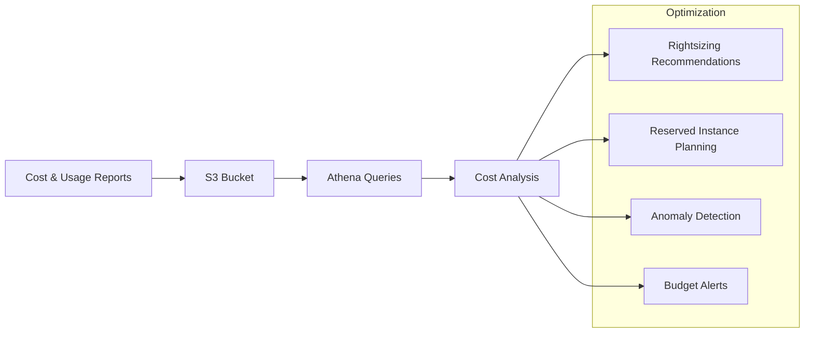

# P15 — Cloud Cost Optimization Lab

## Overview
AWS cost optimization framework with Cost and Usage Reports (CUR) analysis, rightsizing recommendations, reserved instance planning, and cost anomaly detection. Demonstrates FinOps practices and cloud cost management.

## Key Outcomes
- [x] CUR query examples (Athena SQL)
- [x] Rightsizing analysis scripts
- [x] Reserved Instance/Savings Plan recommendations
- [x] Cost anomaly detection
- [x] Budget alerts configuration
- [x] Cost optimization dashboard

## Architecture



## Quickstart

```bash
make setup
make analyze-costs
make generate-report
```

## Configuration

| Env Var | Purpose | Example | Required |
|---------|---------|---------|----------|
| `CUR_BUCKET` | CUR S3 bucket | `s3://cur-reports` | Yes |
| `ATHENA_DATABASE` | Athena database | `cur_database` | Yes |
| `COST_THRESHOLD` | Alert threshold | `1000` | No |

## Testing

```bash
make test
make run-queries
```

## References

- [AWS Cost Optimization](https://aws.amazon.com/aws-cost-management/aws-cost-optimization/)
- [CUR User Guide](https://docs.aws.amazon.com/cur/latest/userguide/what-is-cur.html)
