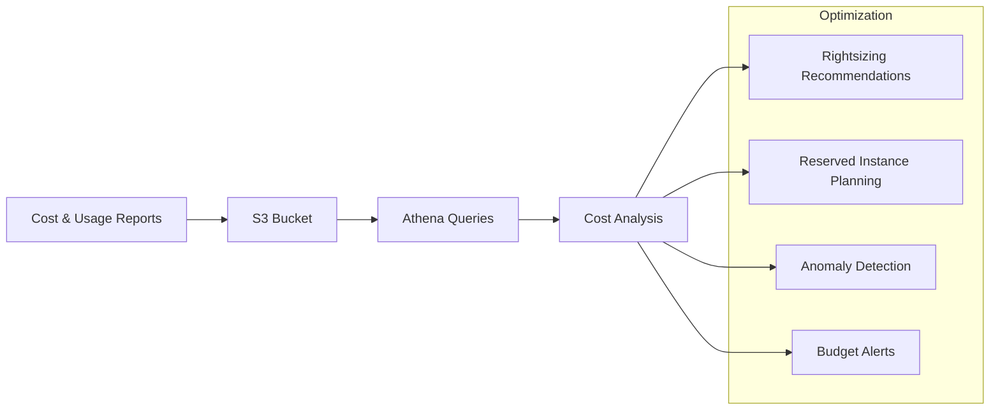

# P15 — Cloud Cost Optimization Lab

## Overview
AWS cost optimization framework with Cost and Usage Reports (CUR) analysis, rightsizing recommendations, reserved instance planning, and cost anomaly detection. Demonstrates FinOps practices and cloud cost management.

## Key Outcomes
- [x] CUR query examples (Athena SQL)
- [x] Rightsizing analysis scripts
- [x] Reserved Instance/Savings Plan recommendations
- [x] Cost anomaly detection
- [x] Budget alerts configuration
- [x] Cost optimization dashboard

## Architecture



## Quickstart

```bash
make setup
make analyze-costs
make generate-report
```

## Configuration

| Env Var | Purpose | Example | Required |
|---------|---------|---------|----------|
| `CUR_BUCKET` | CUR S3 bucket | `s3://cur-reports` | Yes |
| `ATHENA_DATABASE` | Athena database | `cur_database` | Yes |
| `COST_THRESHOLD` | Alert threshold | `1000` | No |

## Testing

```bash
make test
make run-queries
```

## References

- [AWS Cost Optimization](https://aws.amazon.com/aws-cost-management/aws-cost-optimization/)
- [CUR User Guide](https://docs.aws.amazon.com/cur/latest/userguide/what-is-cur.html)


## Code Generation Prompts

This section contains AI-assisted code generation prompts that can help you recreate or extend project components. These prompts are designed to work with AI coding assistants like Claude, GPT-4, or GitHub Copilot.

### Infrastructure as Code

#### 1. Terraform Module
```
Create a Terraform module for deploying a highly available VPC with public/private subnets across 3 availability zones, including NAT gateways and route tables
```

#### 2. CloudFormation Template
```
Generate a CloudFormation template for an Auto Scaling Group with EC2 instances behind an Application Load Balancer, including health checks and scaling policies
```

#### 3. Monitoring Integration
```
Write Terraform code to set up CloudWatch alarms for EC2 CPU utilization, RDS connections, and ALB target health with SNS notifications
```

### How to Use These Prompts

1. **Copy the prompt** from the code block above
2. **Customize placeholders** (replace [bracketed items] with your specific requirements)
3. **Provide context** to your AI assistant about:
   - Your development environment and tech stack
   - Existing code patterns and conventions in this project
   - Any constraints or requirements specific to your use case
4. **Review and adapt** the generated code before using it
5. **Test thoroughly** and adjust as needed for your specific scenario

### Best Practices

- Always review AI-generated code for security vulnerabilities
- Ensure generated code follows your project's coding standards
- Add appropriate error handling and logging
- Write tests for AI-generated components
- Document any assumptions or limitations
- Keep sensitive information (credentials, keys) in environment variables

