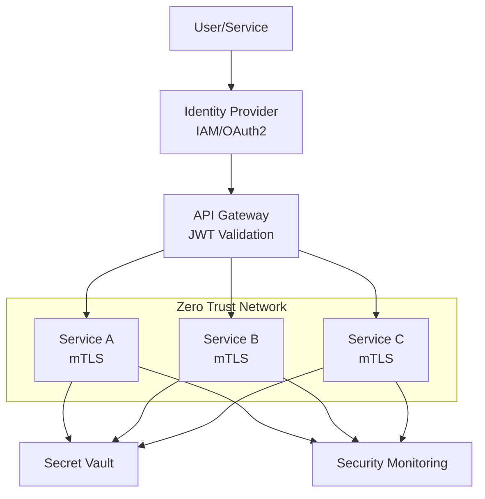

# P16 — Zero-Trust Cloud Architecture

## Overview
Zero-trust security architecture with mTLS, JWT policies, network segmentation, and comprehensive threat modeling. Demonstrates modern security practices, identity-based access, and defense-in-depth strategies.

## Key Outcomes
- [x] Zero-trust architecture design
- [x] mTLS certificate management
- [x] JWT authentication and authorization policies
- [x] Network micro-segmentation
- [x] Threat model documentation
- [x] Security policy templates

## Architecture



## Quickstart

```bash
make setup
make generate-certs
make deploy-policies
```

## Configuration

| Env Var | Purpose | Example | Required |
|---------|---------|---------|----------|
| `CA_CERT_PATH` | CA certificate | `/certs/ca.crt` | Yes |
| `JWT_SECRET` | JWT signing key | `<secret>` | Yes |
| `VAULT_ADDR` | Vault address | `https://vault:8200` | Yes |

## Testing

```bash
make test
make verify-mtls
```

## References

- [Zero Trust Architecture](https://www.nist.gov/publications/zero-trust-architecture)
- [mTLS Best Practices](https://www.cloudflare.com/learning/access-management/what-is-mutual-tls/)
