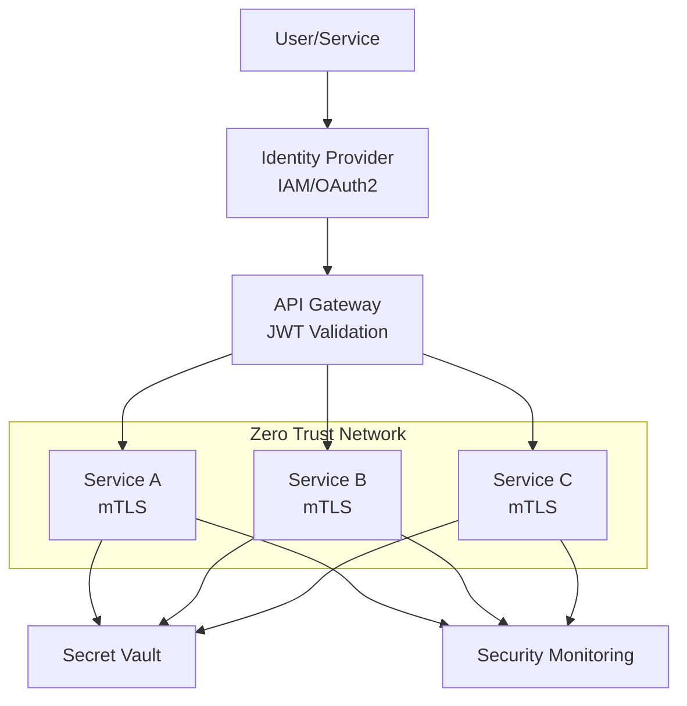

# P16 — Zero-Trust Cloud Architecture

## Documentation
For cross-project documentation, standards, and runbooks, see the [Portfolio Documentation Hub](../../DOCUMENTATION_INDEX.md).


## Overview
Zero-trust security architecture with mTLS, JWT policies, network segmentation, and comprehensive threat modeling. Demonstrates modern security practices, identity-based access, and defense-in-depth strategies.

## Key Outcomes
- [x] Zero-trust architecture design
- [x] mTLS certificate management
- [x] JWT authentication and authorization policies
- [x] Network micro-segmentation
- [x] Threat model documentation
- [x] Security policy templates

## Architecture



## Quickstart

```bash
make setup
make generate-certs
make deploy-policies
```

## Configuration

| Env Var | Purpose | Example | Required |
|---------|---------|---------|----------|
| `CA_CERT_PATH` | CA certificate | `/certs/ca.crt` | Yes |
| `JWT_SECRET` | JWT signing key | `<secret>` | Yes |
| `VAULT_ADDR` | Vault address | `https://vault:8200` | Yes |

## Testing

```bash
make test
make verify-mtls
```

## References

- [Zero Trust Architecture](https://www.nist.gov/publications/zero-trust-architecture)
- [mTLS Best Practices](https://www.cloudflare.com/learning/access-management/what-is-mutual-tls/)


## Code Generation Prompts

This section contains AI-assisted code generation prompts that can help you recreate or extend project components. These prompts are designed to work with AI coding assistants like Claude, GPT-4, or GitHub Copilot.

### Security Automation

#### 1. IAM Policy
```
Create an AWS IAM policy that follows principle of least privilege for a Lambda function that needs to read from S3, write to DynamoDB, and publish to SNS
```

#### 2. Security Scanning
```
Generate a Python script that scans Docker images for vulnerabilities using Trivy, fails CI/CD if critical CVEs are found, and posts results to Slack
```

#### 3. Compliance Checker
```
Write a script to audit AWS resources for CIS Benchmark compliance, checking security group rules, S3 bucket policies, and IAM password policies
```

### How to Use These Prompts

1. **Copy the prompt** from the code block above
2. **Customize placeholders** (replace [bracketed items] with your specific requirements)
3. **Provide context** to your AI assistant about:
   - Your development environment and tech stack
   - Existing code patterns and conventions in this project
   - Any constraints or requirements specific to your use case
4. **Review and adapt** the generated code before using it
5. **Test thoroughly** and adjust as needed for your specific scenario

### Best Practices

- Always review AI-generated code for security vulnerabilities
- Ensure generated code follows your project's coding standards
- Add appropriate error handling and logging
- Write tests for AI-generated components
- Document any assumptions or limitations
- Keep sensitive information (credentials, keys) in environment variables

## Evidence & Verification

Verification summary: Evidence artifacts captured on 2025-11-14 to validate the quickstart configuration and document audit-ready supporting files.

**Evidence artifacts**
- [Screenshot](./docs/evidence/screenshot.svg)
- [Run log](./docs/evidence/run-log.txt)
- [Dashboard export](./docs/evidence/dashboard-export.json)
- [Load test summary](./docs/evidence/load-test-summary.txt)

### Evidence Checklist

| Evidence Item | Location | Status |
| --- | --- | --- |
| Screenshot captured | `docs/evidence/screenshot.svg` | ✅ |
| Run log captured | `docs/evidence/run-log.txt` | ✅ |
| Dashboard export captured | `docs/evidence/dashboard-export.json` | ✅ |
| Load test summary captured | `docs/evidence/load-test-summary.txt` | ✅ |
