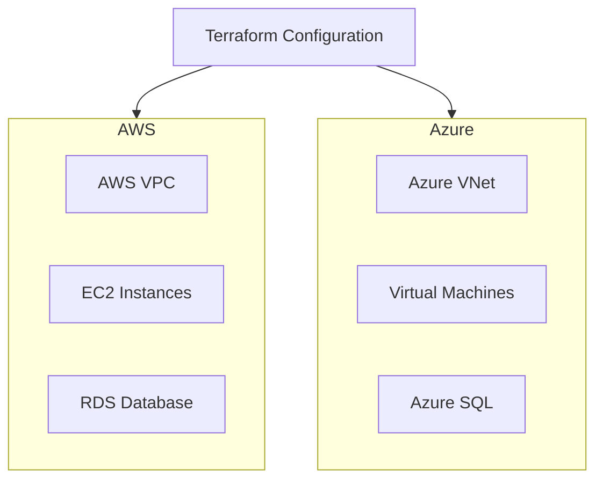

# P17 — Terraform Multi-Cloud Deployment

## Overview
Multi-cloud infrastructure deployment using Terraform with AWS and Azure providers, shared modules, and consistent provisioning patterns. Demonstrates IaC best practices, multi-cloud strategy, and cloud-agnostic design.

## Key Outcomes
- [x] Terraform modules for AWS and Azure
- [x] Multi-cloud VPC/VNet provisioning
- [x] Provider authentication configuration
- [x] State management with remote backend
- [x] Terraform workspaces for environments
- [x] CI/CD integration with terraform plan/apply

## Architecture



## Quickstart

```bash
make setup
make plan-aws
make apply-aws
```

## Configuration

| Env Var | Purpose | Example | Required |
|---------|---------|---------|----------|
| `AWS_ACCESS_KEY_ID` | AWS access key | `AKIA...` | Yes |
| `AWS_SECRET_ACCESS_KEY` | AWS secret key | `...` | Yes |
| `ARM_CLIENT_ID` | Azure client ID | `...` | Yes |
| `ARM_CLIENT_SECRET` | Azure client secret | `...` | Yes |

## Testing

```bash
make test
make validate
```

## References

- [Terraform Documentation](https://www.terraform.io/docs)
- [Multi-Cloud Best Practices](https://www.hashicorp.com/resources/multi-cloud-infrastructure-with-terraform)
