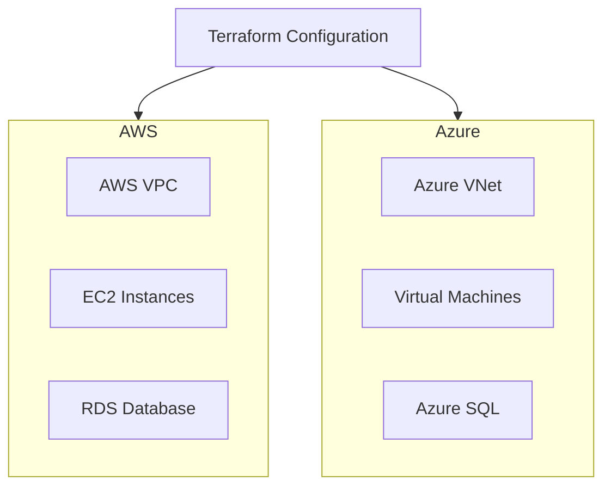

# P17 — Terraform Multi-Cloud Deployment

## Overview
Multi-cloud infrastructure deployment using Terraform with AWS and Azure providers, shared modules, and consistent provisioning patterns. Demonstrates IaC best practices, multi-cloud strategy, and cloud-agnostic design.

## Key Outcomes
- [x] Terraform modules for AWS and Azure
- [x] Multi-cloud VPC/VNet provisioning
- [x] Provider authentication configuration
- [x] State management with remote backend
- [x] Terraform workspaces for environments
- [x] CI/CD integration with terraform plan/apply

## AWS Module Library
The AWS module library ships production-ready building blocks under `modules/aws/`:

- `modules/aws/vpc` — multi-AZ VPC, subnets, NAT gateways, endpoints, flow logs.
- `modules/aws/rds` — PostgreSQL/MySQL with Multi-AZ, replicas, backups, Secrets Manager.
- `modules/aws/ecs` — ECS Fargate cluster, service, autoscaling, logging.
- `modules/aws/s3` — hardened S3 buckets with versioning, encryption, lifecycle, replication.
- `modules/aws/cloudfront` — CloudFront distributions with TLS, WAF, cache controls.

## Architecture



## Quickstart

```bash
make setup
make plan-aws
make apply-aws
```

## Configuration

| Env Var | Purpose | Example | Required |
|---------|---------|---------|----------|
| `AWS_ACCESS_KEY_ID` | AWS access key | `AKIA...` | Yes |
| `AWS_SECRET_ACCESS_KEY` | AWS secret key | `...` | Yes |
| `ARM_CLIENT_ID` | Azure client ID | `...` | Yes |
| `ARM_CLIENT_SECRET` | Azure client secret | `...` | Yes |

## Testing

```bash
make test
make validate
```

## References

- [Terraform Documentation](https://www.terraform.io/docs)
- [Multi-Cloud Best Practices](https://www.hashicorp.com/resources/multi-cloud-infrastructure-with-terraform)


## Code Generation Prompts

This section contains AI-assisted code generation prompts that can help you recreate or extend project components. These prompts are designed to work with AI coding assistants like Claude, GPT-4, or GitHub Copilot.

### Infrastructure as Code

#### 1. Terraform Module
```
Create a Terraform module for deploying a highly available VPC with public/private subnets across 3 availability zones, including NAT gateways and route tables
```

#### 2. CloudFormation Template
```
Generate a CloudFormation template for an Auto Scaling Group with EC2 instances behind an Application Load Balancer, including health checks and scaling policies
```

#### 3. Monitoring Integration
```
Write Terraform code to set up CloudWatch alarms for EC2 CPU utilization, RDS connections, and ALB target health with SNS notifications
```

### How to Use These Prompts

1. **Copy the prompt** from the code block above
2. **Customize placeholders** (replace [bracketed items] with your specific requirements)
3. **Provide context** to your AI assistant about:
   - Your development environment and tech stack
   - Existing code patterns and conventions in this project
   - Any constraints or requirements specific to your use case
4. **Review and adapt** the generated code before using it
5. **Test thoroughly** and adjust as needed for your specific scenario

### Best Practices

- Always review AI-generated code for security vulnerabilities
- Ensure generated code follows your project's coding standards
- Add appropriate error handling and logging
- Write tests for AI-generated components
- Document any assumptions or limitations
- Keep sensitive information (credentials, keys) in environment variables
