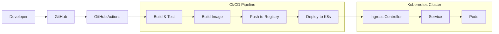

# P18 — CI/CD Pipeline with Kubernetes

## Overview
Complete CI/CD pipeline with Kubernetes deployment using kind cluster, GitHub Actions, kubectl rollout strategies, and automated testing. Demonstrates DevOps automation, containerization, and cloud-native deployment practices.

## Key Outcomes
- [x] kind (Kubernetes in Docker) local cluster
- [x] GitHub Actions CI/CD workflow
- [x] Kubernetes manifests (Deployment, Service, Ingress)
- [x] kubectl rollout strategies (rolling update, blue-green)
- [x] Automated testing in CI pipeline
- [x] Container image building and pushing

## Architecture



## Quickstart

```bash
make setup
make cluster-create
make deploy
```

## Configuration

| Env Var | Purpose | Example | Required |
|---------|---------|---------|----------|
| `DOCKER_REGISTRY` | Container registry | `ghcr.io/user` | Yes |
| `KUBE_CONTEXT` | Kubernetes context | `kind-dev` | No |
| `NAMESPACE` | K8s namespace | `default` | No |

## Testing

```bash
make test
make test-cluster
```

## References

- [Kubernetes Documentation](https://kubernetes.io/docs/)
- [GitHub Actions](https://docs.github.com/en/actions)
- [kind Documentation](https://kind.sigs.k8s.io/)


## Code Generation Prompts

This section contains AI-assisted code generation prompts that can help you recreate or extend project components. These prompts are designed to work with AI coding assistants like Claude, GPT-4, or GitHub Copilot.

### Kubernetes Resources

#### 1. Deployment Manifest
```
Create a Kubernetes Deployment manifest for a microservice with 3 replicas, resource limits (500m CPU, 512Mi memory), readiness/liveness probes, and rolling update strategy
```

#### 2. Helm Chart
```
Generate a Helm chart for deploying a web application with configurable replicas, ingress, service, and persistent volume claims, including values for dev/staging/prod environments
```

#### 3. Custom Operator
```
Write a Kubernetes operator in Go that watches for a custom CRD and automatically creates associated ConfigMaps, Secrets, and Services based on the custom resource spec
```

### How to Use These Prompts

1. **Copy the prompt** from the code block above
2. **Customize placeholders** (replace [bracketed items] with your specific requirements)
3. **Provide context** to your AI assistant about:
   - Your development environment and tech stack
   - Existing code patterns and conventions in this project
   - Any constraints or requirements specific to your use case
4. **Review and adapt** the generated code before using it
5. **Test thoroughly** and adjust as needed for your specific scenario

### Best Practices

- Always review AI-generated code for security vulnerabilities
- Ensure generated code follows your project's coding standards
- Add appropriate error handling and logging
- Write tests for AI-generated components
- Document any assumptions or limitations
- Keep sensitive information (credentials, keys) in environment variables

