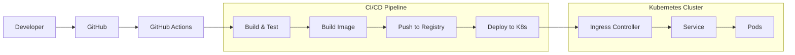

# P18 — CI/CD Pipeline with Kubernetes

## Overview
Complete CI/CD pipeline with Kubernetes deployment using kind cluster, GitHub Actions, kubectl rollout strategies, and automated testing. Demonstrates DevOps automation, containerization, and cloud-native deployment practices.

## Key Outcomes
- [x] kind (Kubernetes in Docker) local cluster
- [x] GitHub Actions CI/CD workflow
- [x] Kubernetes manifests (Deployment, Service, Ingress)
- [x] kubectl rollout strategies (rolling update, blue-green)
- [x] Automated testing in CI pipeline
- [x] Container image building and pushing

## Architecture



## Quickstart

```bash
make setup
make cluster-create
make deploy
```

## Configuration

| Env Var | Purpose | Example | Required |
|---------|---------|---------|----------|
| `DOCKER_REGISTRY` | Container registry | `ghcr.io/user` | Yes |
| `KUBE_CONTEXT` | Kubernetes context | `kind-dev` | No |
| `NAMESPACE` | K8s namespace | `default` | No |

## Testing

```bash
make test
make test-cluster
```

## References

- [Kubernetes Documentation](https://kubernetes.io/docs/)
- [GitHub Actions](https://docs.github.com/en/actions)
- [kind Documentation](https://kind.sigs.k8s.io/)
