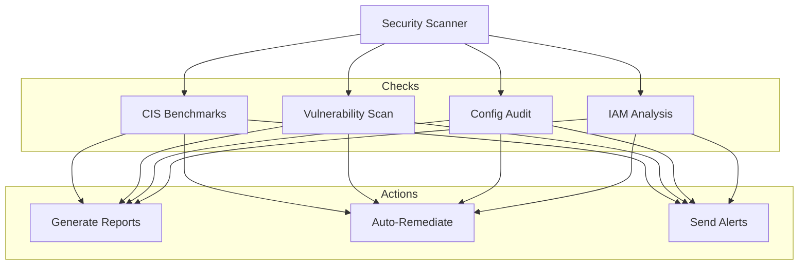

# P19 — Cloud Security Automation

## Overview
Automated cloud security compliance framework with CIS benchmark checks, vulnerability scanning, security posture assessment, and automated remediation. Demonstrates security automation, compliance monitoring, and DevSecOps practices.

## Key Outcomes
- [x] CIS AWS Foundations Benchmark compliance checks
- [x] Automated security scanning scripts
- [x] Vulnerability detection and reporting
- [x] Security posture dashboard
- [x] Automated remediation scripts
- [x] Compliance report generation

## Architecture



## Quickstart

```bash
make setup
make scan-all
make generate-report
```

## Configuration

| Env Var | Purpose | Example | Required |
|---------|---------|---------|----------|
| `AWS_REGION` | AWS region | `us-east-1` | Yes |
| `COMPLIANCE_LEVEL` | Compliance level | `CIS-1.4.0` | Yes |
| `AUTO_REMEDIATE` | Enable auto-fix | `true`, `false` | No |

## Testing

```bash
make test
make scan-cis
```

## References

- [CIS Benchmarks](https://www.cisecurity.org/cis-benchmarks/)
- [AWS Security Best Practices](https://docs.aws.amazon.com/security/)


## Code Generation Prompts

This section contains AI-assisted code generation prompts that can help you recreate or extend project components. These prompts are designed to work with AI coding assistants like Claude, GPT-4, or GitHub Copilot.

### Security Automation

#### 1. IAM Policy
```
Create an AWS IAM policy that follows principle of least privilege for a Lambda function that needs to read from S3, write to DynamoDB, and publish to SNS
```

#### 2. Security Scanning
```
Generate a Python script that scans Docker images for vulnerabilities using Trivy, fails CI/CD if critical CVEs are found, and posts results to Slack
```

#### 3. Compliance Checker
```
Write a script to audit AWS resources for CIS Benchmark compliance, checking security group rules, S3 bucket policies, and IAM password policies
```

### How to Use These Prompts

1. **Copy the prompt** from the code block above
2. **Customize placeholders** (replace [bracketed items] with your specific requirements)
3. **Provide context** to your AI assistant about:
   - Your development environment and tech stack
   - Existing code patterns and conventions in this project
   - Any constraints or requirements specific to your use case
4. **Review and adapt** the generated code before using it
5. **Test thoroughly** and adjust as needed for your specific scenario

### Best Practices

- Always review AI-generated code for security vulnerabilities
- Ensure generated code follows your project's coding standards
- Add appropriate error handling and logging
- Write tests for AI-generated components
- Document any assumptions or limitations
- Keep sensitive information (credentials, keys) in environment variables

## Evidence & Verification

Verification summary: Baseline evidence captured to validate the latest quickstart configuration and document supporting artifacts for audits.

**Evidence artifacts**
- [Screenshot](./docs/evidence/screenshot.svg)
- [Run log](./docs/evidence/run-log.txt)
- [Dashboard export](./docs/evidence/dashboard-export.json)
- [Load test summary](./docs/evidence/load-test-summary.txt)

### Evidence Checklist

| Evidence Item | Location | Status |
| --- | --- | --- |
| Screenshot captured | `docs/evidence/screenshot.svg` | ✅ |
| Run log captured | `docs/evidence/run-log.txt` | ✅ |
| Dashboard export captured | `docs/evidence/dashboard-export.json` | ✅ |
| Load test summary captured | `docs/evidence/load-test-summary.txt` | ✅ |
