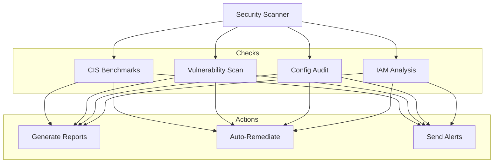

# P19 — Cloud Security Automation

## Overview
Automated cloud security compliance framework with CIS benchmark checks, vulnerability scanning, security posture assessment, and automated remediation. Demonstrates security automation, compliance monitoring, and DevSecOps practices.

## Key Outcomes
- [x] CIS AWS Foundations Benchmark compliance checks
- [x] Automated security scanning scripts
- [x] Vulnerability detection and reporting
- [x] Security posture dashboard
- [x] Automated remediation scripts
- [x] Compliance report generation

## Architecture



## Quickstart

```bash
make setup
make scan-all
make generate-report
```

## Configuration

| Env Var | Purpose | Example | Required |
|---------|---------|---------|----------|
| `AWS_REGION` | AWS region | `us-east-1` | Yes |
| `COMPLIANCE_LEVEL` | Compliance level | `CIS-1.4.0` | Yes |
| `AUTO_REMEDIATE` | Enable auto-fix | `true`, `false` | No |

## Testing

```bash
make test
make scan-cis
```

## References

- [CIS Benchmarks](https://www.cisecurity.org/cis-benchmarks/)
- [AWS Security Best Practices](https://docs.aws.amazon.com/security/)
