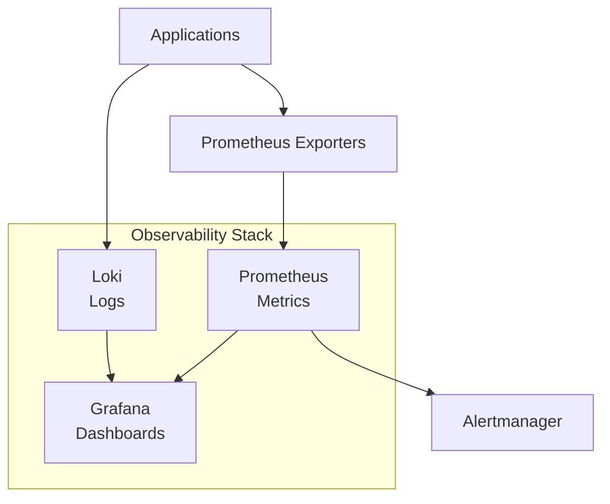

# P20 — Observability Engineering (Full Stack)

## Overview
Complete observability stack with Prometheus for metrics, Grafana for visualization, and Loki for log aggregation. Demonstrates monitoring best practices, distributed tracing, and operational insights.

## Key Outcomes
- [x] Prometheus metrics collection and storage
- [x] Grafana dashboards with visualization
- [x] Loki log aggregation and querying
- [x] Service instrumentation with exporters
- [x] Alerting rules and notification channels
- [x] Dashboard JSON exports

## Architecture



## Quickstart

```bash
make setup
make run
# Visit http://localhost:3000 (admin/admin)
```

## Configuration

| Env Var | Purpose | Example | Required |
|---------|---------|---------|----------|
| `PROMETHEUS_RETENTION` | Data retention | `15d` | No |
| `GRAFANA_ADMIN_PASSWORD` | Admin password | `secure123` | Yes |
| `ALERT_WEBHOOK_URL` | Alert webhook | `https://...` | No |

## Testing

```bash
make test
make query-metrics
```

## References

- [Prometheus Documentation](https://prometheus.io/docs/)
- [Grafana Documentation](https://grafana.com/docs/)
- [Loki Documentation](https://grafana.com/docs/loki/)
