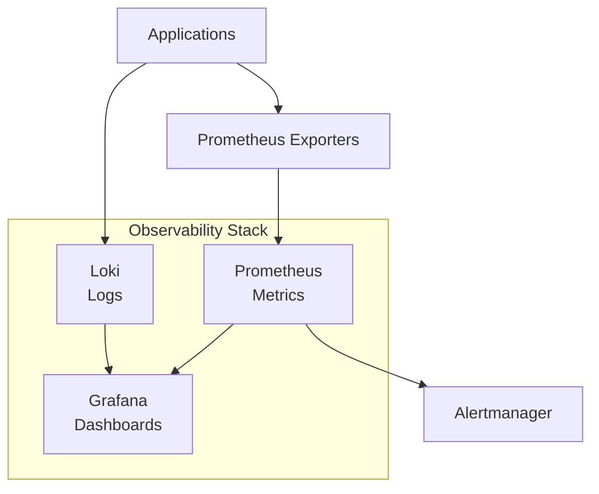

# P20 — Observability Engineering (Full Stack)

## Overview
Complete observability stack with Prometheus for metrics, Grafana for visualization, and Loki for log aggregation. Demonstrates monitoring best practices, distributed tracing, and operational insights.

## Key Outcomes
- [x] Prometheus metrics collection and storage
- [x] Grafana dashboards with visualization
- [x] Loki log aggregation and querying
- [x] Service instrumentation with exporters
- [x] Alerting rules and notification channels
- [x] Dashboard JSON exports

## Architecture



## Quickstart

```bash
make setup
make run
# Visit http://localhost:3000 (admin/admin)
```

## Configuration

| Env Var | Purpose | Example | Required |
|---------|---------|---------|----------|
| `PROMETHEUS_RETENTION` | Data retention | `15d` | No |
| `GRAFANA_ADMIN_PASSWORD` | Admin password | `secure123` | Yes |
| `ALERT_WEBHOOK_URL` | Alert webhook | `https://...` | No |

## Testing

```bash
make test
make query-metrics
```

## References

- [Prometheus Documentation](https://prometheus.io/docs/)
- [Grafana Documentation](https://grafana.com/docs/)
- [Loki Documentation](https://grafana.com/docs/loki/)


## Code Generation Prompts

This section contains AI-assisted code generation prompts that can help you recreate or extend project components. These prompts are designed to work with AI coding assistants like Claude, GPT-4, or GitHub Copilot.

### Observability Setup

#### 1. Prometheus Rules
```
Create Prometheus alerting rules for application health, including error rate thresholds, latency percentiles, and service availability with appropriate severity levels
```

#### 2. Grafana Dashboard
```
Generate a Grafana dashboard JSON for microservices monitoring with panels for request rate, error rate, latency distribution, and resource utilization
```

#### 3. Log Aggregation
```
Write a Fluentd configuration that collects logs from multiple sources, parses JSON logs, enriches with Kubernetes metadata, and forwards to Elasticsearch
```

### How to Use These Prompts

1. **Copy the prompt** from the code block above
2. **Customize placeholders** (replace [bracketed items] with your specific requirements)
3. **Provide context** to your AI assistant about:
   - Your development environment and tech stack
   - Existing code patterns and conventions in this project
   - Any constraints or requirements specific to your use case
4. **Review and adapt** the generated code before using it
5. **Test thoroughly** and adjust as needed for your specific scenario

### Best Practices

- Always review AI-generated code for security vulnerabilities
- Ensure generated code follows your project's coding standards
- Add appropriate error handling and logging
- Write tests for AI-generated components
- Document any assumptions or limitations
- Keep sensitive information (credentials, keys) in environment variables

