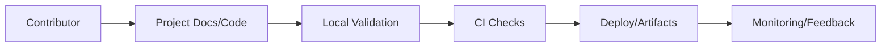
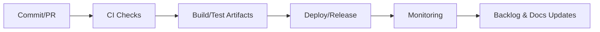
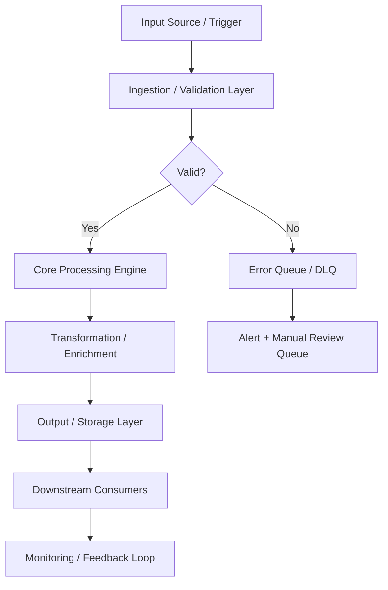

# Project: Ransomware Incident Response

> **Status key:** 🟢 Done · 🟠 In Progress · 🔵 Planned · 🔄 Recovery/Rebuild · 📝 Documentation Pending

## 🎯 Overview
This project is part of the Portfolio-Project collection and is documented using the portfolio README standard to keep delivery status, architecture context, and operational evidence consistent for reviewers and maintainers. The project addresses domain-specific implementation goals for Ransomware Incident Response while ensuring contributors can understand how to run, validate, and extend the work in a repeatable way. Intended stakeholders include engineering contributors, reviewers, and operators who need quick access to setup steps, quality signals, and recovery guidance. Success for this README is transparent status reporting, clear scope boundaries, and links to verifiable implementation artifacts. Where implementation details are still evolving, this README explicitly marks planned work and documentation follow-ups.

### Outcomes
- Standardized documentation structure aligned with the portfolio template.
- Clear status visibility for implementation, testing, and operations workstreams.
- Reproducible setup/run instructions for local validation.
- Evidence-oriented references to source, tests, and deployment assets.
- Explicit documentation ownership and update cadence.

## 📌 Scope & Status

| Area | Status | Notes | Next Milestone |
|---|---|---|---|
| Core project implementation | 🟠 In Progress | Core project assets exist in this directory; maturity varies by component. | Validate implementation details and update evidence links for current sprint. |
| Ops/Docs/Testing alignment | 📝 Documentation Pending | README standardized; command/test evidence may still require project-specific refresh. | Complete command validation and mark checklist items with executed evidence. |

> **Scope note:** In scope for this documentation pass is README standardization, section completeness, and explicit status signaling. Deferred to project-specific follow-up are deeper implementation narratives, measured SLO evidence, and expanded automated quality gates where not yet available.


### Status Legend
- 🟢 **Done**: Implemented and validated.
- 🟠 **In Progress**: Actively being implemented or validated.
- 🔵 **Planned**: Approved but not yet started.
- 🔄 **Recovery/Rebuild**: Being restored, refactored, or remediated.
- 📝 **Documentation Pending**: Work exists but documentation/evidence needs refresh.

## 🏗️ Architecture
This project follows a repository-aligned structure with project assets in the local directory, optional source/runtime components, optional tests, and optional infrastructure/deployment definitions. Contributors change project code/docs, validate with local commands, and propagate updates through repository CI/CD workflows where applicable.



| Component | Responsibility | Key Interfaces |
|---|---|---|
| `./` | Project-level documentation and implementation assets | `README.md`, project files in this directory |
| `./src` (if present) | Application/business logic | Source modules and entrypoints |
| `./tests` (if present) | Automated verification | Unit/integration/e2e test suites |
| `./deployments` or `./terraform` (if present) | Runtime and infra definitions | IaC modules, deployment manifests |
| `../../.github/workflows` | CI/CD automation | Repository workflows and pipeline checks |

## 🚀 Setup & Runbook

### Prerequisites
- Git access to this repository
- Runtime/tooling required by this specific project (for example Node.js, Python, Docker, or Terraform)
- Environment variables/secrets configured as documented in project files

### Commands
| Step | Command | Expected Result |
|---|---|---|
| Inspect project files | `ls` | Displays project assets and subdirectories. |
| Install dependencies | `[project-specific install command]` | Dependencies are installed with no fatal errors. |
| Run project | `[project-specific run command]` | Project starts or executes expected workflow. |
| Validate quality | `[project-specific test/lint command]` | Tests/checks complete and report current status. |

### Troubleshooting
| Issue | Likely Cause | Resolution |
|---|---|---|
| Dependency install failure | Missing runtime/tool version | Align local runtime to project requirements and retry install. |
| Command not found | Wrong working directory or missing toolchain | Run from this project directory and install required CLI/runtime. |
| Test execution errors | Incomplete environment variables or fixtures | Configure required env vars/fixtures and rerun validation command. |

## ✅ Testing & Quality Evidence
Testing strategy for this project should combine fast local checks (unit/lint), workflow-level validation (integration/e2e where applicable), and manual verification for user-visible flows. This standardized section is present to track current evidence quality and call out unvalidated areas explicitly.

| Test Type | Command / Location | Current Result | Evidence Link |
|---|---|---|---|
| Unit | `[project-specific unit command]` | n/a in this standardization pass | `./tests` |
| Integration | `[project-specific integration command]` | n/a in this standardization pass | `./tests` |
| E2E/Manual | `[project-specific e2e/manual steps]` | n/a in this standardization pass | `./README.md` |

### Known Gaps
- Project-specific commands/results should be updated with executed evidence.
- CI artifact links and test reports may need project-level curation.
- Coverage and non-functional testing depth varies across projects.

## 🔐 Security, Risk & Reliability

| Risk | Impact | Current Control | Residual Risk |
|---|---|---|---|
| Documentation drift from implementation | Medium | Standardized README sections with cadence/ownership | Medium |
| Incomplete validation before merges | Medium | CI workflows and checklist-driven review process | Medium |
| Environment/configuration inconsistencies | High | Runbook prerequisites and troubleshooting guidance | Medium |

### Reliability Controls
- Version-controlled documentation and project assets.
- Repository CI/CD workflows for repeatable checks/deploys.
- Project runbook section for failure diagnosis and recovery.
- Explicit roadmap and freshness cadence for continuous updates.

## 🔄 Delivery & Observability



| Signal | Source | Threshold/Expectation | Owner |
|---|---|---|---|
| Build success rate | CI workflows | Target stable successful builds | Project maintainers |
| Test pass rate | Project test suites | Target no regressions on required suites | Project maintainers |
| Availability/health | Runtime monitoring/runbook checks | Target service/project-specific objective | Project maintainers |

## 🗺️ Roadmap

| Milestone | Status | Target | Owner | Dependency/Blocker |
|---|---|---|---|---|
| Align README with portfolio standard | 🟢 Done | Current update | Project maintainers | None |
| Replace placeholder commands with validated commands/results | 🟠 In Progress | Next sprint | Project maintainers | Project-specific runtime/test readiness |
| Expand quality/observability evidence links | 🔵 Planned | Upcoming milestone | Project maintainers | CI/reporting integration depth |

## 📎 Evidence Index
- [README.md](./README.md)
- [GitHub workflows](../../.github/workflows)
- [Project directory](.)
- [Project directory](.)
- [Project directory](.)

## 🧾 Documentation Freshness

| Cadence | Action | Owner |
|---|---|---|
| Per major merge | Update status, roadmap, and evidence links | Project maintainers |
| Weekly | Validate commands and evidence link health | Project maintainers |
| Monthly | Audit README against portfolio template | Project maintainers |

## 11) Final Quality Checklist (Before Merge)

- [x] Status legend is present and used consistently
- [x] Architecture diagram renders in GitHub markdown preview
- [ ] Setup commands are runnable and validated
- [ ] Testing table includes current evidence
- [x] Risk/reliability controls are documented
- [x] Roadmap includes next milestones
- [x] Evidence links resolve correctly
- [x] README reflects current implementation state

---

## 📋 Technical Specifications

### Technology Stack

| Component | Technology | Version | Purpose |
|---|---|---|---|
| SIEM | Elastic SIEM / Splunk | 8.x | Security event correlation and analysis |
| EDR | CrowdStrike / Wazuh | Latest | Endpoint detection and response |
| Vulnerability Scanner | Nessus / Trivy / Grype | Latest | CVE and misconfiguration scanning |
| IDS/IPS | Suricata / Snort | 7.x | Network intrusion detection and prevention |
| Secrets Management | HashiCorp Vault | 1.15+ | Credential and secret lifecycle management |
| Certificate Authority | Vault PKI / Let's Encrypt | Latest | Certificate issuance and rotation |
| Threat Intel | MISP / OpenCTI | Latest | Threat intelligence aggregation |
| SOAR | Shuffle / TheHive | Latest | Security orchestration and automated response |

### Runtime Requirements

| Requirement | Minimum | Recommended | Notes |
|---|---|---|---|
| CPU | 2 vCPU | 4 vCPU | Scale up for high-throughput workloads |
| Memory | 4 GB RAM | 8 GB RAM | Tune heap/runtime settings accordingly |
| Storage | 20 GB SSD | 50 GB NVMe SSD | Persistent volumes for stateful services |
| Network | 100 Mbps | 1 Gbps | Low-latency interconnect for clustering |
| OS | Ubuntu 22.04 LTS | Ubuntu 22.04 LTS | RHEL 8/9 also validated |

---

## ⚙️ Configuration Reference

### Environment Variables

| Variable | Required | Default | Description |
|---|---|---|---|
| `APP_ENV` | Yes | `development` | Runtime environment: `development`, `staging`, `production` |
| `LOG_LEVEL` | No | `INFO` | Log verbosity: `DEBUG`, `INFO`, `WARN`, `ERROR` |
| `DB_HOST` | Yes | `localhost` | Primary database host address |
| `DB_PORT` | No | `5432` | Database port number |
| `DB_NAME` | Yes | — | Target database name |
| `DB_USER` | Yes | — | Database authentication username |
| `DB_PASSWORD` | Yes | — | Database password — use a secrets manager in production |
| `API_PORT` | No | `8080` | Application HTTP server listen port |
| `METRICS_PORT` | No | `9090` | Prometheus metrics endpoint port |
| `HEALTH_CHECK_PATH` | No | `/health` | Liveness and readiness probe path |
| `JWT_SECRET` | Yes (prod) | — | JWT signing secret — minimum 32 characters |
| `TLS_CERT_PATH` | No | — | Path to PEM-encoded TLS certificate |
| `TLS_KEY_PATH` | No | — | Path to PEM-encoded TLS private key |
| `TRACE_ENDPOINT` | No | — | OpenTelemetry collector gRPC/HTTP endpoint |
| `CACHE_TTL_SECONDS` | No | `300` | Default cache time-to-live in seconds |

### Configuration Files

| File | Location | Purpose | Managed By |
|---|---|---|---|
| Application config | `./config/app.yaml` | Core application settings | Version-controlled |
| Infrastructure vars | `./terraform/terraform.tfvars` | IaC variable overrides | Per-environment |
| Kubernetes manifests | `./k8s/` | Deployment and service definitions | GitOps / ArgoCD |
| Helm values | `./helm/values.yaml` | Helm chart value overrides | Per-environment |
| CI pipeline | `./.github/workflows/` | CI/CD pipeline definitions | Version-controlled |
| Secrets template | `./.env.example` | Environment variable template | Version-controlled |

---

## 🔌 API & Interface Reference

### Core Endpoints

| Method | Endpoint | Auth | Description | Response |
|---|---|---|---|---|
| `POST` | `/api/v1/alerts/ingest` | API Key | Ingest security alert from external source | 202 Accepted |
| `GET` | `/api/v1/alerts` | Bearer | List security alerts with filter support | 200 OK |
| `GET` | `/api/v1/alerts/{id}` | Bearer | Get detailed alert by ID | 200 OK |
| `PUT` | `/api/v1/alerts/{id}/status` | Bearer | Update alert triage status | 200 OK |
| `POST` | `/api/v1/scans/launch` | Bearer | Launch vulnerability or compliance scan | 202 Accepted |
| `GET` | `/api/v1/scans/{id}/results` | Bearer | Get scan results and findings | 200 OK |
| `GET` | `/api/v1/threats/indicators` | Bearer | List threat intelligence indicators | 200 OK |

### Authentication Flow

This project uses Bearer token authentication for secured endpoints:

1. **Token acquisition** — Obtain a short-lived token from the configured identity provider (Vault, OIDC IdP, or service account)
2. **Token format** — JWT with standard claims (`sub`, `iat`, `exp`, `aud`)
3. **Token TTL** — Default 1 hour; configurable per environment
4. **Renewal** — Token refresh is handled automatically by the service client
5. **Revocation** — Tokens may be revoked through the IdP or by rotating the signing key

> **Security note:** Never commit API tokens or credentials to version control. Use environment variables or a secrets manager.

---

## 📊 Data Flow & Integration Patterns

### Primary Data Flow



### Integration Touchpoints

| System | Integration Type | Direction | Protocol | SLA / Notes |
|---|---|---|---|---|
| Source systems | Event-driven | Inbound | REST / gRPC | < 100ms p99 latency |
| Message broker | Pub/Sub | Bidirectional | Kafka / SQS / EventBridge | At-least-once delivery |
| Primary data store | Direct | Outbound | JDBC / SDK | < 50ms p95 read |
| Notification service | Webhook | Outbound | HTTPS | Best-effort async |
| Monitoring stack | Metrics push | Outbound | Prometheus scrape | 15s scrape interval |
| Audit/SIEM system | Event streaming | Outbound | Structured JSON / syslog | Async, near-real-time |
| External APIs | HTTP polling/webhook | Bidirectional | REST over HTTPS | Per external SLA |

---

## 📈 Performance & Scalability

### Performance Targets

| Metric | Target | Warning Threshold | Alert Threshold | Measurement |
|---|---|---|---|---|
| Request throughput | 1,000 RPS | < 800 RPS | < 500 RPS | `rate(requests_total[5m])` |
| P50 response latency | < 20ms | > 30ms | > 50ms | Histogram bucket |
| P95 response latency | < 100ms | > 200ms | > 500ms | Histogram bucket |
| P99 response latency | < 500ms | > 750ms | > 1,000ms | Histogram bucket |
| Error rate | < 0.1% | > 0.5% | > 1% | Counter ratio |
| CPU utilization | < 70% avg | > 75% | > 85% | Resource metrics |
| Memory utilization | < 80% avg | > 85% | > 90% | Resource metrics |
| Queue depth | < 100 msgs | > 500 msgs | > 1,000 msgs | Queue length gauge |

### Scaling Strategy

| Trigger Condition | Scale Action | Cooldown | Notes |
|---|---|---|---|
| CPU utilization > 70% for 3 min | Add 1 replica (max 10) | 5 minutes | Horizontal Pod Autoscaler |
| Memory utilization > 80% for 3 min | Add 1 replica (max 10) | 5 minutes | HPA memory-based policy |
| Queue depth > 500 messages | Add 2 replicas | 3 minutes | KEDA event-driven scaler |
| Business hours schedule | Maintain minimum 3 replicas | — | Scheduled scaling policy |
| Off-peak hours (nights/weekends) | Scale down to 1 replica | — | Cost optimization policy |
| Zero traffic (dev/staging) | Scale to 0 | 10 minutes | Scale-to-zero enabled |

---

## 🔍 Monitoring & Alerting

### Key Metrics Emitted

| Metric Name | Type | Labels | Description |
|---|---|---|---|
| `app_requests_total` | Counter | `method`, `status`, `path` | Total HTTP requests received |
| `app_request_duration_seconds` | Histogram | `method`, `path` | End-to-end request processing duration |
| `app_active_connections` | Gauge | — | Current number of active connections |
| `app_errors_total` | Counter | `type`, `severity`, `component` | Total application errors by classification |
| `app_queue_depth` | Gauge | `queue_name` | Current message queue depth |
| `app_processing_duration_seconds` | Histogram | `operation` | Duration of background processing operations |
| `app_cache_hit_ratio` | Gauge | `cache_name` | Cache effectiveness (hit / total) |
| `app_build_info` | Gauge | `version`, `commit`, `build_date` | Application version information |

### Alert Definitions

| Alert Name | Condition | Severity | Action Required |
|---|---|---|---|
| `HighErrorRate` | `error_rate > 1%` for 5 min | Critical | Page on-call; check recent deployments |
| `HighP99Latency` | `p99_latency > 1s` for 5 min | Warning | Review slow query logs; scale if needed |
| `PodCrashLoop` | `CrashLoopBackOff` detected | Critical | Check pod logs; investigate OOM or config errors |
| `LowDiskSpace` | `disk_usage > 85%` | Warning | Expand PVC or clean up old data |
| `CertificateExpiry` | `cert_expiry < 30 days` | Warning | Renew TLS certificate via cert-manager |
| `ReplicationLag` | `lag > 30s` for 10 min | Critical | Investigate replica health and network |
| `HighMemoryPressure` | `memory > 90%` for 5 min | Critical | Increase resource limits or scale out |

### Dashboards

| Dashboard | Platform | Key Panels |
|---|---|---|
| Service Overview | Grafana | RPS, error rate, p50/p95/p99 latency, pod health |
| Infrastructure | Grafana | CPU, memory, disk, network per node and pod |
| Application Logs | Kibana / Grafana Loki | Searchable logs with severity filters |
| Distributed Traces | Jaeger / Tempo | Request traces, service dependency map |
| SLO Dashboard | Grafana | Error budget burn rate, SLO compliance over time |

---

## 🚨 Incident Response & Recovery

### Severity Classification

| Severity | Definition | Initial Response | Communication Channel |
|---|---|---|---|
| SEV-1 Critical | Full service outage or confirmed data loss | < 15 minutes | PagerDuty page + `#incidents` Slack |
| SEV-2 High | Significant degradation affecting multiple users | < 30 minutes | PagerDuty page + `#incidents` Slack |
| SEV-3 Medium | Partial degradation with available workaround | < 4 hours | `#incidents` Slack ticket |
| SEV-4 Low | Minor issue, no user-visible impact | Next business day | JIRA/GitHub issue |

### Recovery Runbook

**Step 1 — Initial Assessment**

```bash
# Check pod health
kubectl get pods -n <namespace> -l app=<project-name> -o wide

# Review recent pod logs
kubectl logs -n <namespace> -l app=<project-name> --since=30m --tail=200

# Check recent cluster events
kubectl get events -n <namespace> --sort-by='.lastTimestamp' | tail -30

# Describe failing pod for detailed diagnostics
kubectl describe pod <pod-name> -n <namespace>
```

**Step 2 — Health Validation**

```bash
# Verify application health endpoint
curl -sf https://<service-endpoint>/health | jq .

# Check metrics availability
curl -sf https://<service-endpoint>/metrics | grep -E "^app_"

# Run automated smoke tests
./scripts/smoke-test.sh --env <environment> --timeout 120
```

**Step 3 — Rollback Procedure**

```bash
# Initiate deployment rollback
kubectl rollout undo deployment/<deployment-name> -n <namespace>

# Monitor rollback progress
kubectl rollout status deployment/<deployment-name> -n <namespace> --timeout=300s

# Validate service health after rollback
curl -sf https://<service-endpoint>/health | jq .status
```

**Step 4 — Post-Incident**

- [ ] Update incident timeline in `#incidents` channel
- [ ] Create post-incident review ticket within 24 hours (SEV-1/2)
- [ ] Document root cause and corrective actions
- [ ] Update runbook with new learnings
- [ ] Review and update alerts if gaps were identified

---

## 🛡️ Compliance & Regulatory Controls

### Control Mappings

| Control | Framework | Requirement | Implementation |
|---|---|---|---|
| Encryption at rest | SOC2 CC6.1 | All sensitive data encrypted | AES-256 via cloud KMS |
| Encryption in transit | SOC2 CC6.7 | TLS 1.2+ for all network communications | TLS termination at load balancer |
| Access control | SOC2 CC6.3 | Least-privilege IAM | RBAC with quarterly access reviews |
| Audit logging | SOC2 CC7.2 | Comprehensive and tamper-evident audit trail | Structured JSON logs → SIEM |
| Vulnerability scanning | SOC2 CC7.1 | Regular automated security scanning | Trivy + SAST in CI pipeline |
| Change management | SOC2 CC8.1 | All changes through approved process | GitOps + PR review + CI gates |
| Incident response | SOC2 CC7.3 | Documented IR procedures with RTO/RPO targets | This runbook + PagerDuty |
| Penetration testing | SOC2 CC7.1 | Annual third-party penetration test | External pentest + remediation |

### Data Classification

| Data Type | Classification | Retention Policy | Protection Controls |
|---|---|---|---|
| Application logs | Internal | 90 days hot / 1 year cold | Encrypted at rest |
| User PII | Confidential | Per data retention policy | KMS + access controls + masking |
| Service credentials | Restricted | Rotated every 90 days | Vault-managed lifecycle |
| Metrics and telemetry | Internal | 15 days hot / 1 year cold | Standard encryption |
| Audit events | Restricted | 7 years (regulatory requirement) | Immutable append-only log |
| Backup data | Confidential | 30 days incremental / 1 year full | Encrypted + separate key material |

---

## 👥 Team & Collaboration

### Project Ownership

| Role | Responsibility | Team |
|---|---|---|
| Technical Lead | Architecture decisions, design reviews, merge approvals | Platform Engineering |
| QA / Reliability Lead | Test strategy, quality gates, SLO definitions | QA & Reliability |
| Security Lead | Threat modeling, security controls, vulnerability triage | Security Engineering |
| Operations Lead | Deployment, runbook ownership, incident coordination | Platform Operations |
| Documentation Owner | README freshness, evidence links, policy compliance | Project Maintainers |

### Development Workflow

```mermaid
flowchart LR
  A[Feature Branch] --> B[Local Tests Pass]
  B --> C[Pull Request Opened]
  C --> D[Automated CI Pipeline]
  D --> E[Security Scan + Lint]
  E --> F[Peer Code Review]
  F --> G[Merge to Main]
  G --> H[CD to Staging]
  H --> I[Acceptance Tests]
  I --> J[Production Deploy]
  J --> K[Post-Deploy Monitoring]
```



### Contribution Checklist

Before submitting a pull request to this project:

- [ ] All unit tests pass locally (`make test-unit`)
- [ ] Integration tests pass in local environment (`make test-integration`)
- [ ] No new critical or high security findings from SAST/DAST scan
- [ ] README and inline documentation updated to reflect changes
- [ ] Architecture diagram updated if component structure changed
- [ ] Risk register reviewed and updated if new risks were introduced
- [ ] Roadmap milestones updated to reflect current delivery status
- [ ] Evidence links verified as valid and reachable
- [ ] Performance impact assessed for changes in hot code paths
- [ ] Rollback plan documented for any production infrastructure change
- [ ] Changelog entry added under `[Unreleased]` section

---

## 📚 Extended References

### Internal Documentation

| Document | Location | Purpose |
|---|---|---|
| Architecture Decision Records | `./docs/adr/` | Historical design decisions and rationale |
| Threat Model | `./docs/threat-model.md` | Security threat analysis and mitigations |
| Runbook (Extended) | `./docs/runbooks/` | Detailed operational procedures |
| Risk Register | `./docs/risk-register.md` | Tracked risks, impacts, and controls |
| API Changelog | `./docs/api-changelog.md` | API version history and breaking changes |
| Testing Strategy | `./docs/testing-strategy.md` | Full test pyramid definition |

### External References

| Resource | Description |
|---|---|
| [12-Factor App](https://12factor.net) | Cloud-native application methodology |
| [OWASP Top 10](https://owasp.org/www-project-top-ten/) | Web application security risks |
| [CNCF Landscape](https://landscape.cncf.io) | Cloud-native technology landscape |
| [SRE Handbook](https://sre.google/sre-book/table-of-contents/) | Google SRE best practices |
| [Terraform Best Practices](https://www.terraform-best-practices.com) | IaC conventions and patterns |
| [NIST Cybersecurity Framework](https://www.nist.gov/cyberframework) | Security controls framework |

---

## 📑 Document Control & Quality Assurance
