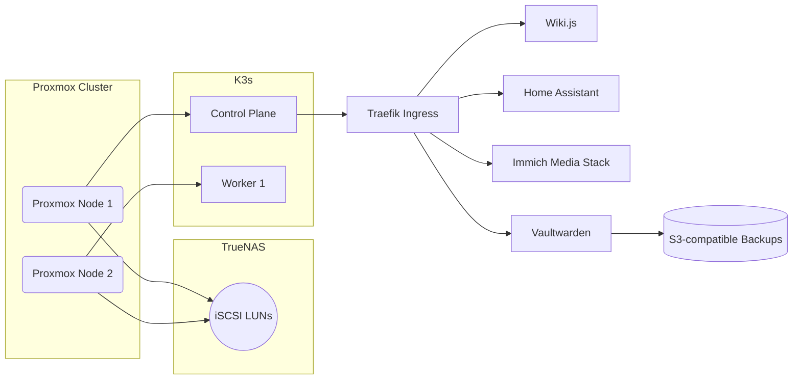

# Virtualization & Core Services Platform

## Overview
Built on a two-node Proxmox cluster with shared TrueNAS storage, this stack hosts self-service applications (Wiki.js, Home Assistant, Immich) behind a Traefik reverse proxy. All services inherit baseline security controls: TLS, SSO, role-based access, and automated backups.

## Service Topology

## Configuration Highlights
- Terraform module provisions Proxmox VMs and tags them for scheduled backup jobs.
- Traefik dynamic configuration stored in git and synced via FluxCD.
- All application secrets managed via Vaultwarden with emergency access logging.
- TrueNAS replication to off-site target runs nightly with quarterly DR restores.

## Operational Checklists
1. **Monthly Patch Cycle**
   - Drain workloads from Node 1 via `pvecm expected 1`.
   - Apply updates, reboot, verify `ceph -s` healthy.
   - Repeat for Node 2.
2. **Service Deployment**
   - Merge PR updating `services/values.yaml`.
   - Flux sync verifies container digest and rolls out changes.
   - Post-deploy smoke test using `make runbook-smoke`.

## Related Artifacts
- [`service-topology.mmd`](./service-topology.mmd) — editable Mermaid source for diagrams.
- [`backup-rotation.md`](./backup-rotation.md) — documented backup tiers and verification cadence.

## Reliability Metrics
| SLO | Target | Current |
| --- | --- | --- |
| Home Assistant availability | 99.5% monthly | 99.7% |
| Backup job success | 100% daily | 100% |
| Restore drill cadence | 1 per quarter | On track |

## Lessons Learned
- Automate snapshot pruning; manual cleanup failed to keep pace with churn.
- Documenting smoke tests prevented regressions when updating Traefik middlewares.
- Treat the homelab cluster like production—runbooks and git history simplify audits.
