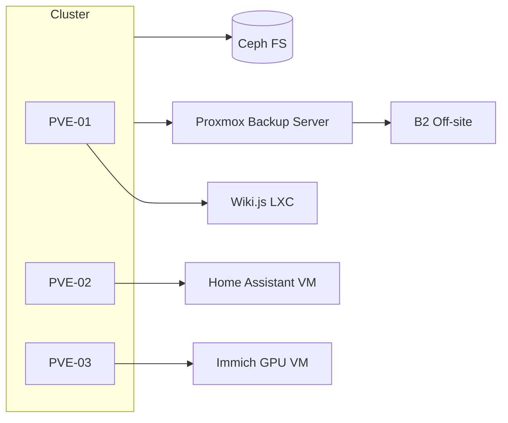

# Virtualization & Core Services

Highly-available Proxmox + TrueNAS environment powering self-hosted services with declarative provisioning and automated backups.

## Platform Diagram


## Provisioning Notes
- **Infrastructure as Code**: Terraform module `modules/pve-vm` handles VM creation; cloud-init scripts stored in Git with CI guardrails.
- **Storage policy**: Ceph triple-replicated pool with failure domain at host-level; Immich GPU VM pinned to PVE-03 with PCI passthrough.
- **Configuration drift**: Ansible roles `pve_cluster`, `truenas_dataset`, and `reverse_proxy` run nightly via AWX schedule.

## Sample Config
<details>
<summary>Terraform module invocation</summary>

```hcl
module "wiki_js" {
  source           = "./modules/pve-vm"
  name             = "wiki-js"
  target_node      = "pve-01"
  template         = "debian-12-cloudinit"
  cores            = 2
  memory           = 4096
  disk_gb          = 32
  cloud_init_vars  = {
    ssh_authorized_keys = file("~/.ssh/id_ed25519.pub")
    user_data_template  = "cloud-init/wiki-js.yaml"
  }
}
```
</details>

<details>
<summary>TrueNAS snapshot task</summary>

```yaml
name: Immich Photo Dataset
recursive: true
schedule: "0 * * * *"
keepfor: "P1D"
replication_target: "pbs-01:immich-dataset"
```
</details>

## Operations Handbook
- **Failover test**: Quarterly migrate Home Assistant VM between nodes while monitoring MQTT latency (<50ms target).
- **Backup validation**: Weekly `pct restore` dry-run into staging VLAN; compare Grafana synthetic checks.
- **Service catalog**: Living Notion doc linking to LXC/VM IDs, responsible engineer, and contact rotation.

## Evidence
- Screenshots of Ceph health dashboards pre/post maintenance.
- AWX job history exports showing Terraform & Ansible runs.
- PBS retention report and B2 lifecycle policy screenshot.
- Immich GPU utilization graphs captured during model training sessions.
