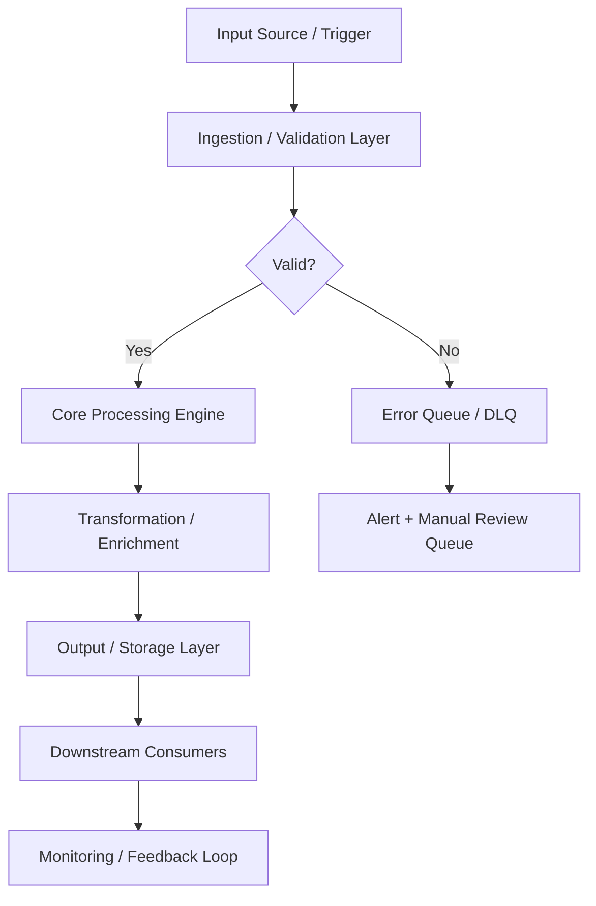

# Portfolio Automation Scripts

# ============================

This directory contains automation scripts for managing and maintaining the portfolio project.

## Available Scripts

### 1. emergency_cleanup.sh
**Purpose:** Safely close all open GitHub pull requests after explicit confirmation

**Safety Features:**
- Requires GitHub CLI (`gh`) to be installed and authenticated
- Interactive confirmation prompt to prevent accidental execution
- Lists and processes up to 500 open pull requests
- Adds an audit comment to each closed PR

**Usage:**
```bash
./scripts/emergency_cleanup.sh
```

**Note:** This is an irreversible bulk action. Ensure you really want to close every open PR in the repository before running.

### 2. organize-screenshots.py
**Purpose:** Intelligent screenshot organization and cataloging for portfolio projects

**Features:**

- Automatically categorizes screenshots by content (dashboards, infrastructure, networking, etc.)
- Renames files with consistent naming convention
- Generates markdown catalogs with image previews
- Creates JSON indexes for programmatic access
- Detects and skips duplicate files
- Extracts image metadata (dimensions, file size, timestamp)

**Usage:**

```bash
# Organize screenshots with auto-detection
python3 organize-screenshots.py /path/to/screenshots

# Organize for specific project
python3 organize-screenshots.py /path/to/screenshots --project PRJ-HOME-001

# Preview without moving files
python3 organize-screenshots.py /path/to/screenshots --dry-run
```

**Categories:**

- `dashboards`: Grafana, metrics, charts
- `infrastructure`: Proxmox, VMs, clusters
- `networking`: UniFi, switches, topology
- `monitoring`: Prometheus, alerts, logs
- `services`: Applications, web interfaces
- `storage`: TrueNAS, NAS, ZFS
- `security`: SIEM, security tools
- `configuration`: Settings, configs
- `deployment`: Terraform, Ansible
- `misc`: Uncategorized

**Output Structure:**

```
projects/PROJECT/assets/screenshots/
├── category1/
│   ├── PRJ-XXX_category_01_20241106.png
│   └── PRJ-XXX_category_02_20241106.png
├── category2/
│   └── PRJ-XXX_category_01_20241106.png
├── README.md                    # Generated catalog
└── screenshots-index.json       # JSON index
```

---

### 3. create-diagram-viewers.py
**Purpose:** Create GitHub-viewable markdown wrappers for Mermaid diagrams

**Features:**

- Wraps Mermaid (.mmd, .mermaid) diagrams in markdown code blocks
- GitHub automatically renders these on the web interface
- No external tools required (no PNG conversion needed)
- Includes instructions for exporting to other formats

**Usage:**

```bash
# Convert all Mermaid diagrams in repository
python3 create-diagram-viewers.py

# The script searches the entire repository automatically
```

**Output:**
For each `diagram.mermaid` file, creates `diagram.md` with:

- Mermaid code in GitHub-compatible fenced code block
- Diagram title and description
- Instructions for viewing and exporting
- Reference to original source file

---

### 4. convert-mermaid-to-png.py
**Purpose:** Convert Mermaid diagrams to PNG using mermaid.ink API

**Features:**

- Uses free mermaid.ink API (no auth required)
- Compresses and base64-encodes diagrams
- Downloads PNG renders
- Configurable theme and scale

**Usage:**

```bash
# Convert all Mermaid diagrams
python3 convert-mermaid-to-png.py

# Convert diagrams in specific directory
python3 convert-mermaid-to-png.py /path/to/diagrams
```

**Note:** This script requires internet access to mermaid.ink API. If API is blocked, use `create-diagram-viewers.py` instead for GitHub-native rendering.

---

## Script Dependencies

### Python Version

All scripts require **Python 3.6+**

### Optional Dependencies

For `organize-screenshots.py`:

```bash
# Install Pillow for advanced image metadata extraction
pip install Pillow
```

For `convert-mermaid-to-png.py`:

```bash
# Requires internet access to mermaid.ink API
# No additional packages needed (uses stdlib)
```

---

## Usage Examples

### Scenario 1: Add New Screenshots

```bash
# Take screenshots and save to ~/screenshots/
# Then organize them:
python3 scripts/organize-screenshots.py ~/screenshots --project PRJ-HOME-001

# Review the generated catalog:
cat projects/06-homelab/PRJ-HOME-001/assets/screenshots/README.md
```

### Scenario 2: Update Diagrams

```bash
# Edit a Mermaid diagram
vim projects/06-homelab/PRJ-HOME-002/assets/diagrams/service-architecture.mermaid

# Regenerate markdown viewer
python3 scripts/create-diagram-viewers.py

# Commit changes
git add .
git commit -m "Update service architecture diagram"
```

### Scenario 3: Bulk Organization

```bash
# Organize all screenshots from multiple sources
for dir in ~/screenshots/grafana ~/screenshots/proxmox ~/screenshots/unifi; do
  python3 scripts/organize-screenshots.py "$dir" --dry-run
done

# Review the preview, then run without --dry-run
```

---

## Best Practices

### For Screenshots

1. **Name Descriptively:** Include service/tool name in filename before organizing
2. **One Topic Per Screenshot:** Makes categorization more accurate
3. **High Resolution:** Minimum 1920x1080 for dashboards
4. **Redact Sensitive Data:** Remove IPs, hostnames, credentials before organizing
5. **Consistent Source:** Take screenshots in same browser/resolution for consistency

### For Diagrams

1. **Valid Syntax:** Test diagrams at <https://mermaid.live> before committing
2. **Clear Labels:** Use descriptive node names and edge labels
3. **Logical Flow:** Top-to-bottom or left-to-right flow
4. **Consistent Style:** Use same diagram type for similar architectures
5. **Version Control:** Keep `.mermaid` source files in git, regenerate .md as needed

### For Automation

1. **Test First:** Always use `--dry-run` before actual organization
2. **Backup Originals:** Keep original files until organization is verified
3. **Review Catalogs:** Check generated README files for accuracy
4. **Incremental Updates:** Run scripts after each batch of new files
5. **Commit Often:** Git commit after each successful organization

---

## Troubleshooting

### organize-screenshots.py Issues

**Problem:** Script can't determine project

```
Solution: Use --project flag explicitly
  python3 organize-screenshots.py /path --project PRJ-HOME-001
```

**Problem:** Duplicate detection too aggressive

```
Solution: Duplicates are based on file hash (content). Rename files
          with different content if needed
```

**Problem:** Wrong category assigned

```
Solution: Rename file to include category keyword before organizing
  Example: rename "screen1.png" to "grafana-dashboard.png"
```

### create-diagram-viewers.py Issues

**Problem:** Diagram doesn't render on GitHub

```
Solution: Check Mermaid syntax at https://mermaid.live
          Ensure proper fenced code block format
```

**Problem:** File encoding errors

```
Solution: Ensure .mermaid files are UTF-8 encoded
```

### convert-mermaid-to-png.py Issues

**Problem:** HTTP 403 errors from mermaid.ink

```
Solution: API may be rate-limited or blocked
          Use create-diagram-viewers.py instead
          Or export manually from https://mermaid.live
```

---

## Contributing

### Adding New Scripts

1. Follow existing naming convention: `action-object.py`
2. Include comprehensive docstring and help text
3. Add usage examples and error handling
4. Update this README with documentation
5. Make executable: `chmod +x script.py`

### Script Template

```python
#!/usr/bin/env python3
"""
Script Name - Description
==========================
Detailed description of what the script does.

Usage:
    python3 script.py [options]

Author: Portfolio Project Automation
"""

import sys
import argparse

def main():
    parser = argparse.ArgumentParser(description='...')
    # Add arguments
    args = parser.parse_args()
    # Implementation
    return 0

if __name__ == '__main__':
    sys.exit(main())
```

---

## Future Enhancements

Planned script additions:

- [ ] `generate-resume-variants.py` - Auto-generate resume PDFs from templates
- [ ] `validate-configs.py` - Lint and validate configuration files
- [ ] `export-portfolio.py` - Package portfolio for offline viewing
- [ ] `check-links.py` - Verify all markdown links are valid
- [ ] `generate-metrics.py` - Portfolio statistics and completion tracking

---

## Support

For issues or questions:

1. Check this README first
2. Review script help: `python3 script.py --help`
3. Check script source code (well-documented)
4. Open issue in portfolio repository

---

**Last Updated:** 2024-11-06
**Maintained By:** Portfolio Automation Team

---

## 📋 Technical Specifications

### Technology Stack

| Component | Technology | Version | Purpose |
|---|---|---|---|
| Frontend | React / Next.js / Vue | 18.x / 14.x / 3.x | Component-based UI framework |
| Backend | Node.js / FastAPI / Django | 20.x / 0.109+ / 5.x | REST API and business logic |
| Database | PostgreSQL / MySQL | 15.x / 8.x | Relational data store |
| Cache | Redis / Memcached | 7.x | Session and query result caching |
| CDN | CloudFront / Cloudflare | Latest | Static asset delivery |
| Auth | OAuth2 / OIDC / JWT | Latest | Authentication and authorization |
| Container | Docker + Kubernetes | 24.x / 1.28+ | Containerization and orchestration |
| CI/CD | GitHub Actions | Latest | Automated testing and deployment |

### Runtime Requirements

| Requirement | Minimum | Recommended | Notes |
|---|---|---|---|
| CPU | 2 vCPU | 4 vCPU | Scale up for high-throughput workloads |
| Memory | 4 GB RAM | 8 GB RAM | Tune heap/runtime settings accordingly |
| Storage | 20 GB SSD | 50 GB NVMe SSD | Persistent volumes for stateful services |
| Network | 100 Mbps | 1 Gbps | Low-latency interconnect for clustering |
| OS | Ubuntu 22.04 LTS | Ubuntu 22.04 LTS | RHEL 8/9 also validated |

---

## ⚙️ Configuration Reference

### Environment Variables

| Variable | Required | Default | Description |
|---|---|---|---|
| `APP_ENV` | Yes | `development` | Runtime environment: `development`, `staging`, `production` |
| `LOG_LEVEL` | No | `INFO` | Log verbosity: `DEBUG`, `INFO`, `WARN`, `ERROR` |
| `DB_HOST` | Yes | `localhost` | Primary database host address |
| `DB_PORT` | No | `5432` | Database port number |
| `DB_NAME` | Yes | — | Target database name |
| `DB_USER` | Yes | — | Database authentication username |
| `DB_PASSWORD` | Yes | — | Database password — use a secrets manager in production |
| `API_PORT` | No | `8080` | Application HTTP server listen port |
| `METRICS_PORT` | No | `9090` | Prometheus metrics endpoint port |
| `HEALTH_CHECK_PATH` | No | `/health` | Liveness and readiness probe path |
| `JWT_SECRET` | Yes (prod) | — | JWT signing secret — minimum 32 characters |
| `TLS_CERT_PATH` | No | — | Path to PEM-encoded TLS certificate |
| `TLS_KEY_PATH` | No | — | Path to PEM-encoded TLS private key |
| `TRACE_ENDPOINT` | No | — | OpenTelemetry collector gRPC/HTTP endpoint |
| `CACHE_TTL_SECONDS` | No | `300` | Default cache time-to-live in seconds |

### Configuration Files

| File | Location | Purpose | Managed By |
|---|---|---|---|
| Application config | `./config/app.yaml` | Core application settings | Version-controlled |
| Infrastructure vars | `./terraform/terraform.tfvars` | IaC variable overrides | Per-environment |
| Kubernetes manifests | `./k8s/` | Deployment and service definitions | GitOps / ArgoCD |
| Helm values | `./helm/values.yaml` | Helm chart value overrides | Per-environment |
| CI pipeline | `./.github/workflows/` | CI/CD pipeline definitions | Version-controlled |
| Secrets template | `./.env.example` | Environment variable template | Version-controlled |

---

## 🔌 API & Interface Reference

### Core Endpoints

| Method | Endpoint | Auth | Description | Response |
|---|---|---|---|---|
| `GET` | `/api/v1/users` | Bearer | List users with pagination | 200 OK |
| `POST` | `/api/v1/users` | Bearer | Create a new user | 201 Created |
| `GET` | `/api/v1/users/{id}` | Bearer | Get user by ID | 200 OK |
| `PUT` | `/api/v1/users/{id}` | Bearer | Update user attributes | 200 OK |
| `DELETE` | `/api/v1/users/{id}` | Bearer | Delete a user (soft delete) | 204 No Content |
| `POST` | `/api/v1/auth/login` | None | Authenticate and receive JWT | 200 OK |
| `GET` | `/health` | None | Health check endpoint | 200 OK |

### Authentication Flow

This project uses Bearer token authentication for secured endpoints:

1. **Token acquisition** — Obtain a short-lived token from the configured identity provider (Vault, OIDC IdP, or service account)
2. **Token format** — JWT with standard claims (`sub`, `iat`, `exp`, `aud`)
3. **Token TTL** — Default 1 hour; configurable per environment
4. **Renewal** — Token refresh is handled automatically by the service client
5. **Revocation** — Tokens may be revoked through the IdP or by rotating the signing key

> **Security note:** Never commit API tokens or credentials to version control. Use environment variables or a secrets manager.

---

## 📊 Data Flow & Integration Patterns

### Primary Data Flow



### Integration Touchpoints

| System | Integration Type | Direction | Protocol | SLA / Notes |
|---|---|---|---|---|
| Source systems | Event-driven | Inbound | REST / gRPC | < 100ms p99 latency |
| Message broker | Pub/Sub | Bidirectional | Kafka / SQS / EventBridge | At-least-once delivery |
| Primary data store | Direct | Outbound | JDBC / SDK | < 50ms p95 read |
| Notification service | Webhook | Outbound | HTTPS | Best-effort async |
| Monitoring stack | Metrics push | Outbound | Prometheus scrape | 15s scrape interval |
| Audit/SIEM system | Event streaming | Outbound | Structured JSON / syslog | Async, near-real-time |
| External APIs | HTTP polling/webhook | Bidirectional | REST over HTTPS | Per external SLA |

---

## 📈 Performance & Scalability

### Performance Targets

| Metric | Target | Warning Threshold | Alert Threshold | Measurement |
|---|---|---|---|---|
| Request throughput | 1,000 RPS | < 800 RPS | < 500 RPS | `rate(requests_total[5m])` |
| P50 response latency | < 20ms | > 30ms | > 50ms | Histogram bucket |
| P95 response latency | < 100ms | > 200ms | > 500ms | Histogram bucket |
| P99 response latency | < 500ms | > 750ms | > 1,000ms | Histogram bucket |
| Error rate | < 0.1% | > 0.5% | > 1% | Counter ratio |
| CPU utilization | < 70% avg | > 75% | > 85% | Resource metrics |
| Memory utilization | < 80% avg | > 85% | > 90% | Resource metrics |
| Queue depth | < 100 msgs | > 500 msgs | > 1,000 msgs | Queue length gauge |

### Scaling Strategy

| Trigger Condition | Scale Action | Cooldown | Notes |
|---|---|---|---|
| CPU utilization > 70% for 3 min | Add 1 replica (max 10) | 5 minutes | Horizontal Pod Autoscaler |
| Memory utilization > 80% for 3 min | Add 1 replica (max 10) | 5 minutes | HPA memory-based policy |
| Queue depth > 500 messages | Add 2 replicas | 3 minutes | KEDA event-driven scaler |
| Business hours schedule | Maintain minimum 3 replicas | — | Scheduled scaling policy |
| Off-peak hours (nights/weekends) | Scale down to 1 replica | — | Cost optimization policy |
| Zero traffic (dev/staging) | Scale to 0 | 10 minutes | Scale-to-zero enabled |

---

## 🔍 Monitoring & Alerting

### Key Metrics Emitted

| Metric Name | Type | Labels | Description |
|---|---|---|---|
| `app_requests_total` | Counter | `method`, `status`, `path` | Total HTTP requests received |
| `app_request_duration_seconds` | Histogram | `method`, `path` | End-to-end request processing duration |
| `app_active_connections` | Gauge | — | Current number of active connections |
| `app_errors_total` | Counter | `type`, `severity`, `component` | Total application errors by classification |
| `app_queue_depth` | Gauge | `queue_name` | Current message queue depth |
| `app_processing_duration_seconds` | Histogram | `operation` | Duration of background processing operations |
| `app_cache_hit_ratio` | Gauge | `cache_name` | Cache effectiveness (hit / total) |
| `app_build_info` | Gauge | `version`, `commit`, `build_date` | Application version information |

### Alert Definitions

| Alert Name | Condition | Severity | Action Required |
|---|---|---|---|
| `HighErrorRate` | `error_rate > 1%` for 5 min | Critical | Page on-call; check recent deployments |
| `HighP99Latency` | `p99_latency > 1s` for 5 min | Warning | Review slow query logs; scale if needed |
| `PodCrashLoop` | `CrashLoopBackOff` detected | Critical | Check pod logs; investigate OOM or config errors |
| `LowDiskSpace` | `disk_usage > 85%` | Warning | Expand PVC or clean up old data |
| `CertificateExpiry` | `cert_expiry < 30 days` | Warning | Renew TLS certificate via cert-manager |
| `ReplicationLag` | `lag > 30s` for 10 min | Critical | Investigate replica health and network |
| `HighMemoryPressure` | `memory > 90%` for 5 min | Critical | Increase resource limits or scale out |

### Dashboards

| Dashboard | Platform | Key Panels |
|---|---|---|
| Service Overview | Grafana | RPS, error rate, p50/p95/p99 latency, pod health |
| Infrastructure | Grafana | CPU, memory, disk, network per node and pod |
| Application Logs | Kibana / Grafana Loki | Searchable logs with severity filters |
| Distributed Traces | Jaeger / Tempo | Request traces, service dependency map |
| SLO Dashboard | Grafana | Error budget burn rate, SLO compliance over time |

---

## 🚨 Incident Response & Recovery

### Severity Classification

| Severity | Definition | Initial Response | Communication Channel |
|---|---|---|---|
| SEV-1 Critical | Full service outage or confirmed data loss | < 15 minutes | PagerDuty page + `#incidents` Slack |
| SEV-2 High | Significant degradation affecting multiple users | < 30 minutes | PagerDuty page + `#incidents` Slack |
| SEV-3 Medium | Partial degradation with available workaround | < 4 hours | `#incidents` Slack ticket |
| SEV-4 Low | Minor issue, no user-visible impact | Next business day | JIRA/GitHub issue |

### Recovery Runbook

**Step 1 — Initial Assessment**

```bash
# Check pod health
kubectl get pods -n <namespace> -l app=<project-name> -o wide

# Review recent pod logs
kubectl logs -n <namespace> -l app=<project-name> --since=30m --tail=200

# Check recent cluster events
kubectl get events -n <namespace> --sort-by='.lastTimestamp' | tail -30

# Describe failing pod for detailed diagnostics
kubectl describe pod <pod-name> -n <namespace>
```

**Step 2 — Health Validation**

```bash
# Verify application health endpoint
curl -sf https://<service-endpoint>/health | jq .

# Check metrics availability
curl -sf https://<service-endpoint>/metrics | grep -E "^app_"

# Run automated smoke tests
./scripts/smoke-test.sh --env <environment> --timeout 120
```

**Step 3 — Rollback Procedure**

```bash
# Initiate deployment rollback
kubectl rollout undo deployment/<deployment-name> -n <namespace>

# Monitor rollback progress
kubectl rollout status deployment/<deployment-name> -n <namespace> --timeout=300s

# Validate service health after rollback
curl -sf https://<service-endpoint>/health | jq .status
```

**Step 4 — Post-Incident**

- [ ] Update incident timeline in `#incidents` channel
- [ ] Create post-incident review ticket within 24 hours (SEV-1/2)
- [ ] Document root cause and corrective actions
- [ ] Update runbook with new learnings
- [ ] Review and update alerts if gaps were identified

---

## 🛡️ Compliance & Regulatory Controls

### Control Mappings

| Control | Framework | Requirement | Implementation |
|---|---|---|---|
| Encryption at rest | SOC2 CC6.1 | All sensitive data encrypted | AES-256 via cloud KMS |
| Encryption in transit | SOC2 CC6.7 | TLS 1.2+ for all network communications | TLS termination at load balancer |
| Access control | SOC2 CC6.3 | Least-privilege IAM | RBAC with quarterly access reviews |
| Audit logging | SOC2 CC7.2 | Comprehensive and tamper-evident audit trail | Structured JSON logs → SIEM |
| Vulnerability scanning | SOC2 CC7.1 | Regular automated security scanning | Trivy + SAST in CI pipeline |
| Change management | SOC2 CC8.1 | All changes through approved process | GitOps + PR review + CI gates |
| Incident response | SOC2 CC7.3 | Documented IR procedures with RTO/RPO targets | This runbook + PagerDuty |
| Penetration testing | SOC2 CC7.1 | Annual third-party penetration test | External pentest + remediation |

### Data Classification

| Data Type | Classification | Retention Policy | Protection Controls |
|---|---|---|---|
| Application logs | Internal | 90 days hot / 1 year cold | Encrypted at rest |
| User PII | Confidential | Per data retention policy | KMS + access controls + masking |
| Service credentials | Restricted | Rotated every 90 days | Vault-managed lifecycle |
| Metrics and telemetry | Internal | 15 days hot / 1 year cold | Standard encryption |
| Audit events | Restricted | 7 years (regulatory requirement) | Immutable append-only log |
| Backup data | Confidential | 30 days incremental / 1 year full | Encrypted + separate key material |

---

## 👥 Team & Collaboration

### Project Ownership

| Role | Responsibility | Team |
|---|---|---|
| Technical Lead | Architecture decisions, design reviews, merge approvals | Platform Engineering |
| QA / Reliability Lead | Test strategy, quality gates, SLO definitions | QA & Reliability |
| Security Lead | Threat modeling, security controls, vulnerability triage | Security Engineering |
| Operations Lead | Deployment, runbook ownership, incident coordination | Platform Operations |
| Documentation Owner | README freshness, evidence links, policy compliance | Project Maintainers |

### Development Workflow

```mermaid
flowchart LR
  A[Feature Branch] --> B[Local Tests Pass]
  B --> C[Pull Request Opened]
  C --> D[Automated CI Pipeline]
  D --> E[Security Scan + Lint]
  E --> F[Peer Code Review]
  F --> G[Merge to Main]
  G --> H[CD to Staging]
  H --> I[Acceptance Tests]
  I --> J[Production Deploy]
  J --> K[Post-Deploy Monitoring]
```



### Contribution Checklist

Before submitting a pull request to this project:

- [ ] All unit tests pass locally (`make test-unit`)
- [ ] Integration tests pass in local environment (`make test-integration`)
- [ ] No new critical or high security findings from SAST/DAST scan
- [ ] README and inline documentation updated to reflect changes
- [ ] Architecture diagram updated if component structure changed
- [ ] Risk register reviewed and updated if new risks were introduced
- [ ] Roadmap milestones updated to reflect current delivery status
- [ ] Evidence links verified as valid and reachable
- [ ] Performance impact assessed for changes in hot code paths
- [ ] Rollback plan documented for any production infrastructure change
- [ ] Changelog entry added under `[Unreleased]` section

---

## 📚 Extended References

### Internal Documentation

| Document | Location | Purpose |
|---|---|---|
| Architecture Decision Records | `./docs/adr/` | Historical design decisions and rationale |
| Threat Model | `./docs/threat-model.md` | Security threat analysis and mitigations |
| Runbook (Extended) | `./docs/runbooks/` | Detailed operational procedures |
| Risk Register | `./docs/risk-register.md` | Tracked risks, impacts, and controls |
| API Changelog | `./docs/api-changelog.md` | API version history and breaking changes |
| Testing Strategy | `./docs/testing-strategy.md` | Full test pyramid definition |

### External References

| Resource | Description |
|---|---|
| [12-Factor App](https://12factor.net) | Cloud-native application methodology |
| [OWASP Top 10](https://owasp.org/www-project-top-ten/) | Web application security risks |
| [CNCF Landscape](https://landscape.cncf.io) | Cloud-native technology landscape |
| [SRE Handbook](https://sre.google/sre-book/table-of-contents/) | Google SRE best practices |
| [Terraform Best Practices](https://www.terraform-best-practices.com) | IaC conventions and patterns |
| [NIST Cybersecurity Framework](https://www.nist.gov/cyberframework) | Security controls framework |
