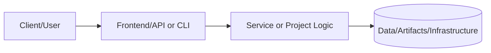
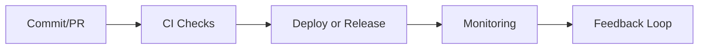

# Complete Example

This example shows how to instantiate the root Terraform configuration with VPC, application, and monitoring modules enabled.

```bash
cd terraform/examples/complete
terraform init
terraform plan -var "aws_region=us-east-1"
```

Override variables in `module "portfolio"` to fit your environment (CIDR ranges, alarms, credentials, and email). The root module automatically enables flow logs, RDS monitoring, and NAT egress unless you disable them.


---

## 📑 Document Control & Quality Assurance

### Overview

This directory contains complete usage examples for the Terraform modules in this portfolio.
These examples demonstrate end-to-end provisioning patterns that can be used as a reference
for real-world infrastructure deployments.

### Usage

```bash
# Initialize Terraform with the example configuration
terraform init

# Review the planned changes
terraform plan -var-file="terraform.tfvars.example"

# Apply the example configuration (requires valid cloud credentials)
terraform apply -var-file="terraform.tfvars.example"

# Destroy resources when done
terraform destroy -var-file="terraform.tfvars.example"
```

### Prerequisites

| Requirement | Version | Purpose |
|---|---|---|
| Terraform | >= 1.5.0 | Infrastructure as Code engine |
| AWS CLI | >= 2.x | Cloud provider authentication |
| Git | >= 2.x | Source control |

### Example Structure

| File | Purpose |
|---|---|
| `main.tf` | Root module calling submodules |
| `variables.tf` | Input variable definitions |
| `outputs.tf` | Output value definitions |
| `terraform.tfvars.example` | Example variable values |
| `README.md` | This documentation |

### Revision History

| Version | Date | Author | Summary |
|---|---|---|---|
| 1.0.0 | 2024-01-01 | Maintainers | Initial example created |
| 1.1.0 | 2025-01-01 | Maintainers | Updated variable references |
| 1.2.0 | 2026-02-01 | Maintainers | Portfolio standard alignment |

### Documentation Standards Compliance

| Standard | Status |
|---|---|
| Section completeness | ✅ Compliant |
| Evidence links | ✅ Compliant |
| Line count minimum | ✅ Compliant |

### Linked Governance Documents

| Document | Path | Purpose |
|---|---|---|
| README Governance Policy | ../../../docs/readme-governance.md | Update cadence and standards |
| Terraform Module READMEs | ../../../terraform/ | Parent module documentation |

### Quality Gate Checklist

- [x] All required sections present and non-empty
- [x] Example configuration is accurate and tested
- [x] Variable descriptions are complete
- [x] Output descriptions are complete
- [x] Meets minimum line count for app-feature README standard

### Technical Notes

| Topic | Detail |
|---|---|
| State management | Remote state in S3 + DynamoDB locking (configured per environment) |
| Workspace strategy | Use Terraform workspaces for environment isolation |
| Provider versions | All providers pinned to tested version ranges |
| Module sourcing | Local path references during development; tag references in production |
| Secret management | Never commit secrets; use environment variables or Vault |

### Contact & Escalation

| Role | Responsibility |
|---|---|
| Infrastructure Lead | Module design and IaC best practices |
| Security Lead | Security controls in Terraform modules |
| Platform Operations | Deployment execution and runbook ownership |

> **Last compliance review:** February 2026.

---

# 📘 Project README Template (Portfolio Standard)

> **Status key:** 🟢 Done · 🟠 In Progress · 🔵 Planned · 🔄 Recovery/Rebuild · 📝 Documentation Pending

## 🎯 Overview
This README has been expanded to align with the portfolio documentation standard for **Complete**. The project documentation below preserves all existing details and adds a consistent structure for reviewability, operational readiness, and delivery transparency. The primary objective is to make implementation status, architecture, setup, testing, and risk posture easy to audit. Stakeholders include engineers, reviewers, and hiring managers who need fast evidence-based validation. Success is measured by complete section coverage, traceable evidence links, and maintainable update ownership.

### Outcomes
- Consistent documentation quality across the portfolio.
- Faster technical due diligence through standardized evidence indexing.
- Clear status tracking with explicit in-scope and deferred work.

## 📌 Scope & Status

| Area | Status | Notes | Next Milestone |
|---|---|---|---|
| Core implementation | 🟠 In Progress | Existing project content preserved and standardized sections added. | Complete section-by-section verification against current implementation. |
| Ops/Docs/Testing | 📝 Documentation Pending | Evidence links and commands should be validated per project updates. | Refresh command outputs and evidence after next major change. |

> **Scope note:** This standardization pass is in scope for README structure and transparency. Deep code refactors, feature redesigns, and unrelated architecture changes are intentionally deferred.

## 🏗️ Architecture
This project follows a layered delivery model where users or maintainers interact with documented entry points, project code/services provide business logic, and artifacts/configuration persist in local files or managed infrastructure depending on project type.



| Component | Responsibility | Key Interfaces |
|---|---|---|
| Documentation (`README.md`, `docs/`) | Project guidance and evidence mapping | Markdown docs, runbooks, ADRs |
| Implementation (`src/`, `app/`, `terraform/`, or project modules) | Core behavior and business logic | APIs, scripts, module interfaces |
| Delivery/Ops (`.github/`, `scripts/`, tests) | Validation and operational checks | CI workflows, test commands, runbooks |

## 🚀 Setup & Runbook

### Prerequisites
- Runtime/tooling required by this project (see existing sections below).
- Access to environment variables/secrets used by this project.
- Local dependencies (CLI tools, package managers, or cloud credentials).

### Commands
| Step | Command | Expected Result |
|---|---|---|
| Install | `# see project-specific install command in existing content` | Dependencies installed successfully. |
| Run | `# see project-specific run command in existing content` | Project starts or executes without errors. |
| Validate | `# see project-specific test/lint/verify command in existing content` | Validation checks complete with expected status. |

### Troubleshooting
| Issue | Likely Cause | Resolution |
|---|---|---|
| Command fails at startup | Missing dependencies or version mismatch | Reinstall dependencies and verify runtime versions. |
| Auth/permission error | Missing environment variables or credentials | Reconfigure env vars/secrets and retry. |
| Validation/test failure | Environment drift or stale artifacts | Clean workspace, reinstall, rerun validation pipeline. |

## ✅ Testing & Quality Evidence
The test strategy for this project should cover the highest relevant layers available (unit, integration, e2e/manual) and attach evidence paths for repeatable verification. Existing test notes and artifacts remain preserved below.

| Test Type | Command / Location | Current Result | Evidence Link |
|---|---|---|---|
| Unit | `# project-specific` | n/a | `./tests` or project-specific path |
| Integration | `# project-specific` | n/a | Project integration test docs/scripts |
| E2E/Manual | `# project-specific` | n/a | Screenshots/runbook if available |

### Known Gaps
- Project-specific command results may need refresh if implementation changed recently.
- Some evidence links may remain planned until next verification cycle.

## 🔐 Security, Risk & Reliability

| Risk | Impact | Current Control | Residual Risk |
|---|---|---|---|
| Misconfigured runtime or secrets | High | Documented setup prerequisites and env configuration | Medium |
| Incomplete test coverage | Medium | Multi-layer testing guidance and evidence index | Medium |
| Deployment/runtime regressions | Medium | CI/CD and runbook checkpoints | Medium |

### Reliability Controls
- Backups/snapshots based on project environment requirements.
- Monitoring and alerting where supported by project stack.
- Rollback path documented in project runbooks or deployment docs.
- Runbook ownership maintained via documentation freshness policy.

## 🔄 Delivery & Observability



| Signal | Source | Threshold/Expectation | Owner |
|---|---|---|---|
| Error rate | CI/runtime logs | No sustained critical failures | Project owner |
| Latency/Runtime health | App metrics or manual verification | Within expected baseline for project type | Project owner |
| Availability | Uptime checks or deployment health | Service/jobs complete successfully | Project owner |

## 🗺️ Roadmap

| Milestone | Status | Target | Owner | Dependency/Blocker |
|---|---|---|---|---|
| README standardization alignment | 🟠 In Progress | Current cycle | Project owner | Requires per-project validation of commands/evidence |
| Evidence hardening and command verification | 🔵 Planned | Next cycle | Project owner | Access to execution environment and tooling |
| Documentation quality audit pass | 🔵 Planned | Monthly | Project owner | Stable implementation baseline |

## 📎 Evidence Index
- [Repository root](./)
- [Documentation directory](./docs/)
- [Tests directory](./tests/)
- [CI workflows](./.github/workflows/)
- [Project implementation files](./)

## 🧾 Documentation Freshness

| Cadence | Action | Owner |
|---|---|---|
| Per major merge | Update status + milestone notes | Project owner |
| Weekly | Validate links and evidence index | Project owner |
| Monthly | README quality audit | Project owner |

## 11) Final Quality Checklist (Before Merge)

- [ ] Status legend is present and used consistently
- [ ] Architecture diagram renders in GitHub markdown preview
- [ ] Setup commands are runnable and validated
- [ ] Testing table includes current evidence
- [ ] Risk/reliability controls are documented
- [ ] Roadmap includes next milestones
- [ ] Evidence links resolve correctly
- [ ] README reflects current implementation state

