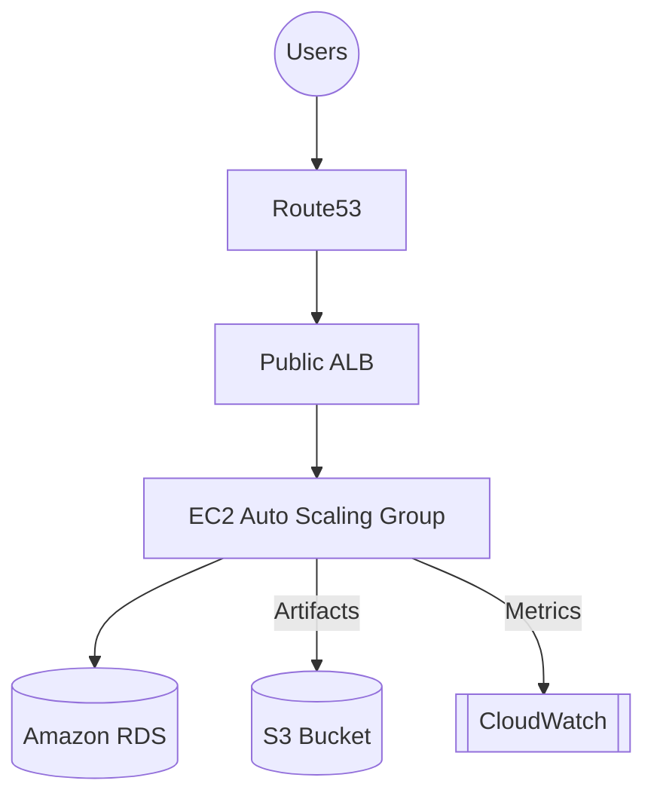

```mermaid
flowchart TB
  Client((Users)) --> Route53[Route53]
  Route53 --> ALB[Public ALB]
  ALB --> ASG[EC2 Auto Scaling Group]
  ASG --> RDS[(Amazon RDS)]
  ASG -->|Artifacts| S3[(S3 Bucket)]
  ASG -->|Metrics| CloudWatch[[CloudWatch]]
```
