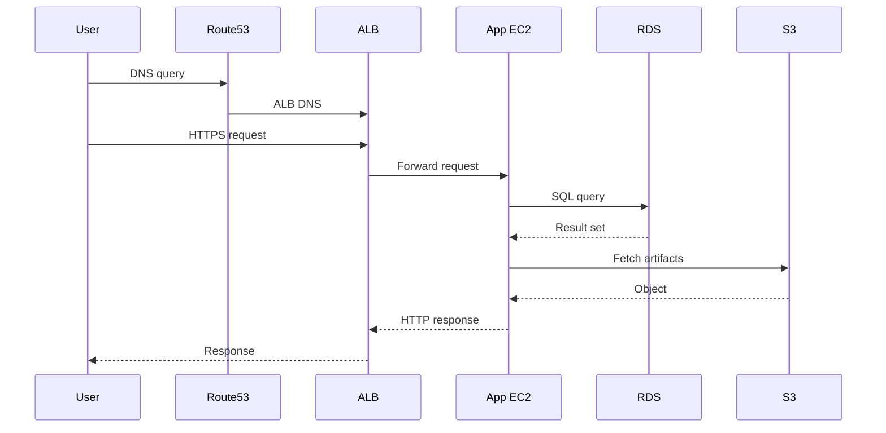

```mermaid
sequenceDiagram
  participant U as User
  participant R as Route53
  participant L as ALB
  participant A as App EC2
  participant D as RDS
  participant S as S3

  U->>R: DNS query
  R->>L: ALB DNS
  U->>L: HTTPS request
  L->>A: Forward request
  A->>D: SQL query
  D-->>A: Result set
  A->>S: Fetch artifacts
  S-->>A: Object
  A-->>L: HTTP response
  L-->>U: Response
```
