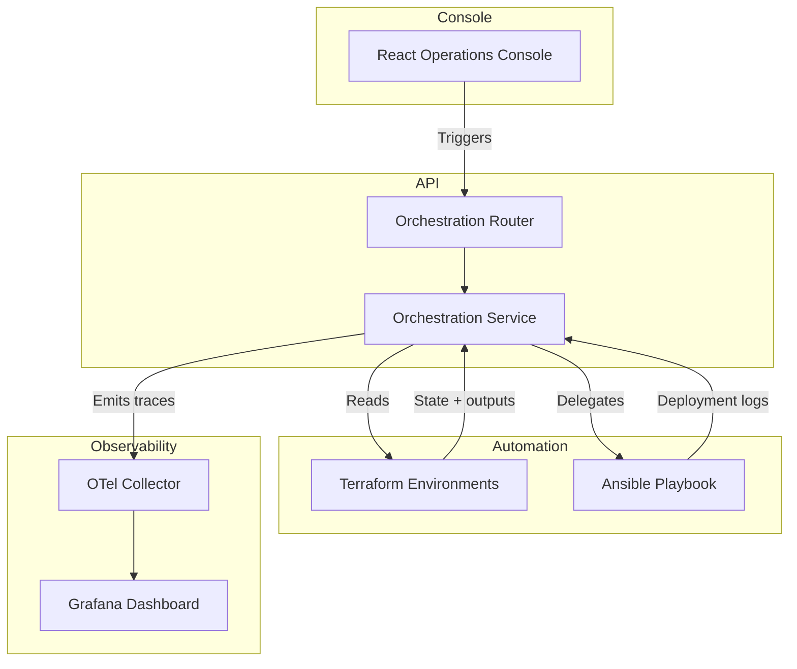

# Orchestration Architecture

```mermaid
graph TD
  subgraph Console
    UI[React Operations Console]
  end
  subgraph API
    ORCH[Orchestration Router]
    SRV[Orchestration Service]
  end
  subgraph Automation
    TF[Terraform Environments]
    ANS[Ansible Playbook]
  end
  subgraph Observability
    OTEL[OTel Collector]
    GRAF[Grafana Dashboard]
  end

  UI -->|Triggers| ORCH
  ORCH --> SRV
  SRV -->|Reads| TF
  SRV -->|Delegates| ANS
  SRV -->|Emits traces| OTEL
  OTEL --> GRAF
  TF -->|State + outputs| SRV
  ANS -->|Deployment logs| SRV
```
