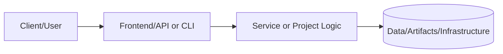
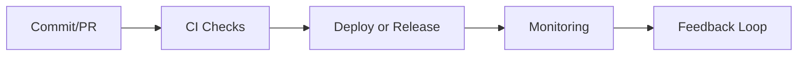

# GitHub Fundamentals Wiki.js

Complete Wiki.js deployment scaffold for the GitHub Fundamentals course with 32 lessons plus navigation pages
covering Git, GitHub, and professional development workflows.

## 📚 Table of Contents

- [Features](#-features)
- [Quick Start](#-quick-start)
- [Deployment Methods](#️-deployment-methods)
- [Project Structure](#-project-structure)
- [Configuration](#️-configuration)
- [Content Management](#-content-management)
- [Backup & Maintenance](#-backup--maintenance)
- [Troubleshooting](#-troubleshooting)

## ✨ Features

- **40 Comprehensive Pages** - Complete GitHub Fundamentals curriculum
- **Multiple Deployment Options** - Docker, manual, API-based, Git-synced
- **Automated Import Scripts** - One-command content deployment
- **Section Landing Pages** - Clear navigation with home and section overviews
- **Production-Ready** - SSL, backups, monitoring included
- **Customizable** - Themes, branding, multi-language support
- **Scalable** - PostgreSQL database, Nginx reverse proxy

## 🚀 Quick Start

### Prerequisites

- Docker and Docker Compose (recommended)
- OR Node.js 18+ (for manual setup)
- 2GB RAM minimum, 4GB recommended
- 10GB disk space

### Option 1: Docker Deployment (Recommended)

```bash
# 1. Clone the repository
git clone <repository-url>
cd wiki-js-scaffold

# 2. Configure environment
cp .env.example .env
nano .env  # Edit configuration

# 3. Start services
cd docker
docker-compose up -d

# 4. Access Wiki.js
open http://localhost:3000

# 5. Complete setup wizard
# - Create admin account
# - Configure site settings
# - Install extensions (optional)

# 6. Import content
cd ..
npm install
npm run import
```

### Option 2: Quick Development Setup

```bash
# Fast setup for local development
docker run -d \
  -p 3000:3000 \
  -e "DB_TYPE=sqlite" \
  -e "DB_FILEPATH=/var/wiki/db.sqlite" \
  -v $(pwd)/content:/var/wiki/content \
  ghcr.io/requarks/wiki:2
```

## 🏗️ Deployment Methods

### Method 1: Docker Compose (Production)

**Best for:** Production deployments with SSL, backups, and monitoring

```bash
cd docker
docker-compose up -d
```

**Includes:**

- Wiki.js application
- PostgreSQL database
- Nginx reverse proxy
- Let's Encrypt SSL
- Automated backups

### Method 2: API-Based Import

**Best for:** Automated content deployment and updates

```bash
# Set environment variables
export WIKIJS_URL=http://localhost:3000
export WIKIJS_TOKEN=your-api-token

# Run import script
node scripts/import-to-wikijs.js
```

**Features:**

- Automated page creation
- Hierarchical structure
- Tag generation
- Bulk import

**Importing portfolio content from this repo**

If you want to import the existing portfolio wiki content located at `../wiki`, set multiple
content roots and adjust default tags:

```bash
export CONTENT_DIRS=content,../wiki
export DEFAULT_TAGS=portfolio
node scripts/import-to-wikijs.js
```

### Method 3: Manual Setup

**Best for:** Custom installations or learning

1. Install Wiki.js:

   ```bash
   npm install -g @requarks/wiki
   ```

2. Initialize:

   ```bash
   wiki start
   ```

3. Configure via web interface at `http://localhost:3000`

4. Import content manually through Admin Panel

### Method 4: Git-Based Content Sync

**Best for:** Team collaboration and version control

1. Configure Git storage in Wiki.js Admin
2. Point to content repository
3. Enable auto-sync
4. Content updates automatically on git push

## 📁 Project Structure

```text
wiki-js-scaffold/
├── content/                    # All wiki pages
│   ├── 00-home.md
│   ├── 01-setup-fundamentals/
│   │   ├── 00-index.md
│   │   ├── 01-course-overview.md
│   │   ├── 02-prerequisites-tools.md
│   │   ├── 03-git-installation.md
│   │   ├── 04-git-configuration.md
│   │   ├── 05-ssh-key-setup.md
│   │   └── 06-github-account-creation.md
│   ├── 02-git-fundamentals/
│   │   ├── 00-index.md
│   │   ├── 01-repository-basics.md
│   │   ├── 02-staging-and-committing.md
│   │   ├── 03-viewing-history.md
│   │   ├── 04-branching-fundamentals.md
│   │   ├── 05-merging-changes.md
│   │   ├── 06-remote-repositories.md
│   │   ├── 07-pushing-changes.md
│   │   └── 08-undoing-changes.md
│   ├── 03-documentation/
│   │   ├── 00-index.md
│   │   ├── 01-readme-best-practices.md
│   │   ├── 02-gitignore-files.md
│   │   └── 03-licenses-and-contributing.md
│   ├── 04-real-world-projects/
│   │   ├── 00-index.md
│   │   ├── 01-portfolio-setup.md
│   │   ├── 02-project-structure.md
│   │   ├── 03-collaboration-workflow.md
│   │   ├── 04-project-management.md
│   │   └── 05-deployment-basics.md
│   ├── 05-github-platform/
│   │   ├── 00-index.md
│   │   ├── 01-issues-and-discussions.md
│   │   ├── 02-pull-requests.md
│   │   ├── 03-github-actions.md
│   │   ├── 04-security-features.md
│   │   └── 05-advanced-github.md
│   ├── 06-advanced-topics/
│   │   ├── 00-index.md
│   │   ├── 01-git-rebase-and-history.md
│   │   └── 02-advanced-workflows.md
│   └── 07-next-steps/
│       ├── 00-index.md
│       ├── 01-contributing-to-open-source.md
│       ├── 02-career-development.md
│       └── 03-continuing-education.md
├── assets/                     # Images, diagrams, media
│   ├── screenshots/
│   ├── diagrams/
│   └── code-examples/
├── docker/                     # Docker configurations
│   ├── docker-compose.yml
│   ├── nginx.conf
│   └── Dockerfile (optional)
├── scripts/                    # Automation scripts
│   ├── import-to-wikijs.js
│   ├── export-from-wikijs.js
│   └── backup-wiki.js
├── templates/                  # Page templates
│   ├── page-template.md
│   └── project-template.md
├── database/                   # Database schemas
│   └── schema.sql
├── .env.example                # Environment variables template
├── package.json                # Node.js dependencies
└── README.md                   # This file
```

## ⚙️ Configuration

### Environment Variables

Copy `.env.example` to `.env` and configure:

```bash
# Required
DB_PASSWORD=your_secure_password
DOMAIN=wiki.example.com
WIKIJS_TOKEN=your_api_token

# Optional
CERTBOT_EMAIL=admin@example.com
GOOGLE_ANALYTICS_ID=UA-XXXXXXXXX-X
```

### Generate API Token

1. Login to Wiki.js as admin
2. Navigate to **Administration** → **API Access**
3. Click **Create New Token**
4. Copy token to `.env` file

### SSL Configuration

**Automatic (Let's Encrypt):**

```bash
# Configure domain in .env
DOMAIN=wiki.example.com
CERTBOT_EMAIL=admin@example.com

# Start services
docker-compose up -d
```

**Manual:**

```bash
# Place certificates in docker/ssl/
docker/ssl/
├── fullchain.pem
└── privkey.pem
```

## 📝 Content Management

### Adding New Pages

#### Method 1: Through Web Interface

1. Login as admin
2. Click **New Page**
3. Enter content and metadata
4. Publish

#### Method 2: Add to content/ directory

```bash
# Add new markdown file
echo "# New Page" > content/01-setup-fundamentals/07-new-topic.md

# Re-import
npm run import
```

#### Method 3: Use API

```javascript
const axios = require('axios');

await axios.post('http://localhost:3000/graphql', {
  query: `mutation { ... }`
}, {
  headers: { 'Authorization': 'Bearer YOUR_TOKEN' }
});
```

### Updating Existing Pages

```bash
# Edit markdown file
nano content/01-setup-fundamentals/01-course-overview.md

# Re-import (updates existing pages)
npm run import
```

### Section Landing Pages

Create section landing pages to improve navigation and search:

- `content/00-home.md` becomes `/home` (recommended Wiki.js home page)
- `content/**/00-index.md` becomes the section root (e.g., `content/01-setup-fundamentals/00-index.md` imports to `/setup-fundamentals`)

### Navigation Structure

Edit navigation in **Administration** → **Navigation**

Or use `navigation-config.json`:

```json
[
  {
    "label": "Home",
    "icon": "home",
    "target": "/home",
    "type": "page"
  },
  {
    "label": "Setup & Fundamentals",
    "icon": "settings",
    "type": "group",
    "items": [...]
  }
]
```

## 🔒 Backup & Maintenance

### Automated Backups

```bash
# Database backup
npm run backup-db

# Full backup (database + content)
./scripts/backup-wiki.sh

# Schedule daily backups (cron)
0 2 * * * /path/to/wiki-js-scaffold/scripts/backup-wiki.sh
```

### Restore from Backup

```bash
# Restore database (replace YYYYMMDD-HHMMSS with your backup timestamp)
docker-compose exec db psql -U wikijs wiki < backups/wiki-YYYYMMDD-HHMMSS.sql

# Restore content (replace TIMESTAMP with your backup folder name)
cp -r backups/wiki-backup-TIMESTAMP/content/* content/
npm run import
```

### Updates

```bash
# Update Wiki.js
docker-compose pull wiki
docker-compose up -d wiki

# Update content
git pull origin main
npm run import
```

## 🔧 Troubleshooting

### Common Issues

**Problem:** Cannot connect to Wiki.js

```bash
# Check if services are running
docker-compose ps

# Check logs
docker-compose logs wiki

# Restart services
docker-compose restart
```

**Problem:** Import fails

```bash
# Verify API token
echo $WIKIJS_TOKEN

# Test API connection
curl -H "Authorization: Bearer $WIKIJS_TOKEN" \
  ${WIKIJS_URL:-http://localhost:3000}/graphql

# Check content files
find content/ -name "*.md"
```

**Problem:** Database connection error

```bash
# Check database status
docker-compose exec db pg_isready -U wikijs

# Reset database (WARNING: deletes data)
docker-compose down -v
docker-compose up -d
```

**Problem:** SSL certificate issues

```bash
# Renew Let's Encrypt certificate
docker-compose run --rm certbot renew

# Check certificate expiry
openssl x509 -in docker/ssl/fullchain.pem -noout -dates
```

### Performance Optimization

**Enable caching:**

```bash
# In .env
CACHE_ENABLED=true
CACHE_TTL=3600
```

**Database tuning:**

```sql
-- Increase connection pool
ALTER SYSTEM SET max_connections = 200;

-- Enable query optimization
ALTER SYSTEM SET shared_buffers = '256MB';
```

**Nginx optimization:**

```nginx
# Add to nginx.conf
gzip on;
gzip_comp_level 6;
client_max_body_size 50M;
```

## 📚 Additional Resources

- [Wiki.js Documentation](https://docs.requarks.io/)
- [PostgreSQL Best Practices](https://wiki.postgresql.org/wiki/Performance_Optimization)
- [Docker Compose Reference](https://docs.docker.com/compose/)
- [Let's Encrypt Documentation](https://letsencrypt.org/docs/)

## 🤝 Contributing

1. Fork the repository
2. Create feature branch (`git checkout -b feature/amazing-feature`)
3. Commit changes (`git commit -m 'Add amazing feature'`)
4. Push to branch (`git push origin feature/amazing-feature`)
5. Open Pull Request

## 📄 License

MIT License - see [LICENSE](LICENSE) file for details

## 🆘 Support

- **Issues:** [GitHub Issues](https://github.com/your-repo/issues)
- **Discussions:** [GitHub Discussions](https://github.com/your-repo/discussions)
- **Email:** <support@example.com>

---

### Made with ❤️ for the GitHub Fundamentals course

---

# 📘 Project README Template (Portfolio Standard)

> **Status key:** 🟢 Done · 🟠 In Progress · 🔵 Planned · 🔄 Recovery/Rebuild · 📝 Documentation Pending

## 🎯 Overview
This README has been expanded to align with the portfolio documentation standard for **Wiki Js Scaffold**. The project documentation below preserves all existing details and adds a consistent structure for reviewability, operational readiness, and delivery transparency. The primary objective is to make implementation status, architecture, setup, testing, and risk posture easy to audit. Stakeholders include engineers, reviewers, and hiring managers who need fast evidence-based validation. Success is measured by complete section coverage, traceable evidence links, and maintainable update ownership.

### Outcomes
- Consistent documentation quality across the portfolio.
- Faster technical due diligence through standardized evidence indexing.
- Clear status tracking with explicit in-scope and deferred work.

## 📌 Scope & Status

| Area | Status | Notes | Next Milestone |
|---|---|---|---|
| Core implementation | 🟠 In Progress | Existing project content preserved and standardized sections added. | Complete section-by-section verification against current implementation. |
| Ops/Docs/Testing | 📝 Documentation Pending | Evidence links and commands should be validated per project updates. | Refresh command outputs and evidence after next major change. |

> **Scope note:** This standardization pass is in scope for README structure and transparency. Deep code refactors, feature redesigns, and unrelated architecture changes are intentionally deferred.

## 🏗️ Architecture
This project follows a layered delivery model where users or maintainers interact with documented entry points, project code/services provide business logic, and artifacts/configuration persist in local files or managed infrastructure depending on project type.



| Component | Responsibility | Key Interfaces |
|---|---|---|
| Documentation (`README.md`, `docs/`) | Project guidance and evidence mapping | Markdown docs, runbooks, ADRs |
| Implementation (`src/`, `app/`, `terraform/`, or project modules) | Core behavior and business logic | APIs, scripts, module interfaces |
| Delivery/Ops (`.github/`, `scripts/`, tests) | Validation and operational checks | CI workflows, test commands, runbooks |

## 🚀 Setup & Runbook

### Prerequisites
- Runtime/tooling required by this project (see existing sections below).
- Access to environment variables/secrets used by this project.
- Local dependencies (CLI tools, package managers, or cloud credentials).

### Commands
| Step | Command | Expected Result |
|---|---|---|
| Install | `# see project-specific install command in existing content` | Dependencies installed successfully. |
| Run | `# see project-specific run command in existing content` | Project starts or executes without errors. |
| Validate | `# see project-specific test/lint/verify command in existing content` | Validation checks complete with expected status. |

### Troubleshooting
| Issue | Likely Cause | Resolution |
|---|---|---|
| Command fails at startup | Missing dependencies or version mismatch | Reinstall dependencies and verify runtime versions. |
| Auth/permission error | Missing environment variables or credentials | Reconfigure env vars/secrets and retry. |
| Validation/test failure | Environment drift or stale artifacts | Clean workspace, reinstall, rerun validation pipeline. |

## ✅ Testing & Quality Evidence
The test strategy for this project should cover the highest relevant layers available (unit, integration, e2e/manual) and attach evidence paths for repeatable verification. Existing test notes and artifacts remain preserved below.

| Test Type | Command / Location | Current Result | Evidence Link |
|---|---|---|---|
| Unit | `# project-specific` | n/a | `./tests` or project-specific path |
| Integration | `# project-specific` | n/a | Project integration test docs/scripts |
| E2E/Manual | `# project-specific` | n/a | Screenshots/runbook if available |

### Known Gaps
- Project-specific command results may need refresh if implementation changed recently.
- Some evidence links may remain planned until next verification cycle.

## 🔐 Security, Risk & Reliability

| Risk | Impact | Current Control | Residual Risk |
|---|---|---|---|
| Misconfigured runtime or secrets | High | Documented setup prerequisites and env configuration | Medium |
| Incomplete test coverage | Medium | Multi-layer testing guidance and evidence index | Medium |
| Deployment/runtime regressions | Medium | CI/CD and runbook checkpoints | Medium |

### Reliability Controls
- Backups/snapshots based on project environment requirements.
- Monitoring and alerting where supported by project stack.
- Rollback path documented in project runbooks or deployment docs.
- Runbook ownership maintained via documentation freshness policy.

## 🔄 Delivery & Observability



| Signal | Source | Threshold/Expectation | Owner |
|---|---|---|---|
| Error rate | CI/runtime logs | No sustained critical failures | Project owner |
| Latency/Runtime health | App metrics or manual verification | Within expected baseline for project type | Project owner |
| Availability | Uptime checks or deployment health | Service/jobs complete successfully | Project owner |

## 🗺️ Roadmap

| Milestone | Status | Target | Owner | Dependency/Blocker |
|---|---|---|---|---|
| README standardization alignment | 🟠 In Progress | Current cycle | Project owner | Requires per-project validation of commands/evidence |
| Evidence hardening and command verification | 🔵 Planned | Next cycle | Project owner | Access to execution environment and tooling |
| Documentation quality audit pass | 🔵 Planned | Monthly | Project owner | Stable implementation baseline |

## 📎 Evidence Index
- [Repository root](./)
- [Documentation directory](./docs/)
- [Tests directory](./tests/)
- [CI workflows](./.github/workflows/)
- [Project implementation files](./)

## 🧾 Documentation Freshness

| Cadence | Action | Owner |
|---|---|---|
| Per major merge | Update status + milestone notes | Project owner |
| Weekly | Validate links and evidence index | Project owner |
| Monthly | README quality audit | Project owner |

## 11) Final Quality Checklist (Before Merge)

- [ ] Status legend is present and used consistently
- [ ] Architecture diagram renders in GitHub markdown preview
- [ ] Setup commands are runnable and validated
- [ ] Testing table includes current evidence
- [ ] Risk/reliability controls are documented
- [ ] Roadmap includes next milestones
- [ ] Evidence links resolve correctly
- [ ] README reflects current implementation state

