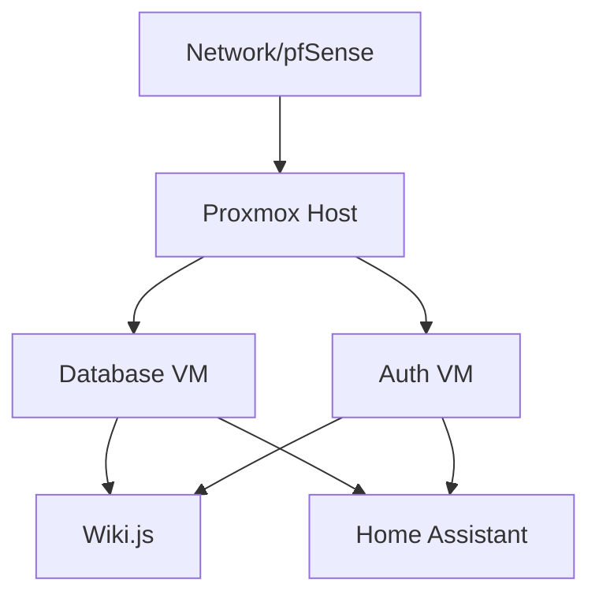

# Disaster Recovery Playbook

**Playbook Owner**: Sam Jackson
**Last Updated**: November 7, 2025
**Review Frequency**: Quarterly
**Next Review**: February 2026

## Purpose

This playbook provides step-by-step procedures for recovering from catastrophic failures affecting the homelab infrastructure, including hardware failures, data corruption, natural disasters, or security incidents.

## When to Use This Playbook

Activate this playbook when:
- **Complete site failure**: Entire homelab is unavailable
- **Hardware failure**: Critical hardware (Proxmox host, TrueNAS, network equipment) has failed
- **Data corruption**: Critical data is corrupted or lost
- **Security breach**: System compromise requires rebuild
- **Natural disaster**: Fire, flood, or other physical damage

## Recovery Objectives

| Metric | Target | Acceptable | Critical |
|--------|--------|------------|----------|
| **Recovery Time Objective (RTO)** | 4 hours | 8 hours | 24 hours |
| **Recovery Point Objective (RPO)** | 24 hours | 48 hours | 7 days |
| **Data Loss** | None | < 24h | < 7 days |

## Prerequisites

Before disaster strikes, ensure:
- [ ] Current backups exist and are verified
- [ ] Backup media is stored off-site or in cloud
- [ ] Hardware inventory and specifications documented
- [ ] Critical passwords stored in password manager
- [ ] Configuration files backed up
- [ ] Network diagram up to date
- [ ] Vendor contact information available
- [ ] This playbook printed or accessible offline

## DR Kit - Essential Information

Keep this information accessible outside the homelab:

**Critical Access**:
- PBS Web UI: https://192.168.1.15:8007
- PBS Credentials: `root@pam` + password (in password manager)
- pfSense Web UI: https://192.168.1.1
- pfSense Credentials: `admin` + password
- ISP Account: Account number, support phone

**Hardware Specifications**:
- Proxmox Host: [Model, CPU, RAM, Storage]
- TrueNAS: [Model, CPU, RAM, Disks]
- Network Equipment: [Models, configurations]

**Backup Locations**:
- Primary: PBS at 192.168.1.15:/mnt/datastore
- Secondary: TrueNAS NFS at 192.168.1.10:/mnt/tank/backups
- Off-site: [Cloud provider or physical location]

---

## Phase 1: Assessment & Triage (0-30 minutes)

### 1.1 Assess the Situation

**Determine Scope**:
```
□ Single VM/service down → Use specific runbook instead
□ Multiple VMs down → Continue to 1.2
□ Entire Proxmox host down → Continue to 1.2
□ Network infrastructure down → Jump to Phase 2
□ Multiple systems affected → Full DR activation
```

**Document Initial State**:
```markdown
## DR Incident - [Date/Time]

**Reported By**: [Name]
**Discovery Time**: [Timestamp]
**Initial Assessment**:
- What failed: [Hardware/Software/Multiple]
- Symptoms observed: [Description]
- Services affected: [List]
- Users impacted: [Number/Departments]

**Immediate Actions Taken**:
- [ ] DR playbook activated
- [ ] Stakeholders notified
- [ ] Backup status verified
```

### 1.2 Verify Backup Status

**Check PBS Availability**:
```bash
# From laptop or workstation
ping 192.168.1.15

# Access PBS Web UI
https://192.168.1.15:8007

# Login and check:
# - Datastore status
# - Recent backup times
# - Backup integrity
```

**Expected**:
- PBS accessible: ✅ Proceed with recovery
- PBS not accessible: ⚠️ Use secondary backup location
- No recent backups: 🔴 Escalate - data loss likely

**Identify Latest Good Backups**:
```
Navigate to: Storage → Datastores → [datastore] → Content

For each critical VM:
□ wiki-vm (100): Last backup [timestamp]
□ homeassistant (101): Last backup [timestamp]
□ immich (102): Last backup [timestamp]
□ database (103): Last backup [timestamp]

Age of backups:
□ < 24 hours: Excellent (within RPO)
□ 24-48 hours: Acceptable
□ > 48 hours: Data loss risk
□ > 7 days: Significant data loss
```

### 1.3 Establish Communication

**Notify Stakeholders**:
```
□ Family/household members
□ Dependent services users
□ Management (if business context)

Message template:
"Homelab infrastructure is currently down due to [reason].
DR procedures activated. Estimated restoration: [time].
Services affected: [list]. Will provide updates every [interval]."
```

**Set Up War Room**:
```
□ Dedicated communication channel (Slack, Discord, etc.)
□ Status page updated
□ Log document started
□ Timer/stopwatch started for RTO tracking
```

---

## Phase 2: Infrastructure Restoration (30 minutes - 4 hours)

### 2.1 Network Infrastructure Recovery

If network is down, restore in this order:

**Step 1: ISP/WAN Connection**:
```bash
# Verify ISP connection
# Check modem lights: Power, Online, LAN

# Test from laptop directly connected to modem
ping -c 4 8.8.8.8

# If no connectivity, contact ISP
# Account: [ISP account number]
# Phone: [ISP support number]
```

**Step 2: pfSense Firewall**:
```bash
# Option A: pfSense appliance responsive
https://192.168.1.1
# Login and verify:
# - WAN interface has IP
# - LAN interfaces up
# - DHCP server running
# - Firewall rules active

# Option B: pfSense needs restore
# Boot pfSense from install media
# During setup, select "Restore config"
# Load from: /backups/pfsense/pfsense-config-YYYY-MM-DD.xml
# Reboot and verify

# Option C: pfSense hardware failed
# Install pfSense on spare hardware or VM
# Minimum: 2 NICs, 2GB RAM, 8GB storage
# Restore config during install
# Reconfigure physical interface assignments
```

**Step 3: UniFi Network**:
```bash
# Access UniFi Controller
https://192.168.1.20:8443

# If controller is down:
# 1. Start UniFi VM/container
# 2. Or install controller on laptop temporarily
# 3. Restore from backup: unifi-backup-YYYY-MM-DD.unf

# Adopt devices:
# Settings → Devices → [Device] → Adopt
# Or use SSH adoption:
ssh ubnt@<device-ip>
set-inform http://192.168.1.20:8080/inform

# Verify:
# - Switch online and port configurations active
# - APs online and SSIDs broadcasting
# - VLAN trunking working
```

**Verification**:
```bash
□ Can ping 8.8.8.8 from trusted VLAN
□ Can resolve DNS queries
□ Can access pfSense web UI
□ Can access UniFi controller
□ VLANs properly segmented
□ All network devices adopted and online
```

### 2.2 Storage Infrastructure Recovery

**Step 1: TrueNAS Recovery**:
```bash
# Option A: TrueNAS responsive
https://192.168.1.10

# Verify pools:
# Storage → Pools → [tank] → Status: ONLINE

# Verify shares:
# Sharing → NFS → All shares exported
# Verify mountable from client

# Option B: TrueNAS needs reinstall
# Boot TrueNAS install media
# Import existing pools (data preserved if disks OK)
# Storage → Pools → Import Pool
# Select all disks in pool → Import

# Recreate shares:
# Sharing → NFS → Add
# Path: /mnt/tank/[share]
# Network: 192.168.1.0/24

# Option C: Storage hardware failure
# See Storage Failure section below
```

**Step 2: Proxmox Backup Server Recovery**:
```bash
# Option A: PBS responsive
https://192.168.1.15:8007

# Verify datastore:
# Storage → Datastores → Status: good

# Option B: PBS VM needs restore
# This is chicken-and-egg problem
# PBS backups are ON PBS
# Solution: Restore PBS from secondary backup location

# On TrueNAS:
ls /mnt/tank/backups/pbs-vm/

# On temporary Proxmox or new PBS install:
# Import backup from file path
# Or manually copy datastore to new PBS

# Option C: PBS needs reinstall
# Install PBS on VM or bare metal
# Add datastore pointing to existing backup location
# /mnt/datastore → existing PBS data
# Backups should be discovered automatically
```

### 2.3 Compute Infrastructure Recovery

**Step 1: Proxmox Host Recovery**:
```bash
# Option A: Proxmox host responsive
https://192.168.1.100:8006

# Check node status:
# Datacenter → [node] → Summary
# Verify: CPU, RAM, Storage

# Check VMs:
# [node] → [VM] → Status

# Option B: Proxmox needs reinstall
# Install Proxmox VE on hardware
# During install:
# - Network: 192.168.1.100/24
# - Gateway: 192.168.1.1
# - DNS: 192.168.1.1

# Post-install configuration:
# Add PBS storage:
pvesm add pbs pbs-backup \
  --server 192.168.1.15 \
  --datastore main \
  --username root@pam!backup \
  --password [token]

# Add TrueNAS NFS:
pvesm add nfs truenas-nfs \
  --server 192.168.1.10 \
  --export /mnt/tank/proxmox \
  --content images,iso

# Configure network (VLANs):
# Create bridges: vmbr0, vmbr1, vmbr2 (for VLANs)
# /etc/network/interfaces

# Option C: Hardware failure
# Order replacement hardware
# Install Proxmox
# Restore VMs from backup (see Phase 3)
```

**Verification**:
```bash
□ Proxmox web UI accessible
□ PBS storage visible: pvesm status
□ Network bridges configured
□ Sufficient resources available
```

---

## Phase 3: Service Restoration (2-6 hours)

Restore services in priority order:

### Priority 1: Critical Services (Restore First)

**3.1 DNS/DHCP (if not pfSense)**:
If running separate DNS/DHCP servers, restore these first.

**3.2 Wiki.js (Documentation)**:
```bash
# In Proxmox UI:
# Storage → pbs-backup → Content
# Find: vm/100/YYYY-MM-DD...
# Right-click → Restore

# Or via CLI:
qm restore 100 pbs-backup:vm/100/YYYY-MM-DD-HH:MM:SS

# Restore settings:
# - VM ID: 100 (or new if conflict)
# - Storage: local-lvm
# - Start after restore: Yes

# Wait for restore (5-10 minutes)
# Verify:
# - VM status: running
# - Can SSH: ssh user@192.168.1.21
# - Web UI: http://192.168.1.21:3000
```

**3.3 Database VM**:
```bash
# Restore database VM
qm restore 103 pbs-backup:vm/103/[latest-backup]

# Start and verify
qm start 103
ssh user@192.168.1.24

# Verify PostgreSQL:
systemctl status postgresql
sudo -u postgres psql -c "SELECT version();"

# If database corruption suspected:
# Restore from database-specific backup
# See: Database Recovery section below
```

**3.4 Monitoring (Prometheus/Grafana)**:
```bash
# Restore monitoring VM
qm restore 104 pbs-backup:vm/104/[latest-backup]

# Verify services:
systemctl status prometheus
systemctl status grafana-server
systemctl status alertmanager

# Access Grafana: http://192.168.1.11:3000
# Dashboards should load with historical data
```

### Priority 2: Important Services

**3.5 Home Assistant**:
```bash
qm restore 101 pbs-backup:vm/101/[latest-backup]
qm start 101

# Verify: http://192.168.1.22:8123
```

**3.6 Immich (Photos)**:
```bash
qm restore 102 pbs-backup:vm/102/[latest-backup]
qm start 102

# Verify: http://192.168.1.23:2283
# Check photo library accessible
```

### Priority 3: Non-Critical Services

Restore remaining VMs in order of importance:
```bash
# List all backups:
pvesm list pbs-backup

# Restore each:
qm restore <vmid> pbs-backup:vm/<vmid>/[latest]
```

### Service Verification Checklist

For each restored service:
```
□ VM powered on and running
□ Can SSH to VM
□ Services started: systemctl status [service]
□ Web UI accessible (if applicable)
□ Data integrity verified
□ Logs show no errors: journalctl -u [service] --since "5 min ago"
□ Monitoring shows healthy metrics
□ Users can access service
```

---

## Phase 4: Data Verification (4-8 hours)

### 4.1 Verify Database Integrity

**PostgreSQL**:
```bash
ssh user@database-vm

# Connect to database
sudo -u postgres psql

# Check database list
\l

# For each critical database:
\c database_name

# Verify tables exist
\dt

# Run consistency checks
SELECT * FROM pg_stat_database WHERE datname = 'your_database';

# Test queries
SELECT COUNT(*) FROM critical_table;
SELECT MAX(updated_at) FROM critical_table;
# If max date is recent (within RPO), data is current

# Verify write capability
CREATE TABLE dr_test (id int, ts timestamp);
INSERT INTO dr_test VALUES (1, NOW());
SELECT * FROM dr_test;
DROP TABLE dr_test;
```

### 4.2 Verify Application Data

**For each application**:
```bash
# Example: Wiki.js
http://wiki.homelab.local

# Test:
□ Can login
□ Recent pages visible
□ Can create new page
□ Can edit existing page
□ Search works
□ All content present
```

**Check data timestamps**:
```bash
# Files:
ls -lht /var/lib/application/data | head -20

# Database records:
SELECT MAX(created_at), MAX(updated_at) FROM articles;

# Expected: Dates within RPO window (24-48h)
```

### 4.3 Calculate Data Loss

```markdown
## Data Loss Assessment

**Recovery Point**: [Backup date/time]
**Disaster Time**: [Failure date/time]
**Data Loss Window**: [Hours/days between]

**Data Lost**:
- Wiki pages created after [date]: [count]
- Database records after [date]: [count]
- Files modified after [date]: [count]
- User actions after [date]: [description]

**Acceptable**: < 24 hours (within RPO)
**Action Required**: > 24 hours (document and notify users)
```

---

## Phase 5: Monitoring & Alerting Restoration (6-8 hours)

### 5.1 Verify Monitoring Stack

**Prometheus**:
```bash
# Check targets
http://prometheus:9090/targets

# All exporters should be UP:
□ node_exporter on all hosts
□ proxmox_exporter
□ Application-specific exporters

# Query recent metrics:
up{instance=~".*"}
node_cpu_seconds_total
```

**Grafana**:
```bash
# Verify dashboards load
http://grafana:3000

# Check key dashboards:
□ Infrastructure Overview
□ Service Health
□ Alerting Summary

# Verify datasources:
# Configuration → Data Sources
□ Prometheus: Connected
□ Loki: Connected (if applicable)
```

**Alertmanager**:
```bash
# Verify no critical alerts firing
http://alertmanager:9093

# Verify notification channels:
# Configuration → Receivers
□ Slack webhook active
□ Email configured

# Send test alert:
amtool alert add alertname=DRTest severity=warning
```

### 5.2 Re-baseline Alerts

```bash
# Silence non-actionable alerts during recovery
# Alertmanager → Silences → Create

# Common alerts to silence temporarily:
- HostDown (for hosts being restored)
- ServiceUnreachable (for services starting up)
- BackupJobFailed (backups may be skipped during DR)

# Duration: 24 hours
# Reason: "DR recovery in progress"
```

---

## Phase 6: Security Validation (8-12 hours)

### 6.1 Security Verification

If disaster was caused by security incident:

**Check for Compromise Indicators**:
```bash
# Check for unauthorized users
getent passwd | grep -E ":[0-9]{4,}:"

# Check for unauthorized SSH keys
for user in /home/*; do echo "=== $user ==="; cat $user/.ssh/authorized_keys; done

# Check for suspicious cron jobs
for user in $(cut -f1 -d: /etc/passwd); do echo "=== $user ==="; crontab -u $user -l; done

# Check listening ports
ss -tulpn | grep LISTEN

# Check recent logins
last -20
journalctl _COMM=sshd --since "7 days ago" | grep -i "accepted\|failed"
```

**Reset Credentials**:
```bash
# Change all passwords
passwd  # Root
passwd user  # Regular users

# Regenerate SSH keys
ssh-keygen -t ed25519 -f ~/.ssh/id_ed25519_new
# Update authorized_keys

# Rotate API tokens
# PBS, Proxmox, applications

# Update firewall rules
# Ensure no unauthorized access
```

### 6.2 Harden Systems Post-Recovery

```bash
# Update all systems
apt update && apt upgrade -y

# Enable fail2ban (if not already)
apt install fail2ban
systemctl enable --now fail2ban

# Review firewall rules
# Ensure default deny, explicit allow

# Enable audit logging
apt install auditd
systemctl enable --now auditd
```

---

## Phase 7: Return to Normal Operations (12-24 hours)

### 7.1 Resume Backup Schedule

**Verify Backup Jobs**:
```bash
# PBS: Check backup schedule
https://192.168.1.15:8007
# Dashboard → Backup Jobs

# Verify next run time
# Run manual backup to verify:
# [Job] → Run Now

# Verify backup completes successfully
```

**Re-enable Automated Backups**:
```bash
# On Proxmox host
# /etc/pve/vzdump.cron should be active

# Verify cron:
systemctl status pvesr.timer
```

### 7.2 Monitoring Validation

```bash
# Verify alerts are firing correctly
# Test: Stop a non-critical VM
qm stop <test-vmid>

# Expected: HostDown alert fires within 2 minutes
# Stop test: qm start <test-vmid>
```

### 7.3 Documentation Update

```markdown
## DR Exercise - [Date]

**Type**: [Actual DR / Planned test / Partial failure]
**Trigger**: [Hardware failure / Security incident / Test]
**Duration**: [Start time] to [End time] = [Total hours]

**Objectives Met**:
- RTO: [Target: 4h / Actual: Xh] - [✅ Met / ⚠️ Exceeded]
- RPO: [Target: 24h / Actual: Xh] - [✅ Met / ⚠️ Exceeded]
- Data Loss: [None / Xh of data]

**Timeline**:
| Time | Event |
|------|-------|
| 00:00 | Disaster discovered |
| 00:15 | DR playbook activated |
| 00:30 | Assessment complete |
| 02:00 | Network restored |
| 04:00 | Critical services restored |
| 08:00 | All services restored |
| 12:00 | Validation complete |
| 24:00 | Return to normal ops |

**What Went Well**:
- Backups were current and accessible
- Network recovery was smooth
- Documentation was clear and helpful

**What Could Improve**:
- Backup verification took longer than expected
- Missing some hardware specifications
- Need better off-site backup strategy

**Action Items**:
- [ ] Update hardware inventory with all specs
- [ ] Implement automated backup verification
- [ ] Add cloud backup for critical data
- [ ] Schedule quarterly DR drills
- [ ] Update this playbook with lessons learned
```

### 7.4 Stakeholder Communication

**Final Status Update**:
```markdown
## DR Recovery Complete - [Date]

**Summary**: Homelab infrastructure has been fully restored following [incident type].

**Status**: ✅ All services operational
**Data Loss**: [None / Minimal - X hours]
**Services Restored**: [List all services]

**Actions Taken**:
- Restored from backups dated [date]
- Verified data integrity
- Resumed normal operations
- Implemented additional safeguards

**Lessons Learned**:
[Key learnings and improvements]

**Next Steps**:
- Continue monitoring for 48 hours
- Schedule follow-up review meeting
- Implement preventive measures

Thank you for your patience during recovery.
```

---

## Special Recovery Scenarios

### Scenario A: Complete Hardware Failure

**Replacement Hardware Required**:
```
□ Order replacement hardware
□ While waiting, restore critical VMs to cloud (AWS/Azure)
□ Point DNS to cloud instances (temporary)
□ When hardware arrives, restore locally
□ Migrate services back from cloud
```

**Cloud Failover Procedure**:
```bash
# Export VMs from PBS backup
proxmox-backup-client snapshot list --repository ...

# Convert to cloud format (AWS AMI, Azure VHD)
# Or run Proxmox in cloud temporarily

# Update DNS:
# Wiki.homelab.local → cloud-ip
```

### Scenario B: Ransomware / Crypto-locker

**DO NOT RESTORE** until threat is eliminated:
```
1. Isolate: Disconnect all systems from network
2. Identify: Determine ransomware variant and scope
3. Contain: Ensure ransomware not in backup chain
4. Clean: Wipe and reinstall all systems
5. Restore: From clean, verified backups
6. Harden: Implement additional security controls
```

**Critical Steps**:
```bash
# Verify backup integrity BEFORE restore
proxmox-backup-client verify ...

# Check backup dates - restore from BEFORE infection
# Typical crypto-lockers encrypt backups too

# If backups compromised:
# - Restore from off-site / cloud backups
# - Or restore from older backups (data loss)
```

### Scenario C: Database Corruption

**PostgreSQL Recovery**:
```bash
# Try automatic recovery first
systemctl stop postgresql
sudo -u postgres pg_resetwal -f /var/lib/postgresql/data

# If that fails, restore from dump
# Find latest dump
ls -lh /var/backups/postgresql/

# Restore:
sudo -u postgres psql < /var/backups/postgresql/backup-YYYY-MM-DD.sql

# Verify data:
sudo -u postgres psql -c "SELECT COUNT(*) FROM critical_table;"
```

### Scenario D: Cascade Failure (Multiple Systems)

**Priority-based Restoration**:
```
Phase 1: Infrastructure (Network, Storage)
↓
Phase 2: Core Services (DNS, Auth, Monitoring)
↓
Phase 3: Applications (Based on dependency graph)
↓
Phase 4: Non-critical Services
```

Use dependency mapping:


---

## Testing & Validation

### Quarterly DR Drills

**Schedule**: First Saturday of each quarter
**Duration**: 4-6 hours
**Scope**: Full DR simulation

**Drill Procedure**:
```
1. Take snapshot of current state
2. Simulate failure (shutdown systems)
3. Execute DR playbook
4. Time each phase
5. Document issues and lessons
6. Restore to snapshot (rollback)
7. Update playbook
```

**Metrics to Track**:
- Time to detect failure
- Time to activate DR playbook
- Time to restore each component
- Total recovery time (RTO)
- Data loss window (RPO)
- Success rate of recoveries
- Issues encountered

### Monthly Backup Verification

```bash
# Automated backup verification
# /usr/local/bin/verify-backups.sh

#!/bin/bash
# Verify latest backup for each VM
for vmid in 100 101 102 103 104; do
    echo "Verifying VM $vmid..."
    proxmox-backup-client verify --repository ... vm/$vmid/latest
done

# Add to cron: 0 3 1 * * /usr/local/bin/verify-backups.sh
```

---

## Recovery Checklist Summary

Use this checklist during actual DR:

**Phase 1: Assessment (0-30 min)**
- [ ] Assess scope of failure
- [ ] Verify backup availability
- [ ] Notify stakeholders
- [ ] Start incident log

**Phase 2: Infrastructure (30 min - 4 hours)**
- [ ] Restore network (pfSense, UniFi)
- [ ] Restore storage (TrueNAS, PBS)
- [ ] Restore compute (Proxmox)

**Phase 3: Services (2-6 hours)**
- [ ] Restore priority 1 services (DNS, Wiki, Database, Monitoring)
- [ ] Restore priority 2 services (Home Assistant, Immich)
- [ ] Restore priority 3 services (others)

**Phase 4: Verification (4-8 hours)**
- [ ] Verify database integrity
- [ ] Verify application data
- [ ] Calculate data loss
- [ ] Test all services

**Phase 5: Monitoring (6-8 hours)**
- [ ] Verify Prometheus scraping
- [ ] Verify Grafana dashboards
- [ ] Verify Alertmanager
- [ ] Re-baseline alerts

**Phase 6: Security (8-12 hours)**
- [ ] Check for compromise (if security incident)
- [ ] Reset credentials
- [ ] Harden systems

**Phase 7: Normal Ops (12-24 hours)**
- [ ] Resume backup schedule
- [ ] Verify monitoring
- [ ] Update documentation
- [ ] Communicate to stakeholders

---

## Contacts & Resources

**Emergency Contacts**:
- PBS Access: root@pam (password in password manager)
- pfSense: admin (password in password manager)
- ISP Support: [Phone number]
- Hardware Vendor: [Phone/email]

**Documentation**:
- [Network Architecture](/projects/homelab/prj-home-001/overview)
- [Virtualization Setup](/projects/homelab/prj-home-002/overview)
- [Backup Configuration](/projects/sde-devops/prj-sde-002/operations)
- [Hardware Inventory](/projects/homelab/hardware-inventory)

**Runbooks**:
- [Host Down](/runbooks/infrastructure/host-down)
- [Backup Job Failure](/runbooks/database/backup-failure)
- [Network Connectivity Issues](/runbooks/networking/connectivity-issues)

**Related Playbooks**:
- [Backup & Recovery Playbook](/playbooks/backup-recovery)
- [Incident Response Playbook](/playbooks/incident-response)
- [Infrastructure Provisioning Playbook](/playbooks/infrastructure-provisioning)

---

**Last Updated**: November 7, 2025
**Playbook Owner**: Sam Jackson
**Review Frequency**: Quarterly
**Next Drill**: February 2026
